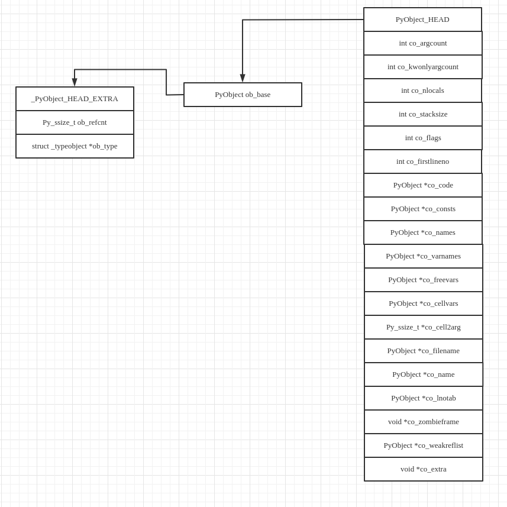

# Code对象与pyc文件

Python虽然是一种解释性的语言，其执行过程依然要有编译的过程．.py文件在执行过程中首先被解释器编译为pyc文件，然后装载到内存中开始执行．在pyc文件中存放的是PyCodeObject对象，该对象是CPython内部使用的，用来表示一段可执行的Python代码段的对象，比如函数，模块，一个类或者迭代器．PyCodeObject对象的内存布局如下图所示．



Python编译器在对Python源代码进行编译的时候，对于代码中的每一个Code Block，都会创建一个PyCodeObject对象与之对应。对于如何确定Code Block，Python的规则为：每当进入一个新的名字空间，就算是进入一个新的Code Block。

## 字段含义

示例代码

```python
def test(x,y,*args,z=3,**kwargs):
    def test1():
        a = 4
        print(x,k,a)
    k = 4
    test1()
    print(x,y,args,kwargs)
test(1,2,"a","b",c=1,d=2)
print("co_argcount", test.__code__.co_argcount)
print("co_kwonlyargcount", test.__code__.co_kwonlyargcount)
print("co_nlocals", test.__code__.co_nlocals)
print("co_stacksize", test.__code__.co_stacksize)
print("co_flags", test.__code__.co_flags)
print("co_firstlineno", test.__code__.co_firstlineno)
print("co_code", test.__code__.co_code)
print("co_consts", test.__code__.co_consts)
print("co_names", test.__code__.co_names)
print("co_varnames", test.__code__.co_varnames)
print("co_freevars", test.__code__.co_freevars)
print("co_cellvars", test.__code__.co_cellvars)

print("co_cell2arg", test.__code__.co_filename)
print("co_name", test.__code__.co_name)
print("co_lnotab", test.__code__.co_lnotab)

print("\n\n", test.__code__.co_consts[1])
print("co_freevars", test.__code__.co_consts[1].co_freevars)
print("co_cellvars", test.__code__.co_consts[1].co_cellvars)
```

代码输出

```python
1 4 4
1 2 ('a', 'b') {'c': 1, 'd': 2}
co_argcount 2
co_kwonlyargcount 1
co_nlocals 6
co_stacksize 5
co_flags 15
co_firstlineno 1
co_code b'\x87\x00\x87\x01f\x02d\x01d\x02\x84\x08}\x05d\x03\x89\x00|\x05\x83\x00\x01\x00t\x00\x88\x01|\x01|\x03|\x04\x83\x04\x01\x00d\x00S\x00'
co_consts (None, <code object test1 at 0x7f4057eeb9d0, file "test.py", line 2>, 'test.<locals>.test1', 4)
co_names ('print',)
co_varnames ('x', 'y', 'z', 'args', 'kwargs', 'test1')
co_freevars ()
co_cellvars ('k', 'x')
co_cell2arg test.py
co_name test
co_lnotab b'\x00\x01\x0e\x03\x04\x01\x06\x01'


 <code object test1 at 0x7f4057eeb9d0, file "test.py", line 2>
co_freevars ('k', 'x')
co_cellvars ()
```

**co_argcount**：Code Block中位置参数的个数．示例中只有x与y两个位置参数．

**co_kwonlyargcount**：强制关键字参数的个数．强制关键字参数必须具名赋值（key=x）或者具有默认值（如本例中的z=3）．强制关键字参数位于*之后（如本例或者\*,key=x）.

**co_nlocals**：局部变量的个数．本例中包括test的函数参数以及变量k．

**co_stacksize**：执行该段Code Block需要多少栈空间．

**co_flags**：一个整数，表示函数本身的属性的组合．

**co_firstlineno**：Code Block在对应的py文件中的起始行．

**co_code**：Code Block编译所的到的字节码指令序列，以PyStringObject的形式存在．

**co_consts**：一个元组对象, 包含了函数中用到的所有常量. 比如 整数, 字符串对象, 和布尔对象. 这个元组里面的内容会在字节码 LOAD_CONST 执行的时候用到, LOAD_CONST 后面会跟一个参数, 这个参数表示 co_consts 的下标位置．

**co_names**：一个元组, 元组里的对象都是字符串对象, 存储着属性, 全局变量名称, 导入的名称等信息. 用到这部分信息的字节码(比如 LOAD_ATTR)后面跟一个参数, 表示这个 co_names 的下标位置．

**co_varnames**：一个元组对象, 包括了函数用到的参数名称和局部变量名称, 参数名称包括普通参数, *args 和 **kwargs, 这些名称在元组里的顺序和在函数对象中第一次使用到的顺序相同．

**co_cellvars** 与 **co_freevars**：函数闭包相关变量．

**co_name**：Code Block的名字，通常是函数名或者类名．

**co_lnotab**：字节码指令与source code行号的对应关系，以PyStringObject的形式存在．

### co_lnotab 和 co_firstlineno

将字节码与对应行关联起来．co_lnotab中的每两个元素作为一个二元组，分别表示字节码位置以及行数的增量．

```python
import dis

def f1(x):
    x = 3
    y = 4

def f2(x):
    x = 5
    y = 6
print(f2.__code__.co_firstlineno)
print(repr(list(bytearray(f2.__code__.co_lnotab))))
print(dis.dis(f2))
```

输出

```python
7
[0, 1, 4, 1]
  8           0 LOAD_CONST               1 (5)
              2 STORE_FAST               0 (x)

  9           4 LOAD_CONST               2 (6)
              6 STORE_FAST               1 (y)
              8 LOAD_CONST               0 (None)
             10 RETURN_VALUE
None

```

x=5的第一条字节码在字节码序列中的位置为0，对应的源文件行数为co_firstlineno(7)+1=8；y=9的第一条字节码在字节码序列中的位置为4，对应的行数为8+1=9．

### co_zombieframe

每个code对象都会保持一个 "zombie" frame, 这样做能保持一个frame对象分配的空间和初始化的信息不变下一次同一个code对象需要创建一个frame对象的时候, 直接用 "zombie" frame 上的对象, 可以节省 malloc/ realloc 的开销和初始化字段的开销．

