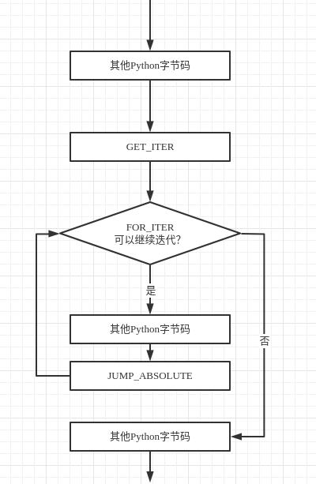
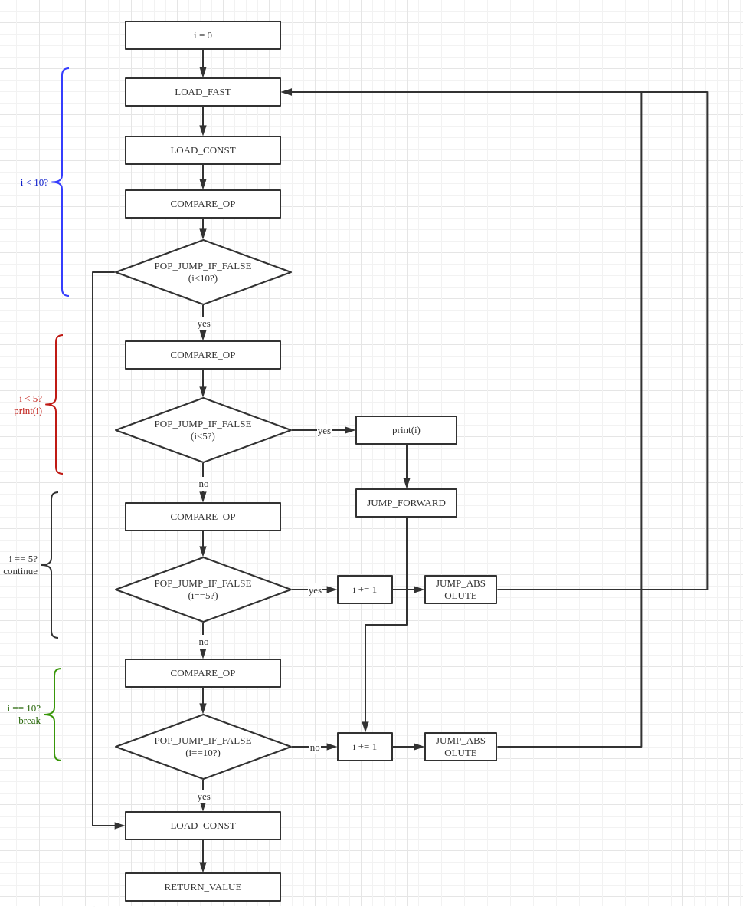

# 循环控制流与异常控制流

### for循环控制流

在分析Python中的循环控制流之前首先来看一段循环代码。

```python
def a():
    ls = [1,2]
    for i in ls:
        print(i)
```
编译之后的python字节码。
```python
  2           0 LOAD_CONST               1 (1)
              2 LOAD_CONST               2 (2)
              4 BUILD_LIST               2
              6 STORE_FAST               0 (ls)

  3           8 LOAD_FAST                0 (ls)
             10 GET_ITER
        >>   12 FOR_ITER                12 (to 26)
             14 STORE_FAST               1 (i)

  4          16 LOAD_GLOBAL              0 (print)
             18 LOAD_FAST                1 (i)
             20 CALL_FUNCTION            1
             22 POP_TOP
             24 JUMP_ABSOLUTE           12
        >>   26 LOAD_CONST               0 (None)
             28 RETURN_VALUE
```

在python字节码中，8 load_fast对应的是for循环的开始。首先，虚拟机将被循环的对象（ls）压入堆栈，然后get_iter开启了整个for循环的过程。

#### 字节码get_iter

```C
case TARGET(GET_ITER): {
            /* before: [obj]; after [getiter(obj)] */
            PyObject *iterable = TOP();
            PyObject *iter = PyObject_GetIter(iterable);
            Py_DECREF(iterable);
            SET_TOP(iter);
            if (iter == NULL)
                goto error;
            PREDICT(FOR_ITER);
            PREDICT(CALL_FUNCTION);
            DISPATCH();
        }
```

首先，get_iter从栈顶获取带迭代对象。然后调用PyObject_GetIter获取该对象的迭代器。

PyObject_GetIter代码

```C
typedef PyObject *(*getiterfunc) (PyObject *);

PyObject *
PyObject_GetIter(PyObject *o)
{
    PyTypeObject *t = o->ob_type;
    getiterfunc f;

    f = t->tp_iter;
    if (f == NULL) {
        if (PySequence_Check(o))
            return PySeqIter_New(o);
        return type_error("'%.200s' object is not iterable", o);
    }
    else {
        PyObject *res = (*f)(o);//获得类型对象中的tp_iter操作
        if (res != NULL && !PyIter_Check(res)) {
            PyErr_Format(PyExc_TypeError,
                         "iter() returned non-iterator "
                         "of type '%.100s'",
                         res->ob_type->tp_name);
            Py_DECREF(res);
            res = NULL;
        }
        return res;
    }
}
```

显然，PyObject_GetIter是通过调用对象对应的类型对象的tp_iter操作来获得与对象关联的迭代器的。Python中的迭代器与java、C#或C++中的迭代器概念是一致的。Python中的迭代器也是实在的对象。

```C
typedef struct {
    PyObject_HEAD
    Py_ssize_t it_index;
    PyListObject *it_seq; /* Set to NULL when iterator is exhausted */
} listiterobject;
```

listiterobject是对list对象的简单封装。其中使用it_index记录当前迭代位置，it_seq记录被迭代的list对象。

我们来看一下list对象的type对象

```C
PyTypeObject PyList_Type = {
    PyVarObject_HEAD_INIT(&PyType_Type, 0)
    "list",
    sizeof(PyListObject),
    0,
    (destructor)list_dealloc,                   /* tp_dealloc */
        /*...*/
    list_iter,                                  /* tp_iter */
        /*...*/
};
```

list_type对象的tp_iter域指向了list_iter

```C
static PyObject *
list_iter(PyObject *seq)
{
    listiterobject *it;

    if (!PyList_Check(seq)) {
        PyErr_BadInternalCall();
        return NULL;
    }
    it = PyObject_GC_New(listiterobject, &PyListIter_Type);
    if (it == NULL)
        return NULL;
    it->it_index = 0;//记录当前list的迭代位置
    Py_INCREF(seq);
    it->it_seq = (PyListObject *)seq;//被迭代的list对象
    _PyObject_GC_TRACK(it);
    return (PyObject *)it;
}
```

get_iter获取了list对象的迭代器对象之后，通过set_top宏强制将其设置为栈顶元素。

#### 字节码for_iter

get_iter获取迭代器之后，for_iter实现对迭代器的迭代。for_iter的实现如下

```C
case TARGET(FOR_ITER): {
    PREDICTED(FOR_ITER);
    /* before: [iter]; after: [iter, iter()] *or* [] */
    PyObject *iter = TOP();
    PyObject *next = (*iter->ob_type->tp_iternext)(iter);
    if (next != NULL) {
        PUSH(next);
        PREDICT(STORE_FAST);
        PREDICT(UNPACK_SEQUENCE);
        DISPATCH();
    }
    if (_PyErr_Occurred(tstate)) {
        if (!_PyErr_ExceptionMatches(tstate, PyExc_StopIteration)) {
            goto error;
        }
        else if (tstate->c_tracefunc != NULL) {
            call_exc_trace(tstate->c_tracefunc, tstate->c_traceobj, tstate, f);
        }
        _PyErr_Clear(tstate);
    }
    /* iterator ended normally */
    STACK_SHRINK(1);
    Py_DECREF(iter);
    JUMPBY(oparg);
    PREDICT(POP_BLOCK);
    DISPATCH();
}
```

for_iter指令反复调用迭代器的tp_iternext方法进行迭代。该方法总是返回与迭代器关联的容器对象的下一个元素，如果当前已经抵达了迭代器的结束位置，那么返回NULL以表示迭代结束。

tp_iternext的具体实现如下

```C
static PyObject *
listiter_next(listiterobject *it)
{
    PyListObject *seq;
    PyObject *item;

    assert(it != NULL);
    seq = it->it_seq;
    if (seq == NULL)
        return NULL;
    assert(PyList_Check(seq));

    if (it->it_index < PyList_GET_SIZE(seq)) {//seq（被迭代的list对象）中依然还有可迭代的元素
        item = PyList_GET_ITEM(seq, it->it_index);
        ++it->it_index;//调整it_index使其指向下一个元素。
        Py_INCREF(item);
        return item;
    }

    it->it_seq = NULL;
    Py_DECREF(seq);
    return NULL;//迭代结束返回NULL
}
```

回到for_iter中的代码，如果next不为NULL，那么将next入栈，并执行指令预测。在本例中，虚拟机成功预测到了store_fast指令。store_fast以及接下来的三条指令（14-22）实现了对i的赋值以及输出（调用print函数）操作。

由于python中的函数必须要有一个返回值（默认返回None），所以print执行结束之后栈顶会存放对None对象的引用（pirnt返回None），指令pop_top的作用是弹出栈顶的None对象以保持堆栈平衡。

```C
case TARGET(POP_TOP): {
            PyObject *value = POP();
            Py_DECREF(value);
            FAST_DISPATCH();
        }
```

可以看到，字节码pop_top只是单纯将栈顶元素出栈并不进行其他操作。

指令jump_absolute指令实现了python虚拟机控制流的回退。

```C
case TARGET(JUMP_ABSOLUTE): {
            PREDICTED(JUMP_ABSOLUTE);
            JUMPTO(oparg);
    }
```

宏定义JUMPTO将next_instr设置为距离f->f_code->co_code oparg个字节的位置，在本例中此位置即为字节码for_iter。

for_iter字节码接受一个参数，这个参数指定了for循环的结束位置。在for_iter中如果返回的next为NULL则代表循环结束，此时进入跳出循环的流程。

首先，宏定义STACK_SHRINK(1)将栈顶元素（当前存放的是迭代完成的迭代器）弹出。

然后调用JUMP_BY宏实现了控制流的跳转。

```C
#define JUMPBY(x)       (next_instr += (x) / sizeof(_Py_CODEUNIT))
```

JUMPBY是实现相对跳转的宏，作用是将next_instr设置为距离当前指令oparg个字节的位置。在这里，虚拟机的控制流通过JUMP_BY宏跳转到了load_const处，for循环正式结束。

可以使用一个流程图来表示上述字节码执行过程



### while循环控制流

```python
def a():
    i = 0
    while i < 10:
        if i < 5:
            print(i)
        elif i == 5:
            i += 1
            continue
        elif i == 10:
            break
        i += 1
```

将上述代码进行编译得到Python字节码

```python
 2           0 LOAD_CONST               1 (0)
              2 STORE_FAST               0 (i)

  3     >>    4 LOAD_FAST                0 (i)
              6 LOAD_CONST               2 (10)
              8 COMPARE_OP               0 (<)
             10 POP_JUMP_IF_FALSE       70

  4          12 LOAD_FAST                0 (i)
             14 LOAD_CONST               3 (5)
             16 COMPARE_OP               0 (<)
             18 POP_JUMP_IF_FALSE       30

  5          20 LOAD_GLOBAL              0 (print)
             22 LOAD_FAST                0 (i)
             24 CALL_FUNCTION            1
             26 POP_TOP
             28 JUMP_FORWARD            30 (to 60)

  6     >>   30 LOAD_FAST                0 (i)
             32 LOAD_CONST               3 (5)
             34 COMPARE_OP               2 (==)
             36 POP_JUMP_IF_FALSE       50

  7          38 LOAD_FAST                0 (i)
             40 LOAD_CONST               4 (1)
             42 INPLACE_ADD
             44 STORE_FAST               0 (i)

  8          46 JUMP_ABSOLUTE            4
             48 JUMP_FORWARD            10 (to 60)

  9     >>   50 LOAD_FAST                0 (i)
             52 LOAD_CONST               2 (10)
             54 COMPARE_OP               2 (==)
             56 POP_JUMP_IF_FALSE       60

 10          58 JUMP_ABSOLUTE           70

 11     >>   60 LOAD_FAST                0 (i)
             62 LOAD_CONST               4 (1)
             64 INPLACE_ADD
             66 STORE_FAST               0 (i)
             68 JUMP_ABSOLUTE            4
        >>   70 LOAD_CONST               0 (None)
             72 RETURN_VALUE

```

绘制上述字节码的流程图



从字节码序列以及流程图中可以看出，while循环的循环机制，break与continue机制也是通过字节码中的跳转指令完成的，这与与if控制流的实现是类似的．

### 异常控制流

程序运行过程中总会出现一些异常情况，比如除数为0，内存不足，想要打开的文件不存在等．一个健壮的程序必须处理这些异常情况．为此，现代编程语言中都引入了＂异常＂的概念来对程序运行过程中的突发情况进行抽象．python中提供try...except...finally来协助程序员进行异常处理．

对于python中的异常，如果程序员没有使用try语句块进行捕捉，那么python虚拟机会自行将异常抛出．

我们通过除零异常来考察python中的异常机制是如何实现的．

```python
1/0
#字节码
 2           0 LOAD_CONST               1 (1)
              3 LOAD_CONST               2 (0)
              6 BINARY_DIVIDE       
              7 POP_TOP             
              8 LOAD_CONST               0 (None)
             11 RETURN_VALUE
#执行结果
>>> a()
Traceback (most recent call last):
  File "<stdin>", line 1, in <module>
  File "<stdin>", line 2, in a
ZeroDivisionError: integer division or modulo by zero
```

首先，来考察字节码binary_true_divide

```C
case TARGET(BINARY_TRUE_DIVIDE): {
            PyObject *divisor = POP();
            PyObject *dividend = TOP();
            PyObject *quotient = PyNumber_TrueDivide(dividend, divisor);
            Py_DECREF(dividend);
            Py_DECREF(divisor);
            SET_TOP(quotient);
            if (quotient == NULL)
                goto error;
            DISPATCH();
        }
```

两个long对象（1和0）的除法计算是通过PyNumber_TrueDivide函数实现的．我们顺着PyNumber_TrueDivide的调用链进行追溯

PyNumber_TrueDivide=>binary_op=>binary_op1=>object->ob_type->tp_as_number->nb_true_divide

由于本次计算的是两个long对象的整数除法，所以nb_true_divide的具体实现需要通过pylong_type来寻找．

pylong_type的部分定义

```C
PyTypeObject PyLong_Type = {
    PyVarObject_HEAD_INIT(&PyType_Type, 0)
    "int",                                      /* tp_name */
    offsetof(PyLongObject, ob_digit),           /* tp_basicsize */
    sizeof(digit),                              /* tp_itemsize */
    long_dealloc,                               /* tp_dealloc */
    0,                                          /* tp_print */
    0,                                          /* tp_getattr */
    0,                                          /* tp_setattr */
    0,                                          /* tp_reserved */
    long_to_decimal_string,                     /* tp_repr */
    &long_as_number,                            /* tp_as_number */
        //....
}
```

找到long_as_number这个结构体

```C
static PyNumberMethods long_as_number = {
    (binaryfunc)long_add,       /*nb_add*/
    (binaryfunc)long_sub,       /*nb_subtract*/
    (binaryfunc)long_mul,       /*nb_multiply*/
    long_mod,                   /*nb_remainder*/
    long_divmod,                /*nb_divmod*/
    long_pow,                   /*nb_power*/
    (unaryfunc)long_neg,        /*nb_negative*/
    long_long,                  /*tp_positive*/
    (unaryfunc)long_abs,        /*tp_absolute*/
    (inquiry)long_bool,         /*tp_bool*/
    (unaryfunc)long_invert,     /*nb_invert*/
    long_lshift,                /*nb_lshift*/
    (binaryfunc)long_rshift,    /*nb_rshift*/
    long_and,                   /*nb_and*/
    long_xor,                   /*nb_xor*/
    long_or,                    /*nb_or*/
    long_long,                  /*nb_int*/
    0,                          /*nb_reserved*/
    long_float,                 /*nb_float*/
    0,                          /* nb_inplace_add */
    0,                          /* nb_inplace_subtract */
    0,                          /* nb_inplace_multiply */
    0,                          /* nb_inplace_remainder */
    0,                          /* nb_inplace_power */
    0,                          /* nb_inplace_lshift */
    0,                          /* nb_inplace_rshift */
    0,                          /* nb_inplace_and */
    0,                          /* nb_inplace_xor */
    0,                          /* nb_inplace_or */
    long_div,                   /* nb_floor_divide */
    long_true_divide,           /* nb_true_divide */
    0,                          /* nb_inplace_floor_divide */
    0,                          /* nb_inplace_true_divide */
    long_long,                  /* nb_index */
};
```

 这个机构体中填充了long对象所对应的所有作为正数时所应该具有的操作的具体实现．nb_true_divide的实现为long_true_divide函数，我们找到这个函数的实现

```C
static PyObject *
long_true_divide(PyObject *v, PyObject *w)
{
    PyLongObject *a, *b, *x;
    Py_ssize_t a_size, b_size, shift, extra_bits, diff, x_size, x_bits;
    digit mask, low;
    int inexact, negate, a_is_small, b_is_small;
    double dx, result;

    CHECK_BINOP(v, w);
    a = (PyLongObject *)v;
    b = (PyLongObject *)w;
	a_size = Py_ABS(Py_SIZE(a));
    b_size = Py_ABS(Py_SIZE(b));
    negate = (Py_SIZE(a) < 0) ^ (Py_SIZE(b) < 0);
    //抛出异常的瞬间
    if (b_size == 0) {
        PyErr_SetString(PyExc_ZeroDivisionError,
                        "division by zero");
        goto error;
    }
    /*...*/
error:
    return NULL;
}
```

在long_true_divide函数中，我们找到了抛出异常的起点．python中一切皆对象，PyExc_ZeroDivisionError也不例外．

```C
PyAPI_DATA(PyObject *) PyExc_ZeroDivisionError;
```

找到了异常抛出的起点之后，我们顺着PyErr_SetString进行追溯来看一下在它内部到进行了什么操作．

```C
void
PyErr_SetString(PyObject *exception, const char *string)
{
    PyObject *value = PyUnicode_FromString(string);
    PyErr_SetObject(exception, value);
    Py_XDECREF(value);
}
```

在PyErr_SetString中，python将char*类型的字符串转换为了标准的PyUnicode类型的字符串并调用了PyErr_SetObject，PyErr_SetObject调用了PyErr_Restore函数

```C
void
PyErr_Restore(PyObject *type, PyObject *value, PyObject *traceback)
{
    PyThreadState *tstate = _PyThreadState_GET();
    PyObject *oldtype, *oldvalue, *oldtraceback;

    if (traceback != NULL && !PyTraceBack_Check(traceback)) {
        /* XXX Should never happen -- fatal error instead? */
        /* Well, it could be None. */
        Py_DECREF(traceback);
        traceback = NULL;
    }

    /* Save these in locals to safeguard against recursive
       invocation through Py_XDECREF */
    //保存之前的异常信息
    oldtype = tstate->curexc_type;
    oldvalue = tstate->curexc_value;
    oldtraceback = tstate->curexc_traceback;

    //保存当前的异常信息
    tstate->curexc_type = type;
    tstate->curexc_value = value;
    tstate->curexc_traceback = traceback;

    //抛弃之前的异常信息
    Py_XDECREF(oldtype);
    Py_XDECREF(oldvalue);
    Py_XDECREF(oldtraceback);
}
```

最终，异常信息被保存在了tstate这个PyThreadState类型的对象中．