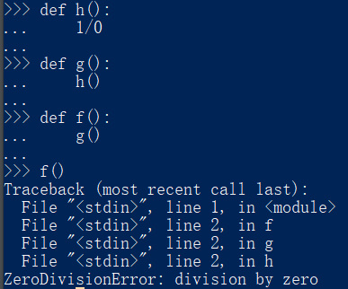
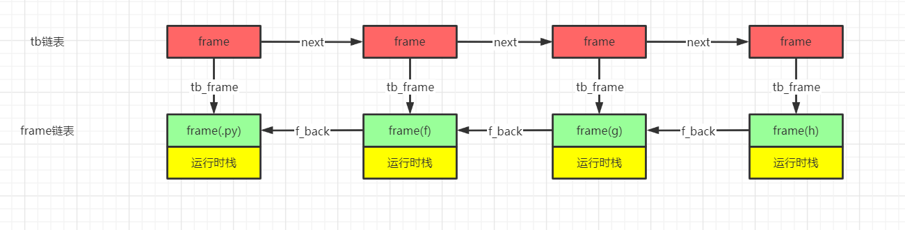
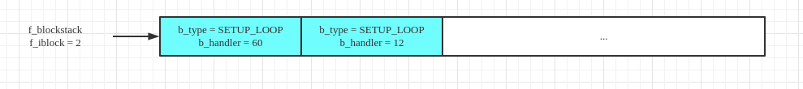

# 循环控制流与异常控制流

### for循环控制流

在分析Python中的循环控制流之前首先来看一段循环代码。

```python
def a():
    ls = [1,2]
    for i in ls:
        print(i)
```
编译之后的python字节码。
```python
  2           0 LOAD_CONST               1 (1)
              2 LOAD_CONST               2 (2)
              4 BUILD_LIST               2
              6 STORE_FAST               0 (ls)

  3           8 LOAD_FAST                0 (ls)
             10 GET_ITER
        >>   12 FOR_ITER                12 (to 26)
             14 STORE_FAST               1 (i)

  4          16 LOAD_GLOBAL              0 (print)
             18 LOAD_FAST                1 (i)
             20 CALL_FUNCTION            1
             22 POP_TOP
             24 JUMP_ABSOLUTE           12
        >>   26 LOAD_CONST               0 (None)
             28 RETURN_VALUE
```

在python字节码中，8 load_fast对应的是for循环的开始。首先，虚拟机将被循环的对象（ls）压入堆栈，然后get_iter开启了整个for循环的过程。

#### 字节码get_iter

```C
case TARGET(GET_ITER): {
            /* before: [obj]; after [getiter(obj)] */
            PyObject *iterable = TOP();
            PyObject *iter = PyObject_GetIter(iterable);
            Py_DECREF(iterable);
            SET_TOP(iter);
            if (iter == NULL)
                goto error;
            PREDICT(FOR_ITER);
            PREDICT(CALL_FUNCTION);
            DISPATCH();
        }
```

首先，get_iter从栈顶获取带迭代对象。然后调用PyObject_GetIter获取该对象的迭代器。

PyObject_GetIter代码

```C
typedef PyObject *(*getiterfunc) (PyObject *);

PyObject *
PyObject_GetIter(PyObject *o)
{
    PyTypeObject *t = o->ob_type;
    getiterfunc f;

    f = t->tp_iter;
    if (f == NULL) {
        if (PySequence_Check(o))
            return PySeqIter_New(o);
        return type_error("'%.200s' object is not iterable", o);
    }
    else {
        PyObject *res = (*f)(o);//获得类型对象中的tp_iter操作
        if (res != NULL && !PyIter_Check(res)) {
            PyErr_Format(PyExc_TypeError,
                         "iter() returned non-iterator "
                         "of type '%.100s'",
                         res->ob_type->tp_name);
            Py_DECREF(res);
            res = NULL;
        }
        return res;
    }
}
```

显然，PyObject_GetIter是通过调用对象对应的类型对象的tp_iter操作来获得与对象关联的迭代器的。Python中的迭代器与java、C#或C++中的迭代器概念是一致的。Python中的迭代器也是实在的对象。

```C
typedef struct {
    PyObject_HEAD
    Py_ssize_t it_index;
    PyListObject *it_seq; /* Set to NULL when iterator is exhausted */
} listiterobject;
```

listiterobject是对list对象的简单封装。其中使用it_index记录当前迭代位置，it_seq记录被迭代的list对象。

我们来看一下list对象的type对象

```C
PyTypeObject PyList_Type = {
    PyVarObject_HEAD_INIT(&PyType_Type, 0)
    "list",
    sizeof(PyListObject),
    0,
    (destructor)list_dealloc,                   /* tp_dealloc */
        /*...*/
    list_iter,                                  /* tp_iter */
        /*...*/
};
```

list_type对象的tp_iter域指向了list_iter

```C
static PyObject *
list_iter(PyObject *seq)
{
    listiterobject *it;

    if (!PyList_Check(seq)) {
        PyErr_BadInternalCall();
        return NULL;
    }
    it = PyObject_GC_New(listiterobject, &PyListIter_Type);
    if (it == NULL)
        return NULL;
    it->it_index = 0;//记录当前list的迭代位置
    Py_INCREF(seq);
    it->it_seq = (PyListObject *)seq;//被迭代的list对象
    _PyObject_GC_TRACK(it);
    return (PyObject *)it;
}
```

get_iter获取了list对象的迭代器对象之后，通过set_top宏强制将其设置为栈顶元素。

#### 字节码for_iter

get_iter获取迭代器之后，for_iter实现对迭代器的迭代。for_iter的实现如下

```C
case TARGET(FOR_ITER): {
    PREDICTED(FOR_ITER);
    /* before: [iter]; after: [iter, iter()] *or* [] */
    PyObject *iter = TOP();
    PyObject *next = (*iter->ob_type->tp_iternext)(iter);
    if (next != NULL) {
        PUSH(next);
        PREDICT(STORE_FAST);
        PREDICT(UNPACK_SEQUENCE);
        DISPATCH();
    }
    if (_PyErr_Occurred(tstate)) {
        if (!_PyErr_ExceptionMatches(tstate, PyExc_StopIteration)) {
            goto error;
        }
        else if (tstate->c_tracefunc != NULL) {
            call_exc_trace(tstate->c_tracefunc, tstate->c_traceobj, tstate, f);
        }
        _PyErr_Clear(tstate);
    }
    /* iterator ended normally */
    STACK_SHRINK(1);
    Py_DECREF(iter);
    JUMPBY(oparg);
    PREDICT(POP_BLOCK);
    DISPATCH();
}
```

for_iter指令反复调用迭代器的tp_iternext方法进行迭代。该方法总是返回与迭代器关联的容器对象的下一个元素，如果当前已经抵达了迭代器的结束位置，那么返回NULL以表示迭代结束。

tp_iternext的具体实现如下

```C
static PyObject *
listiter_next(listiterobject *it)
{
    PyListObject *seq;
    PyObject *item;

    assert(it != NULL);
    seq = it->it_seq;
    if (seq == NULL)
        return NULL;
    assert(PyList_Check(seq));

    if (it->it_index < PyList_GET_SIZE(seq)) {//seq（被迭代的list对象）中依然还有可迭代的元素
        item = PyList_GET_ITEM(seq, it->it_index);
        ++it->it_index;//调整it_index使其指向下一个元素。
        Py_INCREF(item);
        return item;
    }

    it->it_seq = NULL;
    Py_DECREF(seq);
    return NULL;//迭代结束返回NULL
}
```

回到for_iter中的代码，如果next不为NULL，那么将next入栈，并执行指令预测。在本例中，虚拟机成功预测到了store_fast指令。store_fast以及接下来的三条指令（14-22）实现了对i的赋值以及输出（调用print函数）操作。

由于python中的函数必须要有一个返回值（默认返回None），所以print执行结束之后栈顶会存放对None对象的引用（pirnt返回None），指令pop_top的作用是弹出栈顶的None对象以保持堆栈平衡。

```C
case TARGET(POP_TOP): {
            PyObject *value = POP();
            Py_DECREF(value);
            FAST_DISPATCH();
        }
```

可以看到，字节码pop_top只是单纯将栈顶元素出栈并不进行其他操作。

指令jump_absolute指令实现了python虚拟机控制流的回退。

```C
case TARGET(JUMP_ABSOLUTE): {
            PREDICTED(JUMP_ABSOLUTE);
            JUMPTO(oparg);
    }
```

宏定义JUMPTO将next_instr设置为距离f->f_code->co_code oparg个字节的位置，在本例中此位置即为字节码for_iter。

for_iter字节码接受一个参数，这个参数指定了for循环的结束位置。在for_iter中如果返回的next为NULL则代表循环结束，此时进入跳出循环的流程。

首先，宏定义STACK_SHRINK(1)将栈顶元素（当前存放的是迭代完成的迭代器）弹出。

然后调用JUMP_BY宏实现了控制流的跳转。

```C
#define JUMPBY(x)       (next_instr += (x) / sizeof(_Py_CODEUNIT))
```

JUMPBY是实现相对跳转的宏，作用是将next_instr设置为距离当前指令oparg个字节的位置。在这里，虚拟机的控制流通过JUMP_BY宏跳转到了load_const处，for循环正式结束。

可以使用一个流程图来表示上述字节码执行过程


### while循环控制流

```python
def a():
    i = 0
    while i < 10:
        if i < 5:
            print(i)
        elif i == 5:
            i += 1
            continue
        elif i == 10:
            break
        i += 1
```

将上述代码进行编译得到Python字节码

```python
 2           0 LOAD_CONST               1 (0)
              2 STORE_FAST               0 (i)

  3     >>    4 LOAD_FAST                0 (i)
              6 LOAD_CONST               2 (10)
              8 COMPARE_OP               0 (<)
             10 POP_JUMP_IF_FALSE       70

  4          12 LOAD_FAST                0 (i)
             14 LOAD_CONST               3 (5)
             16 COMPARE_OP               0 (<)
             18 POP_JUMP_IF_FALSE       30

  5          20 LOAD_GLOBAL              0 (print)
             22 LOAD_FAST                0 (i)
             24 CALL_FUNCTION            1
             26 POP_TOP
             28 JUMP_FORWARD            30 (to 60)

  6     >>   30 LOAD_FAST                0 (i)
             32 LOAD_CONST               3 (5)
             34 COMPARE_OP               2 (==)
             36 POP_JUMP_IF_FALSE       50

  7          38 LOAD_FAST                0 (i)
             40 LOAD_CONST               4 (1)
             42 INPLACE_ADD
             44 STORE_FAST               0 (i)

  8          46 JUMP_ABSOLUTE            4
             48 JUMP_FORWARD            10 (to 60)

  9     >>   50 LOAD_FAST                0 (i)
             52 LOAD_CONST               2 (10)
             54 COMPARE_OP               2 (==)
             56 POP_JUMP_IF_FALSE       60

 10          58 JUMP_ABSOLUTE           70

 11     >>   60 LOAD_FAST                0 (i)
             62 LOAD_CONST               4 (1)
             64 INPLACE_ADD
             66 STORE_FAST               0 (i)
             68 JUMP_ABSOLUTE            4
        >>   70 LOAD_CONST               0 (None)
             72 RETURN_VALUE

```

绘制上述字节码的流程图


从字节码序列以及流程图中可以看出，while循环的循环机制，break与continue机制也是通过字节码中的跳转指令完成的，这与与if控制流的实现是类似的．

### 内建异常控制流

程序运行过程中总会出现一些异常情况，比如除数为0，内存不足，想要打开的文件不存在等．一个健壮的程序必须处理这些异常情况．为此，现代编程语言中都引入了＂异常＂的概念来对程序运行过程中的突发情况进行抽象．python中提供try...except...finally来协助程序员进行异常处理．

对于python中的异常，如果程序员没有使用try语句块进行捕捉，那么python虚拟机会自行将异常抛出．

我们通过除零异常来考察python中的异常机制是如何实现的．

```python
1/0
#字节码
 2           0 LOAD_CONST               1 (1)
              3 LOAD_CONST               2 (0)
              6 BINARY_DIVIDE       
              7 POP_TOP             
              8 LOAD_CONST               0 (None)
             11 RETURN_VALUE
#执行结果
>>> a()
Traceback (most recent call last):
  File "<stdin>", line 1, in <module>
  File "<stdin>", line 2, in a
ZeroDivisionError: integer division or modulo by zero
```

首先，来考察字节码binary_true_divide

```C
case TARGET(BINARY_TRUE_DIVIDE): {
            PyObject *divisor = POP();
            PyObject *dividend = TOP();
            PyObject *quotient = PyNumber_TrueDivide(dividend, divisor);
            Py_DECREF(dividend);
            Py_DECREF(divisor);
            SET_TOP(quotient);
            if (quotient == NULL)
                goto error;
            DISPATCH();
        }
```

两个long对象（1和0）的除法计算是通过PyNumber_TrueDivide函数实现的．我们顺着PyNumber_TrueDivide的调用链进行追溯

PyNumber_TrueDivide=>binary_op=>binary_op1=>object->ob_type->tp_as_number->nb_true_divide

由于本次计算的是两个long对象的整数除法，所以nb_true_divide的具体实现需要通过pylong_type来寻找．

pylong_type的部分定义

```C
PyTypeObject PyLong_Type = {
    PyVarObject_HEAD_INIT(&PyType_Type, 0)
    "int",                                      /* tp_name */
    offsetof(PyLongObject, ob_digit),           /* tp_basicsize */
    sizeof(digit),                              /* tp_itemsize */
    long_dealloc,                               /* tp_dealloc */
    0,                                          /* tp_print */
    0,                                          /* tp_getattr */
    0,                                          /* tp_setattr */
    0,                                          /* tp_reserved */
    long_to_decimal_string,                     /* tp_repr */
    &long_as_number,                            /* tp_as_number */
        //....
}
```

找到long_as_number这个结构体

```C
static PyNumberMethods long_as_number = {
    (binaryfunc)long_add,       /*nb_add*/
    (binaryfunc)long_sub,       /*nb_subtract*/
    (binaryfunc)long_mul,       /*nb_multiply*/
    long_mod,                   /*nb_remainder*/
    long_divmod,                /*nb_divmod*/
    long_pow,                   /*nb_power*/
    (unaryfunc)long_neg,        /*nb_negative*/
    long_long,                  /*tp_positive*/
    (unaryfunc)long_abs,        /*tp_absolute*/
    (inquiry)long_bool,         /*tp_bool*/
    (unaryfunc)long_invert,     /*nb_invert*/
    long_lshift,                /*nb_lshift*/
    (binaryfunc)long_rshift,    /*nb_rshift*/
    long_and,                   /*nb_and*/
    long_xor,                   /*nb_xor*/
    long_or,                    /*nb_or*/
    long_long,                  /*nb_int*/
    0,                          /*nb_reserved*/
    long_float,                 /*nb_float*/
    0,                          /* nb_inplace_add */
    0,                          /* nb_inplace_subtract */
    0,                          /* nb_inplace_multiply */
    0,                          /* nb_inplace_remainder */
    0,                          /* nb_inplace_power */
    0,                          /* nb_inplace_lshift */
    0,                          /* nb_inplace_rshift */
    0,                          /* nb_inplace_and */
    0,                          /* nb_inplace_xor */
    0,                          /* nb_inplace_or */
    long_div,                   /* nb_floor_divide */
    long_true_divide,           /* nb_true_divide */
    0,                          /* nb_inplace_floor_divide */
    0,                          /* nb_inplace_true_divide */
    long_long,                  /* nb_index */
};
```

 这个机构体中填充了long对象所对应的所有作为正数时所应该具有的操作的具体实现．nb_true_divide的实现为long_true_divide函数，我们找到这个函数的实现

```C
static PyObject *
long_true_divide(PyObject *v, PyObject *w)
{
    PyLongObject *a, *b, *x;
    Py_ssize_t a_size, b_size, shift, extra_bits, diff, x_size, x_bits;
    digit mask, low;
    int inexact, negate, a_is_small, b_is_small;
    double dx, result;

    CHECK_BINOP(v, w);
    a = (PyLongObject *)v;
    b = (PyLongObject *)w;
	a_size = Py_ABS(Py_SIZE(a));
    b_size = Py_ABS(Py_SIZE(b));
    negate = (Py_SIZE(a) < 0) ^ (Py_SIZE(b) < 0);
    //抛出异常的瞬间
    if (b_size == 0) {
        PyErr_SetString(PyExc_ZeroDivisionError,
                        "division by zero");
        goto error;
    }
    /*...*/
error:
    return NULL;
}
```

在long_true_divide函数中，我们找到了抛出异常的起点．python中一切皆对象，PyExc_ZeroDivisionError也不例外．

```C
PyAPI_DATA(PyObject *) PyExc_ZeroDivisionError;
```

找到了异常抛出的起点之后，我们顺着PyErr_SetString进行追溯来看一下在它内部到进行了什么操作．

```C
void
PyErr_SetString(PyObject *exception, const char *string)
{
    PyObject *value = PyUnicode_FromString(string);
    PyErr_SetObject(exception, value);
    Py_XDECREF(value);
}
```

在PyErr_SetString中，python将char*类型的字符串转换为了标准的PyUnicode类型的字符串并调用了PyErr_SetObject，PyErr_SetObject调用了PyErr_Restore函数

```C
void
PyErr_Restore(PyObject *type, PyObject *value, PyObject *traceback)
{
    PyThreadState *tstate = _PyThreadState_GET();
    PyObject *oldtype, *oldvalue, *oldtraceback;

    if (traceback != NULL && !PyTraceBack_Check(traceback)) {
        /* XXX Should never happen -- fatal error instead? */
        /* Well, it could be None. */
        Py_DECREF(traceback);
        traceback = NULL;
    }

    /* Save these in locals to safeguard against recursive
       invocation through Py_XDECREF */
    //保存之前的异常信息
    oldtype = tstate->curexc_type;
    oldvalue = tstate->curexc_value;
    oldtraceback = tstate->curexc_traceback;

    //保存当前的异常信息
    tstate->curexc_type = type;
    tstate->curexc_value = value;
    tstate->curexc_traceback = traceback;

    //抛弃之前的异常信息
    Py_XDECREF(oldtype);
    Py_XDECREF(oldvalue);
    Py_XDECREF(oldtraceback);
}
```

最终，异常信息被保存在了tstate这个PyThreadState类型的对象中．

PyThreadState对象是python用来模拟线程的对象。在python的运行过程中，真实线程的状态信息由操作系统维护，python虚拟机线程的状态信息保存在PyThreadState对象中。当前活动线程所对应的PyThreadState对象可以由_PyThreadState_GET()宏得到。

现在，我们回到字节码binary_true_divide中。PyNumber_TrueDivide执行完成之后最终返回了NULL，也就是说由于除数为0，quotient最终为NULL。当执行到 if (quotient == NULL)分支时，条件成立，执行goto语句，跳转到error标签处并跳出switch结构。在这里，python的异常处理过程开始。

```C
PyObject*
_PyEval_EvalFrameDefault(PyFrameObject *f, int throwflag)
{
main_loop:
    for (;;) {
        /*
        ...
        */
error:
        /* Double-check exception status. */
#ifdef NDEBUG
        if (!_PyErr_Occurred(tstate)) {
            _PyErr_SetString(tstate, PyExc_SystemError,
                             "error return without exception set");
        }
#else
        assert(_PyErr_Occurred(tstate));
#endif

        /* Log traceback info. */
        PyTraceBack_Here(f);

        if (tstate->c_tracefunc != NULL)
            call_exc_trace(tstate->c_tracefunc, tstate->c_traceobj,
                           tstate, f);

exception_unwind:
        /* Unwind stacks if an exception occurred */
        while (f->f_iblock > 0) {
            /*
            处理try...except...finally语句块
            */
		} /* unwind stack */

        /* End the loop as we still have an error */
        break;    
	} /* main loop */

    assert(retval == NULL);
    assert(_PyErr_Occurred(tstate));

exit_returning:

    /* Pop remaining stack entries. */
    while (!EMPTY()) {
        PyObject *o = POP();
        Py_XDECREF(o);
    }

exit_yielding:
    if (tstate->use_tracing) {
        if (tstate->c_tracefunc) {
            if (call_trace_protected(tstate->c_tracefunc, tstate->c_traceobj,
                                     tstate, f, PyTrace_RETURN, retval)) {
                Py_CLEAR(retval);
            }
        }
        if (tstate->c_profilefunc) {
            if (call_trace_protected(tstate->c_profilefunc, tstate->c_profileobj,
                                     tstate, f, PyTrace_RETURN, retval)) {
                Py_CLEAR(retval);
            }
        }
    }

    /* pop frame */
exit_eval_frame:
    if (PyDTrace_FUNCTION_RETURN_ENABLED())
        dtrace_function_return(f);
    Py_LeaveRecursiveCall();
    f->f_executing = 0;
    tstate->frame = f->f_back;

    return _Py_CheckFunctionResult(NULL, retval, "PyEval_EvalFrameEx");
}
```

首先，python虚拟机检查了tstate中保存的异常信息，如果tstate中没有包含异常信息，那么可以认为错误发生．如果检查通过，那么接下来要调用PyTraceBack_Here函数进行异常信息的追踪．我们首先来看一下它的实现．

```C
int
PyTraceBack_Here(PyFrameObject *frame)
{
    PyObject *exc, *val, *tb, *newtb;
    PyErr_Fetch(&exc, &val, &tb);
    newtb = tb_create_raw((PyTracebackObject *)tb, frame, frame->f_lasti,
                          PyFrame_GetLineNumber(frame));
    if (newtb == NULL) {
        _PyErr_ChainExceptions(exc, val, tb);
        return -1;
    }
    PyErr_Restore(exc, val, newtb);
    Py_XDECREF(tb);
    return 0;
}

void
PyErr_Fetch(PyObject **p_type, PyObject **p_value, PyObject **p_traceback)
{
    PyThreadState *tstate = _PyThreadState_GET();
    //通过二重指针传参
    *p_type = tstate->curexc_type;
    *p_value = tstate->curexc_value;
    *p_traceback = tstate->curexc_traceback;
    //将tstate中与当前异常相关的信息设置为NULL
    tstate->curexc_type = NULL;
    tstate->curexc_value = NULL;
    tstate->curexc_traceback = NULL;
}

static PyObject *
tb_create_raw(PyTracebackObject *next, PyFrameObject *frame, int lasti,
              int lineno)
{
    PyTracebackObject *tb;
    if ((next != NULL && !PyTraceBack_Check(next)) ||
                    frame == NULL || !PyFrame_Check(frame)) {
        PyErr_BadInternalCall();
        return NULL;
    }
    tb = PyObject_GC_New(PyTracebackObject, &PyTraceBack_Type);
    if (tb != NULL) {
        Py_XINCREF(next);
        tb->tb_next = next;//指向之前的PyTraceback对象
        Py_XINCREF(frame);
        tb->tb_frame = frame;//保存当前栈帧
        tb->tb_lasti = lasti;//保存当前执行的最后一条字节码
        tb->tb_lineno = lineno;//保存当前执行的最后一条字节码的行号
        PyObject_GC_Track(tb);
    }
    return (PyObject *)tb;
}
```

在PyTraceBack_Here首先调用了PyErr_Fetch函数将tstate中所保存的当前异常信息传出，同时将tstate中所保存的当前异常信息抛弃．然后调用tb_create_raw创建了一个新的PyTraceback对象．

在tb_create_raw中，首先进行了必要的检查，然后创建了一个新的PyTraceback对象．如果成功创建了新的PyTraceback对象，那么python会对其进行初始化的工作．在对此进行考察之前，我们首先看一下PyTraceback的内容究竟是什么．

```C
typedef struct _traceback {
    PyObject_HEAD//python对象头
    struct _traceback *tb_next;//指向前一个PyTraceback对象的指针
    struct _frame *tb_frame;//指向触发异常的栈帧
    int tb_lasti;//当前执行的最后一条字节码
    int tb_lineno;//当前执行的最后一条字节码及其所对应的行号
} PyTracebackObject;
```

首先，PyTraceback也是一个普通的python对象．其中的tb_next指针说明PyTraceback也跟frame对象一样，是一个链表结构．在tb_create_raw函数中，我们可以窥探到这个PyTraceback链表的构建过程．在这里tb->tb_next = next一句中的next正是通过PyErr_Fetch获取的从tstate中得到的PyTraceback对象．新建立的

PyTraceback对象通过tb_frame指针与当前栈帧建立了关联，利用tb_lasti与tb_lineno保存了最后一条字节码及其行号信息．PyTraceback的初始化工作完成之后，执行流程回到PyTraceBack_Here中，在对返回的newtb进行检查之后，python再次调用了PyErr_Restore函数在tstate中保存了异常信息，不过现在的tstate->curexc_traceback已经是新的PyTraceback对象了．

PyTraceBack_Here执行完成之后，流程返回_PyEval_EvalFrameDefault中。tstate->c_tracefunc是用户自定义的追踪函数，主要用于编写python的debugger，通常都是NULL，我们可以不用理会。

标签exception_unwind处是一个while循环，python通过这个循环实现了对try语句块的处理，此处暂且按下不表。我们假定f_iblock的值为0，那么直接跳过while循环，执行while循环之后的break语句。这条break语句的结果是python虚拟机的流程直接跳出了main_loop循环（包裹巨大switch结构的for循环），开始执行推退出流程。

我们忽略一些次要的流程，来到标签exit_eval_frame处。在这里通过设置tstate中的活动栈帧，虚拟机完成了栈帧的回退动作。

```C
f->f_executing = 0;//frame对象中指示frame对象是否活动
tstate->frame = f->f_back;//指向前一个栈帧的指针
return _Py_CheckFunctionResult(NULL, retval, "PyEval_EvalFrameEx");//退出当前_PyEval_EvalFrameDefault
```

通过一个例子来说明pyhton中的栈帧展开过程。



在函数h中发生了除零异常，由于我们并没有编写异常捕获的代码，所以python在tstate中存储了异常信息之后从h所对应的PyEval_EvalFrameDefault中退出。g和f的退出过程与h类似。最终，虚拟机的执行流程退出到交互式环境中并且打印出了异常信息。python虚拟机打印异常信息的来源，正是我们之前所叙述的栈帧展开过程中所建立PyTraceback链表。



### 异常控制语义结构

在前面我们讨论了python中内建的异常处理机制．然而，python也提供了现代化的异常控制语义．在这里，我们通过一个简单的例子来研究python

所提供的异常控制结构如何影响python虚拟机的执行流程。

```python
try:
  1           0 SETUP_FINALLY           60 (to 62)
              2 SETUP_FINALLY           12 (to 16)
	raise Exception("i am an exception")
  2           4 LOAD_NAME                1 (Exception)
              6 LOAD_CONST               1 ('i am an exception')
              8 CALL_FUNCTION            1
             10 RAISE_VARARGS            1
             12 POP_BLOCK
             14 JUMP_FORWARD            42 (to 58)
except Exception as e:
  3     >>   16 DUP_TOP
             18 LOAD_NAME                1 (Exception)
             20 COMPARE_OP              10 (exception match)
             22 POP_JUMP_IF_FALSE       56
             24 POP_TOP
             26 STORE_NAME               2 (e)
             28 POP_TOP
             30 SETUP_FINALLY           12 (to 44)
	print(e)
  4          32 LOAD_NAME                0 (print)
             34 LOAD_NAME                2 (e)
             36 CALL_FUNCTION            1
             38 POP_TOP
             40 POP_BLOCK
             42 BEGIN_FINALLY
        >>   44 LOAD_CONST               2 (None)
             46 STORE_NAME               2 (e)
             48 DELETE_NAME              2 (e)
             50 END_FINALLY
             52 POP_EXCEPT
             54 JUMP_FORWARD             2 (to 58)
        >>   56 END_FINALLY
        >>   58 POP_BLOCK
             60 BEGIN_FINALLY
finally:
    print("the final code")
  6     >>   62 LOAD_NAME                0 (print)
             64 LOAD_CONST               0 ('the final code')
             66 CALL_FUNCTION            1
             68 POP_TOP
             70 END_FINALLY
             72 LOAD_CONST               2 (None)
             74 RETURN_VALUE
```

首先给出异常处理中的关键数据结构PyTryBlock的定义

```C
typedef struct {
    int b_type;                 /* what kind of block this is */
    int b_handler;              /* where to jump to find handler */
    int b_level;                /* value stack level to pop to */
} PyTryBlock;
```

frame中与PyTryBlock相关的域

```C
#define CO_MAXBLOCKS 20 /* Max static block nesting within a function */
typedef struct _frame {
    /*...*/
    int f_iblock;               /* index in f_blockstack */
    /*...*/
    PyTryBlock f_blockstack[CO_MAXBLOCKS]; /* for try and loop blocks */
    /*...*/
} PyFrameObject;
```

首先，我们来看一下字节码setup_finally。

```C
case TARGET(SETUP_FINALLY): {
            /* NOTE: If you add any new block-setup opcodes that
               are not try/except/finally handlers, you may need
               to update the PyGen_NeedsFinalizing() function.
               */

            PyFrame_BlockSetup(f, SETUP_FINALLY, INSTR_OFFSET() + oparg,
                               STACK_LEVEL());
            DISPATCH();
        }
```

函数PyFrame_BlockSetup、

```c
void
PyFrame_BlockSetup(PyFrameObject *f, int type, int handler, int level)
{
    PyTryBlock *b;
    if (f->f_iblock >= CO_MAXBLOCKS)
        Py_FatalError("XXX block stack overflow");
    b = &f->f_blockstack[f->f_iblock++];//增加block引用计数
    b->b_type = type;//设置block类型
    b->b_level = level;//设置堆栈深度
    b->b_handler = handler;//设置跳转点
}
```

执行了前两条字节码setup_finally之后的f_blockstack如下图所示



在这里的两个PyTryBlock分别对应于finally语句以及except语句。在继续讨论之前，我们首先关注一下raise_varargs这条字节码。

```C
case TARGET(RAISE_VARARGS): {
            PyObject *cause = NULL, *exc = NULL;
            switch (oparg) {
            case 2:
                cause = POP(); /* cause */
                /* fall through */
            case 1:
                exc = POP(); /* exc */
                /* fall through */
            case 0:
                if (do_raise(exc, cause)) {
                    goto exception_unwind;
                }
                break;
            default:
                PyErr_SetString(PyExc_SystemError,
                           "bad RAISE_VARARGS oparg");
                break;
            }
            goto error;
        }
```

在raise_varargs执行之前，虚拟机通过load_name，load_const与call_function产生了一个异常对象并压入栈顶，raise_varargs的工作就是从把这个异常对象出栈时开始。此处raise_varargs的参数是1，所以直接将异常对象取出赋给exc，然后调用了do_raise函数。在do_raise中经过了一系列纷繁复杂的动作之后（包括将异常对象储存到当前线程状态对象tstate中），虚拟机通过goto语句转到了与内建异常处理时相同的位置。

我们在讨论python的内建异常处理机制时曾经忽略了一个while循环，该循环是python实现的异常控制语义的关键。

```C
PyObject*
_PyEval_EvalFrameDefault(PyFrameObject *f, int throwflag)
{
main_loop:
    for (;;) {
        /*
        ...
        */
exception_unwind:
        /* Unwind stacks if an exception occurred */
        while (f->f_iblock > 0) {
            /* Pop the current block. */
            PyTryBlock *b = &f->f_blockstack[--f->f_iblock];//取出TryBlock栈顶的TryBlock

            if (b->b_type == EXCEPT_HANDLER) {//如果该异常已经处理过则不再处理
                UNWIND_EXCEPT_HANDLER(b);
                continue;
            }
            UNWIND_BLOCK(b);
            if (b->b_type == SETUP_FINALLY) {//开始处理异常
                PyObject *exc, *val, *tb;
                int handler = b->b_handler;
                _PyErr_StackItem *exc_info = tstate->exc_info;
                /* Beware, this invalidates all b->b_* fields */
                PyFrame_BlockSetup(f, EXCEPT_HANDLER, -1, STACK_LEVEL());//向TryBlock栈中压入一个类型为EXCEPT_HANDLER的TryBlock
                PUSH(exc_info->exc_traceback);//exc_info中指向异常栈栈顶，这里将其内容入栈
                PUSH(exc_info->exc_value);
                if (exc_info->exc_type != NULL) {
                    PUSH(exc_info->exc_type);
                }
                else {
                    Py_INCREF(Py_None);
                    PUSH(Py_None);
                }
                PyErr_Fetch(&exc, &val, &tb);//获取tstate中存储的正在被抛出的异常
                /* Make the raw exception data
                   available to the handler,
                   so a program can emulate the
                   Python main loop. */
                PyErr_NormalizeException(
                    &exc, &val, &tb);
                if (tb != NULL)
                    PyException_SetTraceback(val, tb);
                else
                    PyException_SetTraceback(val, Py_None);
                Py_INCREF(exc);
                exc_info->exc_type = exc;
                Py_INCREF(val);
                exc_info->exc_value = val;
                exc_info->exc_traceback = tb;
                if (tb == NULL)
                    tb = Py_None;
                Py_INCREF(tb);
                PUSH(tb);//正在被抛出的异常的相关信息入栈
                PUSH(val);
                PUSH(exc);
                JUMPTO(handler);//跳转
                /* Resume normal execution */
                goto main_loop;
            }
        } /* unwind stack */

        /* End the loop as we still have an error */
        break;
    } /* main loop */
    /*
    ...
    */
}
```

在while循环中，首先就是取出TryBlock栈栈顶的TryBlock，如果该TryBlock的b_type为EXCEPT_HANDLER，表明该位置的TryBlock所对应的异常已经被处理了。否则就进入异常处理过程。在进行了必要的信息保存工作之后，流程来到了JUMPTO(handler)。handler中保存的是开始进行异常处理的字节码的地址，这里是（16 dup_top）。字节码（20 compare_op）进行了异常类型的比较，即比较被抛出的异常与所要捕获的一场是否为相同类型。如果相同则进行后续处理（print语句），否则跳转到偏移量为56的字节码指令。

我们注意到，异常类型不同会比异常类型的情况多执行一条end_finally指令。

end_finally指令的实现

```c
case TARGET(END_FINALLY): {
            PREDICTED(END_FINALLY);
            /* At the top of the stack are 1 or 6 values:
               Either:
                - TOP = NULL or an integer
               or:
                - (TOP, SECOND, THIRD) = exc_info()
                - (FOURTH, FITH, SIXTH) = previous exception for EXCEPT_HANDLER
            */
            PyObject *exc = POP();
            if (exc == NULL) {//begin_finally压入栈顶的NULL
                FAST_DISPATCH();
            }
            else if (PyLong_CheckExact(exc)) {
                int ret = _PyLong_AsInt(exc);
                Py_DECREF(exc);
                if (ret == -1 && PyErr_Occurred()) {
                    goto error;
                }
                JUMPTO(ret);
                FAST_DISPATCH();
            }
            else {//恢复异常信息
                assert(PyExceptionClass_Check(exc));
                PyObject *val = POP();
                PyObject *tb = POP();
                PyErr_Restore(exc, val, tb);
                goto exception_unwind;
            }
        }
```

begin_finally指令的实现

```C
case TARGET(BEGIN_FINALLY): {
            /* Push NULL onto the stack for using it in END_FINALLY,
               POP_FINALLY, WITH_CLEANUP_START and WITH_CLEANUP_FINISH.
             */
            PUSH(NULL);
            FAST_DISPATCH();
        }
```

通过观察可以发现，多执行的end_finally指令是为了在异常不匹配时将去出来的异常信息重新放回到线程状态对象中，让python虚拟机内部重新进入发生异常的状态，寻找真正能处理异常的代码。而如果异常信息匹配异常处理顺利执行，那么虚拟机会执行begin_finally在栈顶设置一个NULL值，end_finally获取栈顶的NULL之后就会正常执行后续的字节码。

虚拟机在正确处理一场之后还要恢复本次异常处理之前的异常信息。pop_except指令实现了异常信息的恢复。

```C
case TARGET(POP_EXCEPT): {
            PyObject *type, *value, *traceback;
            _PyErr_StackItem *exc_info;
            PyTryBlock *b = PyFrame_BlockPop(f);
            if (b->b_type != EXCEPT_HANDLER) {
                PyErr_SetString(PyExc_SystemError,
                                "popped block is not an except handler");
                goto error;
            }
            assert(STACK_LEVEL() >= (b)->b_level + 3 &&
                   STACK_LEVEL() <= (b)->b_level + 4);
            exc_info = tstate->exc_info;
            type = exc_info->exc_type;
            value = exc_info->exc_value;
            traceback = exc_info->exc_traceback;
            exc_info->exc_type = POP();
            exc_info->exc_value = POP();
            exc_info->exc_traceback = POP();
            Py_XDECREF(type);
            Py_XDECREF(value);
            Py_XDECREF(traceback);
            DISPATCH();
        }
```

pop_except的作用是从TryBlock栈中弹出一个Block。弹出的Block必须是EXCEPT_HANDLER类型的block。弹出之后，pop_except还要恢复在堆栈中保存的异常信息。