# Python对象基石

### 基本对象PyObject

```C
typedef struct _object {
    _PyObject_HEAD_EXTRA
    Py_ssize_t ob_refcnt;//引用计数
    struct _typeobject *ob_type;//类型信息
} PyObject;
```

### 变长对象PyVarObject

```C
typedef struct {
    PyObject ob_base;//基本对象类型
    Py_ssize_t ob_size; /* Number of items in variable part */
} PyVarObject;
```

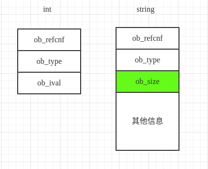

## PyType_Type与其他对象

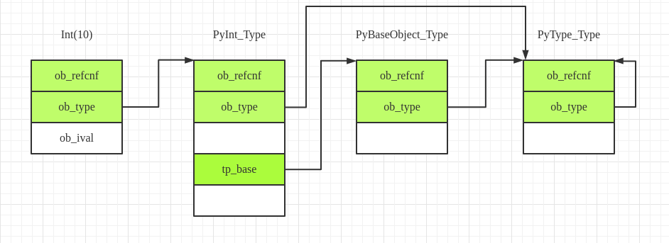

## Python中long/int对象的内存布局

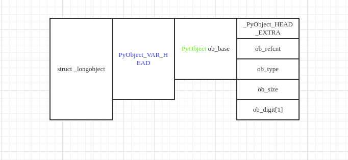

### Python中的整数存储方法

#### 整数0

ob_size为0代表整数0，这是一种特殊情况．

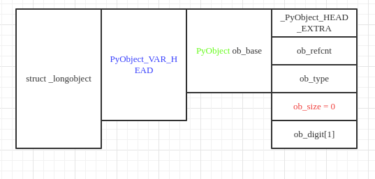

#### 整数1

在python中digit的定义是32位(uint32_t)还是16(unsigned short)位取决于操作系统，为了讨论方便，我们将```PYLONG_BITS_IN_DIGIT```的值定义为15

```C
#if PYLONG_BITS_IN_DIGIT == 30
typedef uint32_t digit;
typedef int32_t sdigit; /* signed variant of digit */
typedef uint64_t twodigits;
typedef int64_t stwodigits; /* signed variant of twodigits */
#define PyLong_SHIFT    30
#define _PyLong_DECIMAL_SHIFT   9 /* max(e such that 10**e fits in a digit) */
#define _PyLong_DECIMAL_BASE    ((digit)1000000000) /* 10 ** DECIMAL_SHIFT */
#elif PYLONG_BITS_IN_DIGIT == 15
typedef unsigned short digit;
typedef short sdigit; /* signed variant of digit */
typedef unsigned long twodigits;
typedef long stwodigits; /* signed variant of twodigits */
#define PyLong_SHIFT    15
#define _PyLong_DECIMAL_SHIFT   4 /* max(e such that 10**e fits in a digit) */
#define _PyLong_DECIMAL_BASE    ((digit)10000) /* 10 ** DECIMAL_SHIFT */
```

当我们需要存储整数1的时候，ob_size的值变成了1表示ob_digit的长度为1，ob_digit以unsigned short的方式存储了整数1．

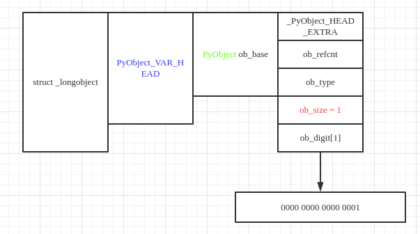

#### 整数-1

ob_size的正负代表整数的正负，ob_size为负值代表整数为负值．

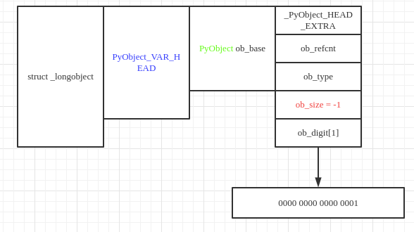

#### 整数1024

1024的二进制表示如图所示，由于只用到了11个比特，只需要使用ob_digit最右边11个比特，ob_size的值依然为1．

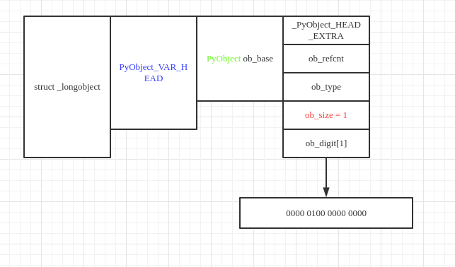

#### 整数32768

整数32768的二进制表示为1000 0000 0000 0000，可以使用一个digit表示，但是在Python中，每个digit的最高位备用做保留位，所以32768要使用两个digit表示．

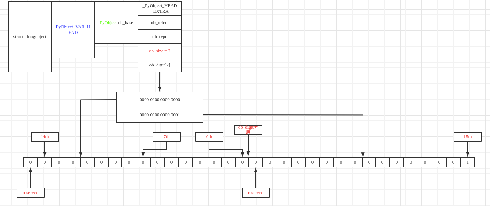

#### 大端与小端

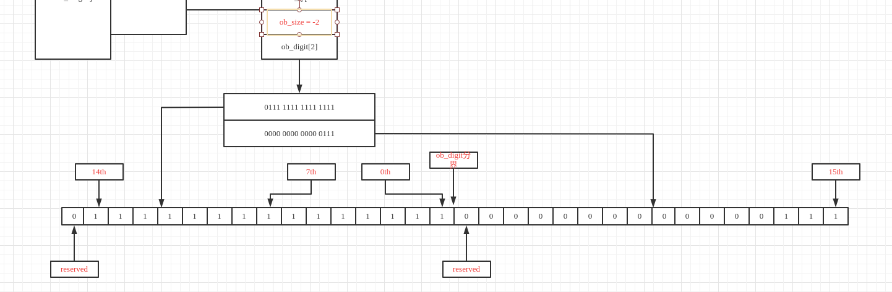

上图为-262143的存储方式．digit之内的比特存储顺序与机器一致，而digit和digit之间则是按照权重的digit在最右边的方式存储（小端存储）．

#### 加法

Python中整数存储中的保留位以及存储方式为计算带来了方便．以

a = 1073741824 - 1

b = 1

为例进行说明．

首先是这两个数字在内存中的存储方式

a的存储方式

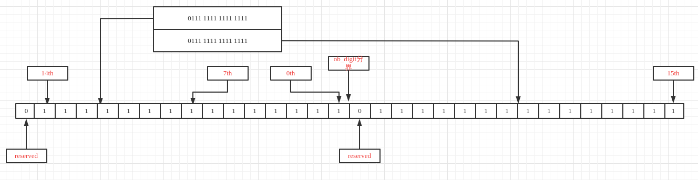

b的存储方式

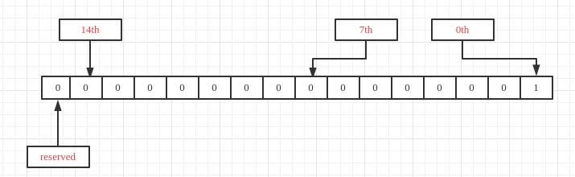

##### 第一步

```C
static PyLongObject *
x_add(PyLongObject *a, PyLongObject *b)
{
    Py_ssize_t size_a = Py_ABS(Py_SIZE(a)), size_b = Py_ABS(Py_SIZE(b));
    PyLongObject *z;
    Py_ssize_t i;
    digit carry = 0;

    /* Ensure a is the larger of the two: */
    if (size_a < size_b) {
        { PyLongObject *temp = a; a = b; b = temp; }
        { Py_ssize_t size_temp = size_a;
            size_a = size_b;
            size_b = size_temp; }
    }
    z = _PyLong_New(size_a+1);
    if (z == NULL)
        return NULL;
```

首先确保a是最长的，并初始化一个临时变量z（长度为a与b中最长的长度加1）用于存放最终结果，一个digit变量carry用于计算．

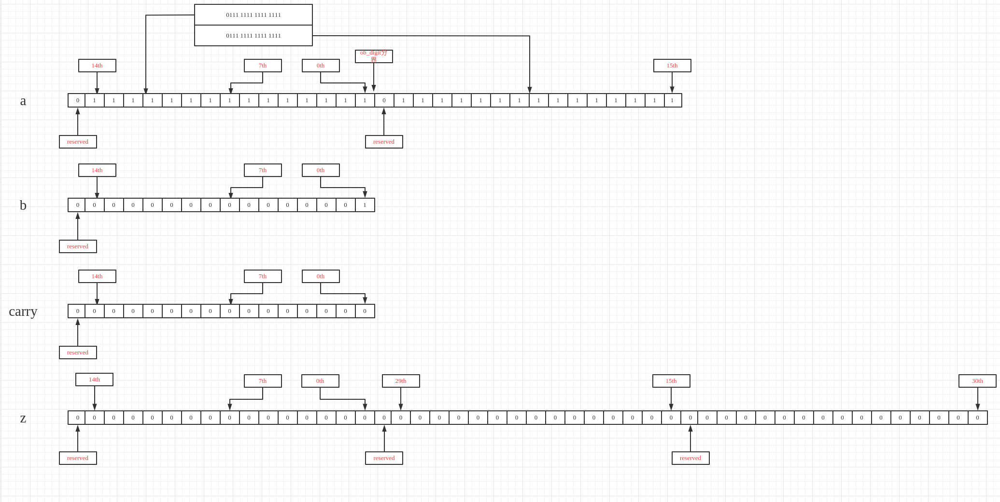

##### 第二步

```c
for (i = 0; i < size_b; ++i) {
        carry += a->ob_digit[i] + b->ob_digit[i];
        z->ob_digit[i] = carry & PyLong_MASK;
        carry >>= PyLong_SHIFT;
    }
```

将a与b对应的部分相加，并使用carry＂运载＂计算结果存放在z中．

首先，a与b的第0个ob_digit以及carry相加，结果放到carry中．

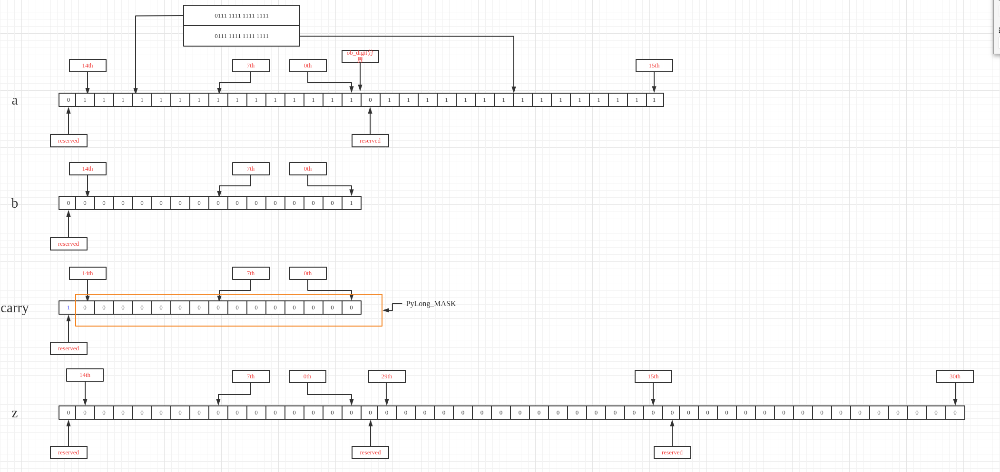

此时，carry的低15位为＂本位＂，需要留在第0个ob_digit中

```c
z->ob_digit[i] = carry & PyLong_MASK;
```

carry的最高位为进位，需要在下一次运算中参与计算

```C
carry >>= PyLong_SHIFT;
```

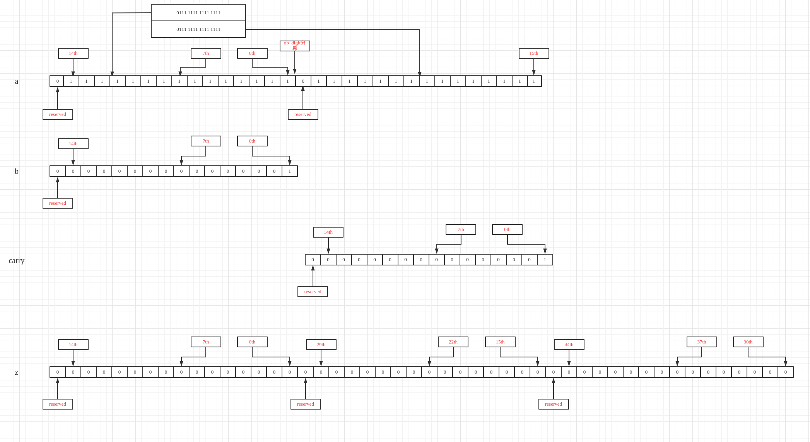

当b中所有ob_digit都参与运算之后，跳出循环，进入下一个循环．

##### 第三步

由于carry中可能还有残留的进位，所以需要继续进行carry与a运算．

```C
for (; i < size_a; ++i) {
        carry += a->ob_digit[i];
        z->ob_digit[i] = carry & PyLong_MASK;
        carry >>= PyLong_SHIFT;
    }
    z->ob_digit[i] = carry;
```

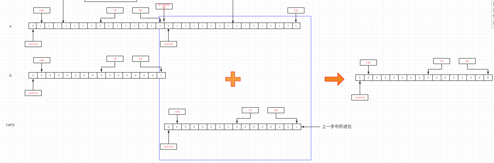

得到的carry右移之后赋值给z对应的ob_digit

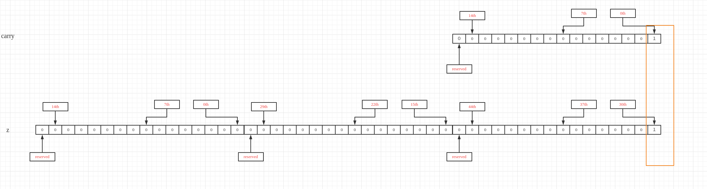

由于最后一次计算得到的carry可能为0，Python需要对z进行了规格化（去掉最高有效ob_digit上多余的0）

```c
return long_normalize(z);
```

### 小整数对象池smallints

在Python中，针对数值比较小的整数使用了对象池技术以避免频繁地在堆上申请内存．该整数池的定义如下

```c
static PyLongObject small_ints[NSMALLNEGINTS + NSMALLPOSINTS];
```

其中，NSMALLNEGINTS与NSMALLPOSINTS定义了小整数的范围－－[NSMALLNEGINTS,NSMALLPOSINTS)

```c
#define NSMALLPOSINTS           257
#define NSMALLNEGINTS           5
```

samll_ints的初始化代码如下

```C
int
_PyLong_Init(void)
{
#if NSMALLNEGINTS + NSMALLPOSINTS > 0
    int ival, size;
    PyLongObject *v = small_ints;

    for (ival = -NSMALLNEGINTS; ival <  NSMALLPOSINTS; ival++, v++) {
        size = (ival < 0) ? -1 : ((ival == 0) ? 0 : 1);//负数longobject对象的ob_size为负值，0的ob_size值0,正数的ob_size为正值
        if (Py_TYPE(v) == &PyLong_Type) {
            /* The element is already initialized, most likely
             * the Python interpreter was initialized before.
             */
            Py_ssize_t refcnt;
            PyObject* op = (PyObject*)v;

            refcnt = Py_REFCNT(op) < 0 ? 0 : Py_REFCNT(op);
            _Py_NewReference(op);
            /* _Py_NewReference sets the ref count to 1 but
             * the ref count might be larger. Set the refcnt
             * to the original refcnt + 1 */
            Py_REFCNT(op) = refcnt + 1;
            assert(Py_SIZE(op) == size);
            assert(v->ob_digit[0] == (digit)abs(ival));
        }
        else {
            (void)PyObject_INIT(v, &PyLong_Type);
        }
        Py_SIZE(v) = size;
        v->ob_digit[0] = (digit)abs(ival);
    }
```

当需要使用小整数对象时，Python使用get_small_int从small_ints缓冲池中获取

```c
static PyObject *
get_small_int(sdigit ival)
{
    PyObject *v;
    assert(-NSMALLNEGINTS <= ival && ival < NSMALLPOSINTS);
    v = (PyObject *)&small_ints[ival + NSMALLNEGINTS];
    Py_INCREF(v);
#ifdef COUNT_ALLOCS
    if (ival >= 0)
        _Py_quick_int_allocs++;
    else
        _Py_quick_neg_int_allocs++;
#endif
    return v;
}
```

