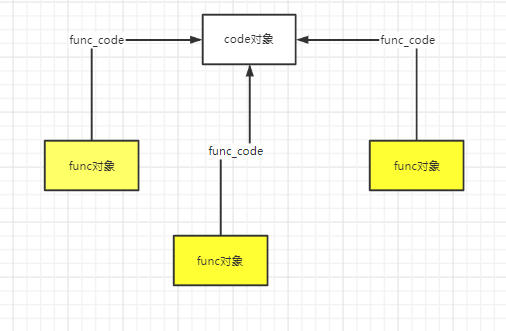
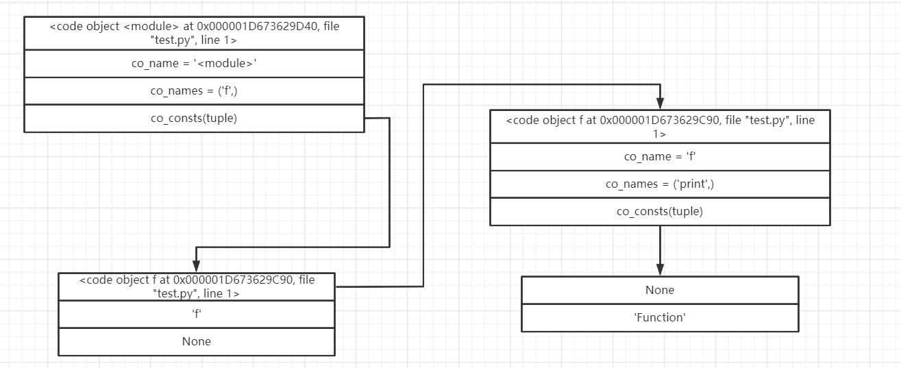

## Python虚拟机中的函数机制

根据“一切皆对象”的原则，python中的函数也应该是一个对象。在python中，函数机制是通过python对象——PyFunctionObject来实现的。

~~~C
typedef struct {
    PyObject_HEAD
    PyObject *func_code;        /* A code object, the __code__ attribute *///对应编译后的PyCodeObject对象
    PyObject *func_globals;     /* A dictionary (other mappings won't do) *///函数运行时的globals名字空间
    PyObject *func_defaults;    /* NULL or a tuple *///默认参数
    PyObject *func_kwdefaults;  /* NULL or a dict *///关键字参数
    PyObject *func_closure;     /* NULL or a tuple of cell objects *///用于实现闭包
    PyObject *func_doc;         /* The __doc__ attribute, can be anything *///函数的文档
    PyObject *func_name;        /* The __name__ attribute, a string object *///函数__name__属性
    PyObject *func_dict;        /* The __dict__ attribute, a dict or NULL *///函数的__dict__属性
    PyObject *func_weakreflist; /* List of weak references */
    PyObject *func_module;      /* The __module__ attribute, can be anything *///函数的__module__属性
    PyObject *func_annotations; /* Annotations, a dict or NULL */
    PyObject *func_qualname;    /* The qualified name */

    /* Invariant:
     *     func_closure contains the bindings for func_code->co_freevars, so
     *     PyTuple_Size(func_closure) == PyCode_GetNumFree(func_code)
     *     (func_closure may be NULL if PyCode_GetNumFree(func_code) == 0).
     */
} PyFunctionObject;
~~~

在**Code对象与pyc文件中**我们已经知道，一段函数代码可以看作一个code block，python会将这段函数代码编译为一个code对象。code对象可以看作是一段python代码的静态表示。每一段code block只会编译产生一个code对象，这个code对象包含了源代码中的静态信息。而func对象不同，func对象是python运行时动态产生的，其中除了包含源代码中的静态信息以外（func_code指针），还包含了函数在执行时所必须的动态信息，比如，func_globals，就是函数在执行时所关联的全局作用域。

func对象和code对象的关系可以用下图来表示。



### 无参函数的构造

在考察无参函数时，我们可以不去考虑python中复杂的参数传递机制。

给出一个无参函数及其编译后的python字节码

~~~python
def f():
    print("Function")
f()
#以下是编译后的字节码
  1           0 LOAD_CONST               0 (<code object f at 0x00000255F9E80190, file ".\test.py", line 1>)
              2 LOAD_CONST               1 ('f')
              4 MAKE_FUNCTION            0
              6 STORE_NAME               0 (f)

  3           8 LOAD_NAME                0 (f)
             10 CALL_FUNCTION            0
             12 POP_TOP
             14 LOAD_CONST               2 (None)
             16 RETURN_VALUE

Disassembly of <code object f at 0x00000255F9E80190, file ".\test.py", line 1>:
  2           0 LOAD_GLOBAL              0 (print)
              2 LOAD_CONST               1 ('Function')
              4 CALL_FUNCTION            1
              6 POP_TOP
              8 LOAD_CONST               0 (None)
             10 RETURN_VALUE
~~~

上述源码经过编译后产生了两个code对象，分别是源文件对应的code对象和函数f对应的code对象。我们来考察一下这两个code对象的关系。



首先，我们来考察一下字节码的执行流程。两条load_const指令分别把函数f所对应的code对象和字符串“f”压入堆栈。然后执行了make_function字节码生成了函数f，随后，执行了store_name字节码将生成的函数对象以及字符串f在local命名空间中进行了关联。

我们来看一下make_function字节码的具体实现。

```C
case TARGET(MAKE_FUNCTION): {
            PyObject *qualname = POP();//一个显示从从定义该对象的模块到到达该对象(类，函数，方法)所经路径的带.号的名字
            PyObject *codeobj = POP();	//获得与函数关联的code对象
            PyFunctionObject *func = (PyFunctionObject *)
                PyFunction_NewWithQualName(codeobj, f->f_globals, qualname);//生成函数

            Py_DECREF(codeobj);
            Py_DECREF(qualname);
            if (func == NULL) {
                goto error;
            }
//////////////////////////////////////////////////////
            if (oparg & 0x08) {                     //
                assert(PyTuple_CheckExact(TOP()));	//
                func ->func_closure = POP();		//
            }										//
            if (oparg & 0x04) {						//
                assert(PyDict_CheckExact(TOP()));	//
                func->func_annotations = POP();		//
            }										///*参数处理*/
            if (oparg & 0x02) {						//
                assert(PyDict_CheckExact(TOP()));	//
                func->func_kwdefaults = POP();		//
            }										//
            if (oparg & 0x01) {						//
                assert(PyTuple_CheckExact(TOP()));	//
                func->func_defaults = POP();		//
            }										//
//////////////////////////////////////////////////////
            PUSH((PyObject *)func);
            DISPATCH();
        }
```

在make_function字节码中，最重要的是调用PyFunction_NewWithQualName函数来生成函数对象。

~~~C
PyObject *
PyFunction_NewWithQualName(PyObject *code, PyObject *globals, PyObject *qualname)
{
    PyFunctionObject *op;
    PyObject *doc, *consts, *module;
    static PyObject *__name__ = NULL;//函数的module属性

    if (__name__ == NULL) {
        __name__ = PyUnicode_InternFromString("__name__");
        if (__name__ == NULL)
            return NULL;
    }

    op = PyObject_GC_New(PyFunctionObject, &PyFunction_Type);//申请func对象空间
    if (op == NULL)
        return NULL;
//初始化对象中的各个域
    op->func_weakreflist = NULL;
    Py_INCREF(code);
    op->func_code = code;//设置code对象
    Py_INCREF(globals);
    op->func_globals = globals;//全局名字空间
    op->func_name = ((PyCodeObject *)code)->co_name;//函数名
    Py_INCREF(op->func_name);
    op->func_defaults = NULL; /* No default arguments */
    op->func_kwdefaults = NULL; /* No keyword only defaults */
    op->func_closure = NULL;//闭包
    op->vectorcall = _PyFunction_Vectorcall;

    consts = ((PyCodeObject *)code)->co_consts;
    if (PyTuple_Size(consts) >= 1) {
        doc = PyTuple_GetItem(consts, 0);
        if (!PyUnicode_Check(doc))
            doc = Py_None;
    }
    else
        doc = Py_None;
    Py_INCREF(doc);
    op->func_doc = doc;//文档

    op->func_dict = NULL;
    op->func_module = NULL;
    op->func_annotations = NULL;

    /* __module__: If module name is in globals, use it.
       Otherwise, use None. */
    module = PyDict_GetItemWithError(globals, __name__);
    if (module) {
        Py_INCREF(module);
        op->func_module = module;
    }
    else if (PyErr_Occurred()) {
        Py_DECREF(op);
        return NULL;
    }
    if (qualname)
        op->func_qualname = qualname;
    else
        op->func_qualname = op->func_name;
    Py_INCREF(op->func_qualname);

    _PyObject_GC_TRACK(op);
    return (PyObject *)op;
}
~~~

### 函数调用

在"8 LOAD_NAME 0 (f)"指令被执行之后，之前生成的函数对象f被入栈，接下来从"10 CALL_FUNCTION 0"开始，python虚拟机进入了函数调用阶段。首先看call_function指令的实现。

~~~C
case TARGET(CALL_FUNCTION): {
            PREDICTED(CALL_FUNCTION);
            PyObject **sp, *res;
            sp = stack_pointer;
            res = call_function(tstate, &sp, oparg, NULL);
            stack_pointer = sp;
            PUSH(res);
            if (res == NULL) {
                goto error;
            }
            DISPATCH();
        }
~~~

call_function指令的主要工作都是在call_function中完成的。

~~~C
Py_LOCAL_INLINE(PyObject *) _Py_HOT_FUNCTION
call_function(PyThreadState *tstate, PyObject ***pp_stack, Py_ssize_t oparg, PyObject *kwnames)
{
    PyObject **pfunc = (*pp_stack) - oparg - 1;//获取函数对象指针（字节码参数oparg为0，栈顶就是函数对象的指针）
    PyObject *func = *pfunc;//函数对象
    PyObject *x, *w;
    Py_ssize_t nkwargs = (kwnames == NULL) ? 0 : PyTuple_GET_SIZE(kwnames);
    Py_ssize_t nargs = oparg - nkwargs;//kwnames为NULL，所以nargs就是总的参数个数
    PyObject **stack = (*pp_stack) - nargs - nkwargs;//弹出所有参数

    if (tstate->use_tracing) {
        x = trace_call_function(tstate, func, stack, nargs, kwnames);
    }
    else {
        x = _PyObject_Vectorcall(func, stack, nargs | PY_VECTORCALL_ARGUMENTS_OFFSET, kwnames);
    }

    assert((x != NULL) ^ (_PyErr_Occurred(tstate) != NULL));

    /* Clear the stack of the function object. */
    while ((*pp_stack) > pfunc) {
        w = EXT_POP(*pp_stack);
        Py_DECREF(w);
    }

    return x;
}
~~~

