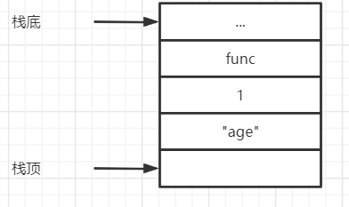
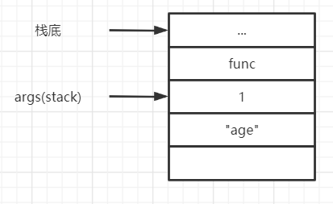

## Python虚拟机中的函数机制

根据“一切皆对象”的原则，python中的函数也应该是一个对象。在python中，函数机制是通过python对象——PyFunctionObject来实现的。

~~~C
typedef struct {
    PyObject_HEAD
    PyObject *func_code;        /* A code object, the __code__ attribute *///对应编译后的PyCodeObject对象
    PyObject *func_globals;     /* A dictionary (other mappings won't do) *///函数运行时的globals名字空间
    PyObject *func_defaults;    /* NULL or a tuple *///一个元组，储存了函数所有的默认参数
    PyObject *func_kwdefaults;  /* NULL or a dict *///保存指定了默认值的强制关键字参数的默认值
    PyObject *func_closure;     /* NULL or a tuple of cell objects *///一个元组，保存了当前函数的所有闭包层级
    PyObject *func_doc;         /* The __doc__ attribute, can be anything *///函数的文档
    PyObject *func_name;        /* The __name__ attribute, a string object *///函数__name__属性
    PyObject *func_dict;        /* The __dict__ attribute, a dict or NULL *///函数的__dict__属性
    PyObject *func_weakreflist; /* List of weak references */
    PyObject *func_module;      /* The __module__ attribute, can be anything *///函数的__module__属性，该函数所属的或者所关联的模块
    PyObject *func_annotations; /* Annotations, a dict or NULL *///对参数的注释
    PyObject *func_qualname;    /* The qualified name *///包含了该函数所属的层次结构及函数名的字符串

    /* Invariant:
     *     func_closure contains the bindings for func_code->co_freevars, so
     *     PyTuple_Size(func_closure) == PyCode_GetNumFree(func_code)
     *     (func_closure may be NULL if PyCode_GetNumFree(func_code) == 0).
     */
} PyFunctionObject;
~~~

在**Code对象与pyc文件中**我们已经知道，一段函数代码可以看作一个code block，python会将这段函数代码编译为一个code对象。code对象可以看作是一段python代码的静态表示。每一段code block只会编译产生一个code对象，这个code对象包含了源代码中的静态信息。而func对象不同，func对象是python运行时动态产生的，其中除了包含源代码中的静态信息以外（func_code指针），还包含了函数在执行时所必须的动态信息，比如，func_globals，就是函数在执行时所关联的全局作用域。

func对象和code对象的关系可以用下图来表示。


### 无参函数的构造

在考察无参函数时，我们可以不去考虑python中复杂的参数传递机制。

给出一个无参函数及其编译后的python字节码

~~~python
def f():
    print("Function")
f()
#以下是编译后的字节码
  1           0 LOAD_CONST               0 (<code object f at 0x00000255F9E80190, file ".\test.py", line 1>)
              2 LOAD_CONST               1 ('f')
              4 MAKE_FUNCTION            0
              6 STORE_NAME               0 (f)

  3           8 LOAD_NAME                0 (f)
             10 CALL_FUNCTION            0
             12 POP_TOP
             14 LOAD_CONST               2 (None)
             16 RETURN_VALUE

Disassembly of <code object f at 0x00000255F9E80190, file ".\test.py", line 1>:
  2           0 LOAD_GLOBAL              0 (print)
              2 LOAD_CONST               1 ('Function')
              4 CALL_FUNCTION            1
              6 POP_TOP
              8 LOAD_CONST               0 (None)
             10 RETURN_VALUE
~~~

上述源码经过编译后产生了两个code对象，分别是源文件对应的code对象和函数f对应的code对象。我们来考察一下这两个code对象的关系。


首先，我们来考察一下字节码的执行流程。两条load_const指令分别把函数f所对应的code对象和字符串“f”压入堆栈。然后执行了make_function字节码生成了函数f，随后，执行了store_name字节码将生成的函数对象以及字符串f在local命名空间中进行了关联。

我们来看一下make_function字节码的具体实现。

```C
case TARGET(MAKE_FUNCTION): {
            PyObject *qualname = POP();//一个显示从从定义该对象的模块到到达该对象(类，函数，方法)所经路径的带.号的名字
            PyObject *codeobj = POP();	//获得与函数关联的code对象
            PyFunctionObject *func = (PyFunctionObject *)
                PyFunction_NewWithQualName(codeobj, f->f_globals, qualname);//生成函数

            Py_DECREF(codeobj);
            Py_DECREF(qualname);
            if (func == NULL) {
                goto error;
            }
//////////////////////////////////////////////////////
            if (oparg & 0x08) {                     //
                assert(PyTuple_CheckExact(TOP()));	//
                func ->func_closure = POP();		//
            }										//
            if (oparg & 0x04) {						//
                assert(PyDict_CheckExact(TOP()));	//
                func->func_annotations = POP();		//
            }										///*参数处理*/
            if (oparg & 0x02) {						//
                assert(PyDict_CheckExact(TOP()));	//
                func->func_kwdefaults = POP();		//
            }										//
            if (oparg & 0x01) {						//
                assert(PyTuple_CheckExact(TOP()));	//
                func->func_defaults = POP();		//
            }										//
//////////////////////////////////////////////////////
            PUSH((PyObject *)func);
            DISPATCH();
        }
```

在make_function字节码中，最重要的是调用PyFunction_NewWithQualName函数来生成函数对象。

~~~C
PyObject *
PyFunction_NewWithQualName(PyObject *code, PyObject *globals, PyObject *qualname)
{
    PyFunctionObject *op;
    PyObject *doc, *consts, *module;
    static PyObject *__name__ = NULL;//函数的module属性

    if (__name__ == NULL) {
        __name__ = PyUnicode_InternFromString("__name__");
        if (__name__ == NULL)
            return NULL;
    }

    op = PyObject_GC_New(PyFunctionObject, &PyFunction_Type);//申请func对象空间
    if (op == NULL)
        return NULL;
//初始化对象中的各个域
    op->func_weakreflist = NULL;
    Py_INCREF(code);
    op->func_code = code;//设置code对象
    Py_INCREF(globals);
    op->func_globals = globals;//全局名字空间
    op->func_name = ((PyCodeObject *)code)->co_name;//函数名
    Py_INCREF(op->func_name);
    op->func_defaults = NULL; /* No default arguments */
    op->func_kwdefaults = NULL; /* No keyword only defaults */
    op->func_closure = NULL;//闭包
    op->vectorcall = _PyFunction_Vectorcall;

    consts = ((PyCodeObject *)code)->co_consts;
    if (PyTuple_Size(consts) >= 1) {
        doc = PyTuple_GetItem(consts, 0);
        if (!PyUnicode_Check(doc))
            doc = Py_None;
    }
    else
        doc = Py_None;
    Py_INCREF(doc);
    op->func_doc = doc;//文档

    op->func_dict = NULL;
    op->func_module = NULL;
    op->func_annotations = NULL;

    /* __module__: If module name is in globals, use it.
       Otherwise, use None. */
    module = PyDict_GetItemWithError(globals, __name__);
    if (module) {
        Py_INCREF(module);
        op->func_module = module;
    }
    else if (PyErr_Occurred()) {
        Py_DECREF(op);
        return NULL;
    }
    if (qualname)
        op->func_qualname = qualname;
    else
        op->func_qualname = op->func_name;
    Py_INCREF(op->func_qualname);

    _PyObject_GC_TRACK(op);
    return (PyObject *)op;
}
~~~

### 函数调用

在"8 LOAD_NAME 0 (f)"指令被执行之后，之前生成的函数对象f被入栈，接下来从"10 CALL_FUNCTION 0"开始，python虚拟机进入了函数调用阶段。首先看call_function指令的实现。

~~~C
case TARGET(CALL_FUNCTION): {
            PREDICTED(CALL_FUNCTION);
            PyObject **sp, *res;
            sp = stack_pointer;
            res = call_function(tstate, &sp, oparg, NULL);
            stack_pointer = sp;
            PUSH(res);
            if (res == NULL) {
                goto error;
            }
            DISPATCH();
        }
~~~

call_function指令的主要工作都是在call_function中完成的。

~~~C
Py_LOCAL_INLINE(PyObject *) _Py_HOT_FUNCTION
call_function(PyObject ***pp_stack, Py_ssize_t oparg, PyObject *kwnames)
{
    PyObject **pfunc = (*pp_stack) - oparg - 1;//获取func对象
    PyObject *func = *pfunc;//func对象
    PyObject *x, *w;
    Py_ssize_t nkwargs = (kwnames == NULL) ? 0 : PyTuple_GET_SIZE(kwnames);
    Py_ssize_t nargs = oparg - nkwargs;//参数总数
    PyObject **stack = (*pp_stack) - nargs - nkwargs;//参数出栈

    /* Always dispatch PyCFunction first, because these are
       presumed to be the most frequent callable object.
    */
    if (PyCFunction_Check(func)) {//CFunction在这里执行
        PyThreadState *tstate = _PyThreadState_GET();
        C_TRACE(x, _PyCFunction_FastCallKeywords(func, stack, nargs, kwnames));
    }
    else if (Py_TYPE(func) == &PyMethodDescr_Type) {//执行method_descriptor（比如str.upper）
        /*...*/
    }
    else {
        if (PyMethod_Check(func) && PyMethod_GET_SELF(func) != NULL) {
            /*...*///处理bound method
        }
        else {
            Py_INCREF(func);
        }

        if (PyFunction_Check(func)) {//[A]在这里开始执行用户自定义的函数
            x = _PyFunction_FastCallKeywords(func, stack, nargs, kwnames);
        }
        else {
            x = _PyObject_FastCallKeywords(func, stack, nargs, kwnames);
        }
        Py_DECREF(func);
    }

    assert((x != NULL) ^ (PyErr_Occurred() != NULL));

    /* Clear the stack of the function object. */
    while ((*pp_stack) > pfunc) {
        w = EXT_POP(*pp_stack);
        Py_DECREF(w);
    }

    return x;
}
~~~

在call_function函数中有多条分支分别处置不同类型的函数调用。用户自定义函数在标记[A]处的到了处理。

~~~C
PyObject *
_PyFunction_FastCallKeywords(PyObject *func, PyObject *const *stack,
                             Py_ssize_t nargs, PyObject *kwnames)
{
    /*必要的处理以及检查工作*/
    /* kwnames must only contains str strings, no subclass, and all keys must
       be unique */

    if (co->co_kwonlyargcount == 0 && nkwargs == 0 &&//[A]快速通道————函数声明中不包含强制关键字参数且未传入关键字参数
        (co->co_flags & ~PyCF_MASK) == (CO_OPTIMIZED | CO_NEWLOCALS | CO_NOFREE))//CO_NOFREE：没有free和cell变量
    {
        if (argdefs == NULL && co->co_argcount == nargs) {//所有参数都已经赋值：nargs——调用时传入的参数个数;co->co_argcount函数声明的参数个数（不包括强制关键字参数，*args以及**kw所声明的参数;*args所代表的参数数量也会被计算入nargs，如果有*args参数，函数流程不会进入这个分支）。
            return function_code_fastcall(co, stack, nargs, globals);
        }
        else if (nargs == 0 && argdefs != NULL
                 && co->co_argcount == PyTuple_GET_SIZE(argdefs)) {//调用时未传参数但是所有参数都具有默认值
            /* function called with no arguments, but all parameters have
               a default value: use default values as arguments .*/
            stack = _PyTuple_ITEMS(argdefs);//使用默认值作为参数值
            return function_code_fastcall(co, stack, PyTuple_GET_SIZE(argdefs),
                                          globals);
        }
    }
    //[B]不满足以上的分支条件则进入常规通道
    kwdefs = PyFunction_GET_KW_DEFAULTS(func);
    closure = PyFunction_GET_CLOSURE(func);
    name = ((PyFunctionObject *)func) -> func_name;
    qualname = ((PyFunctionObject *)func) -> func_qualname;

    if (argdefs != NULL) {
        d = _PyTuple_ITEMS(argdefs);
        nd = PyTuple_GET_SIZE(argdefs);
    }
    else {
        d = NULL;
        nd = 0;
    }
    return _PyEval_EvalCodeWithName((PyObject*)co, globals, (PyObject *)NULL,
                                    stack, nargs,
                                    nkwargs ? _PyTuple_ITEMS(kwnames) : NULL,
                                    stack + nargs,
                                    nkwargs, 1,
                                    d, (int)nd, kwdefs,
                                    closure, name, qualname);
}
~~~

可以看到，_PyFunction_FastCallKeywords的执行流程包括两个分支：标签[A]处的快速通道;标签[B]处的常规通道。快速通道与常规通道的区别在于快速通道中处理的参数类型比较简单，而常规通道对python中各种复杂的参数情况都进行了处理。

#### 快速通道

我们首先来看快速通道的后续流程。

~~~C
static PyObject* _Py_HOT_FUNCTION
function_code_fastcall(PyCodeObject *co, PyObject *const *args, Py_ssize_t nargs,
                       PyObject *globals)
{
    /*...*/
    f = _PyFrame_New_NoTrack(tstate, co, globals, NULL);//创建栈帧
    /*...*/
    result = PyEval_EvalFrameEx(f,0);//执行f

    /*...*/
    return result;
}
~~~

在function_code_fastcall中首先创建了一个frame对象，然后调用了PyEval_EvalFrameEx函数，继续对PyEval_EvalFrameEx进行追溯

```C
PyObject *
PyEval_EvalFrameEx(PyFrameObject *f, int throwflag)
{
    PyInterpreterState *interp = _PyInterpreterState_GET_UNSAFE();
    return interp->eval_frame(f, throwflag);
}
#define _PyInterpreterState_GET_UNSAFE() (_PyThreadState_GET()->interp)
```

变量interp是当前线程状态tstate的一个成员，找到他的定义

```C
typedef struct _is {

    /*...*/
    /* Initialized to PyEval_EvalFrameDefault(). */
    _PyFrameEvalFunction eval_frame;

    /*...*/
} PyInterpreterState;
typedef PyObject* (*_PyFrameEvalFunction)(struct _frame *, int);
```

找到他的初始化函数

```C
PyInterpreterState *
PyInterpreterState_New(void)
{
    PyInterpreterState *interp = (PyInterpreterState *)
                                 PyMem_RawMalloc(sizeof(PyInterpreterState));

    if (interp == NULL) {
        return NULL;
    }

    /*...*/
    interp->eval_frame = _PyEval_EvalFrameDefault;
    /*...*/

    return interp;
}
```

最终，我们发现interp->eval_frame这个函数指针指向的就是_PyEval_EvalFrameDefault。

#### 常规通道

在常规通道中最终调用了_PyEval_EvalCodeWithName函数。\_PyEval_EvalCodeWithName函数比较复杂，我们来看一下他的部分代码。

~~~C
PyObject *
_PyEval_EvalCodeWithName(PyObject *_co, PyObject *globals, PyObject *locals,
           PyObject *const *args, Py_ssize_t argcount,
           PyObject *const *kwnames, PyObject *const *kwargs,
           Py_ssize_t kwcount, int kwstep,
           PyObject *const *defs, Py_ssize_t defcount,
           PyObject *kwdefs, PyObject *closure,
           PyObject *name, PyObject *qualname)
{
    /*...*/

    /* Create the frame */
    tstate = _PyThreadState_GET();
    assert(tstate != NULL);
    f = _PyFrame_New_NoTrack(tstate, co, globals, locals);//创建新frame对象
    /*...*/

    retval = PyEval_EvalFrameEx(f,0);//[A]执行frame对象f

	/*...*/
    return retval;
}
~~~

标签[A]处再次执行了PyEval_EvalFrameEx函数，从这里开始与快速通道一致，python虚拟机流程最终进入了_PyEval_EvalFrameDefault函数，开始了真正的“函数调用”状态。上述过程就是对x86平台函数调用过程的模拟——创建新栈帧并在新栈帧中执行代码。当流程进入虚拟机的主循环时，func对象的影响已经消失了。func对象中真正对新栈帧产生影响的是code对象和global名字空间。这也就是说，func对象的实际作用就是一个”传送工具“——对字节码指令和global名字空间进行打包传送的一种方式。

### 函数参数

pyhton中的函数支持丰富的参数类型。

+ 位置参数——最普通的参数类型，def func(a)中的a就是一个位置参数；
+ 默认参数——具有默认值的位置参数，def func(a,b=2)中的b就是一个默认参数；
+ 可变参数——可以理解为可以接收可变数量的位置参数的参数，def func(a,b,*args)中的args就是一个可变参数，当a、b分别接收对应的位置上的参数之后如果还有剩余的参数则会被args接收；
+ 关键字参数——以键值对的形式传入的参数，def func(a,b,**kw)中的kw就是一个关键字参数，kw可以接收以任意数量传入的键值对形式传入的参数，在函数中这戏参数会被组装为一个dict；
+ 强制关键字参数——关键字参数可以传入任意键名的参数，为了对键名进行限制可以采用强制关键字参数，def func(a,b,*,k1,k2=v2)或者def func(a,b,\*args,k1,k2=v2)（args是可变参数）两种方式都可以定义强制关键字参数，对强制关键字参数进行赋值时必须采用“k=v”的方式进行，强制关键字参数可以有默认值，没有默认值的强制关键字参数必须显式赋值。

#### 位置参数

##### 位置参数的传递

~~~python
##test.py
def func(a,b):
    a = a+1
    print(b)
func(1,"age")
##test.py的编译结果
  1           0 LOAD_CONST               0 (<code object func at 0x000001CAC2BB0190, file ".\test.py", line 1>)
              2 LOAD_CONST               1 ('func')
              4 MAKE_FUNCTION            0
              6 STORE_NAME               0 (func)

  4           8 LOAD_NAME                0 (func)
             10 LOAD_CONST               2 (1)
             12 LOAD_CONST               3 ('age')
             14 CALL_FUNCTION            2
             16 POP_TOP
             18 LOAD_CONST               4 (None)
             20 RETURN_VALUE

Disassembly of <code object func at 0x000001CAC2BB0190, file ".\test.py", line 1>:
  2           0 LOAD_FAST                0 (a)
              2 LOAD_CONST               1 (1)
              4 BINARY_ADD
              6 STORE_FAST               0 (a)

  3           8 LOAD_GLOBAL              0 (print)
             10 LOAD_FAST                1 (b)
             12 CALL_FUNCTION            1
             14 POP_TOP
             16 LOAD_CONST               0 (None)
             18 RETURN_VALUE
~~~

从编译后的代码可以看到，call_function指令之前有三条load指令这三条指令执行之后的运行时栈如图所示



可以看到，func函数需要的参数都已经压入运行时堆栈了，接下来的call_function指令参数为2。

~~~C
Py_LOCAL_INLINE(PyObject *) _Py_HOT_FUNCTION
call_function(PyObject ***pp_stack, Py_ssize_t oparg, PyObject *kwnames)
{												//oparg = 2
    PyObject **pfunc = (*pp_stack) - oparg - 1;	//pfunc指向栈顶的func对象
    PyObject *func = *pfunc;
    PyObject *x, *w;
    Py_ssize_t nkwargs = (kwnames == NULL) ? 0 : PyTuple_GET_SIZE(kwnames);	//kwnames = 0
    Py_ssize_t nargs = oparg - nkwargs;										//nargs = 0
    PyObject **stack = (*pp_stack) - nargs - nkwargs;						//stack指向参数弹出之后的位置（1所在的位置）

  /*...*/
        if (PyFunction_Check(func)) {//执行到这里
            x = _PyFunction_FastCallKeywords(func, stack, nargs, kwnames);
        }

    /*...*/

    return x;
}
//继续追踪_PyFunction_FastCallKeywords
PyObject *					//函数对象func，栈顶指针，nargs = 2，kwnames = NULL
_PyFunction_FastCallKeywords(PyObject *func, PyObject *const *stack,
                             Py_ssize_t nargs, PyObject *kwnames)
{
    PyCodeObject *co = (PyCodeObject *)PyFunction_GET_CODE(func);
    PyObject *globals = PyFunction_GET_GLOBALS(func);
    PyObject *argdefs = PyFunction_GET_DEFAULTS(func);
    PyObject *kwdefs, *closure, *name, *qualname;
    PyObject **d;
    Py_ssize_t nkwargs = (kwnames == NULL) ? 0 : PyTuple_GET_SIZE(kwnames);
    Py_ssize_t nd;

    /*...*/
    /* kwnames must only contains str strings, no subclass, and all keys must
       be unique */

    /*...*/
        if (argdefs == NULL && co->co_argcount == nargs) {
            return function_code_fastcall(co, stack, nargs, globals);//执行到这里
        }
	/*...*/
}
//继续追溯function_code_fastcall
static PyObject* _Py_HOT_FUNCTION        //args的值即是之前的stack参数的值
function_code_fastcall(PyCodeObject *co, PyObject *const *args, Py_ssize_t nargs,
                       PyObject *globals)
{
    PyFrameObject *f;
    PyThreadState *tstate = _PyThreadState_GET();
    PyObject **fastlocals;
    Py_ssize_t i;
    PyObject *result;
	/*...*/
    f = _PyFrame_New_NoTrack(tstate, co, globals, NULL);
    if (f == NULL) {
        return NULL;
    }

    fastlocals = f->f_localsplus;

    for (i = 0; i < nargs; i++) {//[A]
        Py_INCREF(*args);
        fastlocals[i] = *args++;
    }
    result = PyEval_EvalFrameEx(f,0);
    /*...*/
}
~~~

随着对python虚拟机执行过程的一步步追溯，我们在function_code_fastcall中发现了熟悉的frame对象以及f_localsplus这个frame的成员。参数args的值就是之前call_function中stack的值。



标签[A]处的for对新建栈帧的f_localsplus进行了循环赋值的操作，f->f_localsplus[0]、f->f_localsplus[1]分别被赋值为对象1、对象"age"。根据之前《Python虚拟机框架》中对frame对象结构的描述可知，f_localsplus是由两部分空间组成的——locals变量空间和运行时栈空间，函数参数也是一种局部变量，所以在这里func的参数a、b被存储到f_localsplus的起始位置与我们之前对frame对象的考察时完全符合的。

##### 位置参数的访问

当函数参数存储完成之后就进入了执行阶段。首先映入眼帘的就是一条load_fast指令。

~~~C
case TARGET(LOAD_FAST): {
            PyObject *value = GETLOCAL(oparg);
            if (value == NULL) {
                format_exc_check_arg(PyExc_UnboundLocalError,
                                     UNBOUNDLOCAL_ERROR_MSG,
                                     PyTuple_GetItem(co->co_varnames, oparg));
                goto error;
            }
            Py_INCREF(value);
            PUSH(value);
            FAST_DISPATCH();
        }
#define GETLOCAL(i)     (fastlocals[i])
~~~

load_fast指令是以f_localsplus这片内存为操作对象的指令。load_fast 0这条指令的作用就是将f_localsplus下标为0处的对象压入运行时堆栈，store_fast也类似，只不过是操作方向相反。

~~~c
case TARGET(STORE_FAST): {
            PREDICTED(STORE_FAST);
            PyObject *value = POP();
            SETLOCAL(oparg, value);
            FAST_DISPATCH();
        }
~~~

到这里，我们对pyhton中是如何传递位置参数，以及在函数调用过程中是如何访问位置参数，都已经有了比较清晰的了解。在调用函数时，python虚拟机将函数参数从左到右压入运行时堆栈，在function_code_fastcall中，虚拟机又将这些参数依次拷贝到与函数对应的frame对象的f_localsplus域中。在访问这些参数时，python虚拟机并没有去查找名字空间，而是通过load_fast、store_fast指令借助偏移量来访问f_localsplus所存储的对象。这种通过索引来访问参数的方法正是“位置参数”名称的由来。