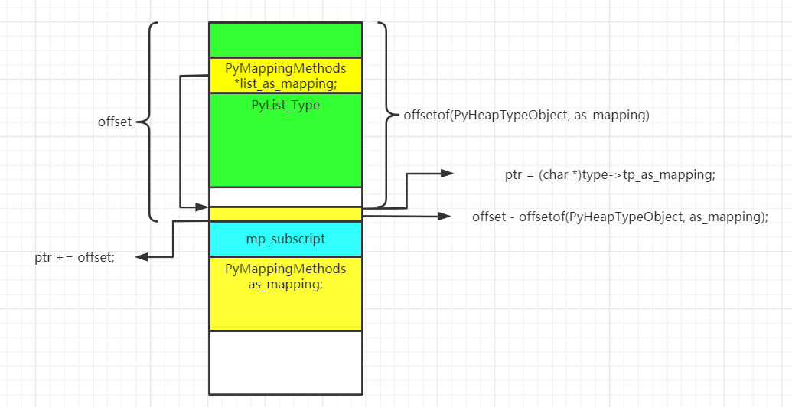
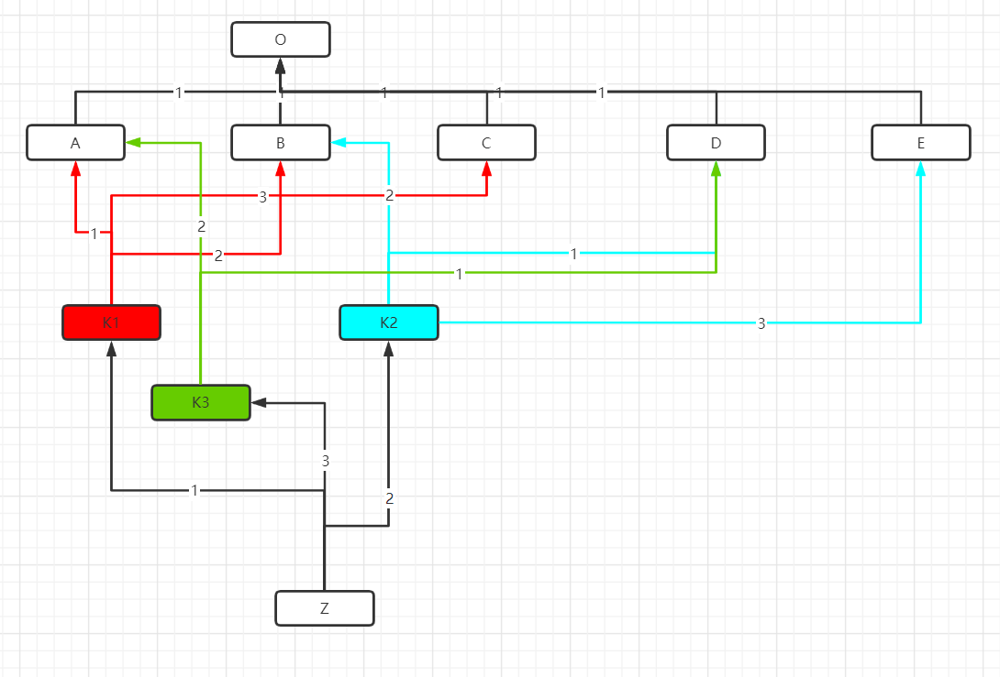
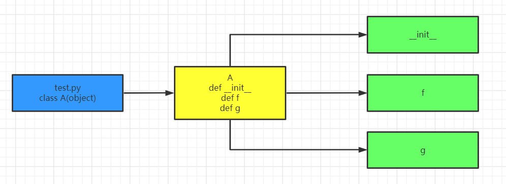
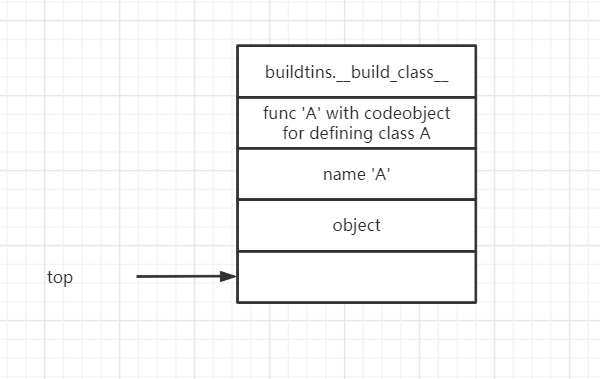
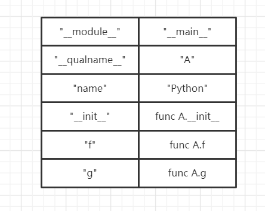

# Python虚拟机中的类机制

在python中，“一切皆对象”，包括面向对象概念的中的类在python也是对象。python中的对象存在两种关系——is-kind-of与is-instance-of。

+ is-kind-of：这种关系对应于面向对象中的基类与子类的关系；
+ is-instance-of：这种关系对应于面向对象中的类与实例之间的关系。

~~~python
class A(object):
    pass
a = A()
~~~

其中包含了三个对象：object（class A对象的基类）、class A对象以及a对象。这三者之间的关系也很明显：A与object之间存在is-kind-of关系，a与A以及a与object之间存在is-instance-of关系，即a是A以及object的一个实例。

python提供了一些方法以及属性来探测这些关系。

\__class__属性，type方法以及isinstance方法：探测两个对象之间的is-instance-of关系；

\__base__属性以及issubclass方法：探测两个对象之间的is-kind-of关系。

~~~python
class A(object):
    pass
a = A()

print(a.__class__)
print(isinstance(a,A))
print(isinstance(a,object))
print(A.__class__)
print(A.__base__)
print(isinstance(A,type))
print(issubclass(A,object))
print(a.__base__)
##输出
<class '__main__.A'>
True
True
<class 'type'>
<class 'object'>
True
True
Traceback (most recent call last):
  File "C:\Users\Administrator\Documents\test.py", line 11, in <module>
    print(a.__base__)
AttributeError: 'A' object has no attribute '__base__'
~~~

最后一条print语句抛出了异常。这也很好理解is-kind-of是类对象之间才有的关系，a是一个实例对象，不应该有表示is-kind-of关系的属性\__base__。


在python中有两个比较重要的类型对象——type对象以及object对象。首先，python中的type是一种特殊的对象，这种对象能够成为其他类型对象的类型，包括object对象以及type对象自身；其次，python中 除了object对象以外的所有类型对象都是直接或间接继承自object对现象，object对象没有基类。python中将type对象称为元类metaclass对象。

~~~pyhton
>>> type
<class 'type'>
>>> type.__base__
<class 'object'>
>>> type.__class__
<class 'type'>
>>> object
<class 'object'>
>>> object.__base__
>>> object.__class__
<class 'type'>
~~~

## 类型系统的初始化

PyType_Ready是python中类型初始化的起点。python中的内置类型对应的类型对象在python启动后已经作为全局对象存在，需要的仅仅是完善；而用户自定义类型的类型对象并不存在，需要申请内存，并创建初始化整个序列。对于内置类型来说，初始化就仅剩下PyType_Ready，而对于用户自定义类型来说，PyType_Ready仅仅是很小的一部分。

### 处理基类和type信息

我们从PyType_Type的初始化来考察PyType_Ready函数。

~~~C
int
PyType_Ready(PyTypeObject *type)//在这里，参数type是type对象的class对象（PyType_Type）
{
    PyObject *dict, *bases;
    PyTypeObject *base;
    Py_ssize_t i, n;
    
    /* Initialize tp_base (defaults to BaseObject unless that's us) */
    base = type->tp_base;//[A]
    if (base == NULL && type != &PyBaseObject_Type) {//如果type没有指定基类（base==NULL）且type不是Object的class对象（PyBaseObject_Type），则将type的基类设置为object对象。
        base = type->tp_base = &PyBaseObject_Type;
        Py_INCREF(base);
    }
    /* Initialize the base class *///[B]如果基类没有初始化，则先初始化基类
    if (base != NULL && base->tp_dict == NULL) {
        if (PyType_Ready(base) < 0)
            goto error;
    }
    /* Initialize ob_type if NULL.      This means extensions that want to be
       compilable separately on Windows can call PyType_Ready() instead of
       initializing the ob_type field of their type objects. */
    /* The test for base != NULL is really unnecessary, since base is only
       NULL when type is &PyBaseObject_Type, and we know its ob_type is
       not NULL (it's initialized to &PyType_Type).      But coverity doesn't
       know that. */
    if (Py_TYPE(type) == NULL && base != NULL)//[C]设置type信息
        Py_TYPE(type) = Py_TYPE(base);
    /*...*/
}
~~~

首先在代码[A]处，python虚拟机尝试获得待初始化的type的基类。这个信息是在TyTypeObject.tp_base中指定的。对于指定了tp_base的内置class对象，python就是用指定的类型作为class对象的基类；而对于tp_base指针为空的class对象，python虚拟机就是用PyBaseObject_Type（object对象）作为其基类。所以从这里可以看出，python中的所有class对象都是直接或者间接以object作为基类的（除了object对象，object对象没有基类）。

得到了基类之后，代码[B]处就要判断基类是否已经初始化了，如果没有，则需要对基类进行初始化。可以看到，判断基类初始化是否完成的条件是base->tp_dict是否为NULL。

最后在[C]处对class对象的ob_type信息进行了设置。实际上这个ob_type信息也就是对象的\__class__返回的信息。更进一步说，这里的ob_type就是元类（metaclass）。实际上，Python虚拟机就是将基类的metaclass作为了子类的metalcass。这里对于PyType_Type来说，其metaclass正是object的metaclass。而在PyBaseObject\_Type的定义中我们可以看到其ob_type被设置成了PyType_Type，这正好与上面的python对象关系图互相印证。

### 处理基类列表

~~~C
/*...*/
if (Py_TYPE(type) == NULL && base != NULL)
        Py_TYPE(type) = Py_TYPE(base);

    /* Initialize tp_bases */
    bases = type->tp_bases;
    if (bases == NULL) {//如果bases为空，则根据情况设置基类列表
        if (base == NULL)//如果base为空，则该class对象的基类列表为空的tuple
            bases = PyTuple_New(0);
        else//如果base不空，则说明基类列表中至少包含一个base对象
            bases = PyTuple_Pack(1, base);
        if (bases == NULL)
            goto error;
        type->tp_bases = bases;
    }
/*...*/
~~~

在这里，python虚拟机将处理类型的基类列表，因为python支持多重继承，所以每一个class对象都会有一个基类列表。

### 填充tp_dict

~~~C
/*...*/
/* Initialize tp_dict */
    dict = type->tp_dict;
    if (dict == NULL) {
        dict = PyDict_New();
        if (dict == NULL)
            goto error;
        type->tp_dict = dict;
    }

    /* Add type-specific descriptors to tp_dict */
    if (add_operators(type) < 0)
        goto error;
    if (type->tp_methods != NULL) {
        if (add_methods(type, type->tp_methods) < 0)
            goto error;
    }
    if (type->tp_members != NULL) {
        if (add_members(type, type->tp_members) < 0)
            goto error;
    }
    if (type->tp_getset != NULL) {
        if (add_getset(type, type->tp_getset) < 0)
            goto error;
    }
/*...*/
~~~

在这个阶段，完成了将("\__add__",&nb_add)加入tp\_dict的过程。这个阶段的add_operators、add_methods、add_members以及add_getset都是完成这样的填充过程的。那么，python是如何找到操作名称与具体的实现动作之间的关系的呢？答案是python源码中已经预先定义好了，存放在一个名为slotdefs的全局数组之中。

#### slot

在python内部，slot可以视为标识PyTypeObject中定义的操作，一个操作对应一个slot，但是slot不仅仅包含一个函数指针，还包含其他一些信息。在python内部，slot是通过slotdefs这个结构体来实现的。

~~~C
typedef struct wrapperbase slotdef;

struct wrapperbase {
    const char *name;
    int offset;
    void *function;
    wrapperfunc wrapper;
    const char *doc;
    int flags;
    PyObject *name_strobj;
};
~~~

在一个slot中，存储着与PyTypeObject中一种操作对应的各种信息。比如，name是操作的名称，比如字符串"\__add__"；offset则是操作的函数地址在PyHeapTypeObject中的偏移量；而function则指向一种被称为slot function的函数。

python中提供了多个宏来定义一个slot，其中最基本的是TPSLOT和ETSLOT。

~~~C
#define TPSLOT(NAME, SLOT, FUNCTION, WRAPPER, DOC) \
    {NAME, offsetof(PyTypeObject, SLOT), (void *)(FUNCTION), WRAPPER, \
     PyDoc_STR(DOC)}

#define ETSLOT(NAME, SLOT, FUNCTION, WRAPPER, DOC) \
    {NAME, offsetof(PyHeapTypeObject, SLOT), (void *)(FUNCTION), WRAPPER, \
     PyDoc_STR(DOC)}
~~~

TPSLOT与EPSLOT的区别在于TPSLOT计算的是操作对应的函数指针（比如nb_add）在PyTypeObject中的偏移量，而ETSLOT计算的是函数指针在PyHeapTypeObject中的偏移量。但是通过PyHeapTypeObject的代码可以发现，PyHeapTypeObject的第一个域就是PyTypeObject，所以TPSLOT计算出的偏移量实际上也就是相对于PyHeapTypeObject的偏移量。

~~~C
/* The *real* layout of a type object when allocated on the heap */
typedef struct _heaptypeobject {
    /* Note: there's a dependency on the order of these members
       in slotptr() in typeobject.c . */
    PyTypeObject ht_type;
    PyAsyncMethods as_async;
    PyNumberMethods as_number;
    PyMappingMethods as_mapping;
    PySequenceMethods as_sequence; /* as_sequence comes after as_mapping,
                                      so that the mapping wins when both
                                      the mapping and the sequence define
                                      a given operator (e.g. __getitem__).
                                      see add_operators() in typeobject.c . */
    PyBufferProcs as_buffer;
    PyObject *ht_name, *ht_slots, *ht_qualname;
    struct _dictkeysobject *ht_cached_keys;
    /* here are optional user slots, followed by the members. */
} PyHeapTypeObject;
~~~

我们来看一下python预定义的slot集合——slotdefs。

~~~C
static slotdef slotdefs[] = {
    /*...*/
    BINSLOT("__add__", nb_add, slot_nb_add,
           "+"),
    RBINSLOT("__radd__", nb_add, slot_nb_add,
           "+"),
    /*...*/
    SQSLOT("__len__", sq_length, slot_sq_length, wrap_lenfunc,
           "__len__($self, /)\n--\n\nReturn len(self)."),
    /*...*/
    MPSLOT("__getitem__", mp_subscript, slot_mp_subscript,
           wrap_binaryfunc,
           "__getitem__($self, key, /)\n--\n\nReturn self[key]."),
    /*...*/
    SQSLOT("__getitem__", sq_item, slot_sq_item, wrap_sq_item,
           "__getitem__($self, key, /)\n--\n\nReturn self[key]."),
    /*...*/
};
~~~

在slotdefs中，存在多个操作对应同一个操作名的情况，同样也存在着同一个操作对应不同操作名的情况。对于相同操作对应不同操作名的情况，在填充tp_dict时就会出现到底填充哪一个操作的问题。以PyList_Type为例：在PyList_Type中，tp_as_mapping.mp_subscript指向list_subscript，而tp_as_sequence.sq_item指向list_item，所以list对象中的\__getitem__到底指向哪一个函数？这个问题的答案可以在PyHeapTypeObject的注释中找到答案。

~~~C
    PyMappingMethods as_mapping;
    PySequenceMethods as_sequence; /* as_sequence comes after as_mapping,
                                      so that the mapping wins when both
                                      the mapping and the sequence define
                                      a given operator (e.g. __getitem__).
                                      see add_operators() in typeobject.c . */
~~~

“由于as_sequence在as_mapping之后，所以如果mapping与sequence定义了相同的操作符，as_mapping会‘胜出’”。也就是说，list对象的"\__getitem__"操作最终指向了tp_as_mapping.mp_subscript。

python虚拟机在tp_dict中找到"\__getitem__"对应的操作之后就会调用该操作，然而slot并不是一个PyObject，不具备可调用性，所以tp_dict中与之对应的操作只能是另一个包装了slot的PyObject。在python中，这是一个我们称之为descriptor的东西。

在python内部，与PyTypeObject中的操作对应的是PyWrapperDescrObject（简称descriptor），一个descriptor对应一个slot。descriptor的创建是通过PyDescr_NewWrapper实现的。

~~~C
typedef struct {
    PyObject_HEAD
    PyTypeObject *d_type;
    PyObject *d_name;
    PyObject *d_qualname;
} PyDescrObject;

#define PyDescr_COMMON PyDescrObject d_common

typedef struct {
    PyDescr_COMMON;
    struct wrapperbase *d_base;
    void *d_wrapped; /* This can be any function pointer */
} PyWrapperDescrObject;

PyObject *
PyDescr_NewWrapper(PyTypeObject *type, struct wrapperbase *base, void *wrapped)
{
    PyWrapperDescrObject *descr;

    descr = (PyWrapperDescrObject *)descr_new(&PyWrapperDescr_Type,
                                             type, base->name);//base->name为操作的名字（比如__getitem__）
    if (descr != NULL) {
        descr->d_base = base;//存放slot
        descr->d_wrapped = wrapped;//操作对应的函数指针，在list对象中该指针指向mp_subscript
    }
    return (PyObject *)descr;
}

static PyDescrObject *
descr_new(PyTypeObject *descrtype, PyTypeObject *type, const char *name)
{
    PyDescrObject *descr;

    descr = (PyDescrObject *)PyType_GenericAlloc(descrtype, 0);
    if (descr != NULL) {
        Py_XINCREF(type);
        descr->d_type = type;//PyDescrObject的所属的类型对象——PyWrapperDescr_Type，该对象的tp_call指向wrapperdescr_call，当前调用descriptor时，也就会调用wrapperdescr_call
        descr->d_name = PyUnicode_InternFromString(name);
        if (descr->d_name == NULL) {
            Py_DECREF(descr);
            descr = NULL;
        }
        else {
            descr->d_qualname = NULL;
        }
    }
    return descr;
}
~~~

#### 建立联系

python虚拟机遍历slotdefs，为每一个slot建立一个descriptor，然后在tp_dict中建立从操作名到descriptor的关联。整个操作过程在add_operators中完成。

~~~C
static int
add_operators(PyTypeObject *type)
{
    PyObject *dict = type->tp_dict;
    slotdef *p;
    PyObject *descr;
    void **ptr;

    init_slotdefs();//slotdefs初始化
    for (p = slotdefs; p->name; p++) {
        if (p->wrapper == NULL)//slot中的wrapper为空则不处理
            continue;
        ptr = slotptr(type, p->offset);//获得slot对应的操作在PyTypeObject中对应的函数指针
        if (!ptr || !*ptr)//为空则不处理
            continue;
        if (PyDict_GetItem(dict, p->name_strobj))//tp_dict中已经存在的操作的优先级更高，不处理当前slot对应的操作
            continue;
        if (*ptr == (void *)PyObject_HashNotImplemented) {
            /* Classes may prevent the inheritance of the tp_hash
               slot by storing PyObject_HashNotImplemented in it. Make it
               visible as a None value for the __hash__ attribute. */
            if (PyDict_SetItem(dict, p->name_strobj, Py_None) < 0)
                return -1;
        }
        else {
            descr = PyDescr_NewWrapper(type, p, *ptr);//根据slot创建一个新的PyWrapperDescrObject
            if (descr == NULL)
                return -1;
            if (PyDict_SetItem(dict, p->name_strobj, descr) < 0) {//建立操作与PyWrapperDescrObject之间的联系
                Py_DECREF(descr);
                return -1;
            }
            Py_DECREF(descr);
        }
    }
    if (type->tp_new != NULL) {
        if (add_tp_new_wrapper(type) < 0)
            return -1;
    }
    return 0;
}
~~~

在add_operators中，首先调用init_slotdefs对slotdefs进行初始化，然后从slotdefs[0]开始对slotdefs进行遍历。对于每一个slot，调用slotptr获取该slot对应的操作在PyTypeObject中的函数指针，接着创建descriptor，在tp_dict中创建从操作名（slot.name_strobj）到操作（descriptor）之间的关联。

~~~C
/* Given a type pointer and an offset gotten from a slotdef entry, return a
   pointer to the actual slot.  This is not quite the same as simply adding
   the offset to the type pointer, since it takes care to indirect through the
   proper indirection pointer (as_buffer, etc.); it returns NULL if the
   indirection pointer is NULL. */
static void **
slotptr(PyTypeObject *type, int ioffset)
{
    char *ptr;
    long offset = ioffset;

    /* Note: this depends on the order of the members of PyHeapTypeObject! */
    assert(offset >= 0);
    assert((size_t)offset < offsetof(PyHeapTypeObject, as_buffer));
    if ((size_t)offset >= offsetof(PyHeapTypeObject, as_sequence)) {//从后向前
        ptr = (char *)type->tp_as_sequence;
        offset -= offsetof(PyHeapTypeObject, as_sequence);
    }
    else if ((size_t)offset >= offsetof(PyHeapTypeObject, as_mapping)) {
        ptr = (char *)type->tp_as_mapping;
        offset -= offsetof(PyHeapTypeObject, as_mapping);
    }
    else if ((size_t)offset >= offsetof(PyHeapTypeObject, as_number)) {
        ptr = (char *)type->tp_as_number;
        offset -= offsetof(PyHeapTypeObject, as_number);
    }
    else if ((size_t)offset >= offsetof(PyHeapTypeObject, as_async)) {
        ptr = (char *)type->tp_as_async;
        offset -= offsetof(PyHeapTypeObject, as_async);
    }
    else {
        ptr = (char *)type;
    }
    if (ptr != NULL)
        ptr += offset;
    return (void **)ptr;
}
~~~



我们以slotptr(&PyList_Type,offsetof(PyHeapTypeObject,mp_subscript))为例，给出slotptr执行过程中各个量在PyHeapTypeObject中的分布。现在，slotptr的执行过程就很容易理解了。


上图是PyList_Type初始化完成之后的整个布局。其中，虚线是编译时就已经确定的好了，而实线是运行时环境初始化时才建立的。

在PyType_Ready中通过add_operators添加了PyType_Object对象中定义的一些operator之后，还会通过add_methods、add_members和add_getsets添加在PyType_Object中定义的tp_methods、tp_members和tp_getsets函数集。这些add**的过程与add_operators类似，不过最后添加到dict中的不是PyWrapperDescrObject，而是PyMethodDescrObject、PyMemberDescrObject和PyGetSetDescrObject。

#### 确定MRO

由于python支持多重继承，在多重继承时，必须确定属性解析顺序，这个顺序被称为MRO（Method Resolve Order）。

python中使用C3算法获取多重继承下的继承顺序表。

##### 基本概念

###### mro序列

mro是一个有序的列表L，在类被创建时就计算出来。

通用的计算公式为

~~~C
mro(B) = [B] + merge( mro(A1), mro(A2), mro(A3) ..., [A1, A2, A3] )
~~~

计算结果为列表，列表中至少有一个元素即类自身。

###### 表头和表尾

**表头**：列表的第一个元素

**表尾**：列表中表头以外的元素（可空）

例子：[A,B,C]中，A为表头，B、C为表尾

###### +操作

~~~C
[A] + [B] = [A,B]
~~~

###### merge操作

对于被merge的多个有序表集合中的每一个列表L：L中的表头如果不出现在其他表的表尾中，那么将该元素放入产出列表中，并从其他表中移除该元素，否则跳过L并考察L的下一项；每次从有序表集合的第一个列表循环该操作直至有序表集合为空得到一张产出表即为结果。



我们以上图为例（数字表示继承顺序即数字小的箭头所指向的基类先被继承）。

~~~C
//记类cls的C3线性表为L[cls]
L[O]:L[O]=[O]
L[A]:
	L[A]=[A]+merge(L[O]+[O])
        =[A]+[O]
        =[A,O]
同理:
	L[B]=[B,O]
    L[C]=[C,O]
    L[D]=[D,O]
	L[E]=[E,O]
L[K1]:
	L[K1]=[K1]+merge(L[A],L[B],L[C],[A,B,C])
         =[K1]+merge([A,O],[B,O],[C,O],[A,B,C])//根据规则，第一项[A,O]的表头不在其他项的表尾之中，将A移出置入产出表并从其他项中删除
         =[K1,A]+merge([O],[B,O],[C,O],[B,C])//第二项的表头B符合移出条件
         =[K1,A,B]+merge([O],[O],[C,O],[C])//移除C后第五项为空列表，从merge中移除
         =[K1,A,B]+merge([O],[O],[O])//merge结束
         =[K1,A,B,C]//K1的线性表
同理:
	L[K2]=[K2,D,B,E,O]
    L[K3]=[K3,D,A,O]
L[Z]:
	L[Z]=[Z]+merge(L[k1],L[K2],L[K3],[K1,K2,K3])//展开
        =[Z]+merge([K1,A,B,C,O],[K2,D,B,E,O],[K3,D,A,O],[K1,K2,K3])//选中K1
        =[Z,K1]+merge([A,B,C,O],[K2,D,B,E,O],[K3,D,A,O],[K2,K3])//选中K2
        =[Z,K1,K2]+merge([A,B,C,O],[D,B,E,O],[K3,D,A,O],[K3])//选中K3
        =[Z,K1,K2,K3]+merge([A,B,C,O],[D,B,E,O],[D,A,O])//选中D
        =[Z,K1,K2,K3,D]+merge([A,B,C,O],[B,E,O],[A,O])//选中A
        =[Z,K1,K2,K3,D,A]+merge([B,C,O],[B,E,O],[O])//选中B
        =[Z,K1,K2,K3,D,A,B]+merge([C,O],[E,O],[O])//选中C
        =[Z,K1,K2,K3,D,A,B,C]+merge([O],[E,O],[O])//选中E
        =[Z,K1,K2,K3,D,A,B,C,E]+merge([O],[O],[O])//结束
        =[Z,K1,K2,K3,D,A,B,C,E,O]
~~~

在python中进行测试

~~~python
class O:
    pass
class A(O):
    pass
class B(O):
    pass
class C(O):
    pass
class D(O):
    pass
class E(O):
    pass
class K1(A,B,C):
    pass
class K2(D,B,E):
    pass
class K3(D,A):
    pass
class Z(K1,K2,K3):
    pass

print(Z.__mro__)
# 测试结果
(<class '__main__.Z'>, <class '__main__.K1'>, <class '__main__.K2'>, <class '__main__.K3'>, <class '__main__.D'>, <class '__main__.A'>, <class '__main__.B'>, <class '__main__.C'>, <class '__main__.E'>, <class '__main__.O'>, <class 'object'>)
~~~

##### 继承基类操作

在确定了mro列表之后，python虚拟机就会从第二项开始遍历mro列表。

~~~C
/* Initialize tp_dict properly */
    bases = type->tp_mro;
    assert(bases != NULL);
    assert(PyTuple_Check(bases));
    n = PyTuple_GET_SIZE(bases);
    for (i = 1; i < n; i++) {
        PyObject *b = PyTuple_GET_ITEM(bases, i);
        if (PyType_Check(b))
            inherit_slots(type, (PyTypeObject *)b);
    }
~~~

继承的动作发生在inherit_slots中。

~~~C
static void
inherit_slots(PyTypeObject *type, PyTypeObject *base)
{
    PyTypeObject *basebase;
    /*...*/
    #define SLOTDEFINED(SLOT) \
    (base->SLOT != 0 && \
     (basebase == NULL || base->SLOT != basebase->SLOT))

    #define COPYSLOT(SLOT) \
        if (!type->SLOT && SLOTDEFINED(SLOT)) type->SLOT = base->SLOT

    #define COPYASYNC(SLOT) COPYSLOT(tp_as_async->SLOT)
    #define COPYNUM(SLOT) COPYSLOT(tp_as_number->SLOT)
    #define COPYSEQ(SLOT) COPYSLOT(tp_as_sequence->SLOT)
    #define COPYMAP(SLOT) COPYSLOT(tp_as_mapping->SLOT)
    #define COPYBUF(SLOT) COPYSLOT(tp_as_buffer->SLOT)
     /* This won't inherit indirect slots (from tp_as_number etc.)
       if type doesn't provide the space. */

    if (type->tp_as_number != NULL && base->tp_as_number != NULL) {
        basebase = base->tp_base;
        if (basebase->tp_as_number == NULL)
            basebase = NULL;
        COPYNUM(nb_add);
		/*...*/
    }
    /*...*/
}
~~~

在inherit_slots中，会拷贝相当多的操作，以nb_add为例。

python中的bool类型是继承自int类型的。

~~~python
>>> bool.__mro__
(<class 'bool'>, <class 'int'>, <class 'object'>)
~~~

在PyBool_Type中并没有定义nb_add

~~~C
static PyNumberMethods bool_as_number = {
    0,                          /* nb_add */
        /*...*/
}
~~~

然而int类型中却设置了nb_add操作，所以两个bool对象也可以进行加法操作。

~~~Python
>>> a=False
>>> b=True
>>> a+b
1
~~~

我们来看一下bool类型的\__add__属性

~~~python
>>> bool.__add__
<slot wrapper '__add__' of 'int' objects>
~~~

正是来自int的\__add__属性。

#### 填充基类中的子类列表

在这里，PyType_Ready还剩下最后一个重要动作了：设置基类中的子类列表。在每一个type对象中，都有一个tp_subclasses，这个东西在PyType_Ready中完成后将是一个dict对象。

~~~C
 /* Link into each base class's list of subclasses */
    bases = type->tp_bases;
    n = PyTuple_GET_SIZE(bases);
    for (i = 0; i < n; i++) {
        PyObject *b = PyTuple_GET_ITEM(bases, i);
        if (PyType_Check(b) &&
            add_subclass((PyTypeObject *)b, type) < 0)
            goto error;
    }

static int
add_subclass(PyTypeObject *base, PyTypeObject *type)
{
    int result = -1;
    PyObject *dict, *key, *newobj;

    dict = base->tp_subclasses;
    if (dict == NULL) {
        base->tp_subclasses = dict = PyDict_New();
        if (dict == NULL)
            return -1;
    }
    assert(PyDict_CheckExact(dict));
    key = PyLong_FromVoidPtr((void *) type);
    if (key == NULL)
        return -1;
    newobj = PyWeakref_NewRef((PyObject *)type, NULL);//创建type弱引用
    if (newobj != NULL) {
        result = PyDict_SetItem(dict, key, newobj);//type的地址作为dict的key，弱引用作为value
        Py_DECREF(newobj);
    }
    Py_DECREF(key);
    return result;
}
~~~

当我们调用type.\__subclasses__时，虚拟机根据type->tp_subclasses返回一个列表

~~~python
>>> int.__subclasses__()
[<class 'bool'>]
>>> type(int.__subclasses__())
<class 'list'>
~~~

此时调用的函数为

~~~C
/*[clinic input]
type.__subclasses__

Return a list of immediate subclasses.
[clinic start generated code]*/

static PyObject *
type___subclasses___impl(PyTypeObject *self)
/*[clinic end generated code: output=eb5eb54485942819 input=5af66132436f9a7b]*/
{
    PyObject *list, *raw, *ref;
    Py_ssize_t i;

    list = PyList_New(0);
    if (list == NULL)
        return NULL;
    raw = self->tp_subclasses;
    if (raw == NULL)
        return list;
    assert(PyDict_CheckExact(raw));
    i = 0;
    while (PyDict_Next(raw, &i, NULL, &ref)) {//遍历tp_subclasses
        assert(PyWeakref_CheckRef(ref));
        ref = PyWeakref_GET_OBJECT(ref);
        if (ref != Py_None) {
            if (PyList_Append(list, ref) < 0) {
                Py_DECREF(list);
                return NULL;
            }
        }
    }
    return list;
}
~~~

## 用户自定义class

在本节中，我们将正式开始研究用户自定义type。首先来研究单个class的实现。 在之前对函数机制的考察中我们可以发现，对于一个包含有函数定义的python源文件，在python中编译之后会得到一个与源文件对应的code对象A，而与函数对应的code对象B则存储在A的co_consts变量中。那么根据经验推测，对于包含类的python源文件，编译之后与源文件对应的code对象的co_consts会包含一个与class对应的code对象，也就是说，与函数对象类似，class对象的声明与实现也是分离的。



上图展示了编译后的test.py的code对象之间的关系。实线表示包含关系，比如，f的对应的字节码包含在f对应的code对象中，而创建f的字节码却包含在A的code对象中。

当python虚拟机开始执行test.py时，首先执行的就是“class A”这条python语句，并创建class对象。


~~~python
class A(object):
    name = 'Python'
    def __init__(self):
        print("A::__init__")
    def f(self):
        print("A::f")
    def g(self,value):
        self.value = value
        print(self.value)
a = A()
a.f()
a.g(10)
# 编译结果
  1           0 LOAD_BUILD_CLASS
              2 LOAD_CONST               0 (<code object A at 0x00000225DBA66030, file ".\test.py", line 1>)
              4 LOAD_CONST               1 ('A')
              6 MAKE_FUNCTION            0
              8 LOAD_CONST               1 ('A')
             10 LOAD_NAME                0 (object)
             12 CALL_FUNCTION            3
             14 STORE_NAME               1 (A)

 10          16 LOAD_NAME                1 (A)
             18 CALL_FUNCTION            0
             20 STORE_NAME               2 (a)

 11          22 LOAD_NAME                2 (a)
             24 LOAD_METHOD              3 (f)
             26 CALL_METHOD              0
             28 POP_TOP

 12          30 LOAD_NAME                2 (a)
             32 LOAD_METHOD              4 (g)
             34 LOAD_CONST               2 (10)
             36 CALL_METHOD              1
             38 POP_TOP
             40 LOAD_CONST               3 (None)
             42 RETURN_VALUE

Disassembly of <code object A at 0x00000225DBA66030, file ".\test.py", line 1>:
  1           0 LOAD_NAME                0 (__name__)
              2 STORE_NAME               1 (__module__)
              4 LOAD_CONST               0 ('A')
              6 STORE_NAME               2 (__qualname__)

  2           8 LOAD_CONST               1 ('Python')
             10 STORE_NAME               3 (name)

  3          12 LOAD_CONST               2 (<code object __init__ at 0x00000225DBA61DF0, file ".\test.py", line 3>)
             14 LOAD_CONST               3 ('A.__init__')
             16 MAKE_FUNCTION            0
             18 STORE_NAME               4 (__init__)

  5          20 LOAD_CONST               4 (<code object f at 0x00000225DBA61EA0, file ".\test.py", line 5>)
             22 LOAD_CONST               5 ('A.f')
             24 MAKE_FUNCTION            0
             26 STORE_NAME               5 (f)

  7          28 LOAD_CONST               6 (<code object g at 0x00000225DBA61F50, file ".\test.py", line 7>)
             30 LOAD_CONST               7 ('A.g')
             32 MAKE_FUNCTION            0
             34 STORE_NAME               6 (g)
             36 LOAD_CONST               8 (None)
             38 RETURN_VALUE

Disassembly of <code object __init__ at 0x00000225DBA61DF0, file ".\test.py", line 3>:
  4           0 LOAD_GLOBAL              0 (print)
              2 LOAD_CONST               1 ('A::__init__')
              4 CALL_FUNCTION            1
              6 POP_TOP
              8 LOAD_CONST               0 (None)
             10 RETURN_VALUE

Disassembly of <code object f at 0x00000225DBA61EA0, file ".\test.py", line 5>:
  6           0 LOAD_GLOBAL              0 (print)
              2 LOAD_CONST               1 ('A::f')
              4 CALL_FUNCTION            1
              6 POP_TOP
              8 LOAD_CONST               0 (None)
             10 RETURN_VALUE

Disassembly of <code object g at 0x00000225DBA61F50, file ".\test.py", line 7>:
  8           0 LOAD_FAST                1 (value)
              2 LOAD_FAST                0 (self)
              4 STORE_ATTR               0 (value)

  9           6 LOAD_GLOBAL              1 (print)
              8 LOAD_FAST                0 (self)
             10 LOAD_ATTR                0 (value)
             12 CALL_FUNCTION            1
             14 POP_TOP
             16 LOAD_CONST               0 (None)
             18 RETURN_VALUE
~~~

在创建class对象的过程中，首先要创建class对象的元信息，比如class的名称，所拥有的方法、属性等。该class实例化时还要为实例对象申请内存空间。对于我们所定义的class A来说，我们必须了解A的元信息才能创建A的class对象。

我们从第一行字节码开始考察。

~~~C
case TARGET(LOAD_BUILD_CLASS): {
            _Py_IDENTIFIER(__build_class__);

            PyObject *bc;
            if (PyDict_CheckExact(f->f_builtins)) {
                bc = _PyDict_GetItemId(f->f_builtins, &PyId___build_class__);//从builtins名字空间中寻找__build_class__
                if (bc == NULL) {
                    PyErr_SetString(PyExc_NameError,
                                    "__build_class__ not found");
                    goto error;
                }
                Py_INCREF(bc);
            }
            else {
                PyObject *build_class_str = _PyUnicode_FromId(&PyId___build_class__);
                if (build_class_str == NULL)
                    goto error;
                bc = PyObject_GetItem(f->f_builtins, build_class_str);
                if (bc == NULL) {
                    if (PyErr_ExceptionMatches(PyExc_KeyError))
                        PyErr_SetString(PyExc_NameError,
                                        "__build_class__ not found");
                    goto error;
                }
            }
            PUSH(bc);//入栈
            DISPATCH();
        }
~~~

load_build_class的作用比较简单，就是从builtin名字空间将函数builtins.\__build_class__压入运行时堆栈。这个函数是生成class的关键。

接下来，虚拟机将class A对应的code对象以及class A的名字‘A’压入了运行时堆栈，并调用了make_function函数创建了一个名为A的函数压入运行时堆栈。然后虚拟机又向堆栈中压入了类名’A‘以及class A的基类object，我们画出此时test.py对应的运行时堆栈。



在这里，生成class A的准备工作已经停当，虚拟机执行了字节码call_function开始了class A的生成工作。

builtins.\__build_class__的类型是PyCFunction_Type，所以在call_function函数中执行的分支与我们在函数机制中所讨论的不同。

~~~C
Py_LOCAL_INLINE(PyObject *) _Py_HOT_FUNCTION
call_function(PyObject ***pp_stack, Py_ssize_t oparg, PyObject *kwnames)
{
    PyObject **pfunc = (*pp_stack) - oparg - 1;
    PyObject *func = *pfunc;
    PyObject *x, *w;
    Py_ssize_t nkwargs = (kwnames == NULL) ? 0 : PyTuple_GET_SIZE(kwnames);
    Py_ssize_t nargs = oparg - nkwargs;
    PyObject **stack = (*pp_stack) - nargs - nkwargs;

    /* Always dispatch PyCFunction first, because these are
       presumed to be the most frequent callable object.
    */
    if (PyCFunction_Check(func)) {//builtins.__build_class__执行到了这里
        PyThreadState *tstate = _PyThreadState_GET();
        C_TRACE(x, _PyCFunction_FastCallKeywords(func, stack, nargs, kwnames));
    }
~~~

进入_PyCFunction_FastCallKeywords函数

~~~C
PyObject *
_PyCFunction_FastCallKeywords(PyObject *func,
                              PyObject *const *args, Py_ssize_t nargs,
                              PyObject *kwnames)
{
    PyObject *result;

    assert(func != NULL);
    assert(PyCFunction_Check(func));

    result = _PyMethodDef_RawFastCallKeywords(((PyCFunctionObject*)func)->m_ml,
                                              PyCFunction_GET_SELF(func),
                                              args, nargs, kwnames);
    result = _Py_CheckFunctionResult(func, result, NULL);
    return result;
}
~~~

在继续追溯之前，我们来看一下PyCFunction的定义以及builtins.\__build_class__的初始化。

~~~C
typedef struct {
    PyObject_HEAD
    PyMethodDef *m_ml; /* Description of the C function to call */
    PyObject    *m_self; /* Passed as 'self' arg to the C func, can be NULL */
    PyObject    *m_module; /* The __module__ attribute, can be anything */
    PyObject    *m_weakreflist; /* List of weak references */
} PyCFunctionObject;

struct PyMethodDef {
    const char  *ml_name;   /* The name of the built-in function/method */
    PyCFunction ml_meth;    /* The C function that implements it */
    int         ml_flags;   /* Combination of METH_xxx flags, which mostly
                               describe the args expected by the C func */
    const char  *ml_doc;    /* The __doc__ attribute, or NULL */
};

typedef PyObject *(*PyCFunction)(PyObject *, PyObject *);

static PyMethodDef builtin_methods[] = {
    {"__build_class__", (PyCFunction)(void(*)(void))builtin___build_class__,
     METH_FASTCALL | METH_KEYWORDS, build_class_doc},
~~~

根据ml_flags我们可以找到_PyMethodDef_RawFastCallKeywords中所执行的分支。

~~~C
PyObject *
_PyMethodDef_RawFastCallKeywords(PyMethodDef *method, PyObject *self,
                                 PyObject *const *args, Py_ssize_t nargs,
                                 PyObject *kwnames)
{
    PyCFunction meth = method->ml_meth;//如果我们以调用__build_class__为例，那么这里的meth指向的就是builtin___build_class__这个函数
    switch (flags)
    {
        case METH_FASTCALL | METH_KEYWORDS:
        /* Fast-path: avoid temporary dict to pass keyword arguments */
        result = ((_PyCFunctionFastWithKeywords)(void(*)(void))meth) (self, args, nargs, kwnames);//这里的args指向的是待传参数的基地址，即test.py的运行时栈中存放func 'A'的那个slot，nargs是参数数量，在这里等于3
        break;
    }
}
~~~

从这里开始，我们正式进入\__build_class__的流程

~~~C
static PyObject *
builtin___build_class__(PyObject *self, PyObject *const *args, Py_ssize_t nargs,
                        PyObject *kwnames)
{
    PyObject *func, *name, *bases, *mkw, *meta, *winner, *prep, *ns, *orig_bases;
    PyObject *cls = NULL, *cell = NULL;
    int isclass = 0;   /* initialize to prevent gcc warning */

    if (nargs < 2) {
        PyErr_SetString(PyExc_TypeError,
                        "__build_class__: not enough arguments");
        return NULL;
    }
    //args[0]：根据class A的code对象生成的func对象
    func = args[0];   /* Better be callable */
    if (!PyFunction_Check(func)) {
        PyErr_SetString(PyExc_TypeError,
                        "__build_class__: func must be a function");
        return NULL;
    }
    //args[1]：class A的类名A
    name = args[1];
    if (!PyUnicode_Check(name)) {
        PyErr_SetString(PyExc_TypeError,
                        "__build_class__: name is not a string");
        return NULL;
    }
    //将class A的直接基类组装到一个tuple中，在这里只有一个object
    orig_bases = _PyStack_AsTupleSlice(args, nargs, 2, nargs);
    if (orig_bases == NULL)
        return NULL;
    //对于orig_bases中的对象，如果该对象不是类型对象，那么查找该对象是否定义了__mro_entries__方法，如果定义了该方法就将orig_bases作为参数调用该方法；该方法会返回一个元组，元组中的内容会代替该对象在基类列表中的位置。比如对基类列表[A,B,C]调用该方法，B不是class对象且定义了__mro_entries__方法，返回[b1,b2,b3],那么最终的bases为[A,b1,b2,b3,C]
    bases = update_bases(orig_bases, args + 2, nargs - 2);
    if (bases == NULL) {
        Py_DECREF(orig_bases);
        return NULL;
    }
    /*
    metaclass选择：
    	1.没有显式给出metaclass则使用type
    	2.显式给出的metaclass对象不是class对象则使用给出的metaclass对象
    	3.显式给出的metaclass对象是一个class对象，或者基类被定义了，那么要计算the most derived metaclass
    */
	//判断是否显式给出metaclass
    if (kwnames == NULL) {//未显式给出metaclass
        meta = NULL;
        mkw = NULL;
    }
    else {
        mkw = _PyStack_AsDict(args + nargs, kwnames);//将创建A时传入的参数组装为一个字典mkw，比如class A(k1=v1,k2=v2)被组装为{"k1":v1,"k2":v2}
        if (mkw == NULL) {
            Py_DECREF(bases);
            return NULL;
        }

        meta = _PyDict_GetItemId(mkw, &PyId_metaclass);//在mkw中寻找metaclass
        if (meta != NULL) {
            Py_INCREF(meta);
            if (_PyDict_DelItemId(mkw, &PyId_metaclass) < 0) {
                Py_DECREF(meta);
                Py_DECREF(mkw);
                Py_DECREF(bases);
                return NULL;
            }
            /* metaclass is explicitly given, check if it's indeed a class */
            isclass = PyType_Check(meta);
        }
    }
    if (meta == NULL) {
        /* if there are no bases, use type: *///未显式指定metaclass且未指定基类则使用type作为metaclass
        if (PyTuple_GET_SIZE(bases) == 0) {
            meta = (PyObject *) (&PyType_Type);
        }
        /* else get the type of the first base *///使用第一个基类的类型作为metaclass
        else {
            PyObject *base0 = PyTuple_GET_ITEM(bases, 0);
            meta = (PyObject *) (base0->ob_type);
        }
        Py_INCREF(meta);
        isclass = 1;  /* meta is really a class */
    }

    if (isclass) {
        /* meta is really a class, so check for a more derived
           metaclass, or possible metaclass conflicts: */
        winner = (PyObject *)_PyType_CalculateMetaclass((PyTypeObject *)meta,
                                                        bases);//metaclass选择——从class A的基类列表中选择继承层次最深的类作为metaclass
        if (winner == NULL) {
            Py_DECREF(meta);
            Py_XDECREF(mkw);
            Py_DECREF(bases);
            return NULL;
        }
        if (winner != meta) {
            Py_DECREF(meta);
            meta = winner;
            Py_INCREF(meta);
        }
    }
    /* else: meta is not a class, so we cannot do the metaclass
       calculation, so we will use the explicitly given object as it is */
    if (_PyObject_LookupAttrId(meta, &PyId___prepare__, &prep) < 0) {//查找meta中是否有__prepare__属性如果有则调用以设置class的namespace
        ns = NULL;//出错
    }
    else if (prep == NULL) {
        ns = PyDict_New();//__prepare__属性不存在
    }
    else {
        PyObject *pargs[2] = {name, bases};
        ns = _PyObject_FastCallDict(prep, pargs, 2, mkw);//调用__prepare__初始化class A的namespace
        Py_DECREF(prep);
    }
    if (ns == NULL) {
        Py_DECREF(meta);
        Py_XDECREF(mkw);
        Py_DECREF(bases);
        return NULL;
    }
    if (!PyMapping_Check(ns)) {
        PyErr_Format(PyExc_TypeError,
                     "%.200s.__prepare__() must return a mapping, not %.200s",
                     isclass ? ((PyTypeObject *)meta)->tp_name : "<metaclass>",
                     Py_TYPE(ns)->tp_name);
        goto error;
    }
    cell = PyEval_EvalCodeEx(PyFunction_GET_CODE(func), PyFunction_GET_GLOBALS(func), ns,
                             NULL, 0, NULL, 0, NULL, 0, NULL,
                             PyFunction_GET_CLOSURE(func));//执行根据class A的code对象所生成的函数，生成class A的动态元信息
    if (cell != NULL) {
        if (bases != orig_bases) {
            if (PyMapping_SetItemString(ns, "__orig_bases__", orig_bases) < 0) {
                goto error;
            }
        }
        PyObject *margs[3] = {name, bases, ns};
        cls = _PyObject_FastCallDict(meta, margs, 3, mkw);//创建class A
        if (cls != NULL && PyType_Check(cls) && PyCell_Check(cell)) {
            PyObject *cell_cls = PyCell_GET(cell);
            if (cell_cls != cls) {
                if (cell_cls == NULL) {
                    const char *msg =
                        "__class__ not set defining %.200R as %.200R. "
                        "Was __classcell__ propagated to type.__new__?";
                    PyErr_Format(PyExc_RuntimeError, msg, name, cls);
                } else {
                    const char *msg =
                        "__class__ set to %.200R defining %.200R as %.200R";
                    PyErr_Format(PyExc_TypeError, msg, cell_cls, name, cls);
                }
                Py_DECREF(cls);
                cls = NULL;
                goto error;
            }
        }
    }
error:
    Py_XDECREF(cell);
    Py_DECREF(ns);
    Py_DECREF(meta);
    Py_XDECREF(mkw);
    Py_DECREF(bases);
    if (bases != orig_bases) {
        Py_DECREF(orig_bases);
    }
    return cls;
}
~~~

通过上述对源码的分析，我们可以看到python中创建一个用户自定义类的过程总体上可以分为一下几步：

1. MRO解析
2. 确定metaclass
3. namespace准备
4. 执行class body
5. 创建class object

### 执行class body

执行class body的过程就是生成class动态元信息的过程。class的动态元信息是指只有在运行时才能确定的信息，在本例中，class A的name属性以及三个成员函数就是class A的动态元信息。

在class A对应的字节码中，虚拟机通过load_name指令将class A的成员放入了A的locals namespace中，这里所说的A的locals namespace就是在调用A时所传入的那个dict类型的参数“ns”。我们可以画出A在调用完成之后的ns的内容（也就是class A的动态元信息）。



### 创建class object

获取了class A的动态元信息之后就进入了class A的创建过程。在这里，虚拟机对metaclass进行了调用。

可调用性在python中是一个非常通用的概念。对于一个类型T来说，只要T的定义中的tp_call指针被实现，那么类型T就是可调用的。在这里，我们的metaclass明显也应该是一个可调用对象。在python中，一般情况下，metaclass都会被指定为type对象，所以我们来考察一下type对象的tp_call的具体实现。

在type对象中，tp_call的具体实现是type_call函数

```c
static PyObject *
type_call(PyTypeObject *type, PyObject *args, PyObject *kwds)//meta,tuple(name,bases,ns),mkw
{
    PyObject *obj;

    if (type->tp_new == NULL) {
        PyErr_Format(PyExc_TypeError,
                     "cannot create '%.100s' instances",
                     type->tp_name);
        return NULL;
    }

#ifdef Py_DEBUG
    /* type_call() must not be called with an exception set,
       because it can clear it (directly or indirectly) and so the
       caller loses its exception */
    assert(!PyErr_Occurred());
#endif

    obj = type->tp_new(type, args, kwds);
    /*...*/
}
```

type对象中的tp_new指向type_new函数，这个函数才是class对象创建的第一现场。

```C
static PyObject *
type_new(PyTypeObject *metatype, PyObject *args, PyObject *kwds)
{
    PyObject *name, *bases = NULL, *orig_dict, *dict = NULL;
    PyObject *qualname, *slots = NULL, *tmp, *newslots, *cell;
    PyTypeObject *type = NULL, *base, *tmptype, *winner;
    PyHeapTypeObject *et;
    PyMemberDef *mp;
    Py_ssize_t i, nbases, nslots, slotoffset, name_size;
    int j, may_add_dict, may_add_weak, add_dict, add_weak;
    //将参数列表中的类名、基类列表、属性表分别解析到name、bases、orig_dict三个变量中
    /* Check arguments: (name, bases, dict) */
    if (!PyArg_ParseTuple(args, "UO!O!:type.__new__", &name, &PyTuple_Type,
                          &bases, &PyDict_Type, &orig_dict))
        return NULL;
    //确定最佳的metaclass，存储在metatype中
    //确定最佳的基类，存储在base中
    /* Adjust for empty tuple bases */
    nbases = PyTuple_GET_SIZE(bases);
    if (nbases == 0) {
        base = &PyBaseObject_Type;
        bases = PyTuple_Pack(1, base);
        if (bases == NULL)
            return NULL;
        nbases = 1;
    }
    else {
        /*...*/
    }
    
    dict = PyDict_Copy(orig_dict);
    if (dict == NULL)
        goto error;
	//处理__slots__属性
    /* Check for a __slots__ sequence variable in dict, and count it */
    slots = _PyDict_GetItemId(dict, &PyId___slots__);
    /*...*/
    
    //为class对象申请内存
    //type对象的tp_alloc为NULL，这里调用的是type对象从object对象继承的tp_alloc
    /* Allocate the type object */
    type = (PyTypeObject *)metatype->tp_alloc(metatype, nslots);
    if (type == NULL)
        goto error;

    /* Keep name and slots alive in the extended type object */
    et = (PyHeapTypeObject *)type;
    Py_INCREF(name);
    et->ht_name = name;
    et->ht_slots = slots;
    slots = NULL;
    /*...*/
    
    //设置tp_flags
      /* Initialize tp_flags */
    type->tp_flags = Py_TPFLAGS_DEFAULT | Py_TPFLAGS_HEAPTYPE |
        Py_TPFLAGS_BASETYPE | Py_TPFLAGS_HAVE_FINALIZE;
    if (base->tp_flags & Py_TPFLAGS_HAVE_GC)
        type->tp_flags |= Py_TPFLAGS_HAVE_GC;
    //初始化type中的各个域
    /* Initialize essential fields */
    type->tp_as_async = &et->as_async;
    type->tp_as_number = &et->as_number;
    type->tp_as_sequence = &et->as_sequence;
    type->tp_as_mapping = &et->as_mapping;
    type->tp_as_buffer = &et->as_buffer;
    type->tp_name = PyUnicode_AsUTF8AndSize(name, &name_size);
    if (!type->tp_name)
        goto error;
    if (strlen(type->tp_name) != (size_t)name_size) {
        PyErr_SetString(PyExc_ValueError,
                        "type name must not contain null characters");
        goto error;
    }
    
    //设置基类
    /* Set tp_base and tp_bases */
    type->tp_bases = bases;
    bases = NULL;
    Py_INCREF(base);
    type->tp_base = base;
    //设置属性表
    /* Initialize tp_dict from passed-in dict */
    Py_INCREF(dict);
    type->tp_dict = dict;
    
    /* Set ht_qualname to dict['__qualname__'] if available, else to
       __name__.  The __qualname__ accessor will look for ht_qualname.
    */
    qualname = _PyDict_GetItemId(dict, &PyId___qualname__);
    /*...*/
    //如果自定义类中重写了__new__函数，将其改造为static函数
     /* Special-case __new__: if it's a plain function,
       make it a static function */
    tmp = _PyDict_GetItemId(dict, &PyId___new__);
    if (tmp != NULL && PyFunction_Check(tmp)) {
        tmp = PyStaticMethod_New(tmp);
        if (tmp == NULL)
            goto error;
        if (_PyDict_SetItemId(dict, &PyId___new__, tmp) < 0) {
            Py_DECREF(tmp);
            goto error;
        }
        Py_DECREF(tmp);
    }
    /*...*/
    //为class对象对应的instance设置内存大小信息
    /* Add descriptors for custom slots from __slots__, or for __dict__ */
    mp = PyHeapType_GET_MEMBERS(et);
    slotoffset = base->tp_basicsize;
    /*...*/
    if (add_dict) {
        if (base->tp_itemsize)
            type->tp_dictoffset = -(long)sizeof(PyObject *);
        else
            type->tp_dictoffset = slotoffset;
        slotoffset += sizeof(PyObject *);//为instance的__dict__设置的额外空间
    }
    
    /*...*/
    //根据属性是否重写，在slot中存储合适的函数
    /* Put the proper slots in place */
    fixup_slot_dispatchers(type);
    //调用PyType_Ready对class对象进行初始化
    /* Initialize the rest */
    if (PyType_Ready(type) < 0)
        goto error;
    /*...*/
}
```

在本质上，无论用户自定义的class对象还是内置的class对象，在python虚拟机内部，都可以用一个PyTypeObject来表示。但是，内置class对象的PyTypeObject与其关联的PyNumberMethods等的内存位置都是在编译时确定的，它们在内存中的位置是分离的；而用户自定义的class对象 PyTypeObject和PyNumberMethods等的位置在内从中是连续的，必须在运行时动态申请。

### 创建类实例

在这里，我们终于得到了A这个类型对象，并通过store_name将A存到了locals名字空间中。接下来虚拟机开始了A类的实例a的创建过程。

```Python
a = A()
###
 10          16 LOAD_NAME                1 (A)
             18 CALL_FUNCTION            0
             20 STORE_NAME               2 (a)
```

虚拟机通过调用class A来创建A的实例对象a。虚拟机在创建了instance对象之后，通过指令store_name指令将a放到了locals名字空间中。

在这里的call_function指令中，虚拟机会沿着call_function->_PyObject_FastCallKeywords->class A->ob_type->tp_call的顺序进行调用。A的类型是type，所以tp_call调用的是type.tp_call。在type.tp_call中又调用了A.tp_new来创建instance对象。在这里我们知道，在A的初始化过程中，虚拟机对PyType_Ready对A进行了初始化，其中一项就是继承基类的操作，所以A.tp_new实际上也就是object.tp_new，在PyBaseObject中，tp_new指向的是object_new。创建class对象和创建instance对象的不同之处正在object\_new与tp_new的不同。创建class对象，虚拟机使用的是type_new，创建instance对象，虚拟机使用的是object_new。

```C
static PyObject *
type_call(PyTypeObject *type, PyObject *args, PyObject *kwds)
{
    PyObject *obj;

    if (type->tp_new == NULL) {
        PyErr_Format(PyExc_TypeError,
                     "cannot create '%.100s' instances",
                     type->tp_name);
        return NULL;
    }

#ifdef Py_DEBUG
    /* type_call() must not be called with an exception set,
       because it can clear it (directly or indirectly) and so the
       caller loses its exception */
    assert(!PyErr_Occurred());
#endif

    obj = type->tp_new(type, args, kwds);//当type为class A时，这里调用的是A从object继承而来的object.tp_new
    obj = _Py_CheckFunctionResult((PyObject*)type, obj, NULL);
    if (obj == NULL)
        return NULL;

    /*...*/
    if (!PyType_IsSubtype(Py_TYPE(obj), type))
        return obj;

    type = Py_TYPE(obj);
    if (type->tp_init != NULL) {//尝试执行__init__进行初始化动作
        int res = type->tp_init(obj, args, kwds);
        if (res < 0) {
            assert(PyErr_Occurred());
            Py_DECREF(obj);
            obj = NULL;
        }
        else {
            assert(!PyErr_Occurred());
        }
    }
    return obj;
}
```

```C
static PyObject *
object_new(PyTypeObject *type, PyObject *args, PyObject *kwds)
{
    
    /*...*/
    return type->tp_alloc(type, 0);//在这里，class A继承自object的tp_alloc
}
```

由于我们的class A重写了\__init__，所以在 fixup_slot_dispatchers，tp_init会指向slotdefs中指定的与之对应的slot_tp_init。

~~~C
static int
slot_tp_init(PyObject *self, PyObject *args, PyObject *kwds)
{
    _Py_IDENTIFIER(__init__);
    int unbound;
    PyObject *meth = lookup_method(self, &PyId___init__, &unbound);//在class对象以及class的mro列表中寻找__init__
    PyObject *res;

    if (meth == NULL)
        return -1;
    if (unbound) {
        res = _PyObject_Call_Prepend(meth, self, args, kwds);
    }
    else {
        res = PyObject_Call(meth, args, kwds);
    }
    Py_DECREF(meth);
    if (res == NULL)
        return -1;
    if (res != Py_None) {
        PyErr_Format(PyExc_TypeError,
                     "__init__() should return None, not '%.200s'",
                     Py_TYPE(res)->tp_name);
        Py_DECREF(res);
        return -1;
    }
    Py_DECREF(res);
    return 0;
}
~~~

在执行slot_tp_init时，虚拟机会首先在class对象及其mro列表中搜索属性\__init__对应的操作，然后调用该操作。如果在定义class时，没有重写该属性，那么虚拟机会调用object的init方法，在object_init中，虚拟机没有对创建的实例进行操作。

这里，我们可以总结一下从class对象创建instance对象的两个步骤

+ instance = class.\__new__(class,args,kwds)
+ class.\__init__(instance,args,kwds)

### 访问实例对象的属性

在test.py中，我们为class A定义了两个成员函数——不需要参数的f以及需要参数的g。在这里，我们首先看看不需要参数的成员函数的调用过程是怎样的。

~~~python
 11          22 LOAD_NAME                2 (a)
             24 LOAD_METHOD              3 (f)
             26 CALL_METHOD              0
             28 POP_TOP
~~~

python虚拟机通过load_name指令将名字空间中符号“a”对应的instance对象压入运行时堆栈中。随后的指令load_method会从instance a中获取与符号“f”对应的对象。

~~~c
case TARGET(LOAD_METHOD): {
            /* Designed to work in tamdem with CALL_METHOD. */
            PyObject *name = GETITEM(names, oparg);
            PyObject *obj = TOP();
            PyObject *meth = NULL;

            int meth_found = _PyObject_GetMethod(obj, name, &meth);//获取实例obj的name方法

            if (meth == NULL) {
                /* Most likely attribute wasn't found. */
                goto error;
            }

            if (meth_found) {
                /* We can bypass temporary bound method object.
                   meth is unbound method and obj is self.

                   meth | self | arg1 | ... | argN
                 */
                SET_TOP(meth);
                PUSH(obj);  // self
            }
            else {
                /* meth is not an unbound method (but a regular attr, or
                   something was returned by a descriptor protocol).  Set
                   the second element of the stack to NULL, to signal
                   CALL_METHOD that it's not a method call.

                   NULL | meth | arg1 | ... | argN
                */
                SET_TOP(NULL);
                Py_DECREF(obj);
                PUSH(meth);
            }
            DISPATCH();
        }
~~~

我们进入_PyObject_GetMethod进一步分析

~~~C
int
_PyObject_GetMethod(PyObject *obj, PyObject *name, PyObject **method)
{
    PyTypeObject *tp = Py_TYPE(obj);
    PyObject *descr;
    descrgetfunc f = NULL;
    PyObject **dictptr, *dict;
    PyObject *attr;
    int meth_found = 0;

    assert(*method == NULL);
	//obj是实例，Py_TYPE(obj)是obj的类型，在这里，实例a的类型是class A，class A的tp_getattro继承自object，就是PyObject_GenericGetAttr；name是一个unicode对象，所以在本例中此处的if条件为false
    if (Py_TYPE(obj)->tp_getattro != PyObject_GenericGetAttr
            || !PyUnicode_Check(name)) {
        *method = PyObject_GetAttr(obj, name);
        return 0;
    }

    if (tp->tp_dict == NULL && PyType_Ready(tp) < 0)
        return 0;

    descr = _PyType_Lookup(tp, name);//在class的mro列表中查找name对应的descriptor（在class的tp_dict中查找）；在本例中，此处的返回结果是A.__dict__.f，是一个func对象
    if (descr != NULL) {
        Py_INCREF(descr);
        if (PyFunction_Check(descr) ||
                (Py_TYPE(descr) == &PyMethodDescr_Type)) {
            meth_found = 1;//在这里返回
        } else {
            f = descr->ob_type->tp_descr_get;
            if (f != NULL && PyDescr_IsData(descr)) {//如果有descriptor并且是data descriptor，那么就调用并返回
                *method = f(descr, obj, (PyObject *)obj->ob_type);
                Py_DECREF(descr);
                return 0;
            }
        }
    }

    dictptr = _PyObject_GetDictPtr(obj);//在instance的__dict__对象中寻找属性
    if (dictptr != NULL && (dict = *dictptr) != NULL) {
        Py_INCREF(dict);
        attr = PyDict_GetItem(dict, name);
        if (attr != NULL) {
            Py_INCREF(attr);
            *method = attr;
            Py_DECREF(dict);
            Py_XDECREF(descr);
            return 0;
        }
        Py_DECREF(dict);
    }

    if (meth_found) {
        *method = descr;
        return 1;
    }

    if (f != NULL) {
        //非data descriptor，返回
        *method = f(descr, obj, (PyObject *)Py_TYPE(obj));
        Py_DECREF(descr);
        return 0;
    }

    if (descr != NULL) {
        *method = descr;
        return 0;
    }

    PyErr_Format(PyExc_AttributeError,
                 "'%.50s' object has no attribute '%U'",
                 tp->tp_name, name);
    return 0;
}
~~~

#### 描述符

 python中的描述符（descriptor）是一个“绑定行为”的对象属性，在描述符中，可以通过方法重写属性的访问。如果任何一个对象定义了

1. \__get__(self,instance,owner)
2. \__set__(self,instance,value)
3. \__delete__(self,instance)

中的任何一个，这个对象就可以被称为一个描述符。如果只定义了get，那么对象就是一个non-data 描述符；如果即定义了get也定义了set，那么就是一个data描述符。

~~~python
class Desc: #data 描述符
    def __init__(self,name):
        self.name = name
    def __get__(self,instance,owner):
        print("__get__ is called")
        print("self is "+str(self))
        print("instance is "+str(instance))
        print("owner is "+str(owner))
        return instance.__dict__[self.name]
    def __set__(self,instance,value):
        print("__set__ is called")
        print("self is "+str(self))
        print("instance is "+str(instance))
        print("value is "+str(value))
        instance.__dict__[self.name] = value
    def __delete__(self,instance):
        print("__delete__ is called")
        print("self is "+str(self))
        print("instance is "+str(instance))
        instance.__dict__.pop(self.name)

class Test:
    name = Desc("name")#
    def __init__(self):
        self.name = None#根据对源码中不同属性访问顺序的分析可知，如果实例所属的类中有同名的data描述符，那么虚拟机会优先调用data描述符中的相应方法，所以下面对实例name属性的访问都会被Test.name所拦截

t = Test()
__set__ is called
self is <__main__.Desc object at 0x000001CEF967A820>
instance is <__main__.Test object at 0x000001CEF9724A60>
value is None

t.name = "Tom"
__set__ is called
self is <__main__.Desc object at 0x000001CEF967A820>
instance is <__main__.Test object at 0x000001CEF9724A60>
value is Tom

print("t.name is "+str(t.name))
__get__ is called
self is <__main__.Desc object at 0x00000279982FA820>
instance is <__main__.Test object at 0x00000279983A4A60>
owner is <class '__main__.Test'>
t.name is Tom

del t.name
__delete__ is called
self is <__main__.Desc object at 0x000001CEF967A820>
instance is <__main__.Test object at 0x000001CEF9724A60>
~~~

在上述例子中，Desc是一个data descriptor，它作为Test类的类属性，访问优先级要比Test的实例t的同名实例属性高，也就是说，Test类的类属性——data描述符Test.name拦截了对Test类的实例t的同名属性t.name的访问。

根据上述代码我们可以总结出python对方法进行选择的两条规则：

1. Python虚拟机按照instance属性、class属性的顺序进行属性选择，即instance属性优于class属性；
2. 如果在class属性中发现同名的data descriptor，那么该descriptor会优于instance属性被虚拟机选择。

这两条规则在对属性进行设置时仍然会被严格遵守，换句话说，如果执行"a.value = 1"，就算在A中发现一个名为“value”的no data descriptor，那么还是会设置a.\__dict__["value"] = 1，而不会设置A中已有的value属性。

#### 无参方法的调用

虚拟机中通过call_method指令对我们得到的属性f进行调用。

~~~C
case TARGET(CALL_METHOD): {
            /* Designed to work in tamdem with LOAD_METHOD. */
            PyObject **sp, *res, *meth;

            sp = stack_pointer;

            meth = PEEK(oparg + 2);
            if (meth == NULL) {
                /* `meth` is NULL when LOAD_METHOD thinks that it's not
                   a method call.

                   Stack layout:

                       ... | NULL | callable | arg1 | ... | argN
                                                            ^- TOP()
                                               ^- (-oparg)
                                    ^- (-oparg-1)
                             ^- (-oparg-2)

                   `callable` will be POPed by call_function.
                   NULL will will be POPed manually later.
                */
                res = call_function(&sp, oparg, NULL);
                stack_pointer = sp;
                (void)POP(); /* POP the NULL. */
            }
            else {//函数f在这里被调用
                /* This is a method call.  Stack layout:

                     ... | method | self | arg1 | ... | argN
                                                        ^- TOP()
                                           ^- (-oparg)
                                    ^- (-oparg-1)
                           ^- (-oparg-2)

                  `self` and `method` will be POPed by call_function.
                  We'll be passing `oparg + 1` to call_function, to
                  make it accept the `self` as a first argument.
                */
                res = call_function(&sp, oparg + 1, NULL);//self被作为隐含参数入栈，所以要oparg要加1
                stack_pointer = sp;
            }

            PUSH(res);
            if (res == NULL)
                goto error;
            DISPATCH();
        }
~~~

在这里我们可以看到，instance a被作为f的第一个参数——self压入栈顶，之后就开始了f的调用过程。

#### 带参方法的调用

与无参方法的调用过程类似，带参方法只是多了一条load_const指令，即把参数10压入堆栈。之后的过程与无参方法的调用过程类似。在这里，我们要关注的是方法g的实现。在g中，我们发现了load_attr指令和store_attr指令。与load_method指令相比，load_attr与store_attr指令在属性的搜索顺序上都是类似的。

~~~C
case TARGET(LOAD_ATTR): {
            PyObject *name = GETITEM(names, oparg);
            PyObject *owner = TOP();
            PyObject *res = PyObject_GetAttr(owner, name);
            Py_DECREF(owner);
            SET_TOP(res);
            if (res == NULL)
                goto error;
            DISPATCH();
        }
~~~

观察load_attr指令我们可以发现，从实例中获取属性的关键在于PyObject_GetAttr函数。

~~~C
PyObject *
PyObject_GetAttr(PyObject *v, PyObject *name)
{
    PyTypeObject *tp = Py_TYPE(v);

    if (!PyUnicode_Check(name)) {
        PyErr_Format(PyExc_TypeError,
                     "attribute name must be string, not '%.200s'",
                     name->ob_type->tp_name);
        return NULL;
    }//通过tp->tp_getattro获得对象的属性（优先使用）
    //如果重写类的__getattribute__方法，那么这里的tp_getattro就会指向重写的方法，进行属性查找时会执行我们自定义的__getattribute__
    //如果重写类的__getattr__方法，那么__getattr__会作为最后的获取属性的方法被调用
    if (tp->tp_getattro != NULL)
        return (*tp->tp_getattro)(v, name);
    if (tp->tp_getattr != NULL) {//通过tp->tp_getattr获得对象的属性
        const char *name_str = PyUnicode_AsUTF8(name);
        if (name_str == NULL)
            return NULL;
        return (*tp->tp_getattr)(v, (char *)name_str);
    }//属性不存在抛出异常
    PyErr_Format(PyExc_AttributeError,
                 "'%.50s' object has no attribute '%U'",
                 tp->tp_name, name);
    return NULL;
}
~~~

虚拟机在创建class A时，会从object中继承tp_getattro，所以这里执行的就是PyObject_GenericGetAttr函数。

~~~C
PyObject *
PyObject_GenericGetAttr(PyObject *obj, PyObject *name)
{
    return _PyObject_GenericGetAttrWithDict(obj, name, NULL, 0);
}

PyObject *
_PyObject_GenericGetAttrWithDict(PyObject *obj, PyObject *name,
                                 PyObject *dict, int suppress)
{
    /* Make sure the logic of _PyObject_GetMethod is in sync with
       this method.

       When suppress=1, this function suppress AttributeError.
    */

    PyTypeObject *tp = Py_TYPE(obj);
    PyObject *descr = NULL;
    PyObject *res = NULL;
    descrgetfunc f;
    Py_ssize_t dictoffset;
    PyObject **dictptr;

    if (!PyUnicode_Check(name)){
        PyErr_Format(PyExc_TypeError,
                     "attribute name must be string, not '%.200s'",
                     name->ob_type->tp_name);
        return NULL;
    }
    Py_INCREF(name);

    if (tp->tp_dict == NULL) {
        if (PyType_Ready(tp) < 0)
            goto done;
    }

    descr = _PyType_Lookup(tp, name);//查找类属性

    f = NULL;
    if (descr != NULL) {
        Py_INCREF(descr);
        f = descr->ob_type->tp_descr_get;
        if (f != NULL && PyDescr_IsData(descr)) {//data descriptor优先调用__get__
            res = f(descr, obj, (PyObject *)obj->ob_type);
            if (res == NULL && suppress &&
                    PyErr_ExceptionMatches(PyExc_AttributeError)) {
                PyErr_Clear();
            }
            goto done;
        }
    }

    if (dict == NULL) {//获取实例对象的__dict__属性
        /* Inline _PyObject_GetDictPtr */
        dictoffset = tp->tp_dictoffset;
        if (dictoffset != 0) {
            if (dictoffset < 0) {
                Py_ssize_t tsize;
                size_t size;

                tsize = ((PyVarObject *)obj)->ob_size;
                if (tsize < 0)
                    tsize = -tsize;
                size = _PyObject_VAR_SIZE(tp, tsize);
                _PyObject_ASSERT(obj, size <= PY_SSIZE_T_MAX);

                dictoffset += (Py_ssize_t)size;
                _PyObject_ASSERT(obj, dictoffset > 0);
                _PyObject_ASSERT(obj, dictoffset % SIZEOF_VOID_P == 0);
            }
            dictptr = (PyObject **) ((char *)obj + dictoffset);
            dict = *dictptr;
        }
    }
    if (dict != NULL) {
        Py_INCREF(dict);
        res = PyDict_GetItem(dict, name);//在instance.__dict__中查找属性，找到则返回
        if (res != NULL) {
            Py_INCREF(res);
            Py_DECREF(dict);
            goto done;
        }
        Py_DECREF(dict);
    }
	//instance.__dict__中未找到
    if (f != NULL) {
        res = f(descr, obj, (PyObject *)Py_TYPE(obj));//non-data descriptor调用__get__方法
        if (res == NULL && suppress &&
                PyErr_ExceptionMatches(PyExc_AttributeError)) {
            PyErr_Clear();
        }
        goto done;
    }

    if (descr != NULL) {
        res = descr;//其他情况
        descr = NULL;
        goto done;
    }

    if (!suppress) {
        PyErr_Format(PyExc_AttributeError,
                     "'%.50s' object has no attribute '%U'",
                     tp->tp_name, name);
    }
  done:
    Py_XDECREF(descr);
    Py_DECREF(name);
    return res;
}
~~~

可以看出，load_attr对属性的查找规则与load_method对方法的查找规则是类似的，即load_method是load_attr的一个“特化”版本。

## 元类的使用

pyhton中可以使用type在运行时动态创建类型。

~~~python
def fn1(self):
    print("instance method of "+str(self))
@staticmethod
def fn2():
    print("static method")
@classmethod
def fn3(cls):
    print("class method of "+str(cls))

Test = type("Test",(object,),{"fn1":fn1,"fn2":fn2,"fn3":fn3})
~~~

### metaclass的使用

python中可以通过metaclass动态创建类。

我们来给继承自List的MyList增加一个add方法。

~~~python
class ListMetaclass(type)://必须显式继承自type；定义并实现__new__方法
    def __new__(cls,name,bases,attrs):
        attrs['add'] = lambda self,value:self.append(value)
        return type.__new__(cls,name,bases,attrs)
//通过关键字参数metaclass
class MyList(list,metaclass=ListMetaclass):
    pass

>>> l = MyList()
>>> l.add(1)
>>> l
[1]
~~~

在构造MyList时，我们传入了metaclass，所以虚拟机调用了ListMetaclass.\__new__来执行新类的创建。new方法接收的对象依次是：

1. 当前准备创建的类的对象；
2. 类名
3. 类的父类集合
4. 类的所有属性、方法的集合

对于动态定义类的场景，必须使用元类。

ORM全称是对象-关系映射，就是把关系型数据库的一张表映射为一个类，即把数据库的一行映射为一个对象。要编写ORM框架，所有的类都只能动态定义。

~~~python
class Field(object):#保存数据库表的字段名和字段类型
    def __init__(self,name,column_type):
        self.name = name
        self.column_type = column_type#可以根据column_type对传入的参数进行校验
    def __str__(self):
        return "<%s:%s>"%(self.__class__.__name__,self.name)
#在Field的基础上派生出各种字段类型
class StringField(Field):
    def __init__(self,name):
        super(StringField,self).__init__(name,'varchar(100)')
class IntegerField(Field):
    def __init__(self,name):
        super(IntegerField,self).__init__(name,'bigint')

class ModelMetaclass(type):
    def __new__(cls,name,bases,attrs):
        if name == "Model":#排除对Model类的修改
            return type.__new__(cls,name,bases,attrs)
        mappings = dict()
        for k,v in attrs.items():#在当前类中查找定义的类的所有属性，将找到的Field属性放到一个dict中，同时从类属性中删除该Field属性
            if isinstance(v,Field):
                mappings[k] = v
        for k in mappings.keys():#从类属性中删除
            attrs.pop(k)
        attrs['__mappings__'] = mappings#
        attrs['__table__'] = name#假设表名和类名一致
        return type.__new__(cls,name,bases,attrs)

class Model(dict,metaclass=ModelMetaclass):#Model继承自dict类
    def __init__(self,**kw):
        super(Model,self).__init__(**kw)
    def __getattr__(self,key):#重写getattr与setattr
        try:
            return self[key]
        except KeyError:
            raise AttributeError("Can't find attribute %s"%key)
    def __setattr__(self,key,value):
        self[key] = value
    def save(self):
        fields = []
        params = []
        args = []
        for k,v in self.__mappings__.items():#组装sql语句
            fields.append(v.name)#
            params.append("?")
            args.append(getattr(self,k,None))
        sql = 'insert into %s (%s) values (%s)' % (self.__table__,','.join(fields),','.join(params))
        print("SQL is %s"%sql)
        print("ARGS is %s"%str(args))
class User(Model):
    id = IntegerField('id')
    name = StringField('username')

u = User(id=123456,name="Tom")
u.save()
~~~

