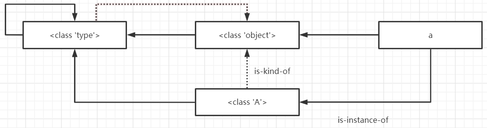

# Python虚拟机中的类机制

在python中，“一切皆对象”，包括面向对象概念的中的类在python也是对象。python中的对象存在两种关系——is-kind-of与is-instance-of。

+ is-kind-of：这种关系对应于面向对象中的基类与子类的关系；
+ is-instance-of：这种关系对应于面向对象中的类与实例之间的关系。

~~~python
class A(object):
    pass
a = A()
~~~

其中包含了三个对象：object（class A对象的基类）、class A对象以及a对象。这三者之间的关系也很明显：A与object之间存在is-kind-of关系，a与A以及a与object之间存在is-instance-of关系，即a是A以及object的一个实例。

python提供了一些方法以及属性来探测这些关系。

\__class__属性，type方法以及isinstance方法：探测两个对象之间的is-instance-of关系；

\__base__属性以及issubclass方法：探测两个对象之间的is-kind-of关系。

~~~python
class A(object):
    pass
a = A()

print(a.__class__)
print(isinstance(a,A))
print(isinstance(a,object))
print(A.__class__)
print(A.__base__)
print(isinstance(A,type))
print(issubclass(A,object))
print(a.__base__)
##输出
<class '__main__.A'>
True
True
<class 'type'>
<class 'object'>
True
True
Traceback (most recent call last):
  File "C:\Users\Administrator\Documents\test.py", line 11, in <module>
    print(a.__base__)
AttributeError: 'A' object has no attribute '__base__'
~~~

最后一条print语句抛出了异常。这也很好理解is-kind-of是类对象之间才有的关系，a是一个实例对象，不应该有表示is-kind-of关系的属性\__base__。

在python中有两个比较重要的类型对象——type对象以及object对象。首先，python中所有的类型对象都是type对象的实例，包括object对象以及type对象自身；其次，python中 除了object对象以外的所有类型对象都是直接或间接继承自object对现象，object对象没有基类。python中将type对象称为元类metaclass对象。

~~~pyhton
>>> type
<class 'type'>
>>> type.__base__
<class 'object'>
>>> type.__class__
<class 'type'>
>>> object
<class 'object'>
>>> object.__base__
>>> object.__class__
<class 'type'>
~~~

