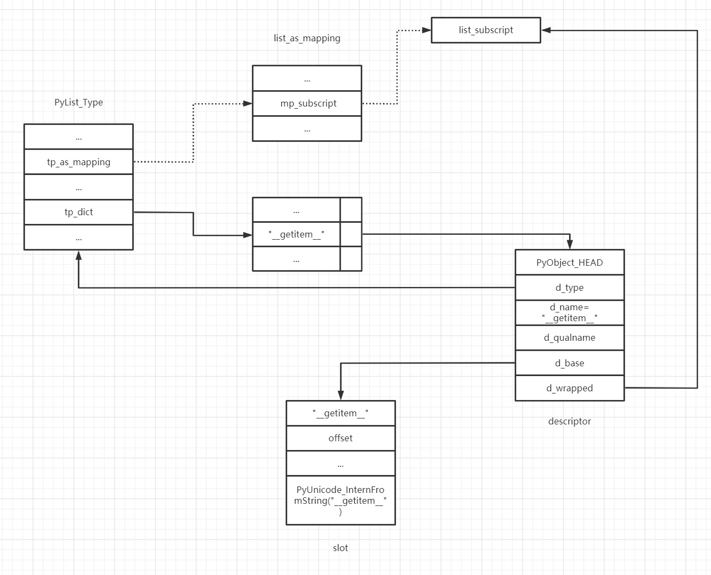

# Python虚拟机中的类机制

在python中，“一切皆对象”，包括面向对象概念的中的类在python也是对象。python中的对象存在两种关系——is-kind-of与is-instance-of。

+ is-kind-of：这种关系对应于面向对象中的基类与子类的关系；
+ is-instance-of：这种关系对应于面向对象中的类与实例之间的关系。

~~~python
class A(object):
    pass
a = A()
~~~

其中包含了三个对象：object（class A对象的基类）、class A对象以及a对象。这三者之间的关系也很明显：A与object之间存在is-kind-of关系，a与A以及a与object之间存在is-instance-of关系，即a是A以及object的一个实例。

python提供了一些方法以及属性来探测这些关系。

\__class__属性，type方法以及isinstance方法：探测两个对象之间的is-instance-of关系；

\__base__属性以及issubclass方法：探测两个对象之间的is-kind-of关系。

~~~python
class A(object):
    pass
a = A()

print(a.__class__)
print(isinstance(a,A))
print(isinstance(a,object))
print(A.__class__)
print(A.__base__)
print(isinstance(A,type))
print(issubclass(A,object))
print(a.__base__)
##输出
<class '__main__.A'>
True
True
<class 'type'>
<class 'object'>
True
True
Traceback (most recent call last):
  File "C:\Users\Administrator\Documents\test.py", line 11, in <module>
    print(a.__base__)
AttributeError: 'A' object has no attribute '__base__'
~~~

最后一条print语句抛出了异常。这也很好理解is-kind-of是类对象之间才有的关系，a是一个实例对象，不应该有表示is-kind-of关系的属性\__base__。

在python中有两个比较重要的类型对象——type对象以及object对象。首先，python中的type是一种特殊的对象，这种对象能够成为其他类型对象的类型，包括object对象以及type对象自身；其次，python中 除了object对象以外的所有类型对象都是直接或间接继承自object对现象，object对象没有基类。python中将type对象称为元类metaclass对象。

~~~pyhton
>>> type
<class 'type'>
>>> type.__base__
<class 'object'>
>>> type.__class__
<class 'type'>
>>> object
<class 'object'>
>>> object.__base__
>>> object.__class__
<class 'type'>
~~~

## 类型系统的初始化

PyType_Ready是python中类型初始化的起点。python中的内置类型对应的类型对象在python启动后已经作为全局对象存在，需要的仅仅是完善；而用户自定义类型的类型对象并不存在，需要申请内存，并创建初始化整个序列。对于内置类型来说，初始化就仅剩下PyType_Ready，而对于用户自定义类型来说，PyType_Ready仅仅是很小的一部分。

### 处理基类和type信息

我们从PyType_Type的初始化来考察PyType_Ready函数。

~~~C
int
PyType_Ready(PyTypeObject *type)//在这里，参数type是type对象的class对象（PyType_Type）
{
    PyObject *dict, *bases;
    PyTypeObject *base;
    Py_ssize_t i, n;
    
    /* Initialize tp_base (defaults to BaseObject unless that's us) */
    base = type->tp_base;//[A]
    if (base == NULL && type != &PyBaseObject_Type) {//如果type没有指定基类（base==NULL）且type不是Object的class对象（PyBaseObject_Type），则将type的基类设置为object对象。
        base = type->tp_base = &PyBaseObject_Type;
        Py_INCREF(base);
    }
    /* Initialize the base class *///[B]如果基类没有初始化，则先初始化基类
    if (base != NULL && base->tp_dict == NULL) {
        if (PyType_Ready(base) < 0)
            goto error;
    }
    /* Initialize ob_type if NULL.      This means extensions that want to be
       compilable separately on Windows can call PyType_Ready() instead of
       initializing the ob_type field of their type objects. */
    /* The test for base != NULL is really unnecessary, since base is only
       NULL when type is &PyBaseObject_Type, and we know its ob_type is
       not NULL (it's initialized to &PyType_Type).      But coverity doesn't
       know that. */
    if (Py_TYPE(type) == NULL && base != NULL)//[C]设置type信息
        Py_TYPE(type) = Py_TYPE(base);
    /*...*/
}
~~~

首先在代码[A]处，python虚拟机尝试获得待初始化的type的基类。这个信息是在TyTypeObject.tp_base中指定的。对于指定了tp_base的内置class对象，python就是用指定的类型作为class对象的基类；而对于tp_base指针为空的class对象，python虚拟机就是用PyBaseObject_Type（object对象）作为其基类。所以从这里可以看出，python中的所有class对象都是直接或者间接以object作为基类的（除了object对象，object对象没有基类）。

得到了基类之后，代码[B]处就要判断基类是否已经初始化了，如果没有，则需要对基类进行初始化。可以看到，判断基类初始化是否完成的条件是base->tp_dict是否为NULL。

最后在[C]处对class对象的ob_type信息进行了设置。实际上这个ob_type信息也就是对象的\__class__返回的信息。更进一步说，这里的ob_type就是元类（metaclass）。实际上，Python虚拟机就是将基类的metaclass作为了子类的metalcass。这里对于PyType_Type来说，其metaclass正是object的metaclass。而在PyBaseObject\_Type的定义中我们可以看到其ob_type被设置成了PyType_Type，这正好与上面的python对象关系图互相印证。

### 处理基类列表

~~~C
/*...*/
if (Py_TYPE(type) == NULL && base != NULL)
        Py_TYPE(type) = Py_TYPE(base);

    /* Initialize tp_bases */
    bases = type->tp_bases;
    if (bases == NULL) {//如果bases为空，则根据情况设置基类列表
        if (base == NULL)//如果base为空，则该class对象的基类列表为空的tuple
            bases = PyTuple_New(0);
        else//如果base不空，则说明基类列表中至少包含一个base对象
            bases = PyTuple_Pack(1, base);
        if (bases == NULL)
            goto error;
        type->tp_bases = bases;
    }
/*...*/
~~~

在这里，python虚拟机将处理类型的基类列表，因为python支持多重继承，所以每一个class对象都会有一个基类列表。

### 填充tp_dict

~~~C
/*...*/
/* Initialize tp_dict */
    dict = type->tp_dict;
    if (dict == NULL) {
        dict = PyDict_New();
        if (dict == NULL)
            goto error;
        type->tp_dict = dict;
    }

    /* Add type-specific descriptors to tp_dict */
    if (add_operators(type) < 0)
        goto error;
    if (type->tp_methods != NULL) {
        if (add_methods(type, type->tp_methods) < 0)
            goto error;
    }
    if (type->tp_members != NULL) {
        if (add_members(type, type->tp_members) < 0)
            goto error;
    }
    if (type->tp_getset != NULL) {
        if (add_getset(type, type->tp_getset) < 0)
            goto error;
    }
/*...*/
~~~

在这个阶段，完成了将("\__add__",&nb_add)加入tp\_dict的过程。这个阶段的add_operators、add_methods、add_members以及add_getset都是完成这样的填充过程的。那么，python是如何找到操作名称与具体的实现动作之间的关系的呢？答案是python源码中已经预先定义好了，存放在一个名为slotdefs的全局数组之中。

#### slot

在python内部，slot可以视为标识PyTypeObject中定义的操作，一个操作对应一个slot，但是slot不仅仅包含一个函数指针，还包含其他一些信息。在python内部，slot是通过slotdefs这个结构体来实现的。

~~~C
typedef struct wrapperbase slotdef;

struct wrapperbase {
    const char *name;
    int offset;
    void *function;
    wrapperfunc wrapper;
    const char *doc;
    int flags;
    PyObject *name_strobj;
};
~~~

在一个slot中，存储着与PyTypeObject中一种操作对应的各种信息。比如，name是操作的名称，比如字符串"\__add__"；offset则是操作的函数地址在PyHeapTypeObject中的偏移量；而function则指向一种被称为slot function的函数。

python中提供了多个宏来定义一个slot，其中最基本的是TPSLOT和ETSLOT。

~~~C
#define TPSLOT(NAME, SLOT, FUNCTION, WRAPPER, DOC) \
    {NAME, offsetof(PyTypeObject, SLOT), (void *)(FUNCTION), WRAPPER, \
     PyDoc_STR(DOC)}

#define ETSLOT(NAME, SLOT, FUNCTION, WRAPPER, DOC) \
    {NAME, offsetof(PyHeapTypeObject, SLOT), (void *)(FUNCTION), WRAPPER, \
     PyDoc_STR(DOC)}
~~~

TPSLOT与EPSLOT的区别在于TPSLOT计算的是操作对应的函数指针（比如nb_add）在PyTypeObject中的偏移量，而ETSLOT计算的是函数指针在PyHeapTypeObject中的偏移量。但是通过PyHeapTypeObject的代码可以发现，PyHeapTypeObject的第一个域就是PyTypeObject，所以TPSLOT计算出的偏移量实际上也就是相对于PyHeapTypeObject的偏移量。

~~~C
/* The *real* layout of a type object when allocated on the heap */
typedef struct _heaptypeobject {
    /* Note: there's a dependency on the order of these members
       in slotptr() in typeobject.c . */
    PyTypeObject ht_type;
    PyAsyncMethods as_async;
    PyNumberMethods as_number;
    PyMappingMethods as_mapping;
    PySequenceMethods as_sequence; /* as_sequence comes after as_mapping,
                                      so that the mapping wins when both
                                      the mapping and the sequence define
                                      a given operator (e.g. __getitem__).
                                      see add_operators() in typeobject.c . */
    PyBufferProcs as_buffer;
    PyObject *ht_name, *ht_slots, *ht_qualname;
    struct _dictkeysobject *ht_cached_keys;
    /* here are optional user slots, followed by the members. */
} PyHeapTypeObject;
~~~

我们来看一下python预定义的slot集合——slotdefs。

~~~C
static slotdef slotdefs[] = {
    /*...*/
    BINSLOT("__add__", nb_add, slot_nb_add,
           "+"),
    RBINSLOT("__radd__", nb_add, slot_nb_add,
           "+"),
    /*...*/
    SQSLOT("__len__", sq_length, slot_sq_length, wrap_lenfunc,
           "__len__($self, /)\n--\n\nReturn len(self)."),
    /*...*/
    MPSLOT("__getitem__", mp_subscript, slot_mp_subscript,
           wrap_binaryfunc,
           "__getitem__($self, key, /)\n--\n\nReturn self[key]."),
    /*...*/
    SQSLOT("__getitem__", sq_item, slot_sq_item, wrap_sq_item,
           "__getitem__($self, key, /)\n--\n\nReturn self[key]."),
    /*...*/
};
~~~

在slotdefs中，存在多个操作对应同一个操作名的情况，同样也存在着同一个操作对应不同操作名的情况。对于相同操作对应不同操作名的情况，在填充tp_dict时就会出现到底填充哪一个操作的问题。以PyList_Type为例：在PyList_Type中，tp_as_mapping.mp_subscript指向list_subscript，而tp_as_sequence.sq_item指向list_item，所以list对象中的\__getitem__到底指向哪一个函数？这个问题的答案可以在PyHeapTypeObject的注释中找到答案。

~~~C
    PyMappingMethods as_mapping;
    PySequenceMethods as_sequence; /* as_sequence comes after as_mapping,
                                      so that the mapping wins when both
                                      the mapping and the sequence define
                                      a given operator (e.g. __getitem__).
                                      see add_operators() in typeobject.c . */
~~~

“由于as_sequence在as_mapping之后，所以如果mapping与sequence定义了相同的操作符，as_mapping会‘胜出’”。也就是说，list对象的"\__getitem__"操作最终指向了tp_as_mapping.mp_subscript。

python虚拟机在tp_dict中找到"\__getitem__"对应的操作之后就会调用该操作，然而slot并不是一个PyObject，不具备可调用性，所以tp_dict中与之对应的操作只能是另一个包装了slot的PyObject。在python中，这是一个我们称之为descriptor的东西。

在python内部，与PyTypeObject中的操作对应的是PyWrapperDescrObject（简称descriptor），一个descriptor对应一个slot。descriptor的创建是通过PyDescr_NewWrapper实现的。

~~~C
typedef struct {
    PyObject_HEAD
    PyTypeObject *d_type;
    PyObject *d_name;
    PyObject *d_qualname;
} PyDescrObject;

#define PyDescr_COMMON PyDescrObject d_common

typedef struct {
    PyDescr_COMMON;
    struct wrapperbase *d_base;
    void *d_wrapped; /* This can be any function pointer */
} PyWrapperDescrObject;

PyObject *
PyDescr_NewWrapper(PyTypeObject *type, struct wrapperbase *base, void *wrapped)
{
    PyWrapperDescrObject *descr;

    descr = (PyWrapperDescrObject *)descr_new(&PyWrapperDescr_Type,
                                             type, base->name);//base->name为操作的名字（比如__getitem__）
    if (descr != NULL) {
        descr->d_base = base;//存放slot
        descr->d_wrapped = wrapped;//操作对应的函数指针，在list对象中该指针指向mp_subscript
    }
    return (PyObject *)descr;
}

static PyDescrObject *
descr_new(PyTypeObject *descrtype, PyTypeObject *type, const char *name)
{
    PyDescrObject *descr;

    descr = (PyDescrObject *)PyType_GenericAlloc(descrtype, 0);
    if (descr != NULL) {
        Py_XINCREF(type);
        descr->d_type = type;//PyDescrObject的所属的类型对象——PyWrapperDescr_Type，该对象的tp_call指向wrapperdescr_call，当前调用descriptor时，也就会调用wrapperdescr_call
        descr->d_name = PyUnicode_InternFromString(name);
        if (descr->d_name == NULL) {
            Py_DECREF(descr);
            descr = NULL;
        }
        else {
            descr->d_qualname = NULL;
        }
    }
    return descr;
}
~~~

#### 建立联系

python虚拟机遍历slotdefs，为每一个slot建立一个descriptor，然后在tp_dict中建立从操作名到descriptor的关联。整个操作过程在add_operators中完成。

~~~C
static int
add_operators(PyTypeObject *type)
{
    PyObject *dict = type->tp_dict;
    slotdef *p;
    PyObject *descr;
    void **ptr;

    init_slotdefs();//slotdefs初始化
    for (p = slotdefs; p->name; p++) {
        if (p->wrapper == NULL)//slot中的wrapper为空则不处理
            continue;
        ptr = slotptr(type, p->offset);//获得slot对应的操作在PyTypeObject中对应的函数指针
        if (!ptr || !*ptr)//为空则不处理
            continue;
        if (PyDict_GetItem(dict, p->name_strobj))//tp_dict中已经存在的操作的优先级更高，不处理当前slot对应的操作
            continue;
        if (*ptr == (void *)PyObject_HashNotImplemented) {
            /* Classes may prevent the inheritance of the tp_hash
               slot by storing PyObject_HashNotImplemented in it. Make it
               visible as a None value for the __hash__ attribute. */
            if (PyDict_SetItem(dict, p->name_strobj, Py_None) < 0)
                return -1;
        }
        else {
            descr = PyDescr_NewWrapper(type, p, *ptr);//根据slot创建一个新的PyWrapperDescrObject
            if (descr == NULL)
                return -1;
            if (PyDict_SetItem(dict, p->name_strobj, descr) < 0) {//建立操作与PyWrapperDescrObject之间的联系
                Py_DECREF(descr);
                return -1;
            }
            Py_DECREF(descr);
        }
    }
    if (type->tp_new != NULL) {
        if (add_tp_new_wrapper(type) < 0)
            return -1;
    }
    return 0;
}
~~~

在add_operators中，首先调用init_slotdefs对slotdefs进行初始化，然后从slotdefs[0]开始对slotdefs进行遍历。对于每一个slot，调用slotptr获取该slot对应的操作在PyTypeObject中的函数指针，接着创建descriptor，在tp_dict中创建从操作名（slot.name_strobj）到操作（descriptor）之间的关联。

~~~C
/* Given a type pointer and an offset gotten from a slotdef entry, return a
   pointer to the actual slot.  This is not quite the same as simply adding
   the offset to the type pointer, since it takes care to indirect through the
   proper indirection pointer (as_buffer, etc.); it returns NULL if the
   indirection pointer is NULL. */
static void **
slotptr(PyTypeObject *type, int ioffset)
{
    char *ptr;
    long offset = ioffset;

    /* Note: this depends on the order of the members of PyHeapTypeObject! */
    assert(offset >= 0);
    assert((size_t)offset < offsetof(PyHeapTypeObject, as_buffer));
    if ((size_t)offset >= offsetof(PyHeapTypeObject, as_sequence)) {//从后向前
        ptr = (char *)type->tp_as_sequence;
        offset -= offsetof(PyHeapTypeObject, as_sequence);
    }
    else if ((size_t)offset >= offsetof(PyHeapTypeObject, as_mapping)) {
        ptr = (char *)type->tp_as_mapping;
        offset -= offsetof(PyHeapTypeObject, as_mapping);
    }
    else if ((size_t)offset >= offsetof(PyHeapTypeObject, as_number)) {
        ptr = (char *)type->tp_as_number;
        offset -= offsetof(PyHeapTypeObject, as_number);
    }
    else if ((size_t)offset >= offsetof(PyHeapTypeObject, as_async)) {
        ptr = (char *)type->tp_as_async;
        offset -= offsetof(PyHeapTypeObject, as_async);
    }
    else {
        ptr = (char *)type;
    }
    if (ptr != NULL)
        ptr += offset;
    return (void **)ptr;
}
~~~

我们以slotptr(&PyList_Type,offsetof(PyHeapTypeObject,mp_subscript))为例，给出slotptr执行过程中各个量在PyHeapTypeObject中的分布。现在，slotptr的执行过程就很容易理解了。

上图是PyList_Type初始化完成之后的整个布局。其中，虚线是编译时就已经确定的好了，而实线是运行时环境初始化时才建立的。

在PyType_Ready中通过add_operators添加了PyType_Object对象中定义的一些operator之后，还会通过add_methods、add_members和add_getsets添加在PyType_Object中定义的tp_mthods、tp_members和tp_getsets函数集。这些add**的过程与add_operators类似，不过最后添加到dict中的不是PyWrapperDescrObject，而是PyMethodDescrObject、PyMemberDescrObject和PyGetSetDescrObject。

#### 确定MRO

由于python支持多重继承，在多重继承时，必须确定属性解析顺序，这个顺序被称为MRO（Method Resolve Order）。

python中使用C3算法获取多重继承下的继承顺序表。

##### 基本概念

###### mro序列

mro是一个有序的列表L，在类被创建时就计算出来。

通用的计算公式为

~~~C
mro(B) = [B] + merge( mro(A1), mro(A2), mro(A3) ..., [A1, A2, A3] )
~~~

计算结果为列表，列表中至少有一个元素即类自身。

###### 表头和表尾

**表头**：列表的第一个元素

**表尾**：列表中表头以外的元素（可空）

例子：[A,B,C]中，A为表头，B、C为表尾

###### +操作

~~~C
[A] + [B] = [A,B]
~~~

###### merge操作

对于被merge的多个有序表集合中的每一个列表L：L中的表头如果不出现在其他表的表尾中，那么将该元素放入产出列表中，并从其他表中移除该元素，否则跳过L并考察L的下一项；每次从有序表集合的第一个列表循环该操作直至有序表集合为空得到一张产出表即为结果。

我们以上图为例（数字表示继承顺序即数字小的箭头所指向的基类先被继承）。

~~~C
//记类cls的C3线性表为L[cls]
L[O]:L[O]=[O]
L[A]:
	L[A]=[A]+merge(L[O]+[O])
        =[A]+[O]
        =[A,O]
同理:
	L[B]=[B,O]
    L[C]=[C,O]
    L[D]=[D,O]
	L[E]=[E,O]
L[K1]:
	L[K1]=[K1]+merge(L[A],L[B],L[C],[A,B,C])
         =[K1]+merge([A,O],[B,O],[C,O],[A,B,C])//根据规则，第一项[A,O]的表头不在其他项的表尾之中，将A移出置入产出表并从其他项中删除
         =[K1,A]+merge([O],[B,O],[C,O],[B,C])//第二项的表头B符合移出条件
         =[K1,A,B]+merge([O],[O],[C,O],[C])//移除C后第五项为空列表，从merge中移除
         =[K1,A,B]+merge([O],[O],[O])//merge结束
         =[K1,A,B,C]//K1的线性表
同理:
	L[K2]=[K2,D,B,E,O]
    L[K3]=[K3,D,A,O]
L[Z]:
	L[Z]=[Z]+merge(L[k1],L[K2],L[K3],[K1,K2,K3])//展开
        =[Z]+merge([K1,A,B,C,O],[K2,D,B,E,O],[K3,D,A,O],[K1,K2,K3])//选中K1
        =[Z,K1]+merge([A,B,C,O],[K2,D,B,E,O],[K3,D,A,O],[K2,K3])//选中K2
        =[Z,K1,K2]+merge([A,B,C,O],[D,B,E,O],[K3,D,A,O],[K3])//选中K3
        =[Z,K1,K2,K3]+merge([A,B,C,O],[D,B,E,O],[D,A,O])//选中D
        =[Z,K1,K2,K3,D]+merge([A,B,C,O],[B,E,O],[A,O])//选中A
        =[Z,K1,K2,K3,D,A]+merge([B,C,O],[B,E,O],[O])//选中B
        =[Z,K1,K2,K3,D,A,B]+merge([C,O],[E,O],[O])//选中C
        =[Z,K1,K2,K3,D,A,B,C]+merge([O],[E,O],[O])//选中E
        =[Z,K1,K2,K3,D,A,B,C,E]+merge([O],[O],[O])//结束
        =[Z,K1,K2,K3,D,A,B,C,E,O]
~~~

在python中进行测试

~~~python
class O:
    pass
class A(O):
    pass
class B(O):
    pass
class C(O):
    pass
class D(O):
    pass
class E(O):
    pass
class K1(A,B,C):
    pass
class K2(D,B,E):
    pass
class K3(D,A):
    pass
class Z(K1,K2,K3):
    pass

print(Z.__mro__)
# 测试结果
(<class '__main__.Z'>, <class '__main__.K1'>, <class '__main__.K2'>, <class '__main__.K3'>, <class '__main__.D'>, <class '__main__.A'>, <class '__main__.B'>, <class '__main__.C'>, <class '__main__.E'>, <class '__main__.O'>, <class 'object'>)
~~~

##### 继承基类操作

在确定了mro列表之后，python虚拟机就会从第二项开始遍历mro列表。

~~~C
/* Initialize tp_dict properly */
    bases = type->tp_mro;
    assert(bases != NULL);
    assert(PyTuple_Check(bases));
    n = PyTuple_GET_SIZE(bases);
    for (i = 1; i < n; i++) {
        PyObject *b = PyTuple_GET_ITEM(bases, i);
        if (PyType_Check(b))
            inherit_slots(type, (PyTypeObject *)b);
    }
~~~

继承的动作发生在inherit_slots中。

~~~C
static void
inherit_slots(PyTypeObject *type, PyTypeObject *base)
{
    PyTypeObject *basebase;
    /*...*/
    #define SLOTDEFINED(SLOT) \
    (base->SLOT != 0 && \
     (basebase == NULL || base->SLOT != basebase->SLOT))

    #define COPYSLOT(SLOT) \
        if (!type->SLOT && SLOTDEFINED(SLOT)) type->SLOT = base->SLOT

    #define COPYASYNC(SLOT) COPYSLOT(tp_as_async->SLOT)
    #define COPYNUM(SLOT) COPYSLOT(tp_as_number->SLOT)
    #define COPYSEQ(SLOT) COPYSLOT(tp_as_sequence->SLOT)
    #define COPYMAP(SLOT) COPYSLOT(tp_as_mapping->SLOT)
    #define COPYBUF(SLOT) COPYSLOT(tp_as_buffer->SLOT)
     /* This won't inherit indirect slots (from tp_as_number etc.)
       if type doesn't provide the space. */

    if (type->tp_as_number != NULL && base->tp_as_number != NULL) {
        basebase = base->tp_base;
        if (basebase->tp_as_number == NULL)
            basebase = NULL;
        COPYNUM(nb_add);
		/*...*/
    }
    /*...*/
}
~~~

在inherit_slots中，会拷贝相当多的操作，以nb_add为例。

python中的bool类型是继承自int类型的。

~~~python
>>> bool.__mro__
(<class 'bool'>, <class 'int'>, <class 'object'>)
~~~

在PyBool_Type中并没有定义nb_add

~~~C
static PyNumberMethods bool_as_number = {
    0,                          /* nb_add */
        /*...*/
}
~~~

然而int类型中却设置了nb_add操作，所以两个bool对象也可以进行加法操作。

~~~Python
>>> a=False
>>> b=True
>>> a+b
1
~~~

我们来看一下bool类型的\__add__属性

~~~python
>>> bool.__add__
<slot wrapper '__add__' of 'int' objects>
~~~

正是来自int的\__add__属性。

#### 填充基类中的子类列表

在这里，PyType_Ready还剩下最后一个重要动作了：设置基类中的子类列表。在每一个type对象中，都有一个tp_subclasses，这个东西在PyType_Ready中完成后将是一个dict对象。

~~~C
 /* Link into each base class's list of subclasses */
    bases = type->tp_bases;
    n = PyTuple_GET_SIZE(bases);
    for (i = 0; i < n; i++) {
        PyObject *b = PyTuple_GET_ITEM(bases, i);
        if (PyType_Check(b) &&
            add_subclass((PyTypeObject *)b, type) < 0)
            goto error;
    }

static int
add_subclass(PyTypeObject *base, PyTypeObject *type)
{
    int result = -1;
    PyObject *dict, *key, *newobj;

    dict = base->tp_subclasses;
    if (dict == NULL) {
        base->tp_subclasses = dict = PyDict_New();
        if (dict == NULL)
            return -1;
    }
    assert(PyDict_CheckExact(dict));
    key = PyLong_FromVoidPtr((void *) type);
    if (key == NULL)
        return -1;
    newobj = PyWeakref_NewRef((PyObject *)type, NULL);//创建typed弱引用
    if (newobj != NULL) {
        result = PyDict_SetItem(dict, key, newobj);//type的地址作为dict的key，弱引用作为value
        Py_DECREF(newobj);
    }
    Py_DECREF(key);
    return result;
}
~~~

当我们调用type.\__subclasses__时，虚拟机根据type->tp_subclasses返回一个列表

~~~python
>>> int.__subclasses__()
[<class 'bool'>]
>>> type(int.__subclasses__())
<class 'list'>
~~~

此时调用的函数为

~~~C
/*[clinic input]
type.__subclasses__

Return a list of immediate subclasses.
[clinic start generated code]*/

static PyObject *
type___subclasses___impl(PyTypeObject *self)
/*[clinic end generated code: output=eb5eb54485942819 input=5af66132436f9a7b]*/
{
    PyObject *list, *raw, *ref;
    Py_ssize_t i;

    list = PyList_New(0);
    if (list == NULL)
        return NULL;
    raw = self->tp_subclasses;
    if (raw == NULL)
        return list;
    assert(PyDict_CheckExact(raw));
    i = 0;
    while (PyDict_Next(raw, &i, NULL, &ref)) {//遍历tp_subclasses
        assert(PyWeakref_CheckRef(ref));
        ref = PyWeakref_GET_OBJECT(ref);
        if (ref != Py_None) {
            if (PyList_Append(list, ref) < 0) {
                Py_DECREF(list);
                return NULL;
            }
        }
    }
    return list;
}
~~~

## 用户自定义class

