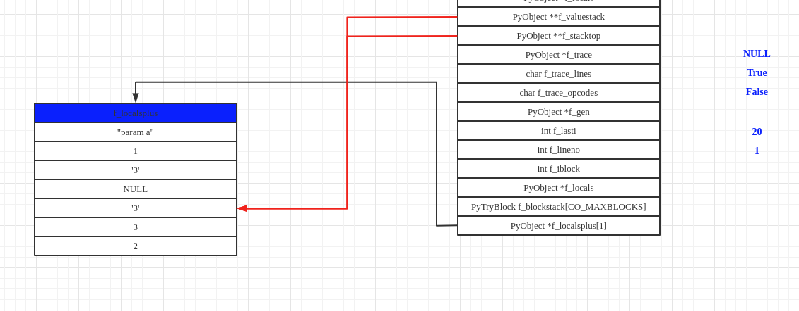

# Python虚拟机框架

### x86下函数调用时栈帧的变化

Python虚拟机运行字节码的过程实际上是模拟操作系统运行可执行文件的过程。所以首先我们需要了解在普通的x86机器上，可执行文件以一种什么方式运行。在这里，我们主要关注运行时栈帧的变化。

C语言代码如下：

```C
int add(int a,int b)
{
    int c = a;
    return c+b;
}

int main()
{
	int x = 1,y = 2,sum;
	sum = add(x,y);
	return 0;
}
```

在进入函数add的过程就是为add构建栈帧的过程，首先要把参数入栈


为了能够从add流程返回main流程，还需要把返回地址入栈


开始构建add的栈帧，将ebp入栈


局部变量以及需要保护的寄存器等入栈．


此时，add的栈帧构建完成，开始执行add内部的流程．当add的内部流程执行完成之后，将esp与ebp还原为add栈帧创建之前的值，将返回地址压入eip，从而继续在main中的流程．

### PyFrameObject

Python中通过PyFrameObject来模拟栈帧，实现了Python字节码的有序执行．

```c
typedef struct _frame {
    PyObject_VAR_HEAD
    struct _frame *f_back;      /* previous frame, or NULL */
    PyCodeObject *f_code;       /* code segment */
    PyObject *f_builtins;       /* builtin symbol table (PyDictObject) */
    PyObject *f_globals;        /* global symbol table (PyDictObject) */
    PyObject *f_locals;         /* local symbol table (any mapping) */
    PyObject **f_valuestack;    /* points after the last local */
    /* Next free slot in f_valuestack.  Frame creation sets to f_valuestack.
       Frame evaluation usually NULLs it, but a frame that yields sets it
       to the current stack top. */
    PyObject **f_stacktop;
    PyObject *f_trace;          /* Trace function */
    char f_trace_lines;         /* Emit per-line trace events? */
    char f_trace_opcodes;       /* Emit per-opcode trace events? */

    /* Borrowed reference to a generator, or NULL */
    PyObject *f_gen;

    int f_lasti;                /* Last instruction if called */
    /* Call PyFrame_GetLineNumber() instead of reading this field
       directly.  As of 2.3 f_lineno is only valid when tracing is
       active (i.e. when f_trace is set).  At other times we use
       PyCode_Addr2Line to calculate the line from the current
       bytecode index. */
    int f_lineno;               /* Current line number */
    int f_iblock;               /* index in f_blockstack */
    char f_executing;           /* whether the frame is still executing */
    PyTryBlock f_blockstack[CO_MAXBLOCKS]; /* for try and loop blocks */
    PyObject *f_localsplus[1];  /* locals+stack, dynamically sized */
} PyFrameObject;
```

+ f_back：指向执行环境链的上一个栈帧，使得当前栈帧在执行结束之后能顺利返回旧栈帧之中．
+ f_code：该frame对象所对应的code对象．
+ f_builtins，f_globals，f_locals：三个独立的名字空间．
+ f_valuestack与f_stacktop：分别指向运行时栈的栈底和栈顶．
+ f_lasti：当前已经执行过的字节码指令的位置．

PyFrameObject 是一个变长对象，其变长部分为f_localsplus．从注释可以看出，f_localsplus由locals与stack两部分组成．

+ locals部分用来保存局部变量．
+ stack指的是“运行时栈”，是在执行运算时所需要的内存空间，这个栈的大小存储在f_code.co_stacksize中，编译PyCodeObject对象的时候会计算出来，由于不同Code Block在执行时所需的栈空间的大小是不同的，所以决定了PyFrameObject的开头一定有一个PyObject_VAR_HEAD

某个时刻下，Python的运行时环境．


### 动态内存空间的申请

```C
        Py_ssize_t extras, ncells, nfrees;
        ncells = PyTuple_GET_SIZE(code->co_cellvars);
        nfrees = PyTuple_GET_SIZE(code->co_freevars);
        extras = code->co_stacksize + code->co_nlocals + ncells +
            nfrees;
        if (free_list == NULL) {
            f = PyObject_GC_NewVar(PyFrameObject, &PyFrame_Type,
            extras);
            if (f == NULL) {
                Py_DECREF(builtins);
                return NULL;
            }
        }
        else {
            assert(numfree > 0);
            --numfree;
            f = free_list;
            free_list = free_list->f_back;
            if (Py_SIZE(f) < extras) {
                PyFrameObject *new_f = PyObject_GC_Resize(PyFrameObject, f, extras);
                if (new_f == NULL) {
                    PyObject_GC_Del(f);
                    Py_DECREF(builtins);
                    return NULL;
                }
                f = new_f;
            }
            _Py_NewReference((PyObject *)f);
        }

        f->f_code = code;
        extras = code->co_nlocals + ncells + nfrees;
        f->f_valuestack = f->f_localsplus + extras;
        for (i=0; i<extras; i++)
            f->f_localsplus[i] = NULL;
        f->f_locals = NULL;
        f->f_trace = NULL;
    }
    f->f_stacktop = f->f_valuestack;
```

可以看出，frame对象也使用了内存池机制．

frame对象中动态大小的内存由两部分组成：

+ 局部变量locals
  + code->co_nclocals Code Block中局部变量的个数
  + code->co_cellvars Code Block中中嵌套函数所引用的局部变量名集合
  + code->co_freevars Code Block 中的自由变量名集合
+ 运行时栈stack code->co_stacksize

f_valuestack维护栈底，f_stacktop维护栈顶．

新创建的frame对象的内存布局如下图所示


### frame执行过程

以一个生成器为例来看frame的执行过程。

```python
def g2(a, b=1, c=2):
    yield a
    c = str(b + c)
    yield c
    new_g = range(3)
    yield from new_g
```

使用dis对上述代码进行编译

```Pyhton
#python -m dis frame_dis.py
  1           0 LOAD_CONST               5 ((1, 2))
              2 LOAD_CONST               2 (<code object g2 at 0x000001D58DD90190, file ".\frame_dis.py", line 1>)
              4 LOAD_CONST               3 ('g2')
              6 MAKE_FUNCTION            1 (defaults)
              8 STORE_NAME               0 (g2)
             10 LOAD_CONST               4 (None)
             12 RETURN_VALUE

Disassembly of <code object g2 at 0x000001D58DD90190, file ".\frame_dis.py", line 1>:
  2           0 LOAD_FAST                0 (a)
              2 YIELD_VALUE
              4 POP_TOP

  3           6 LOAD_GLOBAL              0 (str)
              8 LOAD_FAST                1 (b)
             10 LOAD_FAST                2 (c)
             12 BINARY_ADD
             14 CALL_FUNCTION            1
             16 STORE_FAST               2 (c)

  4          18 LOAD_FAST                2 (c)
             20 YIELD_VALUE
             22 POP_TOP

  5          24 LOAD_GLOBAL              1 (range)
             26 LOAD_CONST               1 (3)
             28 CALL_FUNCTION            1
             30 STORE_FAST               3 (new_g)

  6          32 LOAD_FAST                3 (new_g)
             34 GET_YIELD_FROM_ITER
             36 LOAD_CONST               0 (None)
             38 YIELD_FROM
             40 POP_TOP
             42 LOAD_CONST               0 (None)
             44 RETURN_VALUE
gg = g2("param a")
f = gg.gi_frame
```

初始状态下frame中各个域的状态如下


执行一次next(gg)


此时frame中各个域的值如下


f_lasti=2说明此时yield_value已经执行．字节码load_fast会把对应的参数入栈，而yield_value会弹出栈顶的元素；f_valuestack(栈底)的值不会发生变化；而f_stacktop(栈顶)由于先入栈后出栈所以值与初始状态一致；由于出栈不会清空相应的栈空间，所以此时栈底放的是之前入栈的局部变量a．

继续执行next(gg)


此时frame中各个域的值如下


load_global 0 将f.f_code.co_names[0]处的对象压入堆栈，8与10的load_fast分别将b与c压入堆栈．12的binary_add将栈顶的两个元素弹出，相加之后压入栈顶．binary_add执行之后的栈空间如上图所示．

call_function 1会弹出可执行对象及其参数，执行之后将执行结果入栈，此时的栈空间如下图所示


16 store_fast 2会弹出栈顶元素，并将其存储到f_localsplus下标为2的位置中(c)．



18 load_fast 2把f_localsplus下标为2的元素入栈，之后的20 yield_value将栈顶元素出栈并传递给调用者


f_lasti的值为20说明当前的程序位置在20 yield_value的位置

执行24 load_global 1以及26 load_const 1之后的栈空间


首先，load_global 1指示python虚拟机从co_names中下标1处的名字所对应的对象入栈，co_names的内容如下


虚拟机使用'range'这个名字分别在f_globals以及f_builtins中寻找对应的对象（在f_builtins中找到）


load_const 1指示虚拟机将co_consts下标1处的对象入栈，co_consts的内容如下


执行28 call_function 1之后


执行30 store_fast 3之后


执行32 load_fast 3之后


34 get_yield_from_iter的作用是保证栈顶元素是一个可迭代对象

34 load_const 0的作用是把None入栈


栈帧对象在抛出StopIteration之后就进入了释放阶段(44 return_value执行之后)


### _PyEval_EvalFrameDefault

```C
PyObject*
_PyEval_EvalFrameDefault(PyFrameObject *f, int throwflag)
{
    PyObject **stack_pointer;  /* Next free slot in value stack */
    const _Py_CODEUNIT *next_instr;
    int opcode;        /* Current opcode */
    int oparg;         /* Current opcode argument, if any */
    PyObject **fastlocals, **freevars;
    PyObject *retval = NULL;            /* Return value */
    PyThreadState *tstate = _PyThreadState_GET();
    PyCodeObject *co;
    int instr_ub = -1, instr_lb = 0, instr_prev = -1;

    const _Py_CODEUNIT *first_instr;
    PyObject *names;
    PyObject *consts;
    /*
    ...
    */
    co = f->f_code;
    names = co->co_names;
    consts = co->co_consts;
    fastlocals = f->f_localsplus;
    freevars = f->f_localsplus + co->co_nlocals;
    assert(PyBytes_Check(co->co_code));
    assert(PyBytes_GET_SIZE(co->co_code) <= INT_MAX);
    assert(PyBytes_GET_SIZE(co->co_code) % sizeof(_Py_CODEUNIT) == 0);
    assert(_Py_IS_ALIGNED(PyBytes_AS_STRING(co->co_code), sizeof(_Py_CODEUNIT)));
    first_instr = (_Py_CODEUNIT *) PyBytes_AS_STRING(co->co_code);
    /*
       f->f_lasti refers to the index of the last instruction,
       unless it's -1 in which case next_instr should be first_instr.

       YIELD_FROM sets f_lasti to itself, in order to repeatedly yield
       multiple values.

       When the PREDICT() macros are enabled, some opcode pairs follow in
       direct succession without updating f->f_lasti.  A successful
       prediction effectively links the two codes together as if they
       were a single new opcode; accordingly,f->f_lasti will point to
       the first code in the pair (for instance, GET_ITER followed by
       FOR_ITER is effectively a single opcode and f->f_lasti will point
       to the beginning of the combined pair.)
    */
    assert(f->f_lasti >= -1);
    next_instr = first_instr;
    if (f->f_lasti >= 0) {
        assert(f->f_lasti % sizeof(_Py_CODEUNIT) == 0);
        next_instr += f->f_lasti / sizeof(_Py_CODEUNIT) + 1;
    }
    stack_pointer = f->f_stacktop;
    assert(stack_pointer != NULL);
    f->f_stacktop = NULL;       /* remains NULL unless yield suspends frame */
    f->f_executing = 1;
    /*
    */
}
    
```

_PyEval_EvalFrameDefault函数就是Python虚拟机的具体实现．在这个函数中，code对象中的字节码被一条一条执行．在该函数中，首先是一些变量的定义以及初始化工作．从初始化过程我们可以看出，code对象中的各个信息都被照顾到了．

在Python中，利用3个变量来完成整个遍历过程．首先，co_code在python3中是一个PyBytes对象，bytes对象中使用char数组进行内容存储．在这里PyBytes_AS_STRING宏进行了类型检查并直接返回了co_code对象中的char数组的指针．first_instr指向字节码指令序列开始的位置．next_instr指向下一跳待执行的字节码指令的位置．f_lasti指向上一条已经执行的字节码指令的位置．

Python虚拟机执行字节码指令实际上就是一个for循环加上一个巨大的switch/case结构．

```C
main_loop:
    for (;;) {
/*

*/
    	fast_next_opcode:
        f->f_lasti = INSTR_OFFSET();
        /*
        */
        NEXTOPARG();//获取字节码以及参数的宏定义
        switch (opcode) {

        /* BEWARE!
           It is essential that any operation that fails must goto error
           and that all operation that succeed call [FAST_]DISPATCH() ! */

        case TARGET(NOP): {
            FAST_DISPATCH();
        }
        /*.....*/
        }
```

NEXTOPARG()是获取字节码以及相应参数的宏定义，其展开之后如下

```C
#define NEXTOPARG()  do { \
        _Py_CODEUNIT word = *next_instr; \
        opcode = _Py_OPCODE(word); \
        oparg = _Py_OPARG(word); \
        next_instr++; \
    } while (0)

#ifdef WORDS_BIGENDIAN
#  define _Py_OPCODE(word) ((word) >> 8)
#  define _Py_OPARG(word) ((word) & 255)
#else
#  define _Py_OPCODE(word) ((word) & 255)
#  define _Py_OPARG(word) ((word) >> 8)
#endif
```

成功执行完一条字节码指令之后，Python的执行流程会跳转到fast_next_opcode或者main_loop处继续执行接下来的opcode．如此循环往复，最终完成了对Python程序的执行．

### Python虚拟机中对进程与线程的模拟

在操作系统中有进程(process)与线程(thread)的概念，同样，在Python中也实现了对进程与线程概念的模拟．Python使用PyThreadState保存线的执行现场．而对于进程这个抽先概念，Python虚拟机中则使用PyInterpreterState来实现．在通常情况下，Python中只有一个interpreter，这个interpreter中维护了一个或多个PyThreadState对象，这些PyThreadState轮流使用同一个字节码执行引擎．

```C
typedef struct _ts {
    /* See Python/ceval.c for comments explaining most fields */

    struct _ts *prev;
    struct _ts *next;
    PyInterpreterState *interp;

    struct _frame *frame;
    int recursion_depth;
    char overflowed; /* The stack has overflowed. Allow 50 more calls
                        to handle the runtime error. */
    char recursion_critical; /* The current calls must not cause
                                a stack overflow. */
    int stackcheck_counter;

    /* 'tracing' keeps track of the execution depth when tracing/profiling.
       This is to prevent the actual trace/profile code from being recorded in
       the trace/profile. */
    int tracing;
    int use_tracing;

    Py_tracefunc c_profilefunc;
    Py_tracefunc c_tracefunc;
    PyObject *c_profileobj;
    PyObject *c_traceobj;

    /* The exception currently being raised */
    PyObject *curexc_type;
    PyObject *curexc_value;
    PyObject *curexc_traceback;

    /* The exception currently being handled, if no coroutines/generators
     * are present. Always last element on the stack referred to be exc_info.
     */
    _PyErr_StackItem exc_state;

    /* Pointer to the top of the stack of the exceptions currently
     * being handled */
    _PyErr_StackItem *exc_info;

    PyObject *dict;  /* Stores per-thread state */

    int gilstate_counter;

    PyObject *async_exc; /* Asynchronous exception to raise */
    unsigned long thread_id; /* Thread id where this tstate was created */

    int trash_delete_nesting;
    PyObject *trash_delete_later;

    /* Called when a thread state is deleted normally, but not when it
     * is destroyed after fork().
     * Pain:  to prevent rare but fatal shutdown errors (issue 18808),
     * Thread.join() must wait for the join'ed thread's tstate to be unlinked
     * from the tstate chain.  That happens at the end of a thread's life,
     * in pystate.c.
     * The obvious way doesn't quite work:  create a lock which the tstate
     * unlinking code releases, and have Thread.join() wait to acquire that
     * lock.  The problem is that we _are_ at the end of the thread's life:
     * if the thread holds the last reference to the lock, decref'ing the
     * lock will delete the lock, and that may trigger arbitrary Python code
     * if there's a weakref, with a callback, to the lock.  But by this time
     * _PyRuntime.gilstate.tstate_current is already NULL, so only the simplest
     * of C code can be allowed to run (in particular it must not be possible to
     * release the GIL).
     * So instead of holding the lock directly, the tstate holds a weakref to
     * the lock:  that's the value of on_delete_data below.  Decref'ing a
     * weakref is harmless.
     * on_delete points to _threadmodule.c's static release_sentinel() function.
     * After the tstate is unlinked, release_sentinel is called with the
     * weakref-to-lock (on_delete_data) argument, and release_sentinel releases
     * the indirectly held lock.
     */
    void (*on_delete)(void *);
    void *on_delete_data;

    int coroutine_origin_tracking_depth;

    PyObject *coroutine_wrapper;
    int in_coroutine_wrapper;

    PyObject *async_gen_firstiter;
    PyObject *async_gen_finalizer;

    PyObject *context;
    uint64_t context_ver;

    /* Unique thread state id. */
    uint64_t id;

    /* XXX signal handlers should also be here */

} PyThreadState;
```

PyThreadState对象如上所示．

PyThreadState通过prev与next两个指针被链接成了一个双向链表．同时，ps中有frame指针．也就是说在每个ps对象中，会维护一个栈帧的列表以模拟真实os中的函数调用机制．在_PyEval_EvalFrameDefault函数中可以看到，当虚拟机开始执行时，会将当前ps对象中的frame指针设置为当前的执行环境（通过参数传入的frame对象）．而在创建frame对象时，则从当前线程的状态对象中取出旧的frame，建立frame链表．

```C
PyFrameObject *back = tstate->frame;
```

```C
typedef struct _is {

    struct _is *next;
    struct _ts *tstate_head;

    int64_t id;
    int64_t id_refcount;
    PyThread_type_lock id_mutex;

    PyObject *modules;
    PyObject *modules_by_index;
    PyObject *sysdict;
    PyObject *builtins;
    PyObject *importlib;

    /* Used in Python/sysmodule.c. */
    int check_interval;

    /* Used in Modules/_threadmodule.c. */
    long num_threads;
    /* Support for runtime thread stack size tuning.
       A value of 0 means using the platform's default stack size
       or the size specified by the THREAD_STACK_SIZE macro. */
    /* Used in Python/thread.c. */
    size_t pythread_stacksize;

    PyObject *codec_search_path;
    PyObject *codec_search_cache;
    PyObject *codec_error_registry;
    int codecs_initialized;
    int fscodec_initialized;

    _PyCoreConfig core_config;
    _PyMainInterpreterConfig config;
#ifdef HAVE_DLOPEN
    int dlopenflags;
#endif

    PyObject *builtins_copy;
    PyObject *import_func;
    /* Initialized to PyEval_EvalFrameDefault(). */
    _PyFrameEvalFunction eval_frame;

    Py_ssize_t co_extra_user_count;
    freefunc co_extra_freefuncs[MAX_CO_EXTRA_USERS];

#ifdef HAVE_FORK
    PyObject *before_forkers;
    PyObject *after_forkers_parent;
    PyObject *after_forkers_child;
#endif
    /* AtExit module */
    void (*pyexitfunc)(PyObject *);
    PyObject *pyexitmodule;

    uint64_t tstate_next_unique_id;
} PyInterpreterState;
```

PyInterpreter对象如上所示．

在PyInterpreter中，存在一个PyThreadState指针，指向一个PyThreadState的双向链表．同时，PyInterpreter也被next指针链接成了一个单链表．

通过上述描述，我们可以大体上勾勒出Python的运行时环境


### 部分Python字节码

Python虚拟机中使用了大量的宏定义以提高执行效率．这些宏包括对栈的操作以及对tuple对象的访问操作．字节码的执行过程中大量使用了这些宏定义．

```C
#define STACK_LEVEL()     ((int)(stack_pointer - f->f_valuestack))
#define EMPTY()           (STACK_LEVEL() == 0)
#define TOP()             (stack_pointer[-1])
#define SECOND()          (stack_pointer[-2])
#define THIRD()           (stack_pointer[-3])
#define FOURTH()          (stack_pointer[-4])
#define PEEK(n)           (stack_pointer[-(n)])
#define SET_TOP(v)        (stack_pointer[-1] = (v))
#define SET_SECOND(v)     (stack_pointer[-2] = (v))
#define SET_THIRD(v)      (stack_pointer[-3] = (v))
#define SET_FOURTH(v)     (stack_pointer[-4] = (v))
#define SET_VALUE(n, v)   (stack_pointer[-(n)] = (v))
#define BASIC_STACKADJ(n) (stack_pointer += n)
#define BASIC_PUSH(v)     (*stack_pointer++ = (v))
#define BASIC_POP()       (*--stack_pointer)
```

以上是对栈进行的相关操作．其中，stack_pointer是在_PyEval_EvalFrameDefault中所定义的PyObject**指针．

```C
#define GETITEM(v, i) PyTuple_GET_ITEM((PyTupleObject *)(v), (i))
```

访问tuple中元素的宏定义．

#### **load_const**

```C
case TARGET(LOAD_CONST): {
            PREDICTED(LOAD_CONST);
            PyObject *value = GETITEM(consts, oparg);
            Py_INCREF(value);
            PUSH(value);
            FAST_DISPATCH();
        }
```

load_const指令很简单，就是从consts这个tuple中将oparg位置的对象入栈，同时增加该对象的引用计数．通过追踪_PyEval_EvalFrameDefault中的代码我们可以发现，consts就是code对象中的co_consts对象.

```C
co = f->f_code;
/*...*/
consts = co->co_consts;
```

#### **load_fast**

```c

case TARGET(LOAD_FAST): {
PyObject *value = GETLOCAL(oparg);
if (value == NULL) {
format_exc_check_arg(PyExc_UnboundLocalError,
UNBOUNDLOCAL_ERROR_MSG,
PyTuple_GetItem(co->co_varnames, oparg));
goto error;
}
Py_INCREF(value);
PUSH(value);
FAST_DISPATCH();
}
#define GETLOCAL(i)     (fastlocals[i])
```

我们知道，frame对象当中有一段变长的内存空间（见新建frame对象的内存布局）．在虚拟机的执行过程中，fastlocals指向了这一段内存．

```C
fastlocals = f->f_localsplus;
```

fastlocals[i]表示第i个局部变量．load_fast即是将该局部变量入栈的字节码． 

#### **load_global**

````C
case TARGET(LOAD_GLOBAL): {
            PyObject *name = GETITEM(names, oparg);
            PyObject *v;
            if (PyDict_CheckExact(f->f_globals)
                && PyDict_CheckExact(f->f_builtins))
            {
                v = _PyDict_LoadGlobal((PyDictObject *)f->f_globals,
                                       (PyDictObject *)f->f_builtins,
                                       name);
                if (v == NULL) {
                    if (!_PyErr_OCCURRED()) {
                        /* _PyDict_LoadGlobal() returns NULL without raising
                         * an exception if the key doesn't exist */
                        format_exc_check_arg(PyExc_NameError,
                                             NAME_ERROR_MSG, name);
                    }
                    goto error;
                }
                Py_INCREF(v);
            }
            else {
                /* Slow-path if globals or builtins is not a dict */

                /* namespace 1: globals */
                v = PyObject_GetItem(f->f_globals, name);
                if (v == NULL) {
                    if (!PyErr_ExceptionMatches(PyExc_KeyError))
                        goto error;
                    PyErr_Clear();

                    /* namespace 2: builtins */
                    v = PyObject_GetItem(f->f_builtins, name);
                    if (v == NULL) {
                        if (PyErr_ExceptionMatches(PyExc_KeyError))
                            format_exc_check_arg(
                                        PyExc_NameError,
                                        NAME_ERROR_MSG, name);
                        goto error;
                    }
                }
            }
            PUSH(v);
            DISPATCH();
        }
````

load_global的作用也很明显，就是从names(f->code->co_names)中找到oparg作为下标所对应的元素name，然后分别在global与builtin名字空间中寻找该name所对应的值，最后将其入栈．

#### **load_name**

```C
        case TARGET(LOAD_NAME): {
            PyObject *name = GETITEM(names, oparg);
            PyObject *locals = f->f_locals;
            PyObject *v;
            if (locals == NULL) {
                PyErr_Format(PyExc_SystemError,
                             "no locals when loading %R", name);
                goto error;
            }
            if (PyDict_CheckExact(locals)) {
                v = PyDict_GetItem(locals, name);
                Py_XINCREF(v);
            }
            else {
                v = PyObject_GetItem(locals, name);
                if (v == NULL) {
                    if (!PyErr_ExceptionMatches(PyExc_KeyError))
                        goto error;
                    PyErr_Clear();
                }
            }
            if (v == NULL) {
                v = PyDict_GetItem(f->f_globals, name);
                Py_XINCREF(v);
                if (v == NULL) {
                    if (PyDict_CheckExact(f->f_builtins)) {
                        v = PyDict_GetItem(f->f_builtins, name);
                        if (v == NULL) {
                            format_exc_check_arg(
                                        PyExc_NameError,
                                        NAME_ERROR_MSG, name);
                            goto error;
                        }
                        Py_INCREF(v);
                    }
                    else {
                        v = PyObject_GetItem(f->f_builtins, name);
                        if (v == NULL) {
                            if (PyErr_ExceptionMatches(PyExc_KeyError))
                                format_exc_check_arg(
                                            PyExc_NameError,
                                            NAME_ERROR_MSG, name);
                            goto error;
                        }
                    }
                }
            }
            PUSH(v);
            DISPATCH();
        }
```

与load_global相似，只不过load_name首先从local名字空间中开始查找，之后才是global与builtin．

#### **store_name**

```C
case TARGET(STORE_NAME): {
            PyObject *name = GETITEM(names, oparg);
            PyObject *v = POP();
            PyObject *ns = f->f_locals;
            int err;
            if (ns == NULL) {
                PyErr_Format(PyExc_SystemError,
                             "no locals found when storing %R", name);
                Py_DECREF(v);
                goto error;
            }
            if (PyDict_CheckExact(ns))
                err = PyDict_SetItem(ns, name, v);
            else
                err = PyObject_SetItem(ns, name, v);
            Py_DECREF(v);
            if (err != 0)
                goto error;
            DISPATCH();
        }
```

f_locals是一个可映射对象．在这里虚拟机首先从names(f->code->co_names)中找到oparg作为下标所对应的元素name，然后将栈顶的值v弹出，在f_locals中建立一个name与v的对应关系。

#### **build_list**

```C
        case TARGET(BUILD_LIST): {
            PyObject *list =  PyList_New(oparg);
            if (list == NULL)
                goto error;
            while (--oparg >= 0) {
                PyObject *item = POP();
                PyList_SET_ITEM(list, oparg, item);
            }
            PUSH(list);
            DISPATCH();
        }
```

build_list指令的参数指定了build_list的长度．可以预见，在build_list指令之前肯定有许多load指令进行压栈操作将list对象的成员压入堆栈．

#### **compare_op**

在python中，if控制流由compare_op字节码实现．

```python
def a():
    if a == 1:
        print("a==1")
    else:
        print("a!=1")
```

字节码

```C
  2           0 LOAD_GLOBAL              0 (a)
              2 LOAD_CONST               1 (1)
              4 COMPARE_OP               2 (==)
              6 POP_JUMP_IF_FALSE       18

  3           8 LOAD_GLOBAL              1 (print)
             10 LOAD_CONST               2 ('a==1')
             12 CALL_FUNCTION            1
             14 POP_TOP
             16 JUMP_FORWARD             8 (to 26)

  5     >>   18 LOAD_GLOBAL              1 (print)
             20 LOAD_CONST               3 ('a!=1')
             22 CALL_FUNCTION            1
             24 POP_TOP
        >>   26 LOAD_CONST               0 (None)
             28 RETURN_VALUE

```

compare_op指令的参数对应了不同的比较操作，这些比较操作在opcode.h中定义．

```C
enum cmp_op {PyCmp_LT=Py_LT, PyCmp_LE=Py_LE, PyCmp_EQ=Py_EQ, PyCmp_NE=Py_NE,
                PyCmp_GT=Py_GT, PyCmp_GE=Py_GE, PyCmp_IN, PyCmp_NOT_IN,
                PyCmp_IS, PyCmp_IS_NOT, PyCmp_EXC_MATCH, PyCmp_BAD};
```

在本例中，==对应的是枚举中的第二个枚举值（Py_EQ）.

接下来，我们来看一下compare_op的具体实现．

```C
case TARGET(COMPARE_OP): {
            PyObject *right = POP();
            PyObject *left = TOP();
            PyObject *res = cmp_outcome(oparg, left, right);
            Py_DECREF(left);
            Py_DECREF(right);
            SET_TOP(res);
            if (res == NULL)
                goto error;
            PREDICT(POP_JUMP_IF_FALSE);
            PREDICT(POP_JUMP_IF_TRUE);
            DISPATCH();
        }
```

首先，从堆栈中分别获取左右操作数，然后调用com_outcome函数进行比较操作，该函数是compare_op字节码的关键，我们来看一下具体实现．

```C
static PyObject *
cmp_outcome(int op, PyObject *v, PyObject *w)
{
    int res = 0;
    switch (op) {
    case PyCmp_IS:
        res = (v == w);
        break;
    case PyCmp_IS_NOT:
        res = (v != w);
        break;
    case PyCmp_IN:
        res = PySequence_Contains(w, v);
        if (res < 0)
            return NULL;
        break;
    case PyCmp_NOT_IN:
        res = PySequence_Contains(w, v);
        if (res < 0)
            return NULL;
        res = !res;
        break;
    case PyCmp_EXC_MATCH:
        if (PyTuple_Check(w)) {
            Py_ssize_t i, length;
            length = PyTuple_Size(w);
            for (i = 0; i < length; i += 1) {
                PyObject *exc = PyTuple_GET_ITEM(w, i);
                if (!PyExceptionClass_Check(exc)) {
                    PyErr_SetString(PyExc_TypeError,
                                    CANNOT_CATCH_MSG);
                    return NULL;
                }
            }
        }
        else {
            if (!PyExceptionClass_Check(w)) {
                PyErr_SetString(PyExc_TypeError,
                                CANNOT_CATCH_MSG);
                return NULL;
            }
        }
        res = PyErr_GivenExceptionMatches(v, w);
        break;
    default:
        return PyObject_RichCompare(v, w, op);
    }
    v = res ? Py_True : Py_False;
    Py_INCREF(v);
    return v;
}
```

可以看到，参数op决定了cmp_outcome的比较动作．该函数不仅负责两个对象之间的比较操作，还涵盖了对象与集合之间的关系操作－－in与not in，对象是否为同一个对象的is与not is操作．可以清楚地看出，python中判断一个对象是否＂is＂另一个对象是比较两个对象的地址是否相同；判断一个对象是否在另一个集合中调用了PySequence_Contains函数．

在default中，除了上述比较之外的比较操作在PyObject_RichCompare中进行．关于python中复杂的对象比较体系之后再研究．

cmp_outcome执行之后所得到的返回值被赋值给栈顶（True或者False对象），然后执行跳转动作．这里使用了PREDICT宏进行指令预测．展开PREDICT宏的定义

```C
#define PREDICT(op) \
    do{ \
        _Py_CODEUNIT word = *next_instr; \
        opcode = _Py_OPCODE(word); \
        if (opcode == op){ \
            oparg = _Py_OPARG(word); \
            next_instr++; \
            goto PRED_##op; \
        } \
    } while(0)
```

在python的字节码中，有一些字节码总是顺序出现的，这就为根据上一条字节码预测下一个字节码提供了可能．REDICT宏就是用来实现此功能的．在这里，Python虚拟机直接判断下一条指令是否为POP_JUMP_IF_FALSE或者POP_JUMP_IF_TRUE，如果是的话就直接跳转到PREDICTED(POP_JUMP_IF_FALSE)或者PREDICTED(POP_JUMP_IF_TRUE)处．

#### pop_jump_if_false  与 pop_jump_if_true

这两条字节码的实现相似，我们以pop_jump_if_false为例

```C
case TARGET(POP_JUMP_IF_FALSE): {
            PREDICTED(POP_JUMP_IF_FALSE);
            PyObject *cond = POP();
            int err;
            if (cond == Py_True) {
                Py_DECREF(cond);
                FAST_DISPATCH();
            }
            if (cond == Py_False) {
                Py_DECREF(cond);
                JUMPTO(oparg);
                FAST_DISPATCH();
            }
            err = PyObject_IsTrue(cond);
            Py_DECREF(cond);
            if (err > 0)
                ;
            else if (err == 0)
                JUMPTO(oparg);
            else
                goto error;
            DISPATCH();
        }
```

首先，从弹出栈顶对象．如果是True对象则直接执行下一条指令，否则如果是False对象则执行跳转－－JUMPTO宏．

```C
#define JUMPTO(x)       (next_instr = first_instr + (x) / sizeof(_Py_CODEUNIT))
```

JUMPTO宏使得python虚拟机的执行流程跳转到距离第一条字节码指令　(x) / sizeof(_Py_CODEUNIT)　条指令的地方继续执行．

如果站定对象既不是True也不是False，那么执行PyObject_IsTrue对该对象进行判断．如果其不符合Python中规定的对象为真的条件，那么按照false处理(err == 0)．这针对的是python中直接将对象作为比较条件的情况．

比如，

```python
def a(c):
    if c:
        return True
#编译
  2           0 LOAD_FAST                0 (c)
              2 POP_JUMP_IF_FALSE        8

  3           4 LOAD_CONST               1 (True)
              6 RETURN_VALUE
        >>    8 LOAD_CONST               0 (None)
             10 RETURN_VALUE

```

上例中，if语句直接编译为pop_jump_if_false．