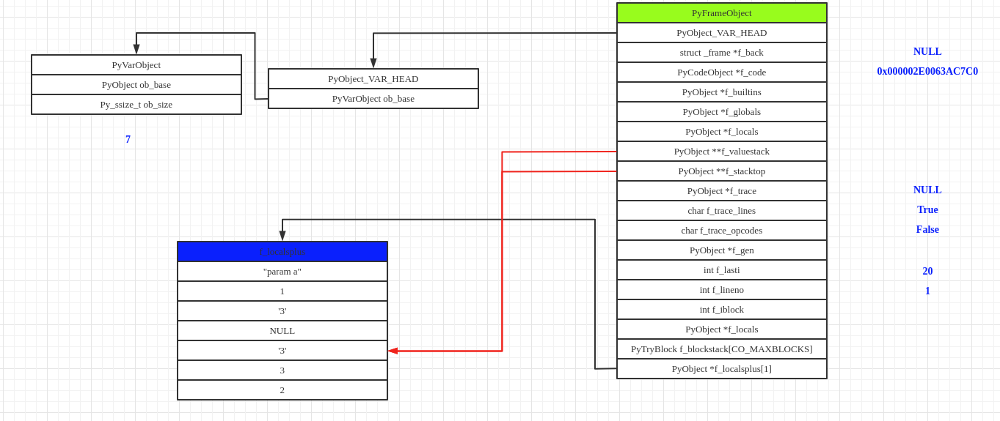

# Python虚拟机框架

### x86下函数调用时栈帧的变化

Python虚拟机运行字节码的过程实际上是模拟操作系统运行可执行文件的过程。所以首先我们需要了解在普通的x86机器上，可执行文件以一种什么方式运行。在这里，我们主要关注运行时栈帧的变化。

C语言代码如下：

```C
int add(int a,int b)
{
    int c = a;
    return c+b;
}

int main()
{
	int x = 1,y = 2,sum;
	sum = add(x,y);
	return 0;
}
```

在进入函数add的过程就是为add构建栈帧的过程，首先要把参数入栈


为了能够从add流程返回main流程，还需要把返回地址入栈


开始构建add的栈帧，将ebp入栈


局部变量以及需要保护的寄存器等入栈．


此时，add的栈帧构建完成，开始执行add内部的流程．当add的内部流程执行完成之后，将esp与ebp还原为add栈帧创建之前的值，将返回地址压入eip，从而继续在main中的流程．

### PyFrameObject

Python中通过PyFrameObject来模拟栈帧，实现了Python字节码的有序执行．

```c
typedef struct _frame {
    PyObject_VAR_HEAD
    struct _frame *f_back;      /* previous frame, or NULL */
    PyCodeObject *f_code;       /* code segment */
    PyObject *f_builtins;       /* builtin symbol table (PyDictObject) */
    PyObject *f_globals;        /* global symbol table (PyDictObject) */
    PyObject *f_locals;         /* local symbol table (any mapping) */
    PyObject **f_valuestack;    /* points after the last local */
    /* Next free slot in f_valuestack.  Frame creation sets to f_valuestack.
       Frame evaluation usually NULLs it, but a frame that yields sets it
       to the current stack top. */
    PyObject **f_stacktop;
    PyObject *f_trace;          /* Trace function */
    char f_trace_lines;         /* Emit per-line trace events? */
    char f_trace_opcodes;       /* Emit per-opcode trace events? */

    /* Borrowed reference to a generator, or NULL */
    PyObject *f_gen;

    int f_lasti;                /* Last instruction if called */
    /* Call PyFrame_GetLineNumber() instead of reading this field
       directly.  As of 2.3 f_lineno is only valid when tracing is
       active (i.e. when f_trace is set).  At other times we use
       PyCode_Addr2Line to calculate the line from the current
       bytecode index. */
    int f_lineno;               /* Current line number */
    int f_iblock;               /* index in f_blockstack */
    char f_executing;           /* whether the frame is still executing */
    PyTryBlock f_blockstack[CO_MAXBLOCKS]; /* for try and loop blocks */
    PyObject *f_localsplus[1];  /* locals+stack, dynamically sized */
} PyFrameObject;
```

+ f_back：指向执行环境链的上一个栈帧，使得当前栈帧在执行结束之后能顺利返回旧栈帧之中．
+ f_code：该frame对象所对应的code对象．
+ f_builtins，f_globals，f_locals：三个独立的名字空间．
+ f_valuestack与f_stacktop：分别指向运行时栈的栈底和栈顶．
+ f_lasti：当前已经执行过的字节码指令的位置．

PyFrameObject 是一个变长对象，其变长部分为f_localsplus．从注释可以看出，f_localsplus由locals与stack两部分组成．

+ locals部分用来保存局部变量．
+ stack指的是“运行时栈”，是在执行运算时所需要的内存空间，这个栈的大小存储在f_code.co_stacksize中，编译PyCodeObject对象的时候会计算出来，由于不同Code Block在执行时所需的栈空间的大小是不同的，所以决定了PyFrameObject的开头一定有一个PyObject_VAR_HEAD

某个时刻下，Python的运行时环境．


### 动态内存空间的申请

```C
        Py_ssize_t extras, ncells, nfrees;
        ncells = PyTuple_GET_SIZE(code->co_cellvars);
        nfrees = PyTuple_GET_SIZE(code->co_freevars);
        extras = code->co_stacksize + code->co_nlocals + ncells +
            nfrees;
        if (free_list == NULL) {
            f = PyObject_GC_NewVar(PyFrameObject, &PyFrame_Type,
            extras);
            if (f == NULL) {
                Py_DECREF(builtins);
                return NULL;
            }
        }
        else {
            assert(numfree > 0);
            --numfree;
            f = free_list;
            free_list = free_list->f_back;
            if (Py_SIZE(f) < extras) {
                PyFrameObject *new_f = PyObject_GC_Resize(PyFrameObject, f, extras);
                if (new_f == NULL) {
                    PyObject_GC_Del(f);
                    Py_DECREF(builtins);
                    return NULL;
                }
                f = new_f;
            }
            _Py_NewReference((PyObject *)f);
        }

        f->f_code = code;
        extras = code->co_nlocals + ncells + nfrees;
        f->f_valuestack = f->f_localsplus + extras;
        for (i=0; i<extras; i++)
            f->f_localsplus[i] = NULL;
        f->f_locals = NULL;
        f->f_trace = NULL;
    }
    f->f_stacktop = f->f_valuestack;
```

可以看出，frame对象也使用了内存池机制．

frame对象中动态大小的内存由两部分组成：

+ 局部变量locals
  + code->co_nclocals Code Block中局部变量的个数
  + code->co_cellvars Code Block中中嵌套函数所引用的局部变量名集合
  + code->co_freevars Code Block 中的自由变量名集合
+ 运行时栈stack code->co_stacksize

f_valuestack维护栈底，f_stacktop维护栈顶．

新创建的frame对象的内存布局如下图所示


### frame执行过程

以一个生成器为例来看frame的执行过程。

```python
def g2(a, b=1, c=2):
    yield a
    c = str(b + c)
    yield c
    new_g = range(3)
    yield from new_g
```

使用dis对上述代码进行编译

```Pyhton
#python -m dis frame_dis.py
  1           0 LOAD_CONST               5 ((1, 2))
              2 LOAD_CONST               2 (<code object g2 at 0x000001D58DD90190, file ".\frame_dis.py", line 1>)
              4 LOAD_CONST               3 ('g2')
              6 MAKE_FUNCTION            1 (defaults)
              8 STORE_NAME               0 (g2)
             10 LOAD_CONST               4 (None)
             12 RETURN_VALUE

Disassembly of <code object g2 at 0x000001D58DD90190, file ".\frame_dis.py", line 1>:
  2           0 LOAD_FAST                0 (a)
              2 YIELD_VALUE
              4 POP_TOP

  3           6 LOAD_GLOBAL              0 (str)
              8 LOAD_FAST                1 (b)
             10 LOAD_FAST                2 (c)
             12 BINARY_ADD
             14 CALL_FUNCTION            1
             16 STORE_FAST               2 (c)

  4          18 LOAD_FAST                2 (c)
             20 YIELD_VALUE
             22 POP_TOP

  5          24 LOAD_GLOBAL              1 (range)
             26 LOAD_CONST               1 (3)
             28 CALL_FUNCTION            1
             30 STORE_FAST               3 (new_g)

  6          32 LOAD_FAST                3 (new_g)
             34 GET_YIELD_FROM_ITER
             36 LOAD_CONST               0 (None)
             38 YIELD_FROM
             40 POP_TOP
             42 LOAD_CONST               0 (None)
             44 RETURN_VALUE
gg = g2("param a")
f = gg.gi_frame
```

初始状态下frame中各个域的状态如下


执行一次next(gg)


此时frame中各个域的值如下


f_lasti=2说明此时yield_value已经执行．字节码load_fast会把对应的参数入栈，而yield_value会弹出栈顶的元素；f_valuestack(栈底)的值不会发生变化；而f_stacktop(栈顶)由于先入栈后出栈所以值与初始状态一致；由于出栈不会清空相应的栈空间，所以此时栈底放的是之前入栈的局部变量a．

继续执行next(gg)


此时frame中各个域的值如下


load_global 0 将f.f_code.co_names[0]处的对象压入堆栈，8与10的load_fast分别将b与c压入堆栈．12的binary_add将栈顶的两个元素弹出，相加之后压入栈顶．binary_add执行之后的栈空间如上图所示．

call_function 1会弹出可执行对象及其参数，执行之后将执行结果入栈，此时的栈空间如下图所示


16 store_fast 2会弹出栈顶元素，并将其存储到f_localsplus下标为2的位置中(c)．


18 load_fast 2把f_localsplus下标为2的元素入栈，之后的20 yield_value将栈顶元素出栈并传递给调用者




f_lasti的值为20说明当前的程序位置在20 yield_value的位置

执行24 load_global 1以及26 load_const 1之后的栈空间


首先，load_global 1指示python虚拟机从co_names中下标1处的名字所对应的对象入栈，co_names的内容如下


虚拟机使用'range'这个名字分别在f_locals，f_globals以及f_builtins中寻找对应的对象（在f_builtins中找到）


load_const 1指示虚拟机将co_consts下标1处的对象入栈，co_consts的内容如下


执行28 call_function 1之后


执行30 store_fast 3之后


执行32 load_fast 3之后


34 get_yield_from_iter的作用是保证栈顶元素是一个可迭代对象

34 load_const 0的作用是把None入栈


栈帧对象在抛出StopIteration之后就进入了释放阶段(44 return_value执行之后)


