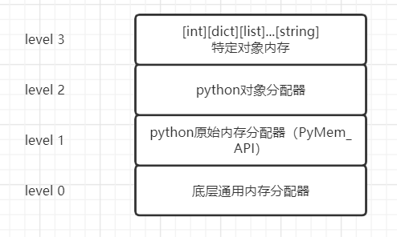
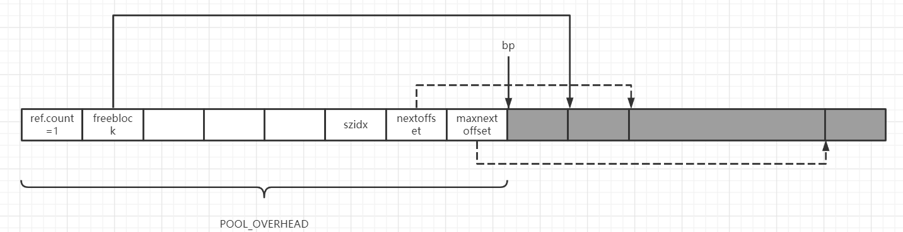
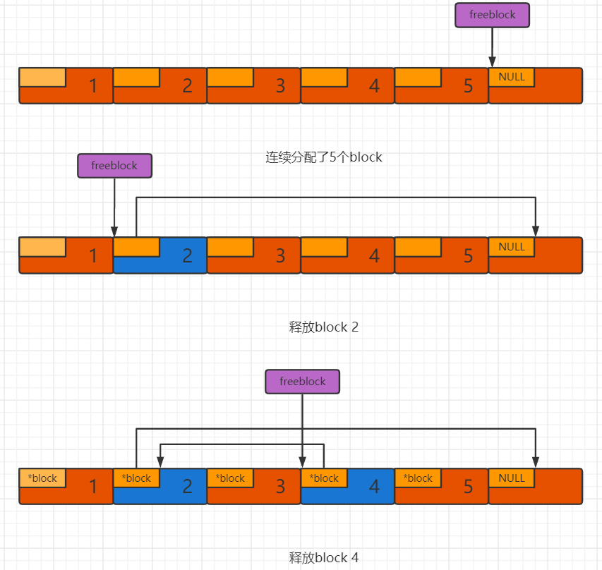
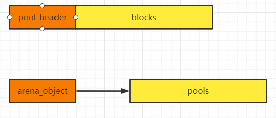
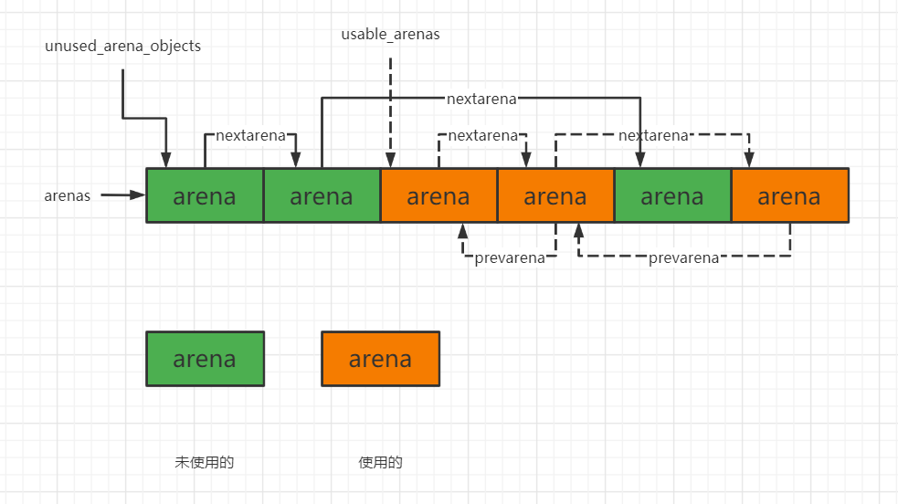
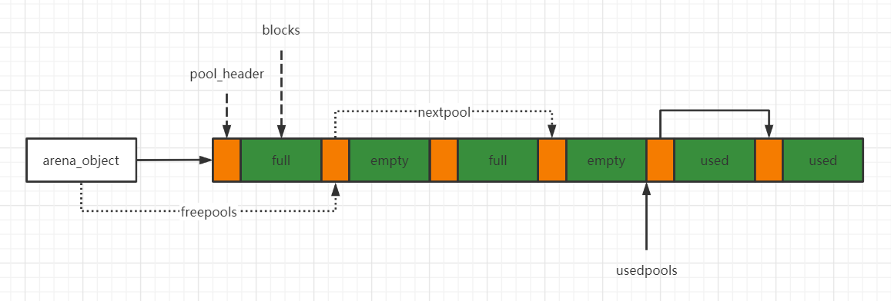
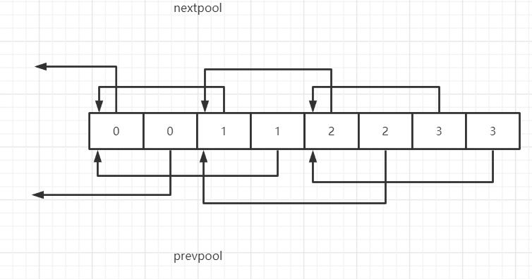
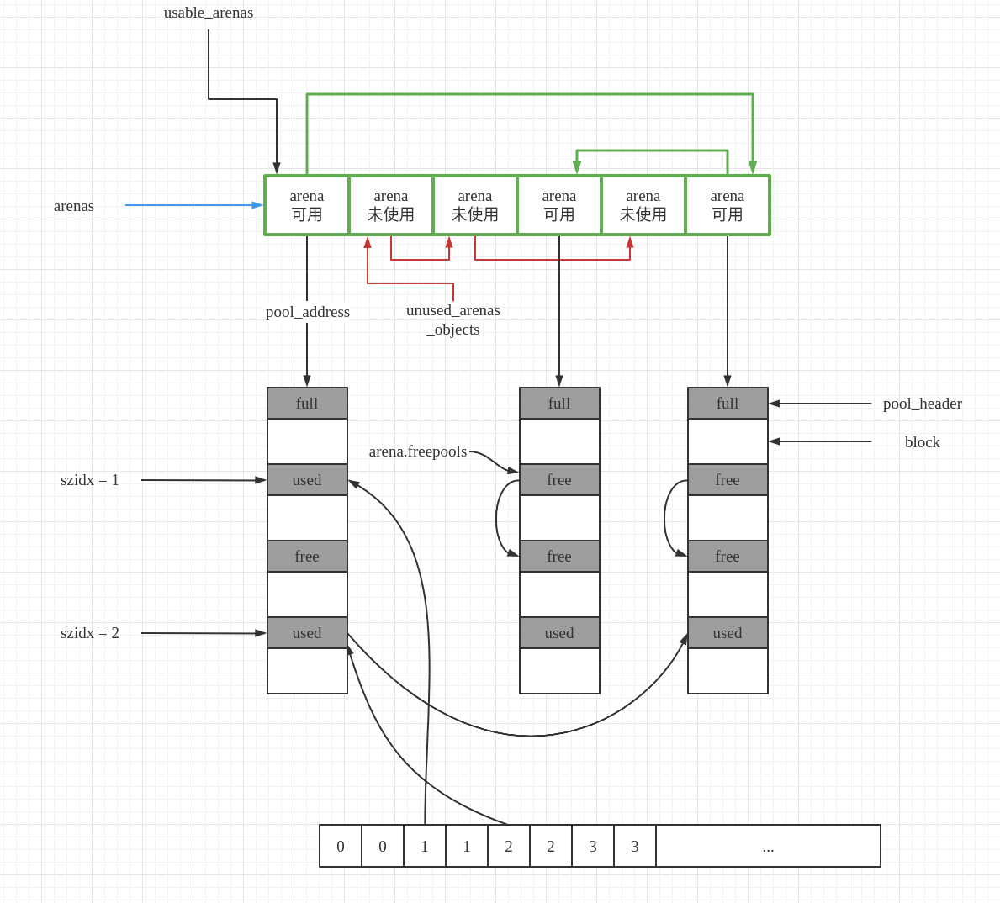

# Python虚拟机的内存管理机制

对于任何一种现代化的语言，内存管理都是至关重要的一环，内存管理效率的高低在很大程度上决定了这种语言的执行效率。对于python来说，高效的内存管理更加重要，因为python在运行过程中会创建和销毁大量对象。

在python中，内存管理组织成了一种层次架构。

最底层（第0层）是操作系统提供的管理接口。这一层是由操作系统实现并管理的，python不能干涉这一层，剩余三层都是由python实现并维护的。

第一层是python在第0层（操作系统的内存管理接口）上包装而成的。该层的目的是为了屏蔽不同操作系统下内存管理接口的不同行为而添加的。

~~~C
static void *
_PyMem_RawMalloc(void *ctx, size_t size)
{
    /* PyMem_RawMalloc(0) means malloc(1). Some systems would return NULL
       for malloc(0), which would be treated as an error. Some platforms would
       return a pointer with no memory behind it, which would break pymalloc.
       To solve these problems, allocate an extra byte. */
    if (size == 0)//python不允许申请大小为0的内存空间
        size = 1;
    return malloc(size);
}

static void *
_PyMem_RawCalloc(void *ctx, size_t nelem, size_t elsize)
{
    /* PyMem_RawCalloc(0, 0) means calloc(1, 1). Some systems would return NULL
       for calloc(0, 0), which would be treated as an error. Some platforms
       would return a pointer with no memory behind it, which would break
       pymalloc.  To solve these problems, allocate an extra byte. */
    if (nelem == 0 || elsize == 0) {
        nelem = 1;
        elsize = 1;
    }
    return calloc(nelem, elsize);
}

static void *
_PyMem_RawRealloc(void *ctx, void *ptr, size_t size)
{
    if (size == 0)
        size = 1;
    return realloc(ptr, size);
}

static void
_PyMem_RawFree(void *ctx, void *ptr)
{
    free(ptr);
}
~~~

我们看到，在第一层中，python提供了类似于C语言中的malloc、realloc、free的语义。

第一层所能提供的内存管理接口功能是有限的。加入我们现在要创建一个int对象，还需要进行许多额外的工作，比如设置类型的对象参数，初始化对象的引用计数等。为了简化python自身的开发，python在比第一层更高的抽象层提供了第二层内存管理接口。在这一层，是一组以PyObject_为前缀的函数族，主要提供了创建python对象的接口。这一套函数族又被称为pymalloc机制。因此在第二层的内存管理机制上，python对于一些内建对象构建了更高抽象层次的内存管理策略。而对于第三层的内存管理策略，主要就是对象的缓存机制，这一点在之前已经剖析过了。第一层仅仅是对malloc等的简单包装，真正在python中发挥巨大作用的，同时也是GC所在之处，就在第二层内存管理机制中。

## 小块空间的内存池

在python中，小对象的使用是非常频繁的。如果直接调用系统层的内存管理接口进行这些小对象的创建与释放会导致用户态与内核态的频繁切换，这会严重降低python的执行效率。所以针对频繁使用的小块内存，python引入了内存池机制，即pymalloc机制，并提供了pymalloc_alloc、pymalloc_realloc、pymalloc_free三个接口。

在python中，整个小块内存的内存池可以视为一个层次结构，在这个层次结构中一共分为4层，从下至上分别是：block、pool、arena和内存池。其中，block、pool和arena都是python代码中可以找到的实体，而最顶层的“内存池”只是一个概念上的东西，表示python对于整个小块内存的分配和释放行为的内存管理机制。

### block

在最底层，block是一个确定大小的内存块。而python中，有很多种block，不同的block有不同的大小，这个内存大小的值称之为size class。在了能够适应当前主流的32位和64位平台，所有的block都是8字节对齐的。

~~~C
/*
 * Alignment of addresses returned to the user. 8-bytes alignment works
 * on most current architectures (with 32-bit or 64-bit address busses).
 * The alignment value is also used for grouping small requests in size
 * classes spaced ALIGNMENT bytes apart.
 *
 * You shouldn't change this unless you know what you are doing.
 */
#define ALIGNMENT               8               /* must be 2^N */
#define ALIGNMENT_SHIFT         3

/* Return the number of bytes in size class I, as a uint. */
#define INDEX2SIZE(I) (((uint)(I) + 1) << ALIGNMENT_SHIFT)
~~~

对于block的大小，python设定了一个上限，如果小于这个上限，python可以组合不同的block来满足需求，而超过这个上限python会调用第1层的内存管理机制来处理。目前python中的上限值是512，即超过512字节的内存python还是会直接向操作系统申请。

~~~C
#define SMALL_REQUEST_THRESHOLD 512
#define NB_SMALL_SIZE_CLASSES   (SMALL_REQUEST_THRESHOLD / ALIGNMENT)
~~~

根据SMALL_REQUEST_THRESHOLD以及ALIGNMENT，我们可以得到block和size class的关系。

~~~C
 * Request in bytes     Size of allocated block      Size class idx
 * ----------------------------------------------------------------
 *        1-8                     8                       0
 *        9-16                   16                       1
 *       17-24                   24                       2
 *       25-32                   32                       3
 *       33-40                   40                       4
 *       41-48                   48                       5
 *       49-56                   56                       6
 *       57-64                   64                       7
 *       65-72                   72                       8
 *        ...                   ...                     ...
 *      497-504                 504                      62
 *      505-512                 512                      63
~~~

也就是说，当我们申请一块大小为28字节的内存时，实际上python从内存池中给我们划分的是一块32字节的block，从size class index为3的pool中划出。

在python中，block只是一个概念，在python源码中没有与之对应的实体存在。然而，python提供的管理block的工具——pool却是源码实在的东西。

### pool

一组block的集合称为一个pool，换句话说，一个pool管理着一堆具有固定大小的内存块。python中，一个pool的大小通常为一个系统内存页。

~~~c
#define SYSTEM_PAGE_SIZE        (4 * 1024)
#define SYSTEM_PAGE_SIZE_MASK   (SYSTEM_PAGE_SIZE - 1)

#define POOL_SIZE               SYSTEM_PAGE_SIZE        /* must be 2^N */
#define POOL_SIZE_MASK          SYSTEM_PAGE_SIZE_MASK
~~~

我们来看python中提供的与pool相关的结构。

~~~C
typedef uint8_t block;

/* Pool for small blocks. */
struct pool_header {
    union { block *_padding;
            uint count; } ref;          /* number of allocated blocks    */
    block *freeblock;                   /* pool's free list head         */
    struct pool_header *nextpool;       /* next pool of this size class  */
    struct pool_header *prevpool;       /* previous pool       ""        */
    uint arenaindex;                    /* index into arenas of base adr */
    uint szidx;                         /* block size class index        */
    uint nextoffset;                    /* bytes to virgin block         */
    uint maxnextoffset;                 /* largest valid nextoffset      */
};

typedef struct pool_header *poolp;
~~~

在pool_header这个结构体中，维护了一个pool的所有关键信息。szidx表示了该pool中所管理的block的大小信息，这意味着同一个pool中的block的大小都是一致的。

假设我们手头有一块4KB的内存，我们来看一下python是如何将内存改造为一个管理多个block的pool。

~~~C
#define POOL_OVERHEAD   _Py_SIZE_ROUND_UP(sizeof(struct pool_header), ALIGNMENT)

static int
pymalloc_alloc(void *ctx, void **ptr_p, size_t nbytes)
{
    block *bp;
    poolp pool;//指向一块4KB的内存
    poolp next;
    uint size;
    /*...*/
    init_pool:
        /* Frontlink to used pools. */
        next = usedpools[size + size]; /* == prev */
        pool->nextpool = next;
        pool->prevpool = next;
        next->nextpool = pool;
        next->prevpool = pool;
        pool->ref.count = 1;//记录被分配的block数量
        if (pool->szidx == size) {
            /* Luckily, this pool last contained blocks
             * of the same size class, so its header
             * and free list are already initialized.
             */
            bp = pool->freeblock;
            assert(bp != NULL);
            pool->freeblock = *(block **)bp;
            goto success;
        }
        /*
         * Initialize the pool header, set up the free list to
         * contain just the second block, and return the first
         * block.
         */
        pool->szidx = size;//设置pool的size class index
        size = INDEX2SIZE(size);//将szidx转换成size
        bp = (block *)pool + POOL_OVERHEAD;//跳过用于pool_header的内存,bp指向第一块可用的block
        pool->nextoffset = POOL_OVERHEAD + (size << 1);//size<<1=size+size
        pool->maxnextoffset = POOL_SIZE - size;
        pool->freeblock = bp + size;
        *(block **)(pool->freeblock) = NULL;
        goto success;
    }
	/*...*/
success:
    assert(bp != NULL);
    *ptr_p = (void *)bp;
    return 1;

failed:
    return 0;
}
~~~

最后返回的bp指向的是从pool取出的第一块block指针。也就是说，pool中的第一块内存已经被分配了。

改造后的4KB的如上图所示。其中，实现箭头代表指针，虚线箭头代表偏移量；nextoffset以及maxnextoffset中存储的是相对于pool头部的偏移量。

在了解了初始化后的pool的结构之后，我们再来看一下申请block时，pool_header中的各个域是怎么变动的。假设我们从现在开始连续申请5块28字节的内存，由于28个字节对应的size class index为3，所以实际上会申请5块32字节的内存。

~~~C
static int
pymalloc_alloc(void *ctx, void **ptr_p, size_t nbytes)
{    
    if (pool != pool->nextpool) {
        /*
         * There is a used pool for this size class.
         * Pick up the head block of its free list.
         */
        ++pool->ref.count;//block计数器加一
        bp = pool->freeblock;//返回下一个可用block的起始地址
        assert(bp != NULL);
        if ((pool->freeblock = *(block **)bp) != NULL) {
            goto success;
        }

        /*
         * Reached the end of the free list, try to extend it.
         *///需要将freeblock向下移动，当再次申请32字节的block时，只需要返回freeblock指向的地址，所以freeblock需要向前移动
        if (pool->nextoffset <= pool->maxnextoffset) {//有足够的block空间
            /* There is room for another block. */
            pool->freeblock = (block*)pool +
                              pool->nextoffset;//freeblock向下一个block移动
            pool->nextoffset += INDEX2SIZE(size);//nextoffset向下一个block移动
            //如此反复，即可对所有的block进行遍历
            //如果pool->nextoffset > pool->maxnextoffset就意味着遍历完pool中的所有block了，此时freeblock就是NULL了
            *(block **)(pool->freeblock) = NULL;
            goto success;
        }

        /* Pool is full, unlink from used pools. */
    }
success:
    assert(bp != NULL);
    *ptr_p = (void *)bp;
    return 1;

failed:
    return 0;
}
~~~

按照上述流程，申请、前进、申请、前进的动作一直执行，整个过程非常自然，也容易理解。然而，这样的流程也存在很大的问题。freeblock如果只能持续前进的话，那么最多只能执行POOL_SIZE/size次对block的申请。比如说现在我们已经进行了5次连续的32字节的内存分配，可以想象，pool中的5个block都分配出去了。过了一段时间，程序释放了第2个和第4个block。如果freeblock只能持续前进，那么第2个和第4个就无法再用于分配了。所以python必须建立一种机制，将这些离散的block利用起来，这个机制就是所谓的自由block链表。这个链表的关键就落在freeblock身上。

刚才我们说了，当pool初始化完后之后，freeblock指向了一个有效的地址，也就是下一个可以分配出去的block的地址。然而奇特的是，当python设置了freeblock时，还设置了\*freeblock。这个动作看似诡异，然而我们马上就能看到设置\*freeblock的动作正是建立离散自由block链表的关键所在。目前我们看到的freeblock只是在机械地前进前进，因为它在等待一个特殊的时刻，在这个特殊的时刻，你会发现freeblock开始成为一个苏醒的精灵，在这4kb的内存上开始灵活地舞动。这个特殊的时刻就是一个block被释放的时刻。

~~~C
#define POOL_ADDR(P) ((poolp)_Py_ALIGN_DOWN((P), POOL_SIZE))

static int
pymalloc_free(void *ctx, void *p)
{
    pool = POOL_ADDR(p);
    if (!address_in_range(p, pool)) {//如果p不在pool里面，直接返回0
        return 0;
    }
    /* We allocated this address. */

    /* Link p to the start of the pool's freeblock list.  Since
     * the pool had at least the p block outstanding, the pool
     * wasn't empty (so it's already in a usedpools[] list, or
     * was full and is in no list -- it's not in the freeblocks
     * list in any case).
     */
    assert(pool->ref.count > 0);            /* else it was empty */
    *(block **)p = lastfree = pool->freeblock;//p的起始的sizeof(block)个字节用来存储当前的freeblock
    pool->freeblock = (block *)p;//freeblock指向p
}
~~~

python构建离散自由block链表的方式非常简单。当一个block p被释放时，首先，用p的起始位置存储freeblock的当前值，然后使freeblock指向p，这样就成功地把一个空闲的block p插入了离散自由block链表的头部。不难想象，从freeblock开始，我们可以很容易地以freeblock=\*freeblock来遍历这个链表。

到了这里，这条实现方式非常其他的block链表已经呈现在我们眼前了。有了这条链表，我们就可以理解block分配时开始的一段代码了。

~~~C
        if ((pool->freeblock = *(block **)bp) != NULL) {//条件不为真，则说明离散自由block链表中已经不存在可用的block，需要从nextoffset处继续分配新的blcok
            goto success;
        }
~~~

pool中的block毕竟是有限的，如果一个pool中的block用完了的话，那么python会去一个新的pool继续进行分配。多个block可以组成一个集合pool，多个pool也可以组成一个集合arena。
### arena

在python中，多个pool的集合就是一个arena。之前提到pool的大小是有默认值的，同样每个arena的大小也有一个默认值。

~~~C
#define ARENA_SIZE              (256 << 10)     /* 256KB */
~~~

很显然，一个arena中容纳的pool的数量时64。

我们来看一下arena的定义。

~~~C
struct arena_object {
    /* The address of the arena, as returned by malloc.  Note that 0
     * will never be returned by a successful malloc, and is used
     * here to mark an arena_object that doesn't correspond to an
     * allocated arena.
     */
    uintptr_t address;

    /* Pool-aligned pointer to the next pool to be carved off. */
    block* pool_address;

    /* The number of available pools in the arena:  free pools + never-
     * allocated pools.
     */
    uint nfreepools;

    /* The total number of pools in the arena, whether or not available. */
    uint ntotalpools;

    /* Singly-linked list of available pools. */
    struct pool_header* freepools;

    /* Whenever this arena_object is not associated with an allocated
     * arena, the nextarena member is used to link all unassociated
     * arena_objects in the singly-linked `unused_arena_objects` list.
     * The prevarena member is unused in this case.
     *
     * When this arena_object is associated with an allocated arena
     * with at least one available pool, both members are used in the
     * doubly-linked `usable_arenas` list, which is maintained in
     * increasing order of `nfreepools` values.
     *
     * Else this arena_object is associated with an allocated arena
     * all of whose pools are in use.  `nextarena` and `prevarena`
     * are both meaningless in this case.
     */
    struct arena_object* nextarena;
    struct arena_object* prevarena;
};
~~~

一个概念上的arena在python源码中对应的就是arena_object结构体，确切地说，arena_object仅仅是一个arena的一部分，就像pool_header只是pool的一部分一样。一个完整的arena包括一个arena_object和透过这个arena_object管理着的pool集合。

#### “未使用的”arena和“可用的”arena

arena是用来管理一组pool的，与pool不同的是，arena_object在申请的时候，其管理的pool并没有被同时申请，也就是说，arena_object与其管理的内存是分离的。

由于arena_object在申请时是没有与pool关联的，所以arena_object需要在某一个时刻与pool建立联系，否则这个arena_object就没有存在的意义了。

在python中，根据是否与pool关联将arena分为两种状态——**“未使用的”**与**“可用的”**。当一个arena的arena_object没有与pool建立联系的时候，这时的arena就处于"未使用的"状态；一旦建立了联系，这时arena就转换到了"可用的"状态。对于每一种状态，都有一个arena链表。"未使用"的arena链表表头是unused_arena_objects，多个arena之间通过nextarena连接，并且是一个单向的链表；而"可用的"arena链表表头是usable_arenas，多个arena之间通过nextarena、prevarena连接，是一个双向链表。

#### 申请arena

在运行期间，python使用new_arena来创建一个arena。

~~~C
/* Array of objects used to track chunks of memory (arenas). */
static struct arena_object* arenas = NULL;//管理arena集合的arenas
/* Number of slots currently allocated in the `arenas` vector. */
static uint maxarenas = 0;//arenas中的arena_object个数

/* The head of the singly-linked, NULL-terminated list of available
 * arena_objects.
 */
static struct arena_object* unused_arena_objects = NULL;//未使用的arena_object链表

/* The head of the doubly-linked, NULL-terminated at each end, list of
 * arena_objects associated with arenas that have pools available.
 */
static struct arena_object* usable_arenas = NULL;//可用的arena_object集合
/* How many arena_objects do we initially allocate?
 * 16 = can allocate 16 arenas = 16 * ARENA_SIZE = 4MB before growing the
 * `arenas` vector.
 */
#define INITIAL_ARENA_OBJECTS 16//初始化时需要申请的arena_object的个数

/* Allocate a new arena.  If we run out of memory, return NULL.  Else
 * allocate a new arena, and return the address of an arena_object
 * describing the new arena.  It's expected that the caller will set
 * `usable_arenas` to the return value.
 */
static struct arena_object*
new_arena(void)
{
    struct arena_object* arenaobj;
    uint excess;        /* number of bytes above pool alignment */
    void *address;
    static int debug_stats = -1;

    if (debug_stats == -1) {
        const char *opt = Py_GETENV("PYTHONMALLOCSTATS");
        debug_stats = (opt != NULL && *opt != '\0');
    }
    if (debug_stats)
        _PyObject_DebugMallocStats(stderr);

    if (unused_arena_objects == NULL) {//[A]判断是否需要扩充“未使用的”arena列表
        uint i;
        uint numarenas;
        size_t nbytes;

        /* Double the number of arena objects on each allocation.
         * Note that it's possible for `numarenas` to overflow.
         *///[B]确定本次需要申请的arena_object的个数，并申请内存
        numarenas = maxarenas ? maxarenas << 1 : INITIAL_ARENA_OBJECTS;
        if (numarenas <= maxarenas)//判断是否溢出
            return NULL;                /* overflow */
#if SIZEOF_SIZE_T <= SIZEOF_INT
        if (numarenas > SIZE_MAX / sizeof(*arenas))
            return NULL;                /* overflow */
#endif
        nbytes = numarenas * sizeof(*arenas);//计算总共需要申请的内存数量
        arenaobj = (struct arena_object *)PyMem_RawRealloc(arenas, nbytes);//内存分配
        if (arenaobj == NULL)
            return NULL;
        arenas = arenaobj;

        /* We might need to fix pointers that were copied.  However,
         * new_arena only gets called when all the pages in the
         * previous arenas are full.  Thus, there are *no* pointers
         * into the old array. Thus, we don't have to worry about
         * invalid pointers.  Just to be sure, some asserts:
         */
        assert(usable_arenas == NULL);
        assert(unused_arena_objects == NULL);

        /* Put the new arenas on the unused_arena_objects list. */
        //[C]初始化新申请的arena_object，并将其放入“未使用的”arena链表中
        for (i = maxarenas; i < numarenas; ++i) {
            arenas[i].address = 0;              /* mark as unassociated */
            arenas[i].nextarena = i < numarenas - 1 ?
                                   &arenas[i+1] : NULL;
        }

        /* Update globals. */
        unused_arena_objects = &arenas[maxarenas];
        maxarenas = numarenas;
    }

    /* Take the next available arena object off the head of the list. */
    assert(unused_arena_objects != NULL);
    arenaobj = unused_arena_objects;//[D]从“未使用的”arena链表中取出一个arena
    unused_arena_objects = arenaobj->nextarena;
    assert(arenaobj->address == 0);
    address = _PyObject_Arena.alloc(_PyObject_Arena.ctx, ARENA_SIZE);//[E]申请arena管理的内存，即arena_object
    if (address == NULL) {
        /* The allocation failed: return NULL after putting the
         * arenaobj back.
         */
        arenaobj->nextarena = unused_arena_objects;
        unused_arena_objects = arenaobj;
        return NULL;
    }
    arenaobj->address = (uintptr_t)address;

    ++narenas_currently_allocated;
    ++ntimes_arena_allocated;//为了分配arena而调用malloc的次数
    if (narenas_currently_allocated > narenas_highwater)
        narenas_highwater = narenas_currently_allocated;//记录narenas_currently_allocated的最大值
    arenaobj->freepools = NULL;//[F]设置pool集合的相关信息
    /* pool_address <- first pool-aligned address in the arena
       nfreepools <- number of whole pools that fit after alignment */
    arenaobj->pool_address = (block*)arenaobj->address;
    arenaobj->nfreepools = ARENA_SIZE / POOL_SIZE;
    assert(POOL_SIZE * arenaobj->nfreepools == ARENA_SIZE);
    excess = (uint)(arenaobj->address & POOL_SIZE_MASK);//将pool的起始地址调整为系统页的边界
    if (excess != 0) {
        --arenaobj->nfreepools;
        arenaobj->pool_address += POOL_SIZE - excess;
    }
    arenaobj->ntotalpools = arenaobj->nfreepools;

    return arenaobj;
}
~~~

在代码[A]处，python会检查当前unused_arena_objects链表中是否还有“未使用的”arena，检查结果将决定后续动作。

如果在"未使用的"链表中还存在未使用的arena，那么python会从"未使用的"arena链表中抽取一个arena，接着调整"未使用的"链表，让它和抽取的arena断绝一切联系。然后在代码[E]处，python申请了一块256KB大小的内存，将申请的内存地址赋给抽取出来的arena的address。我们已经知道，arena中维护的是pool集合，这块256KB的内存就是pool的容身之处，这时候arena就已经和pool集合建立联系了。这个arena已经具备了成为"可用"内存的条件，该arena和"未使用的"arena链表脱离了关系，就等着被"可用的"arena链表接收了。随后，python在代码的[F]处设置了一些arena用户维护pool集合的信息。需要注意的是，python将申请到的256KB内存进行了处理，主要是放弃了一些内存，并将可使用的内存边界`(pool_address)`调整到了与系统页对齐。然后通过arenaobj->freepools = NULL将freepools设置为NULL，这不奇怪，基于对freeblock的了解，我们知道要等到释放一个pool时，这个freepools才会有用。最后我们看到，pool集合占用的256KB内存在进行边界对齐后，实际是交给`pool_address`来维护了。

回到new_arena中的[A]处，如果unused_arena_objects为NULL，则表明目前系统中已经没有"未使用的"arena了，那么python首先会扩大系统的arena集合(小块内存内存池)。python在内部通过一个maxarenas的变量维护了存储arena的数组的个数，然后在[B]处将待申请的arena的个数设置为当然arena个数(maxarenas)的2倍。当然首次初始化的时候maxarenas为0，此时为16。

在获得了新的maxarenas后，python会检查这个新得到的值是否溢出了。如果检查顺利通过，python就会在[C]处通过realloc扩大arenas指向的内存，并对新申请的arena_object进行设置，特别是那个不起眼的address，要将新申请的address一律设置为0。实际上，这是一个标识arena是出于"未使用的"状态还是"可用的"状态的重要标记。而一旦arena(arena_object)和pool集合建立了联系，这个address就变成了非0，看代码的[F]处。当然别忘记我们为什么会走到[C]这里，是因为unused_arena_objects == NULL了，而且最后还设置了unused_arena_objects，这样系统中又有了"未使用的"arena了，接下来python就在[D]处对一个arena进行初始化了。

### 内存池

#### 可用pools缓冲池——usedpools

python中，SMALL_REQUEST_THRESHOLD这个宏定义界定了大内存与小内存。

~~~C
#define SMALL_REQUEST_THRESHOLD 512
~~~

当我们申请小于512字节的内存时，pymalloc_alloc会在内存池中申请内存，而当申请的内存超过了512字节，那么pymalloc_alloc将退化为malloc，通过操作系统来申请内存。python中，内存分配与销毁的动作都是在pool上完成的。

一个pool在python运行的任何一个时刻，总是处于一下三种状态中的一种：

+ used状态：pool中至少有一个block已经被使用，并且至少有一个block未被使用。这种状态的pool受控于python内部维护的usedpools数组；
+ full状态：pool中所有的block都已经被使用，这种状态的pool在arena中，但是不再arena的freepools链表中；
+ pool中所有的block都未被使用，处于这个状态的pool的集合通过其pool_header中的nextpool构成一个链表，这个链表的表头就是arena中的freepools。

arena中处于full状态的pool是各自独立的，没有像其他状态的pool一样，连接成一个链表。

从上图中可以看到，所有处于used状态的pool都处于usedpools的控制下。每当申请内存时，python都会通过usedpools找到一个可用的pool，从中分配一个block。因此，一定有一个usedpools相关联的机制，完成从申请的内存的大小到size class index之间的转换，否则python就无法找到最合适的pool了。这种机制和usedpools的结构有着密切的关系，我们看一下它的结构。

~~~C
typedef uint8_t block;
#define PTA(x)  ((poolp )((uint8_t *)&(usedpools[2*(x)]) - 2*sizeof(block *)))
#define PT(x)   PTA(x), PTA(x)

#define NB_SMALL_SIZE_CLASSES   (SMALL_REQUEST_THRESHOLD / ALIGNMENT)//当前配置下一共有多少个size class

static poolp usedpools[2 * ((NB_SMALL_SIZE_CLASSES + 7) / 8) * 8] = {
    PT(0), PT(1), PT(2), PT(3), PT(4), PT(5), PT(6), PT(7)
#if NB_SMALL_SIZE_CLASSES > 8
    , PT(8), PT(9), PT(10), PT(11), PT(12), PT(13), PT(14), PT(15)
#if NB_SMALL_SIZE_CLASSES > 16
    , PT(16), PT(17), PT(18), PT(19), PT(20), PT(21), PT(22), PT(23)
#if NB_SMALL_SIZE_CLASSES > 24
    , PT(24), PT(25), PT(26), PT(27), PT(28), PT(29), PT(30), PT(31)
#if NB_SMALL_SIZE_CLASSES > 32
    , PT(32), PT(33), PT(34), PT(35), PT(36), PT(37), PT(38), PT(39)
#if NB_SMALL_SIZE_CLASSES > 40
    , PT(40), PT(41), PT(42), PT(43), PT(44), PT(45), PT(46), PT(47)
#if NB_SMALL_SIZE_CLASSES > 48
    , PT(48), PT(49), PT(50), PT(51), PT(52), PT(53), PT(54), PT(55)
#if NB_SMALL_SIZE_CLASSES > 56
    , PT(56), PT(57), PT(58), PT(59), PT(60), PT(61), PT(62), PT(63)
#if NB_SMALL_SIZE_CLASSES > 64
#error "NB_SMALL_SIZE_CLASSES should be less than 64"
#endif /* NB_SMALL_SIZE_CLASSES > 64 */
#endif /* NB_SMALL_SIZE_CLASSES > 56 */
#endif /* NB_SMALL_SIZE_CLASSES > 48 */
#endif /* NB_SMALL_SIZE_CLASSES > 40 */
#endif /* NB_SMALL_SIZE_CLASSES > 32 */
#endif /* NB_SMALL_SIZE_CLASSES > 24 */
#endif /* NB_SMALL_SIZE_CLASSES > 16 */
#endif /* NB_SMALL_SIZE_CLASSES >  8 */
};
~~~

我们通过一张图片来看一下usedpools。

考虑一下当申请28字节的情形，前面我们说到，python首先会获得size class index，显然这里是3。那么在usedpools中，寻找第3+3=6个元素，发现usedpools[6]的值是指向usedpools[4]的地址。现在对照pool_header的定义来看一看usedpools[6] -> nextpool这个指针指向哪里了呢？

~~~c
/* Pool for small blocks. */
struct pool_header {
    union { block *_padding;
            uint count; } ref;          /* number of allocated blocks    */
    block *freeblock;                   /* pool's free list head         */
    struct pool_header *nextpool;       /* next pool of this size class  */
    struct pool_header *prevpool;       /* previous pool       ""        */
    uint arenaindex;                    /* index into arenas of base adr */
    uint szidx;                         /* block size class index        */
    uint nextoffset;                    /* bytes to virgin block         */
    uint maxnextoffset;                 /* largest valid nextoffset      */
};
~~~

显然，从usedpools[6]开始，向后偏移两个指针的内存，正好是usedpools[6]。想象一下，当我们手中有一个size class为32字节的pool，想要将其放入这个usedpools中时，要怎么做呢？从上面的描述我们知道，只需要进行usedpools[i+i] -> nextpool = pool即可，其中i为size class index，对应于32字节，这个i为3。当下次需要访问size class 为32字节(size class index为3)的pool时，只需要简单地访问usedpools[3+3]就可以得到了。python正是使用这个usedpools快速地从众多的pool中快速地寻找到一个最适合当前内存需求的pool，从中分配一块block。

~~~C
static int
pymalloc_alloc(void *ctx, void **ptr_p, size_t nbytes)
{
    block *bp;
    poolp pool;
    poolp next;
    uint size;
    /*...*/
       size = (uint)(nbytes - 1) >> ALIGNMENT_SHIFT;
    pool = usedpools[size + size];
    if (pool != pool->nextpool) {//有可用的pool
        /*
         * There is a used pool for this size class.
         * Pick up the head block of its free list.
         */
        
        }
		/*...*/
        /* Pool is full, unlink from used pools. */
        next = pool->nextpool;
        pool = pool->prevpool;
        next->prevpool = pool;
        pool->nextpool = next;
        goto success;
    }
	//无可用pool，尝试获取empty状态的pool
}
~~~

#### pool的初始化

python采用了延迟分配的策略，即当我们确实开始申请小块内存的时候，python才建立这个内存池。正如之前提到的，当我们开始申请28字节的内存时，python实际将申请32字节的内存，然后会首先根据32字节对应的class size index(3)在usedpools中对应的位置查找，如果发现在对应的位置后面没有连接任何可用的pool，python会从"可用"arena链表中的第一个可用的arena中获取的一个pool。不过需要注意的是，当前获得的arena中包含的这些pools中可能会具有不同的class size index。想象一下，当申请32字节的内存时，从"可用"arena中取出一个pool用作32字节的pool。当下一次内存分配请求分配64字节的内存时，python可以直接使用当前"可用"的arena的另一个pool即可，正如我们之前说的arena没有size class的属性，而pool才有。

~~~C
static int
pymalloc_alloc(void *ctx, void **ptr_p, size_t nbytes)
{
    block *bp;
    poolp pool;
    poolp next;
    uint size;
    /*...*/
    size = (uint)(nbytes - 1) >> ALIGNMENT_SHIFT;
    pool = usedpools[size + size];
    if (pool != pool->nextpool) {//如果usedpools中有可用的pool
        /*...*/
    }
    //无可用pool，尝试获取empty状态的pool
    if (usable_arenas == NULL) {
        /* No arena has a free pool:  allocate a new arena. *///尝试申请新的arena，并放入“可用”arena链表
        /*...*/
        usable_arenas = new_arena();
        if (usable_arenas == NULL) {
            goto failed;
        }
        usable_arenas->nextarena =
            usable_arenas->prevarena = NULL;
    }
    assert(usable_arenas->address != 0);
    //从可用arena链表中第一个arena的freepools中抽取一个可用pool
    pool = usable_arenas->freepools;
    if (pool != NULL) {
        /* Unlink from cached pools. */
        usable_arenas->freepools = pool->nextpool;

        /* This arena already had the smallest nfreepools
         * value, so decreasing nfreepools doesn't change
         * that, and we don't need to rearrange the
         * usable_arenas list.  However, if the arena has
         * become wholly allocated, we need to remove its
         * arena_object from usable_arenas.
         *///调整可用arena链表中第一个arena中的可用pool的数量
        --usable_arenas->nfreepools;
        if (usable_arenas->nfreepools == 0) {
            //如果调整之后变为0，则将该arena从可用arena链表中移除
            /* Wholly allocated:  remove. */
            assert(usable_arenas->freepools == NULL);
            assert(usable_arenas->nextarena == NULL ||
                   usable_arenas->nextarena->prevarena ==
                   usable_arenas);

            usable_arenas = usable_arenas->nextarena;
            if (usable_arenas != NULL) {
                usable_arenas->prevarena = NULL;
                assert(usable_arenas->address != 0);
            }
        }
        else {
            /* nfreepools > 0:  it must be that freepools
             * isn't NULL, or that we haven't yet carved
             * off all the arena's pools for the first
             * time.
             */
            assert(usable_arenas->freepools != NULL ||
                   usable_arenas->pool_address <=
                   (block*)usable_arenas->address +
                       ARENA_SIZE - POOL_SIZE);
        }

    init_pool:
        /*...*/
}
~~~

可以看到，如果开始时"可用"arena链表为空，那么python会通过new_arena申请一个arena，开始构建"可用"arena链表。在这里，一个脱离了"未使用"arena链表并转变为"可用"的arena被纳入了"可用"arena链表的控制。所以python会尝试从"可用"arena链表中的第一个arena所维护的pool集合中取出一个可用的pool。如果成功地取出了这个pool，那么python就会进行一些维护信息的更新工作，甚至在当前arena中可用的pool已经用完了之后，将该arena从"可用"arena链表中移除。

好了，现在我们手里有了一块用于32字节内存分配的pool，为了提高以后内存分配的效率，我们需要将这个pool放入到usedpools中。这一步就是我们上面代码中没贴的init。

~~~C
static int
pymalloc_alloc(void *ctx, void **ptr_p, size_t nbytes)
{
	init_pool:
    	//将pool放入usedpools中
        next = usedpools[size + size]; /* == prev */
        pool->nextpool = next;
        pool->prevpool = next;
        next->nextpool = pool;
        next->prevpool = pool;
        pool->ref.count = 1;
    	//pool在之前就具有正确的size结构，直接返回pool中的一个block
        if (pool->szidx == size) {
            bp = pool->freeblock;
            assert(bp != NULL);
            pool->freeblock = *(block **)bp;
            goto success;
        }
        //pool之前就不具有正确的size结果，调整pool
        pool->szidx = size;
        size = INDEX2SIZE(size);
        bp = (block *)pool + POOL_OVERHEAD;
        pool->nextoffset = POOL_OVERHEAD + (size << 1);
        pool->maxnextoffset = POOL_SIZE - size;
        pool->freeblock = bp + size;
        *(block **)(pool->freeblock) = NULL;
        goto success;
    }
}
~~~

#### block的释放

对block的释放实际上就是将一块block归还给pool，我们已经知道pool可能存在3中状态。当我们释放一个block之后，可能会引起pool状态的转变，这种转变可以分为两种情况

+ used状态转变为empty状态
+ full状态转变为used状态

~~~C
static int
pymalloc_free(void *ctx, void *p)
{
    poolp pool;
    block *lastfree;
    poolp next, prev;
    uint size;

    assert(p != NULL);

#ifdef WITH_VALGRIND
    if (UNLIKELY(running_on_valgrind > 0)) {
        return 0;
    }
#endif

    pool = POOL_ADDR(p);
    if (!address_in_range(p, pool)) {
        return 0;
    }
    /* We allocated this address. */

    /* Link p to the start of the pool's freeblock list.  Since
     * the pool had at least the p block outstanding, the pool
     * wasn't empty (so it's already in a usedpools[] list, or
     * was full and is in no list -- it's not in the freeblocks
     * list in any case).
     */
    assert(pool->ref.count > 0);            /* else it was empty *///设置离散自由的block链表
    *(block **)p = lastfree = pool->freeblock;
    pool->freeblock = (block *)p;
    if (!lastfree) { //如果!lastfree成立，那么意味着不存在lastfree，说明这个pool在释放block之前是满的
        /* Pool was full, so doesn't currently live in any list:
         * link it to the front of the appropriate usedpools[] list.
         * This mimics LRU pool usage for new allocations and
         * targets optimal filling when several pools contain
         * blocks of the same size class.
         */
        //当前pool处于full状态，在释放一块block之后，需要将其转换为used状态，并重新加入到usedpools的头部
        --pool->ref.count;
        assert(pool->ref.count > 0);            /* else the pool is empty */
        size = pool->szidx;
        next = usedpools[size + size];
        prev = next->prevpool;

        /* insert pool before next:   prev <-> pool <-> next */
        pool->nextpool = next;
        pool->prevpool = prev;
        next->prevpool = pool;
        prev->nextpool = pool;
        goto success;
    }
	//执行到这里说明lastfree有效，pool回收了一个block之后不需要从used状态转变为empty状态
    struct arena_object* ao;
    uint nf;  /* ao->nfreepools */

    /* freeblock wasn't NULL, so the pool wasn't full,
     * and the pool is in a usedpools[] list.
     */
    if (--pool->ref.count != 0) {
        /* pool isn't empty:  leave it in usedpools */
        goto success;
    }
    /* Pool is now empty:  unlink from usedpools, and
     * link to the front of freepools.  This ensures that
     * previously freed pools will be allocated later
     * (being not referenced, they are perhaps paged out).
     *///执行到这里说明pool为空
    next = pool->nextpool;
    prev = pool->prevpool;
    next->prevpool = prev;
    prev->nextpool = next;

    /* Link the pool to freepools.  This is a singly-linked
     * list, and pool->prevpool isn't used there.
     *///将pool放入frepools维护的链表中
    ao = &arenas[pool->arenaindex];
    pool->nextpool = ao->freepools;
    ao->freepools = pool;
    nf = ++ao->nfreepools;

    /* All the rest is arena management.  We just freed
     * a pool, and there are 4 cases for arena mgmt:
     * 1. If all the pools are free, return the arena to
     *    the system free().
     * 2. If this is the only free pool in the arena,
     *    add the arena back to the `usable_arenas` list.
     * 3. If the "next" arena has a smaller count of free
     *    pools, we have to "slide this arena right" to
     *    restore that usable_arenas is sorted in order of
     *    nfreepools.
     * 4. Else there's nothing more to do.
     */
    if (nf == ao->ntotalpools) {//所有的pool都是empty状态，释放pool集合所占用的内存
        /* Case 1.  First unlink ao from usable_arenas.
         *///调整usable_arenas链表
        assert(ao->prevarena == NULL ||
               ao->prevarena->address != 0);
        assert(ao ->nextarena == NULL ||
               ao->nextarena->address != 0);

        /* Fix the pointer in the prevarena, or the
         * usable_arenas pointer.
         */
        if (ao->prevarena == NULL) {
            usable_arenas = ao->nextarena;
            assert(usable_arenas == NULL ||
                   usable_arenas->address != 0);
        }
        else {
            assert(ao->prevarena->nextarena == ao);
            ao->prevarena->nextarena =
                ao->nextarena;
        }
        /* Fix the pointer in the nextarena. */
        if (ao->nextarena != NULL) {
            assert(ao->nextarena->prevarena == ao);
            ao->nextarena->prevarena =
                ao->prevarena;
        }
        /* Record that this arena_object slot is
         * available to be reused.
         */
        ao->nextarena = unused_arena_objects;
        unused_arena_objects = ao;

        /* Free the entire arena. *///将内存还给操作系统
        _PyObject_Arena.free(_PyObject_Arena.ctx,
                             (void *)ao->address, ARENA_SIZE);
        ao->address = 0;                        /* mark unassociated */
        --narenas_currently_allocated;

        goto success;
    }

    if (nf == 1) {
        /* Case 2.  Put ao at the head of
         * usable_arenas.  Note that because
         * ao->nfreepools was 0 before, ao isn't
         * currently on the usable_arenas list.
         *///如果之前arena中没有了empty的pool，那么在"可用"链表中就找不到该arena，由于现在arena中有了一个pool，所以需要将这个arena链入到"可用"链表的表头
        ao->nextarena = usable_arenas;
        ao->prevarena = NULL;
        if (usable_arenas)
            usable_arenas->prevarena = ao;
        usable_arenas = ao;
        assert(usable_arenas->address != 0);

        goto success;
    }

    /* If this arena is now out of order, we need to keep
     * the list sorted.  The list is kept sorted so that
     * the "most full" arenas are used first, which allows
     * the nearly empty arenas to be completely freed.  In
     * a few un-scientific tests, it seems like this
     * approach allowed a lot more memory to be freed.
     */
    if (ao->nextarena == NULL ||
                 nf <= ao->nextarena->nfreepools) {
        /* Case 4.  Nothing to do. *///不对arena进行任何处理
        goto success;
    }
    /* Case 3:  We have to move the arena towards the end
     * of the list, because it has more free pools than
     * the arena to its right.
     * First unlink ao from usable_arenas.
     *///如果arena中的empty的pool的个数为n，那么会从"可用"arena链表中开始寻找arena可以插入的位置，将arena插入到"可用"链表。这样操作的原因就在于"可用"arena链表实际上是一个有序的链表，从表头开始往后，每一个arena中empty的pool的个数，即nfreepools，都不能大于前面的arena，也不能小于后面的arena。保持这样有序性的原则是分配block时，是从"可用"链表的表头开始寻找可用arena的，这样就能保证如果一个arena的empty pool数量越多，它被使用的机会就越少。因此它最终释放其维护的pool集合的内存的机会就越大，这样就能保证多余的内存会被归还给操作系统
    if (ao->prevarena != NULL) {
        /* ao isn't at the head of the list */
        assert(ao->prevarena->nextarena == ao);
        ao->prevarena->nextarena = ao->nextarena;
    }
    else {
        /* ao is at the head of the list */
        assert(usable_arenas == ao);
        usable_arenas = ao->nextarena;
    }
    ao->nextarena->prevarena = ao->prevarena;

    /* Locate the new insertion point by iterating over
     * the list, using our nextarena pointer.
     */
    while (ao->nextarena != NULL && nf > ao->nextarena->nfreepools) {
        ao->prevarena = ao->nextarena;
        ao->nextarena = ao->nextarena->nextarena;
    }

    /* Insert ao at this point. */
    assert(ao->nextarena == NULL || ao->prevarena == ao->nextarena->prevarena);
    assert(ao->prevarena->nextarena == ao->nextarena);

    ao->prevarena->nextarena = ao;
    if (ao->nextarena != NULL) {
        ao->nextarena->prevarena = ao;
    }

    /* Verify that the swaps worked. */
    assert(ao->nextarena == NULL || nf <= ao->nextarena->nfreepools);
    assert(ao->prevarena == NULL || nf > ao->prevarena->nfreepools);
    assert(ao->nextarena == NULL || ao->nextarena->prevarena == ao);
    assert((usable_arenas == ao && ao->prevarena == NULL)
           || ao->prevarena->nextarena == ao);

    goto success;
success:
    return 1;
}
~~~

实际上在python2.4之前，python的arena是不会释放pool的。这样的话就会引起内存泄漏，比如我们申请10 * 1024 * 1024个16字节的小内存，这就意味着必须使用160MB的内存，由于python会默认全部使用arena来满足需求。但是当我们将所有16字节的内存全部释放了，这些内存也会回到arena的控制之中，这都没有问题。但是问题来了，这些内存是被arena控制的，并没有交给操作系统，所以这160MB的内存始终会被python占用，如果后面的程序不需要160MB的如此巨大的内存，那么这些内存就浪费了。

由于这种情况必须在大量持续申请小内存对象时才会出现，因为大的话会自动交给操作系统了，小的才会由arena控制，而持续申请大量小内存的情况几乎不会碰到，所以这个问题也就留在了 Python中。但是因为有些人发现了这个问题，所以这个问题在python2.5的时候就得到了解决。

因为早期的python，arena是没有区分"未使用"和"可用"两种状态的，到了python2.5中，arena已经可以将自己维护的pool集合释放，交给操作系统了，从而将"可用"状态转化为"未使用"状态。而当python处理完pool，就开始处理arena了。对arena的处理分了四种情况，正如上述代码中的case1——case4。

#### 内存池全景

内存管理可以说是python中最复杂、最繁琐的地方了。不同尺度的内存会有不同的抽象，这些抽象在各种情况下会组成各式各样的链表，非常复杂。但是我们还是有可能从一个整体的尺度上把握整个内存池，尽管不同的链表变幻无常，但我们只需记住，所有的内存都在arenas(或者说那个存放多个arena的数组)的掌握之中 。

