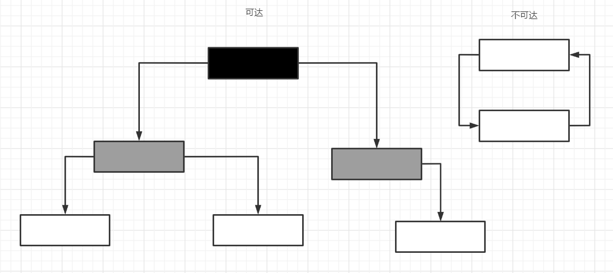
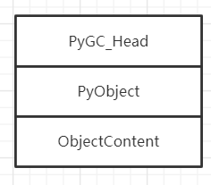
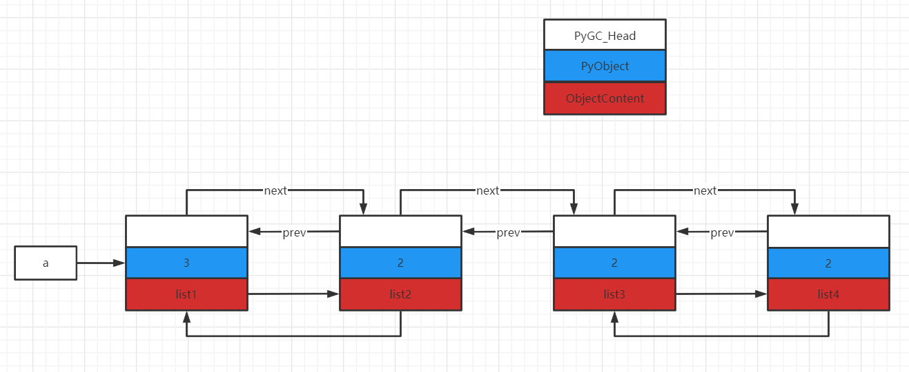
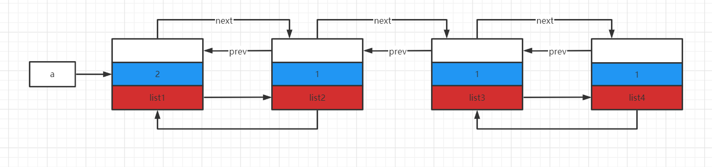
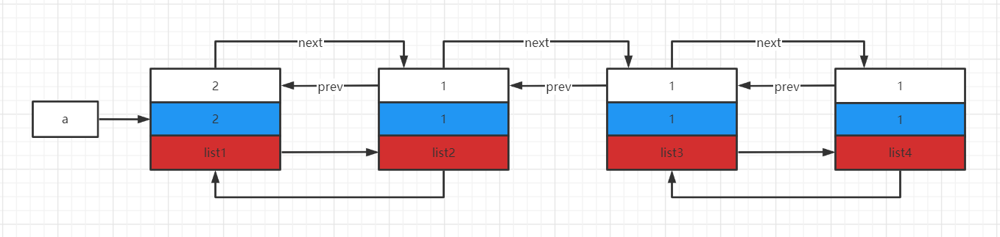
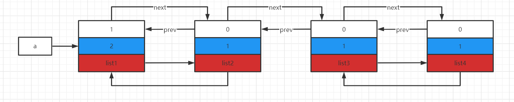
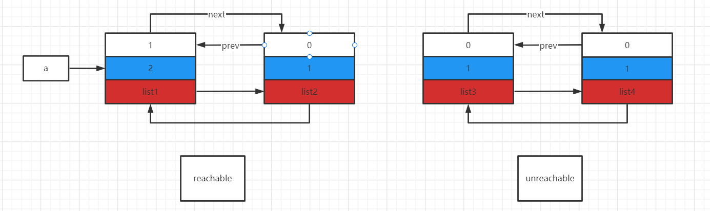

# Python虚拟机的内存管理机制

对于任何一种现代化的语言，内存管理都是至关重要的一环，内存管理效率的高低在很大程度上决定了这种语言的执行效率。对于python来说，高效的内存管理更加重要，因为python在运行过程中会创建和销毁大量对象。

在python中，内存管理组织成了一种层次架构。

最底层（第0层）是操作系统提供的管理接口。这一层是由操作系统实现并管理的，python不能干涉这一层，剩余三层都是由python实现并维护的。

第一层是python在第0层（操作系统的内存管理接口）上包装而成的。该层的目的是为了屏蔽不同操作系统下内存管理接口的不同行为而添加的。

~~~C
static void *
_PyMem_RawMalloc(void *ctx, size_t size)
{
    /* PyMem_RawMalloc(0) means malloc(1). Some systems would return NULL
       for malloc(0), which would be treated as an error. Some platforms would
       return a pointer with no memory behind it, which would break pymalloc.
       To solve these problems, allocate an extra byte. */
    if (size == 0)//python不允许申请大小为0的内存空间
        size = 1;
    return malloc(size);
}

static void *
_PyMem_RawCalloc(void *ctx, size_t nelem, size_t elsize)
{
    /* PyMem_RawCalloc(0, 0) means calloc(1, 1). Some systems would return NULL
       for calloc(0, 0), which would be treated as an error. Some platforms
       would return a pointer with no memory behind it, which would break
       pymalloc.  To solve these problems, allocate an extra byte. */
    if (nelem == 0 || elsize == 0) {
        nelem = 1;
        elsize = 1;
    }
    return calloc(nelem, elsize);
}

static void *
_PyMem_RawRealloc(void *ctx, void *ptr, size_t size)
{
    if (size == 0)
        size = 1;
    return realloc(ptr, size);
}

static void
_PyMem_RawFree(void *ctx, void *ptr)
{
    free(ptr);
}
~~~

我们看到，在第一层中，python提供了类似于C语言中的malloc、realloc、free的语义。

第一层所能提供的内存管理接口功能是有限的。加入我们现在要创建一个int对象，还需要进行许多额外的工作，比如设置类型的对象参数，初始化对象的引用计数等。为了简化python自身的开发，python在比第一层更高的抽象层提供了第二层内存管理接口。在这一层，是一组以PyObject_为前缀的函数族，主要提供了创建python对象的接口。这一套函数族又被称为pymalloc机制。因此在第二层的内存管理机制上，python对于一些内建对象构建了更高抽象层次的内存管理策略。而对于第三层的内存管理策略，主要就是对象的缓存机制，这一点在之前已经剖析过了。第一层仅仅是对malloc等的简单包装，真正在python中发挥巨大作用的，同时也是GC所在之处，就在第二层内存管理机制中。

## 小块空间的内存池

在python中，小对象的使用是非常频繁的。如果直接调用系统层的内存管理接口进行这些小对象的创建与释放会导致用户态与内核态的频繁切换，这会严重降低python的执行效率。所以针对频繁使用的小块内存，python引入了内存池机制，即pymalloc机制，并提供了pymalloc_alloc、pymalloc_realloc、pymalloc_free三个接口。

在python中，整个小块内存的内存池可以视为一个层次结构，在这个层次结构中一共分为4层，从下至上分别是：block、pool、arena和内存池。其中，block、pool和arena都是python代码中可以找到的实体，而最顶层的“内存池”只是一个概念上的东西，表示python对于整个小块内存的分配和释放行为的内存管理机制。

### block

在最底层，block是一个确定大小的内存块。而python中，有很多种block，不同的block有不同的大小，这个内存大小的值称之为size class。在了能够适应当前主流的32位和64位平台，所有的block都是8字节对齐的。

~~~C
/*
 * Alignment of addresses returned to the user. 8-bytes alignment works
 * on most current architectures (with 32-bit or 64-bit address busses).
 * The alignment value is also used for grouping small requests in size
 * classes spaced ALIGNMENT bytes apart.
 *
 * You shouldn't change this unless you know what you are doing.
 */
#define ALIGNMENT               8               /* must be 2^N */
#define ALIGNMENT_SHIFT         3

/* Return the number of bytes in size class I, as a uint. */
#define INDEX2SIZE(I) (((uint)(I) + 1) << ALIGNMENT_SHIFT)
~~~

对于block的大小，python设定了一个上限，如果小于这个上限，python可以组合不同的block来满足需求，而超过这个上限python会调用第1层的内存管理机制来处理。目前python中的上限值是512，即超过512字节的内存python还是会直接向操作系统申请。

~~~C
#define SMALL_REQUEST_THRESHOLD 512
#define NB_SMALL_SIZE_CLASSES   (SMALL_REQUEST_THRESHOLD / ALIGNMENT)
~~~

根据SMALL_REQUEST_THRESHOLD以及ALIGNMENT，我们可以得到block和size class的关系。

~~~C
 * Request in bytes     Size of allocated block      Size class idx
 * ----------------------------------------------------------------
 *        1-8                     8                       0
 *        9-16                   16                       1
 *       17-24                   24                       2
 *       25-32                   32                       3
 *       33-40                   40                       4
 *       41-48                   48                       5
 *       49-56                   56                       6
 *       57-64                   64                       7
 *       65-72                   72                       8
 *        ...                   ...                     ...
 *      497-504                 504                      62
 *      505-512                 512                      63
~~~

也就是说，当我们申请一块大小为28字节的内存时，实际上python从内存池中给我们划分的是一块32字节的block，从size class index为3的pool中划出。

在python中，block只是一个概念，在python源码中没有与之对应的实体存在。然而，python提供的管理block的工具——pool却是源码实在的东西。

### pool

一组block的集合称为一个pool，换句话说，一个pool管理着一堆具有固定大小的内存块。python中，一个pool的大小通常为一个系统内存页。

~~~c
#define SYSTEM_PAGE_SIZE        (4 * 1024)
#define SYSTEM_PAGE_SIZE_MASK   (SYSTEM_PAGE_SIZE - 1)

#define POOL_SIZE               SYSTEM_PAGE_SIZE        /* must be 2^N */
#define POOL_SIZE_MASK          SYSTEM_PAGE_SIZE_MASK
~~~

我们来看python中提供的与pool相关的结构。

~~~C
typedef uint8_t block;

/* Pool for small blocks. */
struct pool_header {
    union { block *_padding;
            uint count; } ref;          /* number of allocated blocks    */
    block *freeblock;                   /* pool's free list head         */
    struct pool_header *nextpool;       /* next pool of this size class  */
    struct pool_header *prevpool;       /* previous pool       ""        */
    uint arenaindex;                    /* index into arenas of base adr */
    uint szidx;                         /* block size class index        */
    uint nextoffset;                    /* bytes to virgin block         */
    uint maxnextoffset;                 /* largest valid nextoffset      */
};

typedef struct pool_header *poolp;
~~~

在pool_header这个结构体中，维护了一个pool的所有关键信息。szidx表示了该pool中所管理的block的大小信息，这意味着同一个pool中的block的大小都是一致的。

假设我们手头有一块4KB的内存，我们来看一下python是如何将内存改造为一个管理多个block的pool。

~~~C
#define POOL_OVERHEAD   _Py_SIZE_ROUND_UP(sizeof(struct pool_header), ALIGNMENT)

static int
pymalloc_alloc(void *ctx, void **ptr_p, size_t nbytes)
{
    block *bp;
    poolp pool;//指向一块4KB的内存
    poolp next;
    uint size;
    /*...*/
    init_pool:
        /* Frontlink to used pools. */
        next = usedpools[size + size]; /* == prev */
        pool->nextpool = next;
        pool->prevpool = next;
        next->nextpool = pool;
        next->prevpool = pool;
        pool->ref.count = 1;//记录被分配的block数量
        if (pool->szidx == size) {
            /* Luckily, this pool last contained blocks
             * of the same size class, so its header
             * and free list are already initialized.
             */
            bp = pool->freeblock;
            assert(bp != NULL);
            pool->freeblock = *(block **)bp;
            goto success;
        }
        /*
         * Initialize the pool header, set up the free list to
         * contain just the second block, and return the first
         * block.
         */
        pool->szidx = size;//设置pool的size class index
        size = INDEX2SIZE(size);//将szidx转换成size
        bp = (block *)pool + POOL_OVERHEAD;//跳过用于pool_header的内存,bp指向第一块可用的block
        pool->nextoffset = POOL_OVERHEAD + (size << 1);//size<<1=size+size
        pool->maxnextoffset = POOL_SIZE - size;
        pool->freeblock = bp + size;
        *(block **)(pool->freeblock) = NULL;
        goto success;
    }
	/*...*/
success:
    assert(bp != NULL);
    *ptr_p = (void *)bp;
    return 1;

failed:
    return 0;
}
~~~

最后返回的bp指向的是从pool取出的第一块block指针。也就是说，pool中的第一块内存已经被分配了。

改造后的4KB的如上图所示。其中，实现箭头代表指针，虚线箭头代表偏移量；nextoffset以及maxnextoffset中存储的是相对于pool头部的偏移量。

在了解了初始化后的pool的结构之后，我们再来看一下申请block时，pool_header中的各个域是怎么变动的。假设我们从现在开始连续申请5块28字节的内存，由于28个字节对应的size class index为3，所以实际上会申请5块32字节的内存。

~~~C
static int
pymalloc_alloc(void *ctx, void **ptr_p, size_t nbytes)
{    
    if (pool != pool->nextpool) {
        /*
         * There is a used pool for this size class.
         * Pick up the head block of its free list.
         */
        ++pool->ref.count;//block计数器加一
        bp = pool->freeblock;//返回下一个可用block的起始地址
        assert(bp != NULL);
        if ((pool->freeblock = *(block **)bp) != NULL) {
            goto success;
        }

        /*
         * Reached the end of the free list, try to extend it.
         *///需要将freeblock向下移动，当再次申请32字节的block时，只需要返回freeblock指向的地址，所以freeblock需要向前移动
        if (pool->nextoffset <= pool->maxnextoffset) {//有足够的block空间
            /* There is room for another block. */
            pool->freeblock = (block*)pool +
                              pool->nextoffset;//freeblock向下一个block移动
            pool->nextoffset += INDEX2SIZE(size);//nextoffset向下一个block移动
            //如此反复，即可对所有的block进行遍历
            //如果pool->nextoffset > pool->maxnextoffset就意味着遍历完pool中的所有block了，此时freeblock就是NULL了
            *(block **)(pool->freeblock) = NULL;
            goto success;
        }

        /* Pool is full, unlink from used pools. */
    }
success:
    assert(bp != NULL);
    *ptr_p = (void *)bp;
    return 1;

failed:
    return 0;
}
~~~

按照上述流程，申请、前进、申请、前进的动作一直执行，整个过程非常自然，也容易理解。然而，这样的流程也存在很大的问题。freeblock如果只能持续前进的话，那么最多只能执行POOL_SIZE/size次对block的申请。比如说现在我们已经进行了5次连续的32字节的内存分配，可以想象，pool中的5个block都分配出去了。过了一段时间，程序释放了第2个和第4个block。如果freeblock只能持续前进，那么第2个和第4个就无法再用于分配了。所以python必须建立一种机制，将这些离散的block利用起来，这个机制就是所谓的自由block链表。这个链表的关键就落在freeblock身上。

刚才我们说了，当pool初始化完后之后，freeblock指向了一个有效的地址，也就是下一个可以分配出去的block的地址。然而奇特的是，当python设置了freeblock时，还设置了\*freeblock。这个动作看似诡异，然而我们马上就能看到设置\*freeblock的动作正是建立离散自由block链表的关键所在。目前我们看到的freeblock只是在机械地前进前进，因为它在等待一个特殊的时刻，在这个特殊的时刻，你会发现freeblock开始成为一个苏醒的精灵，在这4kb的内存上开始灵活地舞动。这个特殊的时刻就是一个block被释放的时刻。

~~~C
#define POOL_ADDR(P) ((poolp)_Py_ALIGN_DOWN((P), POOL_SIZE))

static int
pymalloc_free(void *ctx, void *p)
{
    pool = POOL_ADDR(p);
    if (!address_in_range(p, pool)) {//如果p不在pool里面，直接返回0
        return 0;
    }
    /* We allocated this address. */

    /* Link p to the start of the pool's freeblock list.  Since
     * the pool had at least the p block outstanding, the pool
     * wasn't empty (so it's already in a usedpools[] list, or
     * was full and is in no list -- it's not in the freeblocks
     * list in any case).
     */
    assert(pool->ref.count > 0);            /* else it was empty */
    *(block **)p = lastfree = pool->freeblock;//p的起始的sizeof(block)个字节用来存储当前的freeblock
    pool->freeblock = (block *)p;//freeblock指向p
}
~~~

python构建离散自由block链表的方式非常简单。当一个block p被释放时，首先，用p的起始位置存储freeblock的当前值，然后使freeblock指向p，这样就成功地把一个空闲的block p插入了离散自由block链表的头部。不难想象，从freeblock开始，我们可以很容易地以freeblock=\*freeblock来遍历这个链表。

到了这里，这条实现方式非常其他的block链表已经呈现在我们眼前了。有了这条链表，我们就可以理解block分配时开始的一段代码了。

~~~C
        if ((pool->freeblock = *(block **)bp) != NULL) {//条件不为真，则说明离散自由block链表中已经不存在可用的block，需要从nextoffset处继续分配新的blcok
            goto success;
        }
~~~

pool中的block毕竟是有限的，如果一个pool中的block用完了的话，那么python会去一个新的pool继续进行分配。多个block可以组成一个集合pool，多个pool也可以组成一个集合arena。
### arena

在python中，多个pool的集合就是一个arena。之前提到pool的大小是有默认值的，同样每个arena的大小也有一个默认值。

~~~C
#define ARENA_SIZE              (256 << 10)     /* 256KB */
~~~

很显然，一个arena中容纳的pool的数量时64。

我们来看一下arena的定义。

~~~C
struct arena_object {
    /* The address of the arena, as returned by malloc.  Note that 0
     * will never be returned by a successful malloc, and is used
     * here to mark an arena_object that doesn't correspond to an
     * allocated arena.
     */
    uintptr_t address;

    /* Pool-aligned pointer to the next pool to be carved off. */
    block* pool_address;

    /* The number of available pools in the arena:  free pools + never-
     * allocated pools.
     */
    uint nfreepools;

    /* The total number of pools in the arena, whether or not available. */
    uint ntotalpools;

    /* Singly-linked list of available pools. */
    struct pool_header* freepools;

    /* Whenever this arena_object is not associated with an allocated
     * arena, the nextarena member is used to link all unassociated
     * arena_objects in the singly-linked `unused_arena_objects` list.
     * The prevarena member is unused in this case.
     *
     * When this arena_object is associated with an allocated arena
     * with at least one available pool, both members are used in the
     * doubly-linked `usable_arenas` list, which is maintained in
     * increasing order of `nfreepools` values.
     *
     * Else this arena_object is associated with an allocated arena
     * all of whose pools are in use.  `nextarena` and `prevarena`
     * are both meaningless in this case.
     */
    struct arena_object* nextarena;
    struct arena_object* prevarena;
};
~~~

一个概念上的arena在python源码中对应的就是arena_object结构体，确切地说，arena_object仅仅是一个arena的一部分，就像pool_header只是pool的一部分一样。一个完整的arena包括一个arena_object和透过这个arena_object管理着的pool集合。

#### “未使用的”arena和“可用的”arena

arena是用来管理一组pool的，与pool不同的是，arena_object在申请的时候，其管理的pool并没有被同时申请，也就是说，arena_object与其管理的内存是分离的。

由于arena_object在申请时是没有与pool关联的，所以arena_object需要在某一个时刻与pool建立联系，否则这个arena_object就没有存在的意义了。

在python中，根据是否与pool关联将arena分为两种状态——**“未使用的”**与**“可用的”**。当一个arena的arena_object没有与pool建立联系的时候，这时的arena就处于"未使用的"状态；一旦建立了联系，这时arena就转换到了"可用的"状态。对于每一种状态，都有一个arena链表。"未使用"的arena链表表头是unused_arena_objects，多个arena之间通过nextarena连接，并且是一个单向的链表；而"可用的"arena链表表头是usable_arenas，多个arena之间通过nextarena、prevarena连接，是一个双向链表。

#### 申请arena

在运行期间，python使用new_arena来创建一个arena。

~~~C
/* Array of objects used to track chunks of memory (arenas). */
static struct arena_object* arenas = NULL;//管理arena集合的arenas
/* Number of slots currently allocated in the `arenas` vector. */
static uint maxarenas = 0;//arenas中的arena_object个数

/* The head of the singly-linked, NULL-terminated list of available
 * arena_objects.
 */
static struct arena_object* unused_arena_objects = NULL;//未使用的arena_object链表

/* The head of the doubly-linked, NULL-terminated at each end, list of
 * arena_objects associated with arenas that have pools available.
 */
static struct arena_object* usable_arenas = NULL;//可用的arena_object集合
/* How many arena_objects do we initially allocate?
 * 16 = can allocate 16 arenas = 16 * ARENA_SIZE = 4MB before growing the
 * `arenas` vector.
 */
#define INITIAL_ARENA_OBJECTS 16//初始化时需要申请的arena_object的个数

/* Allocate a new arena.  If we run out of memory, return NULL.  Else
 * allocate a new arena, and return the address of an arena_object
 * describing the new arena.  It's expected that the caller will set
 * `usable_arenas` to the return value.
 */
static struct arena_object*
new_arena(void)
{
    struct arena_object* arenaobj;
    uint excess;        /* number of bytes above pool alignment */
    void *address;
    static int debug_stats = -1;

    if (debug_stats == -1) {
        const char *opt = Py_GETENV("PYTHONMALLOCSTATS");
        debug_stats = (opt != NULL && *opt != '\0');
    }
    if (debug_stats)
        _PyObject_DebugMallocStats(stderr);

    if (unused_arena_objects == NULL) {//[A]判断是否需要扩充“未使用的”arena列表
        uint i;
        uint numarenas;
        size_t nbytes;

        /* Double the number of arena objects on each allocation.
         * Note that it's possible for `numarenas` to overflow.
         *///[B]确定本次需要申请的arena_object的个数，并申请内存
        numarenas = maxarenas ? maxarenas << 1 : INITIAL_ARENA_OBJECTS;
        if (numarenas <= maxarenas)//判断是否溢出
            return NULL;                /* overflow */
#if SIZEOF_SIZE_T <= SIZEOF_INT
        if (numarenas > SIZE_MAX / sizeof(*arenas))
            return NULL;                /* overflow */
#endif
        nbytes = numarenas * sizeof(*arenas);//计算总共需要申请的内存数量
        arenaobj = (struct arena_object *)PyMem_RawRealloc(arenas, nbytes);//内存分配
        if (arenaobj == NULL)
            return NULL;
        arenas = arenaobj;

        /* We might need to fix pointers that were copied.  However,
         * new_arena only gets called when all the pages in the
         * previous arenas are full.  Thus, there are *no* pointers
         * into the old array. Thus, we don't have to worry about
         * invalid pointers.  Just to be sure, some asserts:
         */
        assert(usable_arenas == NULL);
        assert(unused_arena_objects == NULL);

        /* Put the new arenas on the unused_arena_objects list. */
        //[C]初始化新申请的arena_object，并将其放入“未使用的”arena链表中
        for (i = maxarenas; i < numarenas; ++i) {
            arenas[i].address = 0;              /* mark as unassociated */
            arenas[i].nextarena = i < numarenas - 1 ?
                                   &arenas[i+1] : NULL;
        }

        /* Update globals. */
        unused_arena_objects = &arenas[maxarenas];
        maxarenas = numarenas;
    }

    /* Take the next available arena object off the head of the list. */
    assert(unused_arena_objects != NULL);
    arenaobj = unused_arena_objects;//[D]从“未使用的”arena链表中取出一个arena
    unused_arena_objects = arenaobj->nextarena;
    assert(arenaobj->address == 0);
    address = _PyObject_Arena.alloc(_PyObject_Arena.ctx, ARENA_SIZE);//[E]申请arena管理的内存，即arena_object
    if (address == NULL) {
        /* The allocation failed: return NULL after putting the
         * arenaobj back.
         */
        arenaobj->nextarena = unused_arena_objects;
        unused_arena_objects = arenaobj;
        return NULL;
    }
    arenaobj->address = (uintptr_t)address;

    ++narenas_currently_allocated;
    ++ntimes_arena_allocated;//为了分配arena而调用malloc的次数
    if (narenas_currently_allocated > narenas_highwater)
        narenas_highwater = narenas_currently_allocated;//记录narenas_currently_allocated的最大值
    arenaobj->freepools = NULL;//[F]设置pool集合的相关信息
    /* pool_address <- first pool-aligned address in the arena
       nfreepools <- number of whole pools that fit after alignment */
    arenaobj->pool_address = (block*)arenaobj->address;
    arenaobj->nfreepools = ARENA_SIZE / POOL_SIZE;
    assert(POOL_SIZE * arenaobj->nfreepools == ARENA_SIZE);
    excess = (uint)(arenaobj->address & POOL_SIZE_MASK);//将pool的起始地址调整为系统页的边界
    if (excess != 0) {
        --arenaobj->nfreepools;
        arenaobj->pool_address += POOL_SIZE - excess;
    }
    arenaobj->ntotalpools = arenaobj->nfreepools;

    return arenaobj;
}
~~~

在代码[A]处，python会检查当前unused_arena_objects链表中是否还有“未使用的”arena，检查结果将决定后续动作。

如果在"未使用的"链表中还存在未使用的arena，那么python会从"未使用的"arena链表中抽取一个arena，接着调整"未使用的"链表，让它和抽取的arena断绝一切联系。然后在代码[E]处，python申请了一块256KB大小的内存，将申请的内存地址赋给抽取出来的arena的address。我们已经知道，arena中维护的是pool集合，这块256KB的内存就是pool的容身之处，这时候arena就已经和pool集合建立联系了。这个arena已经具备了成为"可用"内存的条件，该arena和"未使用的"arena链表脱离了关系，就等着被"可用的"arena链表接收了。随后，python在代码的[F]处设置了一些arena用户维护pool集合的信息。需要注意的是，python将申请到的256KB内存进行了处理，主要是放弃了一些内存，并将可使用的内存边界`(pool_address)`调整到了与系统页对齐。然后通过arenaobj->freepools = NULL将freepools设置为NULL，这不奇怪，基于对freeblock的了解，我们知道要等到释放一个pool时，这个freepools才会有用。最后我们看到，pool集合占用的256KB内存在进行边界对齐后，实际是交给`pool_address`来维护了。

回到new_arena中的[A]处，如果unused_arena_objects为NULL，则表明目前系统中已经没有"未使用的"arena了，那么python首先会扩大系统的arena集合(小块内存内存池)。python在内部通过一个maxarenas的变量维护了存储arena的数组的个数，然后在[B]处将待申请的arena的个数设置为当然arena个数(maxarenas)的2倍。当然首次初始化的时候maxarenas为0，此时为16。

在获得了新的maxarenas后，python会检查这个新得到的值是否溢出了。如果检查顺利通过，python就会在[C]处通过realloc扩大arenas指向的内存，并对新申请的arena_object进行设置，特别是那个不起眼的address，要将新申请的address一律设置为0。实际上，这是一个标识arena是出于"未使用的"状态还是"可用的"状态的重要标记。而一旦arena(arena_object)和pool集合建立了联系，这个address就变成了非0，看代码的[F]处。当然别忘记我们为什么会走到[C]这里，是因为unused_arena_objects == NULL了，而且最后还设置了unused_arena_objects，这样系统中又有了"未使用的"arena了，接下来python就在[D]处对一个arena进行初始化了。

### 内存池

#### 可用pools缓冲池——usedpools

python中，SMALL_REQUEST_THRESHOLD这个宏定义界定了大内存与小内存。

~~~C
#define SMALL_REQUEST_THRESHOLD 512
~~~

当我们申请小于512字节的内存时，pymalloc_alloc会在内存池中申请内存，而当申请的内存超过了512字节，那么pymalloc_alloc将退化为malloc，通过操作系统来申请内存。python中，内存分配与销毁的动作都是在pool上完成的。

一个pool在python运行的任何一个时刻，总是处于一下三种状态中的一种：

+ used状态：pool中至少有一个block已经被使用，并且至少有一个block未被使用。这种状态的pool受控于python内部维护的usedpools数组；
+ full状态：pool中所有的block都已经被使用，这种状态的pool在arena中，但是不再arena的freepools链表中；
+ pool中所有的block都未被使用，处于这个状态的pool的集合通过其pool_header中的nextpool构成一个链表，这个链表的表头就是arena中的freepools。

arena中处于full状态的pool是各自独立的，没有像其他状态的pool一样，连接成一个链表。

从上图中可以看到，所有处于used状态的pool都处于usedpools的控制下。每当申请内存时，python都会通过usedpools找到一个可用的pool，从中分配一个block。因此，一定有一个usedpools相关联的机制，完成从申请的内存的大小到size class index之间的转换，否则python就无法找到最合适的pool了。这种机制和usedpools的结构有着密切的关系，我们看一下它的结构。

~~~C
typedef uint8_t block;
#define PTA(x)  ((poolp )((uint8_t *)&(usedpools[2*(x)]) - 2*sizeof(block *)))
#define PT(x)   PTA(x), PTA(x)

#define NB_SMALL_SIZE_CLASSES   (SMALL_REQUEST_THRESHOLD / ALIGNMENT)//当前配置下一共有多少个size class

static poolp usedpools[2 * ((NB_SMALL_SIZE_CLASSES + 7) / 8) * 8] = {
    PT(0), PT(1), PT(2), PT(3), PT(4), PT(5), PT(6), PT(7)
#if NB_SMALL_SIZE_CLASSES > 8
    , PT(8), PT(9), PT(10), PT(11), PT(12), PT(13), PT(14), PT(15)
#if NB_SMALL_SIZE_CLASSES > 16
    , PT(16), PT(17), PT(18), PT(19), PT(20), PT(21), PT(22), PT(23)
#if NB_SMALL_SIZE_CLASSES > 24
    , PT(24), PT(25), PT(26), PT(27), PT(28), PT(29), PT(30), PT(31)
#if NB_SMALL_SIZE_CLASSES > 32
    , PT(32), PT(33), PT(34), PT(35), PT(36), PT(37), PT(38), PT(39)
#if NB_SMALL_SIZE_CLASSES > 40
    , PT(40), PT(41), PT(42), PT(43), PT(44), PT(45), PT(46), PT(47)
#if NB_SMALL_SIZE_CLASSES > 48
    , PT(48), PT(49), PT(50), PT(51), PT(52), PT(53), PT(54), PT(55)
#if NB_SMALL_SIZE_CLASSES > 56
    , PT(56), PT(57), PT(58), PT(59), PT(60), PT(61), PT(62), PT(63)
#if NB_SMALL_SIZE_CLASSES > 64
#error "NB_SMALL_SIZE_CLASSES should be less than 64"
#endif /* NB_SMALL_SIZE_CLASSES > 64 */
#endif /* NB_SMALL_SIZE_CLASSES > 56 */
#endif /* NB_SMALL_SIZE_CLASSES > 48 */
#endif /* NB_SMALL_SIZE_CLASSES > 40 */
#endif /* NB_SMALL_SIZE_CLASSES > 32 */
#endif /* NB_SMALL_SIZE_CLASSES > 24 */
#endif /* NB_SMALL_SIZE_CLASSES > 16 */
#endif /* NB_SMALL_SIZE_CLASSES >  8 */
};
~~~

我们通过一张图片来看一下usedpools。

考虑一下当申请28字节的情形，前面我们说到，python首先会获得size class index，显然这里是3。那么在usedpools中，寻找第3+3=6个元素，发现usedpools[6]的值是指向usedpools[4]的地址。现在对照pool_header的定义来看一看usedpools[6] -> nextpool这个指针指向哪里了呢？

~~~c
/* Pool for small blocks. */
struct pool_header {
    union { block *_padding;
            uint count; } ref;          /* number of allocated blocks    */
    block *freeblock;                   /* pool's free list head         */
    struct pool_header *nextpool;       /* next pool of this size class  */
    struct pool_header *prevpool;       /* previous pool       ""        */
    uint arenaindex;                    /* index into arenas of base adr */
    uint szidx;                         /* block size class index        */
    uint nextoffset;                    /* bytes to virgin block         */
    uint maxnextoffset;                 /* largest valid nextoffset      */
};
~~~

显然，从usedpools[6]开始，向后偏移两个指针的内存，正好是usedpools[6]。想象一下，当我们手中有一个size class为32字节的pool，想要将其放入这个usedpools中时，要怎么做呢？从上面的描述我们知道，只需要进行usedpools[i+i] -> nextpool = pool即可，其中i为size class index，对应于32字节，这个i为3。当下次需要访问size class 为32字节(size class index为3)的pool时，只需要简单地访问usedpools[3+3]就可以得到了。python正是使用这个usedpools快速地从众多的pool中快速地寻找到一个最适合当前内存需求的pool，从中分配一块block。

~~~C
static int
pymalloc_alloc(void *ctx, void **ptr_p, size_t nbytes)
{
    block *bp;
    poolp pool;
    poolp next;
    uint size;
    /*...*/
       size = (uint)(nbytes - 1) >> ALIGNMENT_SHIFT;
    pool = usedpools[size + size];
    if (pool != pool->nextpool) {//有可用的pool
        /*
         * There is a used pool for this size class.
         * Pick up the head block of its free list.
         */
        
        }
		/*...*/
        /* Pool is full, unlink from used pools. */
        next = pool->nextpool;
        pool = pool->prevpool;
        next->prevpool = pool;
        pool->nextpool = next;
        goto success;
    }
	//无可用pool，尝试获取empty状态的pool
}
~~~

#### pool的初始化

python采用了延迟分配的策略，即当我们确实开始申请小块内存的时候，python才建立这个内存池。正如之前提到的，当我们开始申请28字节的内存时，python实际将申请32字节的内存，然后会首先根据32字节对应的class size index(3)在usedpools中对应的位置查找，如果发现在对应的位置后面没有连接任何可用的pool，python会从"可用"arena链表中的第一个可用的arena中获取的一个pool。不过需要注意的是，当前获得的arena中包含的这些pools中可能会具有不同的class size index。想象一下，当申请32字节的内存时，从"可用"arena中取出一个pool用作32字节的pool。当下一次内存分配请求分配64字节的内存时，python可以直接使用当前"可用"的arena的另一个pool即可，正如我们之前说的arena没有size class的属性，而pool才有。

~~~C
static int
pymalloc_alloc(void *ctx, void **ptr_p, size_t nbytes)
{
    block *bp;
    poolp pool;
    poolp next;
    uint size;
    /*...*/
    size = (uint)(nbytes - 1) >> ALIGNMENT_SHIFT;
    pool = usedpools[size + size];
    if (pool != pool->nextpool) {//如果usedpools中有可用的pool
        /*...*/
    }
    //无可用pool，尝试获取empty状态的pool
    if (usable_arenas == NULL) {
        /* No arena has a free pool:  allocate a new arena. *///尝试申请新的arena，并放入“可用”arena链表
        /*...*/
        usable_arenas = new_arena();
        if (usable_arenas == NULL) {
            goto failed;
        }
        usable_arenas->nextarena =
            usable_arenas->prevarena = NULL;
    }
    assert(usable_arenas->address != 0);
    //从可用arena链表中第一个arena的freepools中抽取一个可用pool
    pool = usable_arenas->freepools;
    if (pool != NULL) {
        /* Unlink from cached pools. */
        usable_arenas->freepools = pool->nextpool;

        /* This arena already had the smallest nfreepools
         * value, so decreasing nfreepools doesn't change
         * that, and we don't need to rearrange the
         * usable_arenas list.  However, if the arena has
         * become wholly allocated, we need to remove its
         * arena_object from usable_arenas.
         *///调整可用arena链表中第一个arena中的可用pool的数量
        --usable_arenas->nfreepools;
        if (usable_arenas->nfreepools == 0) {
            //如果调整之后变为0，则将该arena从可用arena链表中移除
            /* Wholly allocated:  remove. */
            assert(usable_arenas->freepools == NULL);
            assert(usable_arenas->nextarena == NULL ||
                   usable_arenas->nextarena->prevarena ==
                   usable_arenas);

            usable_arenas = usable_arenas->nextarena;
            if (usable_arenas != NULL) {
                usable_arenas->prevarena = NULL;
                assert(usable_arenas->address != 0);
            }
        }
        else {
            /* nfreepools > 0:  it must be that freepools
             * isn't NULL, or that we haven't yet carved
             * off all the arena's pools for the first
             * time.
             */
            assert(usable_arenas->freepools != NULL ||
                   usable_arenas->pool_address <=
                   (block*)usable_arenas->address +
                       ARENA_SIZE - POOL_SIZE);
        }

    init_pool:
        /*...*/
}
~~~

可以看到，如果开始时"可用"arena链表为空，那么python会通过new_arena申请一个arena，开始构建"可用"arena链表。在这里，一个脱离了"未使用"arena链表并转变为"可用"的arena被纳入了"可用"arena链表的控制。所以python会尝试从"可用"arena链表中的第一个arena所维护的pool集合中取出一个可用的pool。如果成功地取出了这个pool，那么python就会进行一些维护信息的更新工作，甚至在当前arena中可用的pool已经用完了之后，将该arena从"可用"arena链表中移除。

好了，现在我们手里有了一块用于32字节内存分配的pool，为了提高以后内存分配的效率，我们需要将这个pool放入到usedpools中。这一步就是我们上面代码中没贴的init。

~~~C
static int
pymalloc_alloc(void *ctx, void **ptr_p, size_t nbytes)
{
	init_pool:
    	//将pool放入usedpools中
        next = usedpools[size + size]; /* == prev */
        pool->nextpool = next;
        pool->prevpool = next;
        next->nextpool = pool;
        next->prevpool = pool;
        pool->ref.count = 1;
    	//pool在之前就具有正确的size结构，直接返回pool中的一个block
        if (pool->szidx == size) {
            bp = pool->freeblock;
            assert(bp != NULL);
            pool->freeblock = *(block **)bp;
            goto success;
        }
        //pool之前就不具有正确的size结果，调整pool
        pool->szidx = size;
        size = INDEX2SIZE(size);
        bp = (block *)pool + POOL_OVERHEAD;
        pool->nextoffset = POOL_OVERHEAD + (size << 1);
        pool->maxnextoffset = POOL_SIZE - size;
        pool->freeblock = bp + size;
        *(block **)(pool->freeblock) = NULL;
        goto success;
    }
}
~~~

#### block的释放

对block的释放实际上就是将一块block归还给pool，我们已经知道pool可能存在3中状态。当我们释放一个block之后，可能会引起pool状态的转变，这种转变可以分为两种情况

+ used状态转变为empty状态
+ full状态转变为used状态

~~~C
static int
pymalloc_free(void *ctx, void *p)
{
    poolp pool;
    block *lastfree;
    poolp next, prev;
    uint size;

    assert(p != NULL);

#ifdef WITH_VALGRIND
    if (UNLIKELY(running_on_valgrind > 0)) {
        return 0;
    }
#endif

    pool = POOL_ADDR(p);
    if (!address_in_range(p, pool)) {
        return 0;
    }
    /* We allocated this address. */

    /* Link p to the start of the pool's freeblock list.  Since
     * the pool had at least the p block outstanding, the pool
     * wasn't empty (so it's already in a usedpools[] list, or
     * was full and is in no list -- it's not in the freeblocks
     * list in any case).
     */
    assert(pool->ref.count > 0);            /* else it was empty *///设置离散自由的block链表
    *(block **)p = lastfree = pool->freeblock;
    pool->freeblock = (block *)p;
    if (!lastfree) { //如果!lastfree成立，那么意味着不存在lastfree，说明这个pool在释放block之前是满的
        /* Pool was full, so doesn't currently live in any list:
         * link it to the front of the appropriate usedpools[] list.
         * This mimics LRU pool usage for new allocations and
         * targets optimal filling when several pools contain
         * blocks of the same size class.
         */
        //当前pool处于full状态，在释放一块block之后，需要将其转换为used状态，并重新加入到usedpools的头部
        --pool->ref.count;
        assert(pool->ref.count > 0);            /* else the pool is empty */
        size = pool->szidx;
        next = usedpools[size + size];
        prev = next->prevpool;

        /* insert pool before next:   prev <-> pool <-> next */
        pool->nextpool = next;
        pool->prevpool = prev;
        next->prevpool = pool;
        prev->nextpool = pool;
        goto success;
    }
	//执行到这里说明lastfree有效，pool回收了一个block之后不需要从used状态转变为empty状态
    struct arena_object* ao;
    uint nf;  /* ao->nfreepools */

    /* freeblock wasn't NULL, so the pool wasn't full,
     * and the pool is in a usedpools[] list.
     */
    if (--pool->ref.count != 0) {
        /* pool isn't empty:  leave it in usedpools */
        goto success;
    }
    /* Pool is now empty:  unlink from usedpools, and
     * link to the front of freepools.  This ensures that
     * previously freed pools will be allocated later
     * (being not referenced, they are perhaps paged out).
     *///执行到这里说明pool为空
    next = pool->nextpool;
    prev = pool->prevpool;
    next->prevpool = prev;
    prev->nextpool = next;

    /* Link the pool to freepools.  This is a singly-linked
     * list, and pool->prevpool isn't used there.
     *///将pool放入frepools维护的链表中
    ao = &arenas[pool->arenaindex];
    pool->nextpool = ao->freepools;
    ao->freepools = pool;
    nf = ++ao->nfreepools;

    /* All the rest is arena management.  We just freed
     * a pool, and there are 4 cases for arena mgmt:
     * 1. If all the pools are free, return the arena to
     *    the system free().
     * 2. If this is the only free pool in the arena,
     *    add the arena back to the `usable_arenas` list.
     * 3. If the "next" arena has a smaller count of free
     *    pools, we have to "slide this arena right" to
     *    restore that usable_arenas is sorted in order of
     *    nfreepools.
     * 4. Else there's nothing more to do.
     */
    if (nf == ao->ntotalpools) {//所有的pool都是empty状态，释放pool集合所占用的内存
        /* Case 1.  First unlink ao from usable_arenas.
         *///调整usable_arenas链表
        assert(ao->prevarena == NULL ||
               ao->prevarena->address != 0);
        assert(ao ->nextarena == NULL ||
               ao->nextarena->address != 0);

        /* Fix the pointer in the prevarena, or the
         * usable_arenas pointer.
         */
        if (ao->prevarena == NULL) {
            usable_arenas = ao->nextarena;
            assert(usable_arenas == NULL ||
                   usable_arenas->address != 0);
        }
        else {
            assert(ao->prevarena->nextarena == ao);
            ao->prevarena->nextarena =
                ao->nextarena;
        }
        /* Fix the pointer in the nextarena. */
        if (ao->nextarena != NULL) {
            assert(ao->nextarena->prevarena == ao);
            ao->nextarena->prevarena =
                ao->prevarena;
        }
        /* Record that this arena_object slot is
         * available to be reused.
         */
        ao->nextarena = unused_arena_objects;
        unused_arena_objects = ao;

        /* Free the entire arena. *///将内存还给操作系统
        _PyObject_Arena.free(_PyObject_Arena.ctx,
                             (void *)ao->address, ARENA_SIZE);
        ao->address = 0;                        /* mark unassociated */
        --narenas_currently_allocated;

        goto success;
    }

    if (nf == 1) {
        /* Case 2.  Put ao at the head of
         * usable_arenas.  Note that because
         * ao->nfreepools was 0 before, ao isn't
         * currently on the usable_arenas list.
         *///如果之前arena中没有了empty的pool，那么在"可用"链表中就找不到该arena，由于现在arena中有了一个pool，所以需要将这个arena链入到"可用"链表的表头
        ao->nextarena = usable_arenas;
        ao->prevarena = NULL;
        if (usable_arenas)
            usable_arenas->prevarena = ao;
        usable_arenas = ao;
        assert(usable_arenas->address != 0);

        goto success;
    }

    /* If this arena is now out of order, we need to keep
     * the list sorted.  The list is kept sorted so that
     * the "most full" arenas are used first, which allows
     * the nearly empty arenas to be completely freed.  In
     * a few un-scientific tests, it seems like this
     * approach allowed a lot more memory to be freed.
     */
    if (ao->nextarena == NULL ||
                 nf <= ao->nextarena->nfreepools) {
        /* Case 4.  Nothing to do. *///不对arena进行任何处理
        goto success;
    }
    /* Case 3:  We have to move the arena towards the end
     * of the list, because it has more free pools than
     * the arena to its right.
     * First unlink ao from usable_arenas.
     *///如果arena中的empty的pool的个数为n，那么会从"可用"arena链表中开始寻找arena可以插入的位置，将arena插入到"可用"链表。这样操作的原因就在于"可用"arena链表实际上是一个有序的链表，从表头开始往后，每一个arena中empty的pool的个数，即nfreepools，都不能大于前面的arena，也不能小于后面的arena。保持这样有序性的原则是分配block时，是从"可用"链表的表头开始寻找可用arena的，这样就能保证如果一个arena的empty pool数量越多，它被使用的机会就越少。因此它最终释放其维护的pool集合的内存的机会就越大，这样就能保证多余的内存会被归还给操作系统
    if (ao->prevarena != NULL) {
        /* ao isn't at the head of the list */
        assert(ao->prevarena->nextarena == ao);
        ao->prevarena->nextarena = ao->nextarena;
    }
    else {
        /* ao is at the head of the list */
        assert(usable_arenas == ao);
        usable_arenas = ao->nextarena;
    }
    ao->nextarena->prevarena = ao->prevarena;

    /* Locate the new insertion point by iterating over
     * the list, using our nextarena pointer.
     */
    while (ao->nextarena != NULL && nf > ao->nextarena->nfreepools) {
        ao->prevarena = ao->nextarena;
        ao->nextarena = ao->nextarena->nextarena;
    }

    /* Insert ao at this point. */
    assert(ao->nextarena == NULL || ao->prevarena == ao->nextarena->prevarena);
    assert(ao->prevarena->nextarena == ao->nextarena);

    ao->prevarena->nextarena = ao;
    if (ao->nextarena != NULL) {
        ao->nextarena->prevarena = ao;
    }

    /* Verify that the swaps worked. */
    assert(ao->nextarena == NULL || nf <= ao->nextarena->nfreepools);
    assert(ao->prevarena == NULL || nf > ao->prevarena->nfreepools);
    assert(ao->nextarena == NULL || ao->nextarena->prevarena == ao);
    assert((usable_arenas == ao && ao->prevarena == NULL)
           || ao->prevarena->nextarena == ao);

    goto success;
success:
    return 1;
}
~~~

实际上在python2.4之前，python的arena是不会释放pool的。这样的话就会引起内存泄漏，比如我们申请10 * 1024 * 1024个16字节的小内存，这就意味着必须使用160MB的内存，由于python会默认全部使用arena来满足需求。但是当我们将所有16字节的内存全部释放了，这些内存也会回到arena的控制之中，这都没有问题。但是问题来了，这些内存是被arena控制的，并没有交给操作系统，所以这160MB的内存始终会被python占用，如果后面的程序不需要160MB的如此巨大的内存，那么这些内存就浪费了。

由于这种情况必须在大量持续申请小内存对象时才会出现，因为大的话会自动交给操作系统了，小的才会由arena控制，而持续申请大量小内存的情况几乎不会碰到，所以这个问题也就留在了 Python中。但是因为有些人发现了这个问题，所以这个问题在python2.5的时候就得到了解决。

因为早期的python，arena是没有区分"未使用"和"可用"两种状态的，到了python2.5中，arena已经可以将自己维护的pool集合释放，交给操作系统了，从而将"可用"状态转化为"未使用"状态。而当python处理完pool，就开始处理arena了。对arena的处理分了四种情况，正如上述代码中的case1——case4。

#### 内存池全景

内存管理可以说是python中最复杂、最繁琐的地方了。不同尺度的内存会有不同的抽象，这些抽象在各种情况下会组成各式各样的链表，非常复杂。但是我们还是有可能从一个整体的尺度上把握整个内存池，尽管不同的链表变幻无常，但我们只需记住，所有的内存都在arenas(或者说那个存放多个arena的数组)的掌握之中 。

## 循环引用的垃圾收集

### 引用计数与垃圾收集

在各种现代化语言的内存垃圾回收机制中，python所采用的基于引用计数的垃圾回收机制可以说是最“原始”、最简单的一种了。回想PyObject这个结构体中的两个属性，一个是对象的类型，另一个就是该对象的引用计数——ob_refcnt。与其他垃圾回收机制相比，引用计数具有实时性好的优点。任何内存，一旦没有指向它的引用，那么就会被回收。而其他的垃圾回收计数必须在特定的条件下才能进行内存回收。引用计数机制所带来的维护引用计数的额外操作，与python运行中所进行的内存分配、释放、引用赋值的次数是成正比的。这一点，相对于主流的垃圾回收技术，比如标记--清除(mark--sweep)、停止--复制(stop--copy)等方法相比是一个弱点，因为它们带来额外操作只和内存数量有关，至于多少人引用了这块内存则不关心。为了提升引用计数所带来的劣势，提升python内存管理的效率，python设计了大量的内存池机制，比如小整数对象池、字符串的intern机制，列表的freelist缓冲池等等，这些大量使用的面向特定对象的内存池机制正是为了弥补引用计数的软肋。如果说效率只是软肋的话，那么引用计数还存在一个致命的缺陷，这一缺陷几乎将引用计数机制在垃圾回收技术中判处了"死刑"，这一技术就是"循环引用"。而且也正是因为"循环引用"这个致命伤，导致在狭义上并不把引用计数机制看成是垃圾回收技术。为了解决这个问题，python引入了主流垃圾收集技术中的标记--清除和分代收集两种技术来弥补其内存管理中这一最致命的漏洞。

在讨论python的垃圾处理机制之前，我们先来看一下python中对象的引用计数在什么情况下会增加，在什么情况下会减少。

#### 引用计数增加

+ 对象被创建 a=1
+ 对象被引用 b=a
+ 对象作为函数的参数 func(a)
+ 对象被其他容器所引用等

#### 引用计数减少

+ 对象的别名被显式销毁 del a
+ 对象的别名指向了其他对象 a=2
+ 对象离开了作用域
+ 对象的容器被销毁或者被从容器中移除等

python中，可以通过sys.getrefcount来查看一个对象的引用计数。

考虑如下代码

~~~python
l1 = []
l2 = []
l1.append(l2)
l2.append(l1)
del l1,l2
~~~

在上述情况下，l1、l2的引用计数永远都是1，因此l1、l2都不会被回收，然而我们是希望l1、l2被回收的。所以除了引用计数，我们需要引入别的垃圾回收技术。为了解决这个问题，python引入了标记--清除和分代收集来弥补这个致命缺陷。

### 三色标记模型

标记--清除垃圾回收算法分为两个阶段：垃圾检测和垃圾回收，其简要过程如下：

+ 寻找根对象（root object）。所谓的root object就是一些就是一些全局引用和函数栈的引用。这些引用所用的对象是不可被删除的，而这个root object集合也是垃圾检测动作的起点
+ 从root object集合出发，沿着root object集合中的每一个引用，如果能到达某个对象A，则称A是可达的（reachable），可达的对象也不可被删除。这个阶段就是垃圾检测阶段
+ 当垃圾检测阶段结束后，所有的对象分为了可达的(reachable)和不可达的(unreachable)。而所有可达对象都必须予以保留，而不可达对象所占用的内存将被回收

在垃圾回收动作被激活之前，系统中的所有对象之间组成了一张有向图，节点是对象，而对象之间的引用则是图的边。开始时我们假设系统中所有对象都是不可达的，对应在有向图上就是白色。随后从root object集合中的某一个对象开始，我们沿着该对象的引用链到达了某个对象A并将A标记为灰色，这意味着A是一个可达对象。然后我们检查A中所包含的引用。如果A中所包含的引用都被检查过了，那我们将A标记为黑色。显然，此时A中引用的对象则被标记成了灰色。假如我们从root object集合开始，按照广度优先的策略进行搜索的话，那么最终所有可达对象都会被标记为黑色，此时，本轮垃圾检测就结束了。

## Python中的垃圾回收

根据对引用计数缺陷的分析我们可以知道，只有当一个对象可以持有其他对象的引用时，循环引用导致垃圾无法回收这种情况才有可能发生。python中的循环引用只有可能发生在container之间，比如list、dict、tuple、instance等。当python开始进行垃圾回收时，只需要检查container对象。为了做到这一点，python必须跟踪所创建的每一个container对象。python内部采用了一个双向链表，所有的container对象被创建之后，都会被插入到这个链表中。

### 可收集对象链表

为了将container对象放入可收集链表中，python在每一个container对象前面都加入了额外的信息——PyGC_Head。

~~~C
/* GC information is stored BEFORE the object structure. */
typedef struct {
    // Pointer to next object in the list.
    // 0 means the object is not tracked
    uintptr_t _gc_next;

    // Pointer to previous object in the list.
    // Lowest two bits are used for flags documented later.
    uintptr_t _gc_prev;
} PyGC_Head;
~~~

加入PyGC_Head之后对象的布局如下

我们来看一下可收集container的创建过程

~~~C
PyObject *
_PyObject_GC_New(PyTypeObject *tp)
{
    PyObject *op = _PyObject_GC_Malloc(_PyObject_SIZE(tp));
    if (op != NULL)
        op = PyObject_INIT(op, tp);
    return op;
}

PyObject *
_PyObject_GC_Malloc(size_t basicsize)
{
    return _PyObject_GC_Alloc(0, basicsize);
}

static PyObject *
_PyObject_GC_Alloc(int use_calloc, size_t basicsize)
{
    PyObject *op;
    PyGC_Head *g;
    size_t size;
    if (basicsize > PY_SSIZE_T_MAX - sizeof(PyGC_Head))
        return PyErr_NoMemory();
    size = sizeof(PyGC_Head) + basicsize;//将PyGC_Head和待创建对象的内存需求相加
    if (use_calloc)//为对象本身和PyGC_Head申请内存
        g = (PyGC_Head *)PyObject_Calloc(1, size);
    else
        g = (PyGC_Head *)PyObject_Malloc(size);
    if (g == NULL)
        return PyErr_NoMemory();
    assert(((uintptr_t)g & 3) == 0);  // g must be aligned 4bytes boundary
    g->_gc_next = 0;//_gc_next为0代表该对象未被垃圾回收系统追踪
    g->_gc_prev = 0;
    _PyRuntime.gc.generations[0].count++; /* number of allocated GC objects */
    if (_PyRuntime.gc.generations[0].count > _PyRuntime.gc.generations[0].threshold &&
        _PyRuntime.gc.enabled &&
        _PyRuntime.gc.generations[0].threshold &&
        !_PyRuntime.gc.collecting &&
        !PyErr_Occurred()) {
        _PyRuntime.gc.collecting = 1;
        collect_generations();
        _PyRuntime.gc.collecting = 0;
    }
    op = FROM_GC(g);
    return op;
}
~~~

当垃圾回收机制运行期间，我们需要在一个可收集的container对象的PyGC_Head部分和PyObject_HEAD部分之间来回切换。更清楚的说，某些时候，我们持有一个对象A的PyObject_HEAD的地址，但是我们需要根据这个地址来获得PyGC_Head的地址；而且某些时候，我们又需要反过来进行逆运算。而python提供了两个地址之间的转换算法

~~~C
#define _Py_AS_GC(o) ((PyGC_Head *)(o)-1)

/* Get an object's GC head */
#define AS_GC(o) ((PyGC_Head *)(o)-1)

/* Get the object given the GC head */
#define FROM_GC(g) ((PyObject *)(((PyGC_Head *)g)+1))
~~~

在创建某个container的最后一，该对象被链接到了python内部维护的可收集对象链表中，以list对象的创建为例

~~~C
PyObject *
PyList_New(Py_ssize_t size)
{
    PyListObject *op;
    /*...*/
    Py_SIZE(op) = size;
    op->allocated = size;
    _PyObject_GC_TRACK(op);
    return (PyObject *) op;
}

static inline void _PyObject_GC_TRACK_impl(const char *filename, int lineno,
                                           PyObject *op)
{
    _PyObject_ASSERT_FROM(op, !_PyObject_GC_IS_TRACKED(op),
                          "object already tracked by the garbage collector",
                          filename, lineno, "_PyObject_GC_TRACK");

    PyGC_Head *gc = _Py_AS_GC(op);
    _PyObject_ASSERT_FROM(op,
                          (gc->_gc_prev & _PyGC_PREV_MASK_COLLECTING) == 0,
                          "object is in generation which is garbage collected",
                          filename, lineno, "_PyObject_GC_TRACK");
	//将op插入last与_PyRuntime.gc.generation0之间
    PyGC_Head *last = (PyGC_Head*)(_PyRuntime.gc.generation0->_gc_prev);
    _PyGCHead_SET_NEXT(last, gc);
    _PyGCHead_SET_PREV(gc, last);
    _PyGCHead_SET_NEXT(gc, _PyRuntime.gc.generation0);
    _PyRuntime.gc.generation0->_gc_prev = (uintptr_t)gc;
}

#define _PyObject_GC_TRACK(op) \
    _PyObject_GC_TRACK_impl(__FILE__, __LINE__, _PyObject_CAST(op))
~~~

可以看到，在\_PyObject_GC_TRACK之后，我们创建的container对象已经置身于python垃圾回收机制的控制之下了。同样，python也提供了一个将container对象从可收集对象链表中摘除的方法。

~~~C
static inline void _PyObject_GC_UNTRACK_impl(const char *filename, int lineno,
                                             PyObject *op)
{
    _PyObject_ASSERT_FROM(op, _PyObject_GC_IS_TRACKED(op),
                          "object not tracked by the garbage collector",
                          filename, lineno, "_PyObject_GC_UNTRACK");

    PyGC_Head *gc = _Py_AS_GC(op);
    PyGC_Head *prev = _PyGCHead_PREV(gc);
    PyGC_Head *next = _PyGCHead_NEXT(gc);
    _PyGCHead_SET_NEXT(prev, next);
    _PyGCHead_SET_PREV(next, prev);
    gc->_gc_next = 0;
    gc->_gc_prev &= _PyGC_PREV_MASK_FINALIZED;
}

#define _PyObject_GC_UNTRACK(op) \
    _PyObject_GC_UNTRACK_impl(__FILE__, __LINE__, _PyObject_CAST(op))
~~~

### 垃圾的分代回收

同一程序中，不同内存块的生存周期是不同的。有的被申请之后很快就会被回收，而有的生存周期比较长，甚至会从程序开始一致持续到程序结束。对于生存期较长的内存块，我们应该降低对其进行垃圾回收的概率。python中采用了分代回收的垃圾回收机制，总共分三个“代”，每一代就是一条可收紧对象链表。很明显，_PyRuntime.gc.generation0这个变量就是0代内存的表头。

~~~C
//_PyRuntime.gc的定义
struct _gc_runtime_state {
    /* List of objects that still need to be cleaned up, singly linked
     * via their gc headers' gc_prev pointers.  */
    PyObject *trash_delete_later;
    /* Current call-stack depth of tp_dealloc calls. */
    int trash_delete_nesting;

    int enabled;
    int debug;
    /* linked lists of container objects */
    struct gc_generation generations[NUM_GENERATIONS];//通过这个数组控制了三条可收集对象链表，这就是python中用于分代垃圾收集的三个"代"
    //0代对象
    PyGC_Head *generation0;
    /* a permanent generation which won't be collected */
    struct gc_generation permanent_generation;
    struct gc_generation_stats generation_stats[NUM_GENERATIONS];
    /* true if we are currently running the collector */
    int collecting;
    /* list of uncollectable objects */
    PyObject *garbage;
    /* a list of callbacks to be invoked when collection is performed */
    PyObject *callbacks;
    /* This is the number of objects that survived the last full
       collection. It approximates the number of long lived objects
       tracked by the GC.

       (by "full collection", we mean a collection of the oldest
       generation). */
    Py_ssize_t long_lived_total;
    /* This is the number of objects that survived all "non-full"
       collections, and are awaiting to undergo a full collection for
       the first time. */
    Py_ssize_t long_lived_pending;
};

//_PyRuntime.gc的初始化过程
#define NUM_GENERATIONS 3

#define GEN_HEAD(n) (&_PyRuntime.gc.generations[n].head)

void
_PyGC_Initialize(struct _gc_runtime_state *state)
{
    state->enabled = 1; /* automatic collection enabled? */

#define _GEN_HEAD(n) (&state->generations[n].head)
    struct gc_generation generations[NUM_GENERATIONS] = {//通过这个数组控制了三条可收集对象链表，这就是python中用于分代垃圾收集的三个"代"
        /* PyGC_Head,                                    threshold,    count */
        {{(uintptr_t)_GEN_HEAD(0), (uintptr_t)_GEN_HEAD(0)},   700,        0},
        {{(uintptr_t)_GEN_HEAD(1), (uintptr_t)_GEN_HEAD(1)},   10,         0},
        {{(uintptr_t)_GEN_HEAD(2), (uintptr_t)_GEN_HEAD(2)},   10,         0},
    };
    for (int i = 0; i < NUM_GENERATIONS; i++) {
        state->generations[i] = generations[i];
    };
    state->generation0 = GEN_HEAD(0);//generation0指向的正是0代对象
    struct gc_generation permanent_generation = {
          {(uintptr_t)&state->permanent_generation.head,
           (uintptr_t)&state->permanent_generation.head}, 0, 0
    };
    state->permanent_generation = permanent_generation;
}

//“代”的定义
struct gc_generation {
    PyGC_Head head;
    int threshold; /* collection threshold */
    int count; /* count of allocations or collections of younger
                  generations */
};
~~~

对于第0代gc_generation，count记录了当前这条可收集对象链表中一共有多少个对象。而在_PyObject_GC_Alloc中我们可以看到，每当新申请对象，都会进行0代对象的计数增加动作，这预示着所有新创建的对象实际上都会被加入到0代链表当中。而对于第1代和第2代gc_generation，count记录的是上一代对象收集的次数。

~~~C
_PyRuntime.gc.generations[0].count++; /* number of allocated GC objects */
~~~

对于第0代链表来说，gc_generation中的threshold则记录了该条可收集对象链表中最多可以容纳多少个可收集对象。从代码中可以知道0代链表中最多可以容纳700个对象，一旦0代链表中的container对象超过了700这个阈值就会立即触发垃圾回收机制。而对于第1代和第2代链表来说，如果上一代对象收集超过十次，那么本代也会被垃圾回收机制所处理。

~~~C
static PyObject *
_PyObject_GC_Alloc(int use_calloc, size_t basicsize)
{
    /*...*/
    if (_PyRuntime.gc.generations[0].count > _PyRuntime.gc.generations[0].threshold &&
        _PyRuntime.gc.enabled &&
        _PyRuntime.gc.generations[0].threshold &&
        !_PyRuntime.gc.collecting &&
        !PyErr_Occurred()) {
        _PyRuntime.gc.collecting = 1;
        collect_generations();
        _PyRuntime.gc.collecting = 0;
    }
    op = FROM_GC(g);
    return op;
}

static Py_ssize_t
collect_generations(void)
{
    int i;
    Py_ssize_t n = 0;

    /* Find the oldest generation (highest numbered) where the count
     * exceeds the threshold.  Objects in the that generation and
     * generations younger than it will be collected. */
    for (i = NUM_GENERATIONS-1; i >= 0; i--) {
        if (_PyRuntime.gc.generations[i].count > _PyRuntime.gc.generations[i].threshold) {
            /* Avoid quadratic performance degradation in number
               of tracked objects. See comments at the beginning
               of this file, and issue #4074.
            */
            if (i == NUM_GENERATIONS - 1
                && _PyRuntime.gc.long_lived_pending < _PyRuntime.gc.long_lived_total / 4)
                continue;
            n = collect_with_callback(i);
            break;
        }
    }
    return n;
}
~~~

在_PyObject_GC_Alloc中，虽然是0代可收集对象链表触发了垃圾收集，但是python会借此时机，对所有”代“内存链表都进行收集，当然，这只能在与某”代“对应的count值超过阈值时才能进行。注释中可以看到，在collect_generations，python会找到满足count超阈值的最”老“的那一”代“，然后回收这”代“以及所有比他年轻的”代“的内存。但是在源码中却看到collect_with_callback之后直接执行了break跳出了循环，年轻的”代“并没有处理。实际上，问题的关键就在collect_with_callback及其接受的参数上。这个函数时python垃圾回收的关键。

### python中的标记——清除方法

python中，如果当前收集的是第1代，那么垃圾收集开始之前，python会将所有比起年轻的“代”的内存链表整个地链接到第一代之后，这个操作是通过gc_list_merge实现的。

~~~C
/*将from链接到to之后*/
static void
gc_list_merge(PyGC_Head *from, PyGC_Head *to)
{
    assert(from != to);
    if (!gc_list_is_empty(from)) {
        PyGC_Head *to_tail = GC_PREV(to);
        PyGC_Head *from_head = GC_NEXT(from);
        PyGC_Head *from_tail = GC_PREV(from);
        assert(from_head != from);
        assert(from_tail != from);

        _PyGCHead_SET_NEXT(to_tail, from_head);
        _PyGCHead_SET_PREV(from_head, to_tail);

        _PyGCHead_SET_NEXT(from_tail, to);
        _PyGCHead_SET_PREV(to, from_tail);
    }
    gc_list_init(from);
}

static inline void
gc_list_init(PyGC_Head *list)
{
    // List header must not have flags.
    // We can assign pointer by simple cast.
    list->_gc_prev = (uintptr_t)list;
    list->_gc_next = (uintptr_t)list;
}
~~~

此后的标记——清除算法就将在merge之后所得到的那一条链表上进行。同时，这也能解释collect_generations函数中为什么执行了一次collect_with_callback之后就直接break跳出了循环。

为了描述python使用的标记——清除算法，我们需要使用一个循环引用的例子来进行描述。

~~~python
list1 = []
list2 = []
list1.append(list2)
list2.append(list1)
a = list1
list3 = []
list4 = []
list3.append(list4)
list4.append(list3)
~~~

图中的数值表示对象的引用计数ob_refcnt。

#### 寻找root object集合

根据标记——清除算法的原理，在垃圾收集之前首先要找到root object集合。在上图中，我们可以看出，list1应该是属于root object的。但这仅仅是观察得到的，如何设计一种算法来得到这个结果呢？

要找出root object对象，关键在于打破循环引用。如果两个对象的引用计数都为1，但是仅仅它们之间存在着循环引用，那么这两个对象是需要被回收的，也就是说，尽管它们的引用计数表现为非0，但是实际上有效的引用计数为0。这里，我们提出了**有效引用计数**的概念，为了从引用计数中获得优秀的引用计数，必须将循环引用的影响去除，也就是说，这个闭环从引用中摘除，而具体的实现就是两个对象各自的引用值都减去1。这样一来，两个对象的引用计数都成为了0，这样我们便挥去了循环引用的迷雾，是有效引用计数出现了真身。那么如何使两个对象的引用计数都减1呢，很简单，假设这两个对象为A和B，那么从A出发，由于它有一个对B的引用，则将B的引用计数减1；然后顺着引用达到B，发现它有一个对A的引用，那么同样会将A的引用减1，这样就完成了循环引用对象间环的删除。

但是这样就引出了一个问题，假设可收集对象链表中的container对象A有一个对对象C的引用，而C并不在这个链表中，如果将C的引用计数减去1，而最后A并没有被回收，那么显然，C的引用计数被错误地减少1，这将导致未来的某个时刻对C的引用会出现悬空。这就要求我们必须在A没有被删除的情况下回复C的引用计数，可是如果采用这样的方案的话，那么维护引用计数的复杂度将成倍增长。换一个角度，其实我们有更好的做法，我们不改动真实的引用计数，而是改动引用计数的副本。对于副本，我们无论做什么样的改动，都不会影响对象生命周期的维护，因为这个副本的唯一作用就是寻找root object集合，而这个副本服用了PyGC_Head中的gc._gc_prev。在垃圾回收的第一步，就是遍历可收集对象链表，将每个对象的gc.\_gc_prev的值设置为其ob_refcnt的值。

~~~C
static void
update_refs(PyGC_Head *containers)
{
    PyGC_Head *gc = GC_NEXT(containers);
    for (; gc != containers; gc = GC_NEXT(gc)) {
        gc_reset_refs(gc, Py_REFCNT(FROM_GC(gc)));
        /*...*/
        _PyObject_ASSERT(FROM_GC(gc), gc_get_refs(gc) != 0);
    }
}

static inline void
gc_reset_refs(PyGC_Head *g, Py_ssize_t refs)
{//遍历可收集对象链表打破循环引用时只需要_gc_next就可以，所以python复用了_gc_prev作为引用计数的副本
    g->_gc_prev = (g->_gc_prev & _PyGC_PREV_MASK_FINALIZED)
        | PREV_MASK_COLLECTING
        | ((uintptr_t)(refs) << _PyGC_PREV_SHIFT);
}
~~~

接下来的动作就是要将循环引用从引用中摘除

~~~C
static void
subtract_refs(PyGC_Head *containers)
{
    traverseproc traverse;
    PyGC_Head *gc = GC_NEXT(containers);
    for (; gc != containers; gc = GC_NEXT(gc)) {
        traverse = Py_TYPE(FROM_GC(gc))->tp_traverse;
        (void) traverse(FROM_GC(gc),
                       (visitproc)visit_decref,
                       NULL);
    }
}
~~~

其中的traverse是与特定的container对象相关的，在container对象类型中定义。一般来说，traverse都是遍历container对象中的每一个引用，然后对引用来执行某种动作，而这个动作在subtract_refs中就是visit_decref。我们以list对象为例来看一下traverse所定义的动作。

~~~C
PyTypeObject PyList_Type = {
    (traverseproc)list_traverse,                /* tp_traverse */
};

typedef int (*traverseproc)(PyObject *, visitproc, void *);

#define Py_VISIT(op)                                                    \
    do {                                                                \
        if (op) {                                                       \
            int vret = visit(_PyObject_CAST(op), arg);                  \
            if (vret)                                                   \
                return vret;                                            \
        }                                                               \
    } while (0)

static int
list_traverse(PyListObject *o, visitproc visit, void *arg)
{
    Py_ssize_t i;

    for (i = Py_SIZE(o); --i >= 0; )
        Py_VISIT(o->ob_item[i]);
    return 0;
}
~~~

可以看到，对于list对象来说，traverse操作就是将visit作用于每一个list所引用的对象，而这里的visit就是visit_decref。

~~~C
static int
visit_decref(PyObject *op, void *data)
{
    assert(op != NULL);
    if (PyObject_IS_GC(op)) {
        PyGC_Head *gc = AS_GC(op);
        /* We're only interested in gc_refs for objects in the
         * generation being collected, which can be recognized
         * because only they have positive gc_refs.
         */
        if (gc_is_collecting(gc)) {
            gc_decref(gc);
        }
    }
    return 0;
}

static inline void
gc_decref(PyGC_Head *g)
{
    _PyObject_ASSERT_WITH_MSG(FROM_GC(g),
                              gc_get_refs(g) > 0,
                              "refcount is too small");
    g->_gc_prev -= 1 << _PyGC_PREV_SHIFT;//引用计数减一
}
~~~

在完成了subtract_refs之后，所有container之间的环都被摘除了。这时，有一些container对象的引用计数的副本还不为0，这些对象就是标记——清除算法的root object。

还是以上面的例子为例，加入我们执行已下python代码

~~~python
del list1,list2,list3,list4
~~~

此时的引用计数如下所示

执行update_refs之后

执行subtract_refs之后

#### 垃圾标记

找到root object集合之后，我们就可以从root object出发，沿着引用标记不能回收的内存，由于root object集合中的对象是不能回收的，因此，被这些对象引用的对象也是不能回收的。在从root object出发之前，我们首先要将现在的内存链表一分为二——一条链表维护root object集合，成为root链表，而另一条维护剩下的对象，成为unreachable链表。然而，现在的unreachable链表不是名副其实的”unreachable“，其中的对象还有可能被root对象直接或间接地引用，一旦在标识过程中发现了这样的对象，我们就将其从unreachable链表移动到root链表中，当完成标记后，unreachable链表中剩下的就是可回收对象了。

python通过move_unreachable完成了拆分。

~~~C
static void
move_unreachable(PyGC_Head *young, PyGC_Head *unreachable)
{
    // previous elem in the young list, used for restore gc_prev.
    PyGC_Head *prev = young;
    PyGC_Head *gc = GC_NEXT(young);

    /* Invariants:  all objects "to the left" of us in young are reachable
     * (directly or indirectly) from outside the young list as it was at entry.
     *
     * All other objects from the original young "to the left" of us are in
     * unreachable now, and have NEXT_MASK_UNREACHABLE.  All objects to the
     * left of us in 'young' now have been scanned, and no objects here
     * or to the right have been scanned yet.
     */

    while (gc != young) {
        if (gc_get_refs(gc)) {//对于root object，遍历被其引用的container object
            /* gc is definitely reachable from outside the
             * original 'young'.  Mark it as such, and traverse
             * its pointers to find any other objects that may
             * be directly reachable from it.  Note that the
             * call to tp_traverse may append objects to young,
             * so we have to wait until it returns to determine
             * the next object to visit.
             */
            PyObject *op = FROM_GC(gc);
            traverseproc traverse = Py_TYPE(op)->tp_traverse;
            _PyObject_ASSERT_WITH_MSG(op, gc_get_refs(gc) > 0,
                                      "refcount is too small");
            // NOTE: visit_reachable may change gc->_gc_next when
            // young->_gc_prev == gc.  Don't do gc = GC_NEXT(gc) before!
            (void) traverse(op,
                    (visitproc)visit_reachable,
                    (void *)young);
            // relink gc_prev to prev element.
            _PyGCHead_SET_PREV(gc, prev);
            // gc is not COLLECTING state after here.
            gc_clear_collecting(gc);//清除_PyGC_PREV_MASK_COLLECTING（Bit 1 is set when the object is in generation which is GCed currently.）
            prev = gc;
        }
        else {//该对象可能是unreachable的，假定该对象是unreachable的，我们暂时将其放入unreachable链表中
            /* This *may* be unreachable.  To make progress,
             * assume it is.  gc isn't directly reachable from
             * any object we've already traversed, but may be
             * reachable from an object we haven't gotten to yet.
             * visit_reachable will eventually move gc back into
             * young if that's so, and we'll see it again.
             */
            // Move gc to unreachable.
            // No need to gc->next->prev = prev because it is single linked.
            prev->_gc_next = gc->_gc_next;

            // We can't use gc_list_append() here because we use
            // NEXT_MASK_UNREACHABLE here.
            PyGC_Head *last = GC_PREV(unreachable);
            // NOTE: Since all objects in unreachable set has
            // NEXT_MASK_UNREACHABLE flag, we set it unconditionally.
            // But this may set the flat to unreachable too.
            // move_legacy_finalizers() should care about it.
            last->_gc_next = (NEXT_MASK_UNREACHABLE | (uintptr_t)gc);
            _PyGCHead_SET_PREV(gc, last);
            gc->_gc_next = (NEXT_MASK_UNREACHABLE | (uintptr_t)unreachable);
            unreachable->_gc_prev = (uintptr_t)gc;
        }
        gc = (PyGC_Head*)prev->_gc_next;
    }
    // young->_gc_prev must be last element remained in the list.
    young->_gc_prev = (uintptr_t)prev;
}

static int
visit_reachable(PyObject *op, PyGC_Head *reachable)
{
    if (!PyObject_IS_GC(op)) {//如果op不是GC对象则直接退出
        return 0;
    }

    PyGC_Head *gc = AS_GC(op);
    const Py_ssize_t gc_refs = gc_get_refs(gc);

    // Ignore untracked objects and objects in other generation.
    if (gc->_gc_next == 0 || !gc_is_collecting(gc)) {
        return 0;
    }

    if (gc->_gc_next & NEXT_MASK_UNREACHABLE) {//此处条件成立说明move_unreachable将该对象设置为unreachable，但是该对象被root object所引用，所以我们要把该对象从unreachable链表中移动到reachable链表中
        /* This had gc_refs = 0 when move_unreachable got
         * to it, but turns out it's reachable after all.
         * Move it back to move_unreachable's 'young' list,
         * and move_unreachable will eventually get to it
         * again.
         */
        // Manually unlink gc from unreachable list because
        PyGC_Head *prev = GC_PREV(gc);
        PyGC_Head *next = (PyGC_Head*)(gc->_gc_next & ~NEXT_MASK_UNREACHABLE);
        _PyObject_ASSERT(FROM_GC(prev),
                         prev->_gc_next & NEXT_MASK_UNREACHABLE);
        _PyObject_ASSERT(FROM_GC(next),
                         next->_gc_next & NEXT_MASK_UNREACHABLE);
        prev->_gc_next = gc->_gc_next;  // copy NEXT_MASK_UNREACHABLE
        _PyGCHead_SET_PREV(next, prev);

        gc_list_append(gc, reachable);
        gc_set_refs(gc, 1);
    }
    else if (gc_refs == 0) {//虽然gc_refs为0，但是该对象仍然是reachable，将其gc_refs设置为1以通知move_unreachable
        /* This is in move_unreachable's 'young' list, but
         * the traversal hasn't yet gotten to it.  All
         * we need to do is tell move_unreachable that it's
         * reachable.
         */
        gc_set_refs(gc, 1);
    }
    /* Else there's nothing to do.
     * If gc_refs > 0, it must be in move_unreachable's 'young'
     * list, and move_unreachable will eventually get to it.
     */
    else {
        _PyObject_ASSERT_WITH_MSG(op, gc_refs > 0, "refcount is too small");
    }
    return 0;
}
~~~

最终获得的reachable链表和unreachable链表如下图所示。

的到reachable链表之后，python将其并入old链表中。

~~~C
    if (young != old) {
        if (generation == NUM_GENERATIONS - 2) {
            _PyRuntime.gc.long_lived_pending += gc_list_size(young);
        }
        gc_list_merge(young, old);
    }
~~~

到现在为止，unreachable链表中的对象就是我们要回收的垃圾对象。但是，unreachable中的对象依然不一定能被安全回收。问题出在一种特殊的container对象，即从类对象得到的实例对象。当我们在python中定义一个class时，为一位这个class定义一个特殊方法\_\_del\_\_，这在python中被称为finalizer。当一个拥有finalizer的实例对象被销毁时，首先会调用这个finalizer。现在假设在unreachable链表中有两个对象，对象B在finalizer中引用了对象A的某个操作，那么A一定要在B之后被回收，但是python无法做到这一点，python的垃圾回收不能保证顺序。为了解决这个问题，python采取了一种保守的做法——将所有具有finalizer的对象都移动到一个finalizers链表中；同时，如果一个unreachable状态的对象被finalizer所引用，那么将该对象也移动到finalizers链表中。

~~~C
static Py_ssize_t
collect(int generation, Py_ssize_t *n_collected, Py_ssize_t *n_uncollectable,
        int nofail)
{
        /* All objects in unreachable are trash, but objects reachable from
     * legacy finalizers (e.g. tp_del) can't safely be deleted.
     */
    gc_list_init(&finalizers);
    // NEXT_MASK_UNREACHABLE is cleared here.
    // After move_legacy_finalizers(), unreachable is normal list.
    move_legacy_finalizers(&unreachable, &finalizers);
    /* finalizers contains the unreachable objects with a legacy finalizer;
     * unreachable objects reachable *from* those are also uncollectable,
     * and we move those into the finalizers list too.
     */
    move_legacy_finalizer_reachable(&finalizers);
}

//一个对象是否具有finalizer
static int
has_legacy_finalizer(PyObject *op)
{
    return op->ob_type->tp_del != NULL;
}
//将具有finalizer的对象从unreachable链表移动到finalizers链表中
static void
move_legacy_finalizers(PyGC_Head *unreachable, PyGC_Head *finalizers)
{
    PyGC_Head *gc, *next;
    unreachable->_gc_next &= ~NEXT_MASK_UNREACHABLE;

    /* March over unreachable.  Move objects with finalizers into
     * `finalizers`.
     */
    for (gc = GC_NEXT(unreachable); gc != unreachable; gc = next) {
        PyObject *op = FROM_GC(gc);

        _PyObject_ASSERT(op, gc->_gc_next & NEXT_MASK_UNREACHABLE);
        gc->_gc_next &= ~NEXT_MASK_UNREACHABLE;
        next = (PyGC_Head*)gc->_gc_next;

        if (has_legacy_finalizer(op)) {
            gc_clear_collecting(gc);
            gc_list_move(gc, finalizers);
        }
    }
}

static int
visit_move(PyObject *op, PyGC_Head *tolist)
{
    if (PyObject_IS_GC(op)) {
        PyGC_Head *gc = AS_GC(op);
        if (gc_is_collecting(gc)) {
            gc_list_move(gc, tolist);
            gc_clear_collecting(gc);
        }
    }
    return 0;
}
//将finaliers所引用的对象从unreachable链表移动到finalizers链表中
static void
move_legacy_finalizer_reachable(PyGC_Head *finalizers)
{
    traverseproc traverse;
    PyGC_Head *gc = GC_NEXT(finalizers);
    for (; gc != finalizers; gc = GC_NEXT(gc)) {
        /* Note that the finalizers list may grow during this. */
        traverse = Py_TYPE(FROM_GC(gc))->tp_traverse;
        (void) traverse(FROM_GC(gc),
                        (visitproc)visit_move,
                        (void *)finalizers);
    }
}
~~~

到此为止，所有container对象已经被分到了三条链表中：reachable链表、unreachable链表以及finalizers链表。接下来，python针对finalizers链表中的对象调用了其tp_finalize方法。

~~~C
static void
finalize_garbage(PyGC_Head *collectable)
{
    destructor finalize;
    PyGC_Head seen;

    /* While we're going through the loop, `finalize(op)` may cause op, or
     * other objects, to be reclaimed via refcounts falling to zero.  So
     * there's little we can rely on about the structure of the input
     * `collectable` list across iterations.  For safety, we always take the
     * first object in that list and move it to a temporary `seen` list.
     * If objects vanish from the `collectable` and `seen` lists we don't
     * care.
     */
    gc_list_init(&seen);

    while (!gc_list_is_empty(collectable)) {
        PyGC_Head *gc = GC_NEXT(collectable);
        PyObject *op = FROM_GC(gc);
        gc_list_move(gc, &seen);
        if (!_PyGCHead_FINALIZED(gc) &&
                PyType_HasFeature(Py_TYPE(op), Py_TPFLAGS_HAVE_FINALIZE) &&
                (finalize = Py_TYPE(op)->tp_finalize) != NULL) {
            _PyGCHead_SET_FINALIZED(gc);
            Py_INCREF(op);
            finalize(op);//执行op->tp_finalize
            assert(!PyErr_Occurred());
            Py_DECREF(op);
        }
    }
    gc_list_merge(&seen, collectable);
}
~~~

#### 垃圾回收

在delete_garbage中，python对真正的引用计数进行了减小的操作。

~~~C
static inline int
gc_list_is_empty(PyGC_Head *list)
{
    return (list->_gc_next == (uintptr_t)list);
}

static void
delete_garbage(PyGC_Head *collectable, PyGC_Head *old)
{
    inquiry clear;

    assert(!PyErr_Occurred());
    while (!gc_list_is_empty(collectable)) {
        PyGC_Head *gc = GC_NEXT(collectable);
        PyObject *op = FROM_GC(gc);

        _PyObject_ASSERT_WITH_MSG(op, Py_REFCNT(op) > 0,
                                  "refcount is too small");

        if (_PyRuntime.gc.debug & DEBUG_SAVEALL) {
            assert(_PyRuntime.gc.garbage != NULL);
            if (PyList_Append(_PyRuntime.gc.garbage, op) < 0) {
                PyErr_Clear();
            }
        }
        else {
            if ((clear = Py_TYPE(op)->tp_clear) != NULL) {//调用tp_clear
                Py_INCREF(op);
                (void) clear(op);
                if (PyErr_Occurred()) {
                    PySys_WriteStderr("Exception ignored in tp_clear of "
                                      "%.50s\n", Py_TYPE(op)->tp_name);
                    PyErr_WriteUnraisable(NULL);
                }
                Py_DECREF(op);
            }
        }
        if (GC_NEXT(collectable) == gc) {
            /* object is still alive, move it, it may die later */
            gc_list_move(gc, old);
        }
    }
}
~~~

其中，python会调用对象类型中的tp_clear操作，这个操作会调整container对象中的每个被引用对象的引用计数，从而完成打破循环引用的最终目标。

~~~C
static int
_list_clear(PyListObject *a)
{
    Py_ssize_t i;
    PyObject **item = a->ob_item;
    if (item != NULL) {
        /* Because XDECREF can recursively invoke operations on
           this list, we make it empty first. */
        i = Py_SIZE(a);
        Py_SIZE(a) = 0;
        a->ob_item = NULL;
        a->allocated = 0;
        while (--i >= 0) {
            Py_XDECREF(item[i]);
        }
        PyMem_FREE(item);
    }
    /* Never fails; the return value can be ignored.
       Note that there is no guarantee that the list is actually empty
       at this point, because XDECREF may have populated it again! */
    return 0;
}
~~~

在delete_garbage中，有一些unreachable状态的对象会被重新送回到reachable链表中，这是由于进行clear时，如果成功进行，则通常一个对象会把自己从垃圾收集机制维护的对象中摘除。由于某些原因，对象可能在clear时，没有完成必要的动作，从而没有将自己从collectable中摘除，这表示对象认为自己还不能被销毁，所以python需要将这种对象放回reachable链表中。

以我们之前例子中list3和list4为例，加入首先处理list3，调用其tp_clear方法，那么会减少list4 的引用计数，此时会触发list4的tp_dealloc方法。

~~~C
static void
list_dealloc(PyListObject *op)
{
    Py_ssize_t i;
    PyObject_GC_UnTrack(op);
    Py_TRASHCAN_SAFE_BEGIN(op)
    if (op->ob_item != NULL) {
        /* Do it backwards, for Christian Tismer.
           There's a simple test case where somehow this reduces
           thrashing when a *very* large list is created and
           immediately deleted. */
        i = Py_SIZE(op);
        while (--i >= 0) {
            Py_XDECREF(op->ob_item[i]);
        }
        PyMem_FREE(op->ob_item);
    }
    if (numfree < PyList_MAXFREELIST && PyList_CheckExact(op))
        free_list[numfree++] = op;
    else
        Py_TYPE(op)->tp_free((PyObject *)op);
    Py_TRASHCAN_SAFE_END(op)
}
~~~

首先会将list4从链表中摘除，如同list3执行tp_clear时所做的动作，list4中list_dealloc的减少引用计数的动作也影响到了list3，使其引用计数减少为0，这导致list3也被销毁。如此，list3和list4都被安全回收了。

### 垃圾收集全景

通过上述分析，我们对python垃圾回收的全过程已经有了初步了解，现在我们再从全局上来看一下collect这个函数。

~~~C
/* This is the main function.  Read this to understand how the
 * collection process works. */
static Py_ssize_t
collect(int generation, Py_ssize_t *n_collected, Py_ssize_t *n_uncollectable,
        int nofail)
{
    int i;
    Py_ssize_t m = 0; /* # objects collected */
    Py_ssize_t n = 0; /* # unreachable objects that couldn't be collected */
    PyGC_Head *young; /* the generation we are examining */
    PyGC_Head *old; /* next older generation */
    PyGC_Head unreachable; /* non-problematic unreachable trash */
    PyGC_Head finalizers;  /* objects with, & reachable from, __del__ */
    PyGC_Head *gc;
    _PyTime_t t1 = 0;   /* initialize to prevent a compiler warning */

    struct gc_generation_stats *stats = &_PyRuntime.gc.generation_stats[generation];

/*...*/

    if (PyDTrace_GC_START_ENABLED())
        PyDTrace_GC_START(generation);

    /* update collection and allocation counters */
    if (generation+1 < NUM_GENERATIONS)//generation是第0代或者第1代，则更新第1代或者第2代的count值
        _PyRuntime.gc.generations[generation+1].count += 1;
    for (i = 0; i <= generation; i++)//count复位
        _PyRuntime.gc.generations[i].count = 0;

    /* merge younger generations with one we are currently collecting */
    for (i = 0; i < generation; i++) {//把比当前处理的“代”更年轻的“代”合并到当前代“中”
        gc_list_merge(GEN_HEAD(i), GEN_HEAD(generation));
    }

    /* handy references */
    young = GEN_HEAD(generation);
    if (generation < NUM_GENERATIONS-1)//当前代是第0代或者第1代，那么old就是第1代或者第2代
        old = GEN_HEAD(generation+1);
    else
        old = young;//否则，old就是第2代本身

    validate_list(young, 0);
    validate_list(old, 0);
    /* Using ob_refcnt and gc_refs, calculate which objects in the
     * container set are reachable from outside the set (i.e., have a
     * refcount greater than 0 when all the references within the
     * set are taken into account).
     *///寻找root object集合
    update_refs(young);  // gc_prev is used for gc_refs
    subtract_refs(young);

    /* Leave everything reachable from outside young in young, and move
     * everything else (in young) to unreachable.
     * NOTE:  This used to move the reachable objects into a reachable
     * set instead.  But most things usually turn out to be reachable,
     * so it's more efficient to move the unreachable things.
     */
    gc_list_init(&unreachable);//将yong中的unreachable对象移动到unreachable链表中
    move_unreachable(young, &unreachable);  // gc_prev is pointer again
    validate_list(young, 0);

    untrack_tuples(young);
    /* Move reachable objects to next generation. */
    if (young != old) {
        if (generation == NUM_GENERATIONS - 2) {
            _PyRuntime.gc.long_lived_pending += gc_list_size(young);
        }
        gc_list_merge(young, old);//将yong中的对象（reachable）移动到old中
    }
    else {
        /* We only untrack dicts in full collections, to avoid quadratic
           dict build-up. See issue #14775. */
        untrack_dicts(young);
        _PyRuntime.gc.long_lived_pending = 0;
        _PyRuntime.gc.long_lived_total = gc_list_size(young);
    }

    /* All objects in unreachable are trash, but objects reachable from
     * legacy finalizers (e.g. tp_del) can't safely be deleted.
     */
    gc_list_init(&finalizers);
    // NEXT_MASK_UNREACHABLE is cleared here.
    // After move_legacy_finalizers(), unreachable is normal list.
    move_legacy_finalizers(&unreachable, &finalizers);//处理finalizers
    /* finalizers contains the unreachable objects with a legacy finalizer;
     * unreachable objects reachable *from* those are also uncollectable,
     * and we move those into the finalizers list too.
     */
    move_legacy_finalizer_reachable(&finalizers);//将unreachable链表中被finalizers所引用的对象移动到finalizers链表中

    validate_list(&finalizers, 0);
    validate_list(&unreachable, PREV_MASK_COLLECTING);

    /* Collect statistics on collectable objects found and print
     * debugging information.
     */
    /*...*/

    /* Clear weakrefs and invoke callbacks as necessary. */
    m += handle_weakrefs(&unreachable, old);//清理弱引用

    validate_list(old, 0);
    validate_list(&unreachable, PREV_MASK_COLLECTING);

    /* Call tp_finalize on objects which have one. */
    finalize_garbage(&unreachable);//调用finalizer的tp_finalize方法

    if (check_garbage(&unreachable)) { // clear PREV_MASK_COLLECTING here
        gc_list_merge(&unreachable, old);
    }
    else {
        /* Call tp_clear on objects in the unreachable set.  This will cause
         * the reference cycles to be broken.  It may also cause some objects
         * in finalizers to be freed.
         */
        delete_garbage(&unreachable, old);//真正的垃圾收集动作
    }

    /* Collect statistics on uncollectable objects found and print
     * debugging information. */
    /*...*/

    /* Append instances in the uncollectable set to a Python
     * reachable list of garbage.  The programmer has to deal with
     * this if they insist on creating this type of structure.
     */
    handle_legacy_finalizers(&finalizers, old);//将finalizer放到_PyRuntime.gc.garbage中，同时将finalizers合并到old中
    validate_list(old, 0);

    /* Clear free list only during the collection of the highest
     * generation */
    if (generation == NUM_GENERATIONS-1) {
        clear_freelists();//清理free list
    }

    /*...*/

    /* Update stats */
    /*更新统计信息*/
    return n+m;
}
~~~

从代码中可以看出，finalizer是不能被自动清除的，这些对象最终被放入了\_PyRuntime.gc.garbage这个list中。到了这里，我们需要指出一点，python的垃圾收集机制完全是为了打破循环引用而设计，虽然container再创建时都会被纳入垃圾收集机制的监控中，但是大多数container还是通过引用计数而被回收的，毕竟循环引用并不是普遍存在的。

~~~C
static void
func_dealloc(PyFunctionObject *op)
{
    _PyObject_GC_UNTRACK(op);
    if (op->func_weakreflist != NULL) {
        PyObject_ClearWeakRefs((PyObject *) op);
    }
    (void)func_clear(op);
    PyObject_GC_Del(op);
}

void
PyObject_GC_Del(void *op)
{
    PyGC_Head *g = AS_GC(op);
    if (_PyObject_GC_IS_TRACKED(op)) {
        gc_list_remove(g);
    }
    if (_PyRuntime.gc.generations[0].count > 0) {
        _PyRuntime.gc.generations[0].count--;
    }
    PyObject_FREE(g);
}
~~~

以func对象为例，如果某个func对象的引用计数减为0，那么func_dealloc就会被调用，此时该func对象会主动将自己从垃圾收集监控的链表中摘除，然后释放内存。

