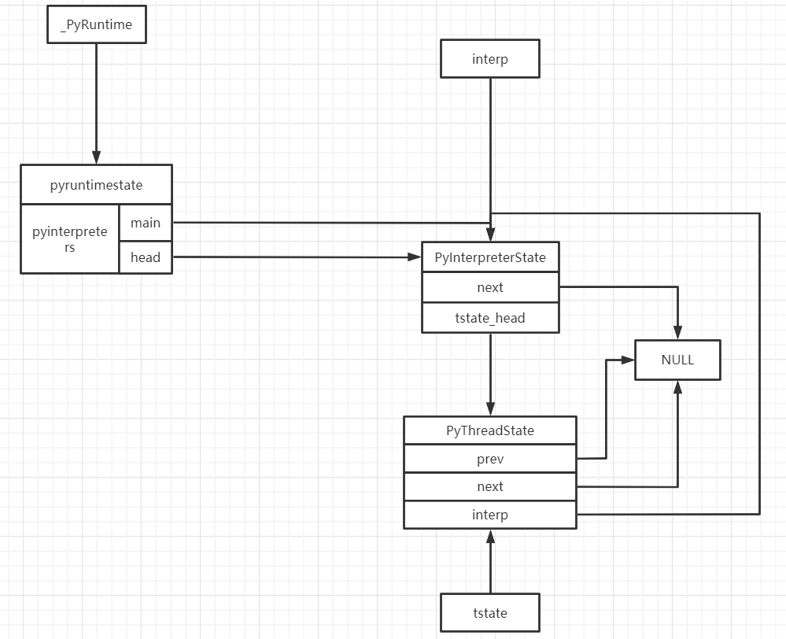
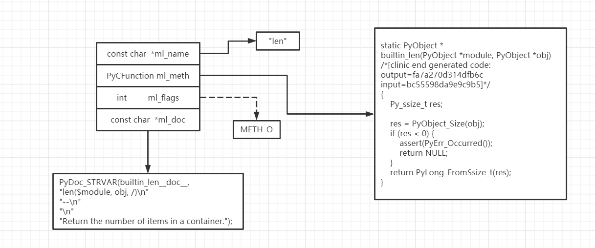
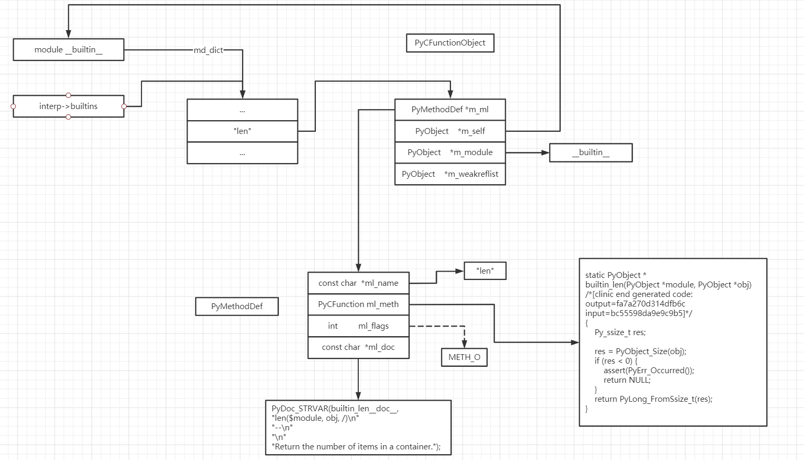
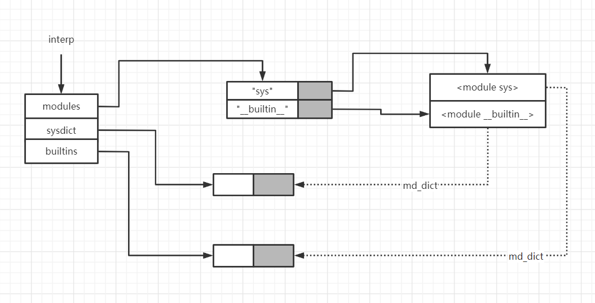
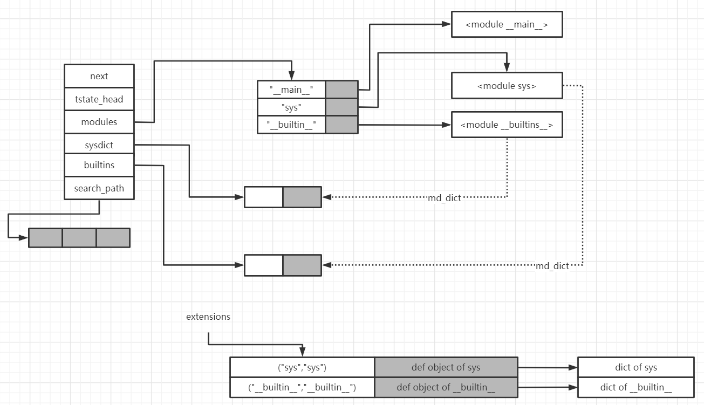

# Python运行环境初始化

python启动后，有意义的初始化动作是从Py_Initialize开始的。在Py_Initialize，仅有一个函数被调用，即Py_InitializeEx。

~~~C
void
Py_Initialize(void)
{
    Py_InitializeEx(1);//调用Py_InitializeEx
}

void
Py_InitializeEx(int install_sigs)
{
    if (_PyRuntime.initialized) {//Py_Initialize已经被调用过了
        /* bpo-33932: Calling Py_Initialize() twice does nothing. */
        return;
    }

    _PyInitError err;
    _PyCoreConfig config = _PyCoreConfig_INIT;//根据环境变量以及命令行参数设置该结构体影响python虚拟机的运行时行为
    config.install_signal_handlers = install_sigs;

    err = _Py_InitializeFromConfig(&config);//执行核心初始化动作
    _PyCoreConfig_Clear(&config);

    if (_Py_INIT_FAILED(err)) {
        _Py_FatalInitError(err);
    }
}
~~~

在Py_InitializeEx中，主要的初始化动作都是在_Py_InitializeFromConfig中完成的，其中，主要的工作又是在\_Py_InitializeCore中进行的，在这里，虚拟机进行了最重要的进程以及线程的初始化过程。

在《Python虚拟机框架》中，我们已经讨论过Pyhton的运行模型。python虚拟机分别使用了**PyInterpreterState**以及**PyThreadState**这两个结构体对进程以及线程进行了模拟。在\_Py_InitializeCore中，虚拟机除了进行必要的配置工作以外，最终又调用了\_Py_InitializeCore_impl进行了虚拟机中第一个is和ts对象的初始化。

~~~C
static _PyInitError
_Py_InitializeCore_impl(PyInterpreterState **interp_p,
                        const _PyCoreConfig *core_config)
{
    PyInterpreterState *interp;

    _PyInitError err = pycore_init_runtime(core_config);//_PyRuntime是一个_PyRuntimeState类型的全局对象，用来保存完整的运行时状态
    if (_Py_INIT_FAILED(err)) {
        return err;
    }

    err = pycore_create_interpreter(core_config, &interp);//初始化第一个is和ts对象
    /***/
}

static _PyInitError
pycore_create_interpreter(const _PyCoreConfig *core_config,
                          PyInterpreterState **interp_p)
    PyInterpreterState *interp = PyInterpreterState_New();
/*...*/
PyThreadState *tstate = PyThreadState_New(interp);
/*...*/
}
~~~

is对象的创建

~~~C
PyInterpreterState *
PyInterpreterState_New(void)
{
    PyInterpreterState *interp = (PyInterpreterState *)
                                 PyMem_RawMalloc(sizeof(PyInterpreterState));

    if (interp == NULL) {
        return NULL;
    }

    //设置is对象的各个域
    /*...*/

    HEAD_LOCK();
    if (_PyRuntime.interpreters.next_id < 0) {
        /* overflow or Py_Initialize() not called! */
        PyErr_SetString(PyExc_RuntimeError,
                        "failed to get an interpreter ID");
        PyMem_RawFree(interp);
        interp = NULL;
    } else {
        interp->id = _PyRuntime.interpreters.next_id;//将当前is对象插入到rt对象的is对象链表中
        _PyRuntime.interpreters.next_id += 1;
        interp->next = _PyRuntime.interpreters.head;
        if (_PyRuntime.interpreters.main == NULL) {
            _PyRuntime.interpreters.main = interp;//设置runtime对象的主is对象为当前的is对象
        }
        _PyRuntime.interpreters.head = interp;//将is对象链接到runtime对象上
    }
    HEAD_UNLOCK();

    if (interp == NULL) {
        return NULL;
    }

    interp->tstate_next_unique_id = 0;

    return interp;
}
~~~

ts对象的创建

~~~C
static PyThreadState *
new_threadstate(PyInterpreterState *interp, int init)
{
    PyThreadState *tstate = (PyThreadState *)PyMem_RawMalloc(sizeof(PyThreadState));

    if (_PyThreadState_GetFrame == NULL)
        _PyThreadState_GetFrame = threadstate_getframe;//threadstate_getframe返回ts对象的frame域

    if (tstate != NULL) {
        tstate->interp = interp;

        /*...*/
        //ts对象各个域的初始化
        tstate->id = ++interp->tstate_next_unique_id;

        if (init)
            _PyThreadState_Init(tstate);

        HEAD_LOCK();
        tstate->prev = NULL;
        tstate->next = interp->tstate_head;//将当前的ts对象插入到is对象的ts链表中
        if (tstate->next)
            tstate->next->prev = tstate;
        interp->tstate_head = tstate;
        HEAD_UNLOCK();
    }

    return tstate;
}
~~~

现在，我们可以建立rt对象、is以及ts对象这三者之间的联系了。

在创建完成is以及ts对象之后，虚拟机还对这些对象进行了配置工作，之后虚拟机调用了pycore_init_types进行了类型系统的初始化。类型系统的初始化是一套相当复杂的动作，我们在《Python虚拟机的类机制》已经进行了详细的分析。

## \__builtin__的创建过程

在pyhton中，如果我们在交互模式下输入“dir()”，那么屏幕上会输出一个list的内容。我们已经知道，python要执行dir这个函数，必定是在某个名字空间中找到了符号“dir”所对应的对象，并且调用了这个对象。在python启动后，我们虽然没有进行任何操作，当时python已经在某个名字空间中创建了符号“dir”及其对应的对象。这个名字空间中的符号和对象来自于系统module，而系统module正是在Py_InitializeEx中创建的。我们首先来看\__builtin__的创建过程。

~~~C
static _PyInitError
pycore_init_builtins(PyInterpreterState *interp)
{
    PyObject *bimod = _PyBuiltin_Init();//在这里进行了builtin模块的初始化
    if (bimod == NULL) {
        return _Py_INIT_ERR("can't initialize builtins modules");
    }
    _PyImport_FixupBuiltin(bimod, "builtins", interp->modules);

    interp->builtins = PyModule_GetDict(bimod);//获取builtin模块的md_dict指针
    if (interp->builtins == NULL) {
        return _Py_INIT_ERR("can't initialize builtins dict");
    }
    Py_INCREF(interp->builtins);

    _PyInitError err = _PyBuiltins_AddExceptions(bimod);
    if (_Py_INIT_FAILED(err)) {
        return err;
    }
    return _Py_INIT_OK();
}
~~~

builtin模块是在_PyBuiltin_Init中初始化的，我们来看一下具体实现。

~~~C
PyObject *
_PyBuiltin_Init(void)
{
    PyObject *mod, *dict, *debug;

    const _PyCoreConfig *config = &_PyInterpreterState_GET_UNSAFE()->core_config;

    if (PyType_Ready(&PyFilter_Type) < 0 ||
        PyType_Ready(&PyMap_Type) < 0 ||
        PyType_Ready(&PyZip_Type) < 0)
        return NULL;

    mod = _PyModule_CreateInitialized(&builtinsmodule, PYTHON_API_VERSION);//初始化builtin模块
    if (mod == NULL)
        return NULL;
    dict = PyModule_GetDict(mod);//将所有pyhton内建类型加入builtin模块中

#ifdef Py_TRACE_REFS
    /* "builtins" exposes a number of statically allocated objects
     * that, before this code was added in 2.3, never showed up in
     * the list of "all objects" maintained by Py_TRACE_REFS.  As a
     * result, programs leaking references to None and False (etc)
     * couldn't be diagnosed by examining sys.getobjects(0).
     */
#define ADD_TO_ALL(OBJECT) _Py_AddToAllObjects((PyObject *)(OBJECT), 0)
#else
#define ADD_TO_ALL(OBJECT) (void)0
#endif

#define SETBUILTIN(NAME, OBJECT) \
    if (PyDict_SetItemString(dict, NAME, (PyObject *)OBJECT) < 0)       \
        return NULL;                                                    \
    ADD_TO_ALL(OBJECT)
	//将所有内建类型放入builtin模块中
    SETBUILTIN("None",                  Py_None);
    /**/
    SETBUILTIN("zip",                   &PyZip_Type);
    debug = PyBool_FromLong(config->optimization_level == 0);
    if (PyDict_SetItemString(dict, "__debug__", debug) < 0) {
        Py_DECREF(debug);
        return NULL;
    }
    Py_DECREF(debug);

    return mod;
#undef ADD_TO_ALL
#undef SETBUILTIN
}
~~~

可以看到，_PyBuiltin_Init是通过两个步骤来完成对builtin的设置：

1. 创建PyModuleObject对象，在python中，模块正是通过这个对象实现的
2. 设置module，将python中所有的类型对象全部放到新创建的builtin对象中

### 创建module对象

在函数_PyModule_CreateInitialized中实现了对PyModuleObject的初始化，该函数接受两个参数：

1. 指向struct PyModuleDef结构体的指针，这个结构体描述了一个python模块的详细信息
2. int类型的参数module_api_version，这是python内部使用的version值，用于比较

首先来看一下PyModuleDef的定义以及builtinsmodule的初始化过程

~~~C
typedef struct PyModuleDef{
  PyModuleDef_Base m_base;
  const char* m_name; //名字
  const char* m_doc;  //文档
  Py_ssize_t m_size;
  PyMethodDef *m_methods; //模块中的函数集合
  struct PyModuleDef_Slot* m_slots;
  traverseproc m_traverse;
  inquiry m_clear;
  freefunc m_free;
} PyModuleDef;
//描述builtin模块的ModuleDef
static struct PyModuleDef builtinsmodule = {
    PyModuleDef_HEAD_INIT,
    "builtins", //名字
    builtin_doc, //模块文档
    -1, /* multiple "initialization" just copies the module dict. */
    builtin_methods, //builtin中的函数集合
    NULL,
    NULL,
    NULL,
    NULL
};
~~~

在_PyModule_CreateInitialized中完成了builtin模块的主要创建工作

~~~C
PyObject *
_PyModule_CreateInitialized(struct PyModuleDef* module, int module_api_version)
{
    const char* name;
    PyModuleObject *m;

    if (!PyModuleDef_Init(module))//检查ModuleDef模块
        return NULL;
    name = module->m_name;
    if (!check_api_version(name, module_api_version)) {
        return NULL;
    }
    /*...*/
    if ((m = (PyModuleObject*)PyModule_New(name)) == NULL)//创建Module对象
        return NULL;

    /*...*/

    if (module->m_methods != NULL) {//将builtin_methods中的方法添加到builtin模块中
        if (PyModule_AddFunctions((PyObject *) m, module->m_methods) != 0) {
            Py_DECREF(m);
            return NULL;
        }
    }
    if (module->m_doc != NULL) {//设置模块doc
        if (PyModule_SetDocString((PyObject *) m, module->m_doc) != 0) {
            Py_DECREF(m);
            return NULL;
        }
    }
    m->md_def = module;
    return (PyObject*)m;
}
~~~

在上面的过程中，对builtin_methods中的方法的会被添加到新创建的builtin模块中，我们来看一下这个builtin_methods。

~~~C
typedef PyObject *(*PyCFunction)(PyObject *, PyObject *);

struct PyMethodDef {
    const char  *ml_name;   /* The name of the built-in function/method */
    PyCFunction ml_meth;    /* The C function that implements it */
    int         ml_flags;   /* Combination of METH_xxx flags, which mostly
                               describe the args expected by the C func */
    const char  *ml_doc;    /* The __doc__ attribute, or NULL */
};
typedef struct PyMethodDef PyMethodDef;

static PyMethodDef builtin_methods[] = {
    {"__build_class__", (PyCFunction)(void(*)(void))builtin___build_class__,
     METH_FASTCALL | METH_KEYWORDS, build_class_doc},
    {"__import__",      (PyCFunction)(void(*)(void))builtin___import__, METH_VARARGS | METH_KEYWORDS, import_doc},
    BUILTIN_ABS_METHODDEF
    /*...*/
    {"iter",            (PyCFunction)(void(*)(void))builtin_iter,       METH_FASTCALL, iter_doc},
    BUILTIN_LEN_METHODDEF
    BUILTIN_LOCALS_METHODDEF
    {"max",             (PyCFunction)(void(*)(void))builtin_max,        METH_VARARGS | METH_KEYWORDS, max_doc},
    /*...*/
    {"vars",            builtin_vars,       METH_VARARGS, vars_doc},
    {NULL,              NULL},
};
~~~

在这里我们发现，dir、len、print等等python内置的函数都是在这里被塞到builtin中的。我们以len为例来看一下PyMethodDef的结构。

对于builtin_methods中的每一个PyMethodDef结构，_PyModule_CreateInitialized都会基于它创建一个PyCFunctionObject对象。

~~~C
typedef struct {
    PyObject_HEAD
    PyMethodDef *m_ml; /* Description of the C function to call */
    PyObject    *m_self; /* Passed as 'self' arg to the C func, can be NULL */
    PyObject    *m_module; /* The __module__ attribute, can be anything */
    PyObject    *m_weakreflist; /* List of weak references */
} PyCFunctionObject;

PyObject *					//PyMethodDef 方法所属的模块   模块的名字
PyCFunction_NewEx(PyMethodDef *ml, PyObject *self, PyObject *module)
{
    PyCFunctionObject *op;
    op = free_list;//显然，CFunction也使用了缓冲池机制
    if (op != NULL) {
        free_list = (PyCFunctionObject *)(op->m_self);
        (void)PyObject_INIT(op, &PyCFunction_Type);
        numfree--;
    }
    else {
        op = PyObject_GC_New(PyCFunctionObject, &PyCFunction_Type);
        if (op == NULL)
            return NULL;
    }
    op->m_weakreflist = NULL;
    op->m_ml = ml;
    Py_XINCREF(self);
    op->m_self = self;//所属的模块
    Py_XINCREF(module);
    op->m_module = module;//所属的模块的名字
    _PyObject_GC_TRACK(op);
    return (PyObject *)op;
}
~~~

执行到这里，创建builtin模块的第一部算是基本完成了。接下来，再把python中的内建类型放到builtin中，builtin模块的创建就算基本完成了。结合pycore_init_builtins中对interp->builtins指针的设置，我们可以大致勾勒出建立完成的builtin模块的示意图。

## sys的创建过程

在_Py_InitializeCore_impl中，虚拟机通过\_PySys_Create创建了sys模块，并像设置interp->builtins一样设置interp->sysdict。

~~~C
PyObject *sysdict = PyModule_GetDict(sysmod);
if (sysdict == NULL) {
    return _Py_INIT_ERR("can't initialize sys dict");
}
Py_INCREF(sysdict);
interp->sysdict = sysdict;
~~~

在创建sys模块之前，虚拟机将interp->modules创建为一个dict对象。

~~~C
PyObject *modules = PyDict_New();
if (modules == NULL) {
    return _Py_INIT_ERR("can't make modules dictionary");
}
interp->modules = modules;
~~~

## sys与\__builtin__的备份

在完成了对sys与\__builtin__的创建之后，为了避免对这些模块的再次初始化，python会将多有的扩展module通过一个全局dict对象来进行备份和维护。

这个备份动作通过\_PyImport_FixupBuiltin来完成。

~~~C
int
_PyImport_FixupBuiltin(PyObject *mod, const char *name, PyObject *modules)
{
    int res;
    PyObject *nameobj;
    nameobj = PyUnicode_InternFromString(name);
    if (nameobj == NULL)
        return -1;                       //模块，模块名，模块名/文件名，interp->modules
    res = _PyImport_FixupExtensionObject(mod, nameobj, nameobj, modules);
    Py_DECREF(nameobj);
    return res;
}

static PyObject *extensions = NULL;

int
_PyImport_FixupExtensionObject(PyObject *mod, PyObject *name,
                                 PyObject *filename, PyObject *modules)
{
    PyObject *dict, *key;
    struct PyModuleDef *def;
    int res;
    if (extensions == NULL) {//如果extensions为空，则创建dict对象
        extensions = PyDict_New();
        if (extensions == NULL)
            return -1;
    }
    if (mod == NULL || !PyModule_Check(mod)) {
        PyErr_BadInternalCall();
        return -1;
    }
    def = PyModule_GetDef(mod);//获取模块对应的def对象
    if (!def) {
        PyErr_BadInternalCall();
        return -1;
    }
    if (PyObject_SetItem(modules, name, mod) < 0)//以(名字，模块)的形式将模块设置到interp->modules
        return -1;
    if (_PyState_AddModule(mod, def) < 0) {
        PyMapping_DelItem(modules, name);
        return -1;
    }
    if (def->m_size == -1) {
        if (def->m_base.m_copy) {
            /* Somebody already imported the module,
               likely under a different name.
               XXX this should really not happen. */
            Py_CLEAR(def->m_base.m_copy);
        }
        dict = PyModule_GetDict(mod);//获取模块的dict
        if (dict == NULL)
            return -1;
        def->m_base.m_copy = PyDict_Copy(dict);//复制该dict并存储到def对象的m_base.m_copy属性中
        if (def->m_base.m_copy == NULL)
            return -1;
    }
    key = PyTuple_Pack(2, filename, name);//制作(文件名，模块名)或者(模块名，模块名)的tuple作为key
    if (key == NULL)
        return -1;
    res = PyDict_SetItem(extensions, key, (PyObject *)def);//将key以及def对象保存到exensions中
    Py_DECREF(key);
    if (res < 0)
        return -1;
    return 0;
}
~~~

上述代码执行完毕之后，模块的dict对象被复制了一份并且存储到了该模块所对应的def对象的m_base.m_copy中，而def对象又被存储到了extensions这个dict中。当python系统的module集合中的某个module需要重新加载时，只需要用extensions中备份的dict对象来创建一个新的module即可。

sys与\__builtin__创建完成后的内存布局

## 设置module的搜索路径

python在创建了sys模块之后，会在此模块中设置python搜索一个模块是的默认路径集合。这个路径集合就是在python执行import xyz时将查看的路径集合。

~~~C
void
PySys_SetPath(const wchar_t *path)
{
    PyObject *v;
    if ((v = makepathobject(path, DELIM)) == NULL)//v时一个list对象，包含了模块搜索路径
        Py_FatalError("can't create sys.path");
    if (_PySys_SetObjectId(&PyId_path, v) != 0)//这个v就是sys.path所看到的路径集合
        Py_FatalError("can't assign sys.path");
    Py_DECREF(v);
}

int
_PySys_SetObjectId(_Py_Identifier *key, PyObject *v)
{
    PyObject *sd = _PyInterpreterState_GET_UNSAFE()->sysdict;
    if (v == NULL) {
        if (_PyDict_GetItemId(sd, key) == NULL) {
            return 0;
        }
        else {
            return _PyDict_DelItemId(sd, key);
        }
    }
    else {
        return _PyDict_SetItemId(sd, key, v);
    }
}
~~~

## 创建\__main__模块

在上述工作完成之后，pyhton将创建一个名为\__main__的模块。

~~~C
static _PyInitError
add_main_module(PyInterpreterState *interp)
{
    PyObject *m, *d, *loader, *ann_dict;
    m = PyImport_AddModule("__main__");//创建__main__模块并将__main__放到interp->modules中
    if (m == NULL)
        return _Py_INIT_ERR("can't create __main__ module");

    d = PyModule_GetDict(m);//获取__main__模块中的dict对象
    ann_dict = PyDict_New();
    if ((ann_dict == NULL) || //设置__main__的__annotations__属性
        (PyDict_SetItemString(d, "__annotations__", ann_dict) < 0)) {
        return _Py_INIT_ERR("Failed to initialize __main__.__annotations__");
    }
    Py_DECREF(ann_dict);

    if (PyDict_GetItemString(d, "__builtins__") == NULL) {
        PyObject *bimod = PyImport_ImportModule("builtins");//导入builtins模块
        if (bimod == NULL) {
            return _Py_INIT_ERR("Failed to retrieve builtins module");
        }
        if (PyDict_SetItemString(d, "__builtins__", bimod) < 0) {//设置__main__的__builtins__属性
            return _Py_INIT_ERR("Failed to initialize __main__.__builtins__");
        }
        Py_DECREF(bimod);
    }

    /* Main is a little special - imp.is_builtin("__main__") will return
     * False, but BuiltinImporter is still the most appropriate initial
     * setting for its __loader__ attribute. A more suitable value will
     * be set if __main__ gets further initialized later in the startup
     * process.
     */
    loader = PyDict_GetItemString(d, "__loader__");
    if (loader == NULL || loader == Py_None) {
        PyObject *loader = PyObject_GetAttrString(interp->importlib,
                                                  "BuiltinImporter");
        if (loader == NULL) {
            return _Py_INIT_ERR("Failed to retrieve BuiltinImporter");
        }
        if (PyDict_SetItemString(d, "__loader__", loader) < 0) {
            return _Py_INIT_ERR("Failed to initialize __main__.__loader__");
        }
        Py_DECREF(loader);
    }
    return _Py_INIT_OK();
}
~~~

当python以python xyz.py这样的方式执行时，python在沿着名字空间寻找\__name__时会发现其值为"\_\_main\_\_"，而如果一个py文件是以import方式加载的，\_\_name\_\_就不会为"\_\_main\_\_"。

进入交互环境之后，敲入dir()就可以查看\_\_main\_\_的所有内容。

~~~python
>>> dir()
['__annotations__', '__builtins__', '__doc__', '__loader__', '__name__', '__package__', '__spec__']
~~~

## 设置site-specific的模块搜索路径

在python中，一些较大规模的第三方库通常安装在site-packages目录下，python目前的初始化动作并没有将site-packages放入python的搜索目录中。在完成了\_\_main__模块的创建之后，python虚拟机采取了将site-packages放入搜索路径的动作。这个动作的关键在于一个python标准库——site.py。

~~~C
if (core_config->site_import) {
        err = initsite(); /* Module site */
        if (_Py_INIT_FAILED(err)) {
            return err;
        }
    }

static _PyInitError
initsite(void)
{
    PyObject *m;
    m = PyImport_ImportModule("site");//导入site.py模块
    if (m == NULL) {
        return _Py_INIT_USER_ERR("Failed to import the site module");
    }
    Py_DECREF(m);
    return _Py_INIT_OK();
}
~~~

在site中主要执行了以下操作：

1. 使用sys.prefix和sys.exec_prefix作为前缀，使用空字符串和（lib/site-packages（on windows）或者lib/pythonX.Y/site-packages（on Unix或者Macintosh）作为后缀产生最多四个目录。
2. 对于每一个生成的目录，检查该目录是否是一个真正的目录，如果是的话，将该目录添加到sys.path并且将该目录下的路径配置文件中的路径也添加到sys.path中。

到此为止，python中的大部分重要的初始化动作都已经完成了，我们来看一下初始化完成之后python为我们准备的资源。

## 激活python虚拟机

到这里，pyhton已经完成了执行所必须的基础设施的建设，但是这离python真正的执行还有一段距离。在对python虚拟机框架的分析中我们知道，python代码会被编译为python字节码，最终由一个具有巨大“for循环”结构的字节码引擎来执行。只有进入了这个字节码虚拟机后，python的初始化才算真正完成。

Py_main是进入python字节码引擎的起点，我们对其内部的调用过程进行追溯——Py_main->pymain_main->pymain_run_python

~~~C
static int
pymain_run_python(_PyMain *pymain, PyInterpreterState *interp)
{
    /*...*/
    //根据不同的调用情况进行了分支
    if (pymain->command) { //-c选项（调用PyRun_SimpleStringFlags）
    pymain->status = pymain_run_command(pymain->command, &cf);
    }
    else if (pymain->module) { //-m选项（调用runpy模块的_run_module_as_main）
        pymain->status = (pymain_run_module(pymain->module, 1) != 0);
    }
    else if (main_importer_path != NULL) { //python 具有__main__.py（调用runpy模块的_run_module_as_main）
        int sts = pymain_run_module(L"__main__", 0);
        pymain->status = (sts != 0);
    }
    else if (pymain->filename != NULL) { //调用PyRun_AnyFileExFlags
        pymain_run_file(pymain, config, &cf);
    }
    else { //调用PyRun_AnyFileExFlags
        pymain_run_stdin(pymain, config, &cf);
    }

    pymain_repl(pymain, config, &cf);
    /*...*/
}
~~~

在上面的几种情况中，调用PyObject_Call我们已经很熟悉了。对于其他两种情况我们可以发现，python虚拟机的执行流程最终都进入了那个具有巨大“for循环”结构的字节码引擎中。

~~~C
int
PyRun_AnyFileExFlags(FILE *fp, const char *filename, int closeit,
                     PyCompilerFlags *flags)
{
    if (filename == NULL)
        filename = "???";
    if (Py_FdIsInteractive(fp, filename)) { //分流
        int err = PyRun_InteractiveLoopFlags(fp, filename, flags);//交互模式
        if (closeit)
            fclose(fp);
        return err;
    }
    else
        return PyRun_SimpleFileExFlags(fp, filename, closeit, flags);//文件模式
}
~~~

首先来看PyRun_InteractiveLoopFlags

~~~C
int
PyRun_InteractiveLoopFlags(FILE *fp, const char *filename_str, PyCompilerFlags *flags)
{
   /*...*/
    do {
        ret = PyRun_InteractiveOneObjectEx(fp, filename, flags);//交互式执行
        if (ret == -1 && PyErr_Occurred()) {
            /* Prevent an endless loop after multiple consecutive MemoryErrors
             * while still allowing an interactive command to fail with a
             * MemoryError. */
            if (PyErr_ExceptionMatches(PyExc_MemoryError)) {
                if (++nomem_count > 16) {
                    PyErr_Clear();
                    err = -1;
                    break;
                }
            } else {
                nomem_count = 0;
            }
            PyErr_Print();
            flush_io();
        } else {
            nomem_count = 0;
        }
#ifdef Py_REF_DEBUG
        if (show_ref_count) {
            _PyDebug_PrintTotalRefs();
        }
#endif
    } while (ret != E_EOF);
    Py_DECREF(filename);
    return err;
}

static int
PyRun_InteractiveOneObjectEx(FILE *fp, PyObject *filename,
                             PyCompilerFlags *flags)
{
    /*...*/
    //编译用户在交互式环境下输入的python语句（AST）
    mod = PyParser_ASTFromFileObject(fp, filename, enc,
                                     Py_single_input, ps1, ps2,
                                     flags, &errcode, arena);
	/*...*/
    //完成对用户输入语句的执行动作
    m = PyImport_AddModuleObject(mod_name); //获取__main__模块
    if (m == NULL) {
        PyArena_Free(arena);
        return -1;
    }
    d = PyModule_GetDict(m); //__main__模块的m_dict对象作为虚拟机开始执行时当前活动 的frame对象的local名字空间和global名字空间
    v = run_mod(mod, filename, d, d, flags, arena);//执行
    PyArena_Free(arena);
    if (v == NULL) {
        return -1;
    }
    Py_DECREF(v);
    flush_io();
    return 0;
}

static PyObject *
run_mod(mod_ty mod, PyObject *filename, PyObject *globals, PyObject *locals,
            PyCompilerFlags *flags, PyArena *arena)
{
    PyCodeObject *co;
    PyObject *v;
    co = PyAST_CompileObject(mod, filename, flags, -1, arena);//将AST编译为code对象
    if (co == NULL)
        return NULL;
    v = PyEval_EvalCode((PyObject*)co, globals, locals);
    Py_DECREF(co);
    return v;
}

PyObject *
PyEval_EvalCode(PyObject *co, PyObject *globals, PyObject *locals)
{
    return PyEval_EvalCodeEx(co,
                      globals, locals,
                      (PyObject **)NULL, 0,
                      (PyObject **)NULL, 0,
                      (PyObject **)NULL, 0,
                      NULL, NULL);
}
~~~

在PyEval_EvalCode中，我们终于见到了PyEval_EvalCodeEx，从这里开始，pyhton虚拟机最终将调用我们的“老朋友”——_PyEval_EvalFrameDefault——那个具有巨大“for循环”结构的字节码引擎。

我们继续来看文件形式的执行过程

~~~C
int
PyRun_SimpleFileExFlags(FILE *fp, const char *filename, int closeit,
                        PyCompilerFlags *flags)
{
    PyObject *m, *d, *v;
    const char *ext;
    int set_file_name = 0, ret = -1;
    size_t len;

    m = PyImport_AddModule("__main__");
    if (m == NULL)
        return -1;
    Py_INCREF(m);
    d = PyModule_GetDict(m);
    /*...*/
    if (maybe_pyc_file(fp, filename, ext, closeit)) {
        FILE *pyc_fp;
        /* Try to run a pyc file. First, re-open in binary */
        /*...*/
        v = run_pyc_file(pyc_fp, filename, d, d, flags); //调用PyEval_EvalCode
    } else {
        /* When running from stdin, leave __main__.__loader__ alone */
        if (strcmp(filename, "<stdin>") != 0 &&
            set_main_loader(d, filename, "SourceFileLoader") < 0) {
            fprintf(stderr, "python: failed to set __main__.__loader__\n");
            ret = -1;
            goto done;
        }
        v = PyRun_FileExFlags(fp, filename, Py_file_input, d, d,
                              closeit, flags); //调用run_mod
    }
    /*...*/
    return ret;
}
~~~

在PyRun_SimpleFileExFlags中，程序产生了两个分支

1. 如果pyc文件生效那么直接执行pyc文件；
2. pyc文件不生效则编译执行。

以上两种方法最终时殊途同归——调用_PyEval_EvalFrameDefault。

到现在为止，我们对python的启动过程已经有了全面的了解——从操作系统为python创建进程一直到python字节码引擎的启动。

### 名字空间

我们来看一下python虚拟机激活过程中，在创建frame对象时所设置的三个名字空间：locals、globals、builtin。

~~~C
PyFrameObject* _Py_HOT_FUNCTION
_PyFrame_New_NoTrack(PyThreadState *tstate, PyCodeObject *code,
                     PyObject *globals, PyObject *locals)//globals与locals都是__main__模块的m_dict对象
{	//tstate：当前state对象
    PyFrameObject *back = tstate->frame;//在这里back一定是NULL，因为这是虚拟机创建的第一个frame对象
    /*...*/
    //设置builtin名字空间
    if (back == NULL || back->f_globals != globals) {
        builtins = _PyDict_GetItemId(globals, &PyId___builtins__);//这里的builtins就是之前创建的__builtin__模块
        if (builtins) {
            if (PyModule_Check(builtins)) {
                builtins = PyModule_GetDict(builtins);
                assert(builtins != NULL);
            }
        }
        if (builtins == NULL) {
            /* No builtins!              Make up a minimal one
               Give them 'None', at least. */
            builtins = PyDict_New();
            if (builtins == NULL ||
                PyDict_SetItemString(
                    builtins, "None", Py_None) < 0)
                return NULL;
        }
        else
            Py_INCREF(builtins);

    }
    else {
        /* If we share the globals, we share the builtins.
           Save a lookup and a call. */
        builtins = back->f_builtins;//如果back不为空，那么当前frame共享之前frame的builtin名字空间，这意味着python所有的线程都共享相同的builtin名字空间
        assert(builtins != NULL);
        Py_INCREF(builtins);
    }
    /*...*/
    f->f_globals = globals;//设置global名字空间
    /* Most functions have CO_NEWLOCALS and CO_OPTIMIZED set. */
    if ((code->co_flags & (CO_NEWLOCALS | CO_OPTIMIZED)) ==
        (CO_NEWLOCALS | CO_OPTIMIZED))
        ; /* f_locals = NULL; will be set by PyFrame_FastToLocals() */
    else if (code->co_flags & CO_NEWLOCALS) {
        locals = PyDict_New();
        if (locals == NULL) {
            Py_DECREF(f);
            return NULL;
        }
        f->f_locals = locals;
    }
    else {//python初始化时会执行到这里
        if (locals == NULL)
            locals = globals;
        Py_INCREF(locals);
        f->f_locals = locals;
    }

    /*...*/
    f->f_trace_lines = 1;

    return f;
}
~~~

从这里我们可以看到，python激活时所创建的第一个frame对象的locals和globals名字空间都被设置成了\_\_main__中的dict对象；而builtin名字空间是在python所有的frame对象之间共享的。