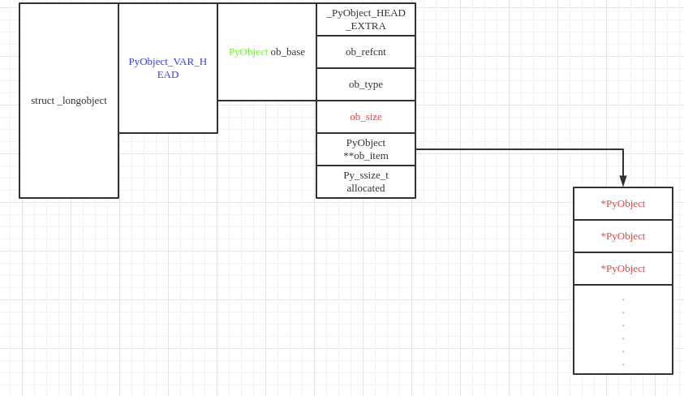

# 列表list

## 内存布局



ob_size表示的是list中现存的元素数量，allocated表示的是list中可容纳的元素数量，显然，Python中的list与c++中的vector更为相似．

## 初始化

```C
#ifndef PyList_MAXFREELIST
#define PyList_MAXFREELIST 80
#endif
static PyListObject *free_list[PyList_MAXFREELIST];
static int numfree = 0;

PyObject *
PyList_New(Py_ssize_t size)
{
    PyListObject *op;
#ifdef SHOW_ALLOC_COUNT
    static int initialized = 0;
    if (!initialized) {
        Py_AtExit(show_alloc);
        initialized = 1;
    }
#endif

    if (size < 0) {
        PyErr_BadInternalCall();
        return NULL;
    }
    if (numfree) {//缓冲池可用
        numfree--;
        op = free_list[numfree];
        _Py_NewReference((PyObject *)op);
#ifdef SHOW_ALLOC_COUNT
        count_reuse++;
#endif
    } else {//缓冲池不可用
        op = PyObject_GC_New(PyListObject, &PyList_Type);
        if (op == NULL)
            return NULL;
#ifdef SHOW_ALLOC_COUNT
        count_alloc++;
#endif
    }
    if (size <= 0)//为list中的元素列表申请空间　
        op->ob_item = NULL;
    else {
        op->ob_item = (PyObject **) PyMem_Calloc(size, sizeof(PyObject *));
        if (op->ob_item == NULL) {
            Py_DECREF(op);
            return PyErr_NoMemory();
        }
    }
    Py_SIZE(op) = size;
    op->allocated = size;
    _PyObject_GC_TRACK(op);
    return (PyObject *) op;
}
```

list对象也采用了缓冲池机制以避免list对象的反复申请与释放．至于free_list中对象来源于即将被销毁的list．

```C
static void
list_dealloc(PyListObject *op)
{
    Py_ssize_t i;
    PyObject_GC_UnTrack(op);
    Py_TRASHCAN_SAFE_BEGIN(op)
    if (op->ob_item != NULL) {
        /* Do it backwards, for Christian Tismer.
           There's a simple test case where somehow this reduces
           thrashing when a *very* large list is created and
           immediately deleted. */
        i = Py_SIZE(op);
        while (--i >= 0) {
            Py_XDECREF(op->ob_item[i]);
        }
        PyMem_FREE(op->ob_item);
    }
    if (numfree < PyList_MAXFREELIST && PyList_CheckExact(op))
        free_list[numfree++] = op;
    else
        Py_TYPE(op)->tp_free((PyObject *)op);
    Py_TRASHCAN_SAFE_END(op)
}
```

销毁list对象时，首先销毁元素列表，然后销毁list对象本身．在删除list对象时，Python会检查free_list缓冲池，如果还有空间，就将待删除的list放入其中．

## 插入元素

list中插入元素最终调用的是ins1这个函数．

```C
static int
ins1(PyListObject *self, Py_ssize_t where, PyObject *v)
{
    Py_ssize_t i, n = Py_SIZE(self);
    PyObject **items;
    if (v == NULL) {
        PyErr_BadInternalCall();
        return -1;
    }
    if (n == PY_SSIZE_T_MAX) {
        PyErr_SetString(PyExc_OverflowError,
            "cannot add more objects to list");
        return -1;
    }

    if (list_resize(self, n+1) < 0)//调用resize确保list有足够的空间进行插入
        return -1;

    if (where < 0) {//对索引是负值的情况进行了处理，-1代表倒数第一个元素
        where += n;
        if (where < 0)
            where = 0;
    }
    if (where > n)
        where = n;
    items = self->ob_item;
    for (i = n; --i >= where; )//将where之后的元素想后搬动
        items[i+1] = items[i];
    Py_INCREF(v);//增加被插入元素的引用计数
    items[where] = v;
    return 0;
}
```

## resize

Python中通过list_resize实现对list空间的调整．

```C
static int
list_resize(PyListObject *self, Py_ssize_t newsize)
{
    PyObject **items;
    size_t new_allocated, num_allocated_bytes;
    Py_ssize_t allocated = self->allocated;

    /* Bypass realloc() when a previous overallocation is large enough
       to accommodate the newsize.  If the newsize falls lower than half
       the allocated size, then proceed with the realloc() to shrink the list.
    */
    if (allocated >= newsize && newsize >= (allocated >> 1)) {
        assert(self->ob_item != NULL || newsize == 0);
        Py_SIZE(self) = newsize;
        return 0;
    }

    /* This over-allocates proportional to the list size, making room
     * for additional growth.  The over-allocation is mild, but is
     * enough to give linear-time amortized behavior over a long
     * sequence of appends() in the presence of a poorly-performing
     * system realloc().
     * The growth pattern is:  0, 4, 8, 16, 25, 35, 46, 58, 72, 88, ...
     * Note: new_allocated won't overflow because the largest possible value
     *       is PY_SSIZE_T_MAX * (9 / 8) + 6 which always fits in a size_t.
     */
    new_allocated = (size_t)newsize + (newsize >> 3) + (newsize < 9 ? 3 : 6);//额外申请备用
    if (new_allocated > (size_t)PY_SSIZE_T_MAX / sizeof(PyObject *)) {
        PyErr_NoMemory();
        return -1;
    }

    if (newsize == 0)
        new_allocated = 0;
    num_allocated_bytes = new_allocated * sizeof(PyObject *);
    items = (PyObject **)PyMem_Realloc(self->ob_item, num_allocated_bytes);
    if (items == NULL) {
        PyErr_NoMemory();
        return -1;
    }
    self->ob_item = items;
    Py_SIZE(self) = newsize;
    self->allocated = new_allocated;
    return 0;
}
```

在调整list所维护的列表内存时，Python分两种情况处理

+ allocated >= newsize && newsize >= (allocated >> 1)，简单修改ob_size的值
+ 否则，调用realloc重新分配内存空间．

在第二种情况中new_size小于原allocated的一半，此时relloc会收缩list所维护的元素列表的空间．