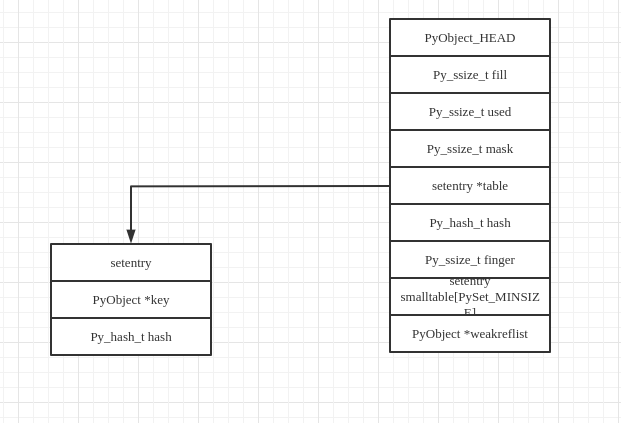
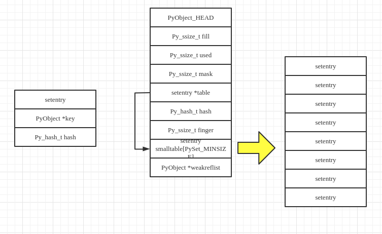

# 集合set

## set的内存布局



## set初始化

```C
static PyObject *
make_new_set(PyTypeObject *type, PyObject *iterable)
{
    PySetObject *so;

    so = (PySetObject *)type->tp_alloc(type, 0);
    if (so == NULL)
        return NULL;

    so->fill = 0;
    so->used = 0;
    so->mask = PySet_MINSIZE - 1;
    so->table = so->smalltable;
    so->hash = -1;
    so->finger = 0;
    so->weakreflist = NULL;

    if (iterable != NULL) {
        if (set_update_internal(so, iterable)) {
            Py_DECREF(so);
            return NULL;
        }
    }

    return (PyObject *)so;
}
```

  

在空的set中，table指针指向PySetObject中的smalltable．即set中的元素比较少时，采用PySetObject自备的空间进行存储．当set的元素达到一定数量时，PySetObject会触发resize机制进行空间重新分配，此时的table指针会指向新分配的内存空间．

同时，如果iterable不为NULL，那么还会向set中添加元素并进行初始化，添加元素最终调用的函数为set_add_entry．

## set增加元素

